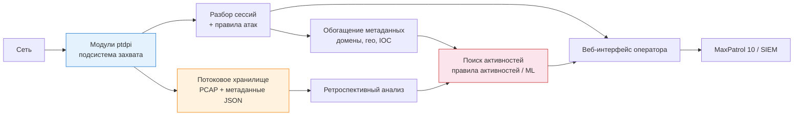

---
tags:
  - maxpatrol-nad
  - learning
  - stage-2
  - architecture
status: in-progress
created: 2026-10-07
---
# Этап 2 — Архитектура и захват трафика

> [!todo] Приоритет: КРИТИЧЕСКИЙ
> Ошибка в точке перехвата = слепая зона, которую не исправит никакая настройка правил. Это второй по важности фундамент после теории.

Основной источник: [[attachments/nad_12.3_operator.pdf|Руководство оператора PT NAD 12.3]], разделы 2.1, 2.4, 2.5, 7, 20.1; комплект документации (раздел 1).

---

## 2.1 Комплект документации — где что искать

> [!important] Важно
> «Руководство оператора» (наш PDF) **не содержит** установки и администрирования. Комплект PT NAD:
>
> - **Руководство оператора** — ежедневная работа в интерфейсе (это изучаем)
> - **Руководство по проектированию** — планирование развёртывания под топологию и ресурсы
> - **Руководство по установке на один сервер** / **на несколько серверов** — установка и обновление
> - **Руководство администратора** — настройка и администрирование
> - **Справочное руководство по REST API**

## 2.2 Концептуальная схема

## 2.3 Захват трафика: модули ptdpi

- Захват выполняют **модули ptdpi** подсистемы захвата; список модулей и их фильтров — страница **«Сенсоры»** в меню администрирования (раздел 20.1)
- Фильтр захвата трафика пишется на языке **BPF** (Berkeley Packet Filter), раздел 20.1.6:

| Задача | Выражение |
| --- | --- |
| По IP-адресу | `host 198.51.100.13` |
| По домену | `host example.com` |
| По группе адресов | `host 203.0.113.13 or host example.net or host 192.0.2.251` |
| По подсети | `net 203.0.113.0/24` |
| Всё, кроме подсетей | `not(net 203.0.113.0/24 or net 198.51.100.0/24)` |
| По порту / диапазону | `port 13090` / `portrange 100-4001` |
| По транспортному протоколу | `udp or tcp` |
| Исключение подсети при VLAN | `not (vlan and ip and net 198.51.100.0/24)` |

> [!warning] Производительность BPF
> Чем сложнее выражение (больше параметров и логических операций), тем медленнее обработка трафика — вплоть до потери данных при захвате (раздел 20.1.1). Фильтры захвата — грубый инструмент «отсечь лишнее», а не тонкая настройка анализа.

- После запуска модуля ptdpi первые **5 минут** продукт оценивает трафик для настройки порогов механизма самозащиты от сканирований/флуда/DDoS — в это время эти активности не детектируются (раздел 20.1.2)

## 2.4 Хранилища

- **Потоковое хранилище** — создаётся при развёртывании; каждый сенсор пишет в него исходную копию трафика и метаданные; ротируется согласно конфигурации (глоссарий)
- **Выделенное хранилище** — создаётся оператором для удобства работы с конкретным трафиком (инцидент, сервер, период) или для долгосрочного хранения (раздел 7)
- Возможен импорт PCAP в выделенное хранилище (раздел 7.3) и удаление хранилищ (7.4)
- В версии **PT NAD Sensor** хранение PCAP и метаданных более 1 дня не предусмотрено (см. 2.6)

## 2.5 Иерархия: центральная консоль и дочерние системы

- Экземпляры PT NAD можно объединять в иерархию (раздел 2.4)
- **Центральная консоль** — не захватывает трафик сама, только отображает данные дочерних систем; в её интерфейсе нет разделов захвата/правил/справочников/репутационных списков
- **Дочерняя система** — самостоятельный PT NAD, работающий в обычном режиме
- **Что нового в 12.3:** из центральной консоли теперь доступны операции с данными дочерних систем — экспорт PCAP, скачивание файлов, отметки о ложных срабатываниях, решения по активностям, работа с узлами, регистрация инцидента в MaxPatrol 10; добавлена навигация по иерархии (метка экземпляра в главном меню)

## 2.6 PT NAD Sensor

Упрощённая версия для интеграции с MaxPatrol 10 (раздел 2.5):
- трафик на диск не сохраняется (нет хранилища PCAP)
- метаданные хранятся не более 1 дня
- скорость захвата ограничена 1 Гбит/с
- полная версия продукта: захват **100 Мбит/с — 10 Гбит/с**

## 2.7 Что проверить физически в лаборатории

- Откуда зеркалится трафик (SPAN/TAP), что источник не перегружен
- Модули ptdpi видны на странице «Сенсоры», фильтр захвата корректен
- В карточке сессии видно **флаги и ошибки обработки** (приложение Е) — сигнал потерь/проблем сборки сессии
- Понимаете разницу: фильтр **захвата** (BPF, до анализа) vs **фильтр интерфейса** (по метаданным, после анализа)

---

## Чек-лист этапа

- [ ] Знаю комплект документов и где искать установку/администрирование
- [ ] Написал минимум 5 выражений BPF и понимаю их влияние на производительность
- [ ] Объясняю разницу между потоковым и выделенным хранилищем
- [ ] Понимаю модель «центральная консоль — дочерние системы» и ограничения консоли
- [ ] Знаю ограничения PT NAD Sensor

## Связанные заметки

- [[1. Теоретические основы обнаружения сетевых атак]] — предыдущий этап
- [[3. Протоколы, метаданные и ограничения анализа]] — следующий этап
- [[7. Эксплуатация и управление захватом]] — эксплуатационная часть ptdpi

## Источники

- [[attachments/nad_12.3_operator.pdf|Руководство оператора PT NAD 12.3]] — разделы 1, 2.1, 2.4, 2.5, 7, 20.1, приложение Е
- Руководство по проектированию и руководства по установке (в комплекте документации, не в этой папке)
