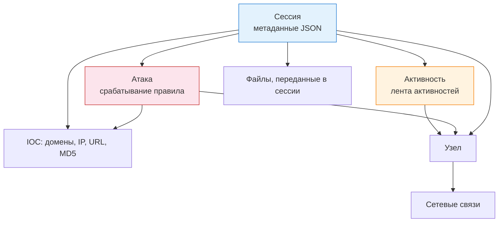

---
tags:
  - maxpatrol-nad
  - learning
  - stage-4
  - ui
status: в-progress
created: 2026-10-07
stage: 4
---

# Этап 4 — Интерфейс и модель данных

> [!todo] Приоритет: ВЫСОКИЙ
> Ежедневная рабочая среда SOC. Цель этапа — уверенно ориентироваться в разделах и понимать иерархию «сессия → атака / активность → узел».

Основной источник: [[attachments/nad_12.3_operator.pdf|Руководство оператора PT NAD 12.3]], разделы 5–6, 11–12, 15, 17.

---

## 4.1 Вход и доступ

- Интерфейс — веб-браузер (рекомендуются Chrome/Firefox), раздел 5
- Два варианта: собственные учётные записи (настраиваются администратором) или единый вход через **PT Management and Configuration (PT MC)**
- Стандартная сессия — 12 часов; с флажком «Запомнить меня» — 7 дней бездействия (через PT MC)

## 4.2 Страницы главного меню — карта продукта

| Раздел | Что там | Основной рабочий объект |
| --- | --- | --- |
| Дашборды | Статистика, виджеты, диаграммы | виджет |
| Сессии | Все разобранные сессии с метаданными | сессия |
| Атаки | Срабатывания правил для атак | атака |
| Лента активностей | Опасные/потенциальные активности и аномалии | активность |
| Сетевые связи | Карта взаимодействий узлов | пара узлов |
| Узлы | Обнаруженные устройства, типы и роли | узел |
| Отчёты / Интеграция с MaxPatrol 10 | Выпуск отчётов, регистрация инцидентов | — |
| Администрирование (кнопка ⚙) | Сенсоры, правила, справочники, репутационные списки, группы | правило |

Общие элементы (раздел 6):
- **диаграмма интенсивности трафика** — быстрая оценка ситуации за период
- **панель фильтрации** — единая для страниц, работает по метаданным (см. [[6. Расследования — фильтры, сессии, доказательства]])
- **индикатор состояния продукта** — состояние системы (используйте его первым при подозрении на деградацию)

## 4.3 Модель данных

- **Сессия** — базовый объект: всё остальное (атаки, активности, файлы, IOC) привязано к сессиям и узлам
- **Атака** — запись о срабатывании правила; карточка содержит описание и рекомендации вендора, тактики/техники ATT&CK, сработавшее правило, сегмент **Payload**
- **Активность** — результат несигнатурного анализа; в карточке есть комментарии и выбор решения
- **Узел** — устройство в сети TCP/IP; есть тип и роли (автоопределение или ручные), переименование и комментарии (разделы 15.6–15.9)
- **Сетевые связи** — «кто с кем общался», карта взаимодействий узла (раздел 12)

## 4.4 Что нового в 12.3 для интерфейса

- Навигация по иерархии экземпляров: метка центральной консоли/дочерней системы рядом с логотипом в главном меню
- Индексация **нестандартных полей HTTP-заголовков** и их значений — поиск по ним при расследованиях
- Плейбуки — ссылки на документы реагирования из карточек атаки, активности, сессии и правил (список новых плейбуков: Coerce-атака, DNS-туннелирование, DCSync, эксплуатация уязвимостей T1190, вредоносное ПО и др.)

## 4.5 Дашборды и виджеты (раздел 11, приложение А)

- Системные виджеты по категориям: **Трафик, Атаки, ПО, HTTP, DNS, Индикаторы компрометации, Учётные данные, Электронная почта, Файлы**
- Свои виджеты: создание, копирование, изменение, удаление; настройка максимума записей; экспорт данных виджета
- Фильтрация по периоду и метаданным, автообновление данных
- Дашборды: создание, переименование, удаление, восстановление состояния по умолчанию

---

## Практика этапа

- Пройти по всем разделам главного меню на демо/лаборатории и для каждого записать: «что здесь делает оператор»
- Найти свою сессию: `src.ip == <ваш_адрес>` — открыть карточку, включить расширенные данные, найти Payload, файлы, IOC
- Открыть карточку узла: посмотреть тип, роли, комментарии, сетевые связи
- Собрать дашборд из 5 виджетов под задачу «что происходит в DMZ за сутки»

## Чек-лист этапа

- [ ] Знаю назначение каждого раздела главного меню
- [ ] Объясняю разницу между сессией, атакой, активностью и узлом
- [ ] Нашёл информацию об атаке: описание, ATT&CK, правило, Payload
- [ ] Настроил дашборд и сохранил личный фильтр

## Связанные заметки

- [[3. Протоколы, метаданные и ограничения анализа]] — предыдущий этап
- [[5. Правила, атаки и активности]] — следующий этап

## Источники

- [[attachments/nad_12.3_operator.pdf|Руководство оператора PT NAD 12.3]] — разделы 5, 6, 11, 12, 15, 17, приложение А
