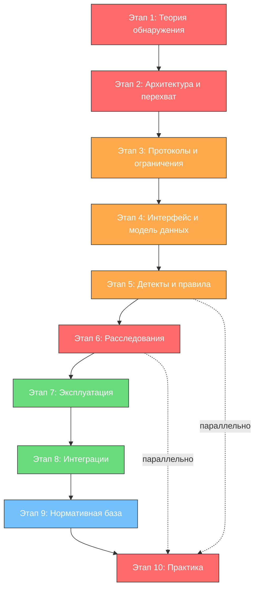

---
tags:
  - maxpatrol-nad
  - network-security
  - ndr
  - deep-packet-inspection
  - positive-technologies
  - learning-plan
status: в-progress
created: 2026-10-07
version: 12.3
---

# План изучения PT NAD 12.3

## Обзор продукта

PT NAD (Network Attack Discovery) — система глубокого анализа сетевого трафика (Network Traffic Analysis / NDR) от Positive Technologies. Выявляет аномальную сетевую активность, сложные целенаправленные атаки (APT), вредоносное ПО и утечки данных как на периметре организации, так и внутри сети.

Ключевые отличия от классического IDS/IPS:

- **Глубокий контент-анализ, а не только заголовки** — восстановление сессий, извлечение файлов, разбор протоколов прикладного уровня, поиск вредоносного кода в передаваемых файлах
- **Корреляция событий в сценарии атак** — из отдельных сигналов (сканирование, брутфорс, эксплуатация уязвимости, C2-канал, exfiltration) собирается цепочка атаки (kill chain), а не список разрозненных срабатываний
- **Совмещение сигнатурного, поведенческого и машинного анализа** — сигнатуры атак + детектирование аномалий + флоу-аномалии
- **Работа в связке с MaxPatrol SIEM/VM** — события NAD обогащаются контекстом активов и уязвимостей, а инциденты передаются в SIEM для расследования

> [!note] Про версию 12.3
> В этом плане изучаются общие для NAD принципы и возможности. Перед началом сверьтесь с release notes именно вашей сборки 12.3 (раздел «Что нового» в документации) — состав модулей, поддерживаемые протоколы и форматы правил могут отличаться от предыдущих версий. Пункты, требующие проверки по документации 12.3, помечены знаком ⚠.

---

## Предварительные требования

> [!important] Необходимая база
> Без этой базы изучение NAD превратится в запоминание кнопок вместо понимания происходящего.

- **Сети и стек протоколов** — модель OSI, IP/TCP/UDP, DNS, HTTP(S), ключевые порты, NAT, маршрутизация, VLAN; умение читать вывод `tcpdump`/Wireshark
- **Основы перехвата трафика** — что такое SPAN/mirror port, TAP, сетевой диод, размещение точки наблюдения
- **MITRE ATT&CK** — тактики и техники (Initial Access, Execution, C2, Exfiltration) — язык, на котором описывается большинство детектов
- **Типы систем обнаружения** — разница между IDS/IPS, NDR, SIEM; сигнатурный vs аномальный vs поведенческий детект
- **Вредоносное ПО и инциденты** — основы малварь-аналитики: C2-каналы, ботсети, фишинг, веб-шеллы, эксплуатация уязвимостей
- **ОС Linux** — администрирование, сервисы, логи (интерфейс NAD — веб-консоль, но диагностика требует SSH)
- **Криптография (базово)** — TLS/HTTPS, почему шифрование ограничивает глубину анализа и какие есть способы обхода

---

## Этап 1 — Теоретические основы обнаружения сетевых атак

> [!todo] Приоритет: КРИТИЧЕСКИЙ
> Без понимания принципов обнаружения невозможно ни настраивать NAD, ни отличать реальный инцидент от ложного срабатывания.

### 1.1 Как устроено обнаружение атак в трафике

- **Что изучить:** уровни анализа — потоковый анализ (NetFlow/флоу), анализ пакетов (DPI), анализ сессий/протоколов, анализ контента (файлы, URL, токены)
- **Зачем:** NAD совмещает несколько уровней, и нужно понимать, какой из них дал сигнал и с какой достоверностью
- **Ключевые понятия:** поток (flow), сессия (TCP-сессия/стрим), инспекция прикладного уровня (appID), полезная нагрузка (payload)

### 1.2 Методы детектирования

- **Сигнатурный анализ** — совпадение с правилом/сигнатурой атаки, вредоносного ПО, известного C2; плюс (точность), минус (неизвестные атаки)
- **Поведенческий и аномальный анализ** — отклонение от базовой линии: всплески трафика, необычные клиенты/серверы, редкие протоколы, флоу-аномалии
- **Машинное обучение** — классификация сессий и хостов по поведению ⚠ (состав ML-модулей уточнить для 12.3)
- **Корреляция и построение цепочки атак** — из отдельных событий собирается сценарий (kill chain / инцидент)

### 1.3 Kill chain и MITRE ATT&CK как каркас расследования

- **Что изучить:** модель цикла атаки (разведка → доставка → эксплуатация → установка → C2 → действия на цели → exfiltration); сопоставление событий NAD с техниками MITRE ATT&CK
- **Зачем:** отчёт об инциденте имеет смысл только в терминах цепочки событий, а не списка срабатываний
- **Ресурсы:** матрица [MITRE ATT&CK](https://attack.mitre.org/), официальная таксономия событий PT

### 1.4 Типовые классы атак, которые выявляет NAD

- **Что изучить:** сканирование портов/сети, перебор учётных данных (brute force), веб-атаки (SQLi, XSS, веб-шеллы), эксплуатация уязвимостей в ПО, вредоносное ПО в файлах, C2-каналы и ботсети, DNS/ICMP/веб-туннели, утечки данных (exfiltration), аномальная активность внутренних хостов, активность в промышленных/отраслевых протоколах ⚠
- **Зачем:** это словарь детектов NAD; на любом этапе вы будете возвращаться к этому списку

---

## Этап 2 — Архитектура PT NAD и схемы развёртывания

> [!todo] Приоритет: КРИТИЧЕСКИЙ
> От архитектуры зависит, какие трафики вы вообще видите. Ошибка в точке перехвата = слепая зона, которую никакой настройкой не исправить.

### 2.1 Компоненты системы

- **Что изучить:** сервер NAD (обработка, хранение, веб-интерфейс), коллекторы (сбор трафика), база событий/хранилище потоков, модули обработки; соотношение ролей и требования к железу
- **Ключевые вопросы:**
  - Где заканчивается коллектор и начинается сервер анализа?
  - Что хранится в БД событий, а что в потоковой базе (pcap/сессии)?
  - Как компоненты связаны с MaxPatrol SIEM/VM?
- **Практика:** нарисуйте схему своего целевого развёртывания (mermaid-диаграмма в отдельной заметке)

### 2.2 Точки перехвата трафика

- **Что изучить:** SPAN/monitor session, сетевые TAP, оптические диоды; размещение на периметре (north-south) и внутри сегментов (east-west); почему для выявления атак внутри сети одного периметра недостаточно
- **Типовые ошибки:**
  - Зеркалируется только исходящий трафик — теряются атаки изнутри наружу
  - Перегруженный mirror-порт молча теряет пакеты
  - Не учитывается шифрование на периметре → контент-анализ слепнет
  - Точка наблюдения только на периметре → lateral movement невидим

### 2.3 Схемы развёртывания

- **Что изучить:** минимальная конфигурация (один сервер + один коллектор), распределённая схема (несколько площадок/ЦОД), отказоустойчивость, кластеризация ⚠ (детали для 12.3 — по документации)
- **Зачем:** правильная схема на старте экономит переделку при масштабировании

---

## Этап 3 — Источники данных, протоколы и ограничения анализа

> [!todo] Приоритет: ВЫСОКИЙ
> Оператор должен знать, что система видит, а чего не видит никогда.

### 3.1 Поддерживаемые протоколы и контент

- **Что изучить:** какие протоколы разбирает NAD 12.3 (HTTP/HTTPS, DNS, SMTP/POP3/IMAP, FTP, SMB, RDP, базы данных, отраслевые протоколы ⚠), что извлекается из них (файлы, URL, домены, учётные данные, сессии)
- **Практика:** соберите таблицу «протокол → что извлекает NAD → какие детекты возможны»

### 3.2 Шифрованный трафик

- **Что изучить:** поведение NAD при TLS: SNI/сертификаты/индикаторы без расшифровки, возможность инспекции через пробные ключи/интеграцию ⚠ (механизм зависит от конфигурации и версии), рост доли шифрования и его влияние на покрытие детектов
- **Зачем:** это главный современный слепое пятно любого NTA/NDR; ограничения нужно честно описывать в отчётах руководству

### 3.3 Флоу-данные и обогащение

- **Что изучить:** используются ли потоковые данные (NetFlow/IPFIX) помимо пакетного анализа, источники контекста: Active Directory, списки активов MaxPatrol VM, репутации/IP-блок-листы, Threat Intelligence ⚠
- **Зачем:** контекст превращает «IP 91.x.x.x отправил 2 ГБ» в «хост HR-подразделения отгружал данные на сервер с плохой репутацией»

---

## Этап 4 — Веб-интерфейс: мониторинг и модель данных

> [!todo] Приоритет: ВЫСОКИЙ
> Это ежедневная рабочая среда аналитика SOC.

### 4.1 Панели мониторинга (Dashboard)

- **Что изучить:** основные экраны — текущая ситуация, события, инциденты/сценарии, состояние системы; что означают ключевые счётчики
- **Практика:** настройте вид так, чтобы критичные сценарии были на первом экране

### 4.2 Модель данных: событие, сессия, инцидент

- **Что изучить:** иерархия — отдельное событие (срабатывание правила) → сессия/поток → сценарий/инцидент (группировка событий по хостам и времени); поля события (время, адреса, порты, протокол, правило, MITRE-техника, хосты)
- **Ключевой вопрос:** чем событие отличается от инцидента и почему расследование начинают с инцидента, а не с ленты событий

### 4.3 Карточки хостов и репутации

- **Что изучить:** информация по участвующим хостам, история активности, связи между хостами, «поведенческий профиль» ⚠
- **Зачем:** для расследования важно быстро перейти от события к хосту и его соседям по сети

---

## Этап 5 — Детекты: правила, сценарии, классификация

> [!todo] Приоритет: ВЫСОКИЙ (.core skill)
> Понимание детектов — ядро работы с NAD: что именно сработало, насколько это надёжно и что дальше.

### 5.1 Классификация правил и событий

- **Что изучить:** категории детектов (веб-атаки, брутфорс, сканирование, вредоносное ПО, C2, утечки, аномалии), уровни критичности, связь правил с MITRE ATT&CK
- **Ресурс:** каталог правил/описаний событий в документации NAD — пройдите его как чек-лист, а не как книгу для чтения

### 5.2 Сценарии атак (инциденты)

- **Что изучить:** как события группируются в сценарий, логика эскалации (несколько слабых сигналов → один инцидент), типовые цепочки: «фишинг → исполнение → C2», «сканирование → эксплуатация → веб-шелл → выгрузка»
- **Практика:** откройте 5–10 типовых инцидентов в демо-среде и восстановите по ним цепочку событий

### 5.3 Аномалии и ложные срабатывания

- **Что изучить:** принципы работы модуля аномалий ⚠, характерные источники FP: легитимный административный трафик, резервное копирование, обновления, сканеры уязвимостей, тесты, редкие но легитимные протоколы
- **Навык:** формулировать правило подавления FP так, чтобы не потерять реальную атаку (фильтр должен быть по хосту/сервису/окну времени, а не «выключить правило»)

### 5.4 Политики и обновление контента

- **Что изучить:** обновление сигнатур/правил, кастомизация детектов, списки исключений/доверенных хостов, версии контента ⚠ (механизм актуализации контента в 12.3 уточнить)
- **Зачем:** устаревший контент = детекты, которые не срабатывают на актуальные атаки

---

## Этап 6 — Расследования: работа с трафиком и отчётность

> [!todo] Приоритет: КРИТИЧЕСКИЙ (профессия SOC-аналитика)
> Именно здесь система окупается: умение поднять исходный трафик и доказать/опровергнуть инцидент.

### 6.1 Поиск и фильтрация по трафику

- **Что изучить:** поиск по потокам и сессиям (адреса, порты, протоколы, время), фильтры захвата (в духе BPF/правил площадки), переход от события к исходной сессии ⚠ (точный синтаксис фильтров — по документации 12.3)
- **Практика:** найдите все сессии конкретного внутреннего хоста за сутки, затем — все обращения к конкретному внешнему домену

### 6.2 Восстановление контента

- **Что изучить:** просмотр HTTP-запросов/ответов, извлечение и экспорт переданных файлов, просмотр DNS-запросов, почтовых сессий ⚠
- **Практика:** извлеките файл, переданный по HTTP в лаборатории, и проверьте его в песочнице/антивирусе

### 6.3 Разбор инцидента «от сигнала к доказательствам»

- **Что изучить:** методология: подтвердить событие → выделить затронутые хосты → определить стадию kill chain → оценить распространение (был ли lateral movement) → собрать артефакты (файлы, домены, IP) → оформить вывод
- **Формат:** шаблон отчёта об инциденте: что произошло, когда, какие хосты, какие артефакты, статус, рекомендации по устранению
- **Связь:** события NAD передаются в MaxPatrol SIEM — изучите, как расследование продолжается там (см. план по VM: [[План изучения]] в `MaxPatrol VM`)

### 6.4 Отчёты системы

- **Что изучить:** стандартные отчёты NAD (по инцидентам, по трафику, по состоянию системы), выгрузки, планирование ⚠
- **Аудитор:** оперативный отчёт (для дежурного), сводный (для руководителя SOC), статистический (для ИТ/руководства)

---

## Этап 7 — Эксплуатация: производительность, хранение, доступы

> [!todo] Приоритет: СРЕДНИЙ
> NAD — тяжёлая система: она ест трафик, диск и CPU. Эксплуатационные навыки обязательны.

### 7.1 Мониторинг состояния системы

- **Что изучить:** панель состояния (загрузка, задержки обработки, потери пакетов на коллекторах, свободное место), пороги, при которых анализ деградирует ⚠
- **Зачем:** потерянные пакеты = невидимые атаки, и никто об этом не узнает, если не смотреть метрики коллектора

### 7.2 Политики хранения и ротация

- **Что изучить:** сроки хранения событий vs сессий/потоков, влияние объёма трафика на диск, тюнинг глубины хранения под требования (и под регуляторов) ⚠
- **Зачем:** типичная причина «диск закончился» — неоптимальная ретенция; типичная ошибка расследования — история уже удалена

### 7.3 Пользователи, роли, аудит

- **Что изучить:** ролевая модель доступа к веб-консоли, журнал действий пользователей, разграничение «оператор / аналитик / администратор» ⚠

---

## Этап 8 — Интеграция и автоматизация

> [!todo] Приоритет: СРЕДНИЙ
> NAD ценен не сам по себе, а как источник контекста для остальных систем.

### 8.1 MaxPatrol SIEM

- **Что изучить:** передача событий/инцидентов NAD в SIEM, корреляция с событиями конечных точек и журналами, обогащение событий NAD данными из SIEM
- **Зачем:** типовой сценарий — сигнал NAD подтверждается активностью на хосте из EDR/SIEM

### 8.2 MaxPatrol VM, Active Directory, TI-сервисы

- **Что изучить:** обогащение событий NAD информацией об активах и уязвимостях (можно ли было эксплуатировать уязвимость — уязвим ли хост?), привязка к AD-учёткам, подключение репутаций и Threat Intelligence ⚠
- **Связь:** [[План изучения]] (MaxPatrol VM) — модель активов и значимости

### 8.3 REST API и автоматизация

- **Что изучить:** доступные API (получение событий/инцидентов, управление конфигурацией ⚠), автоматизация выгрузок и интеграция с SOAR/скриптами
- **Практика:** выгрузите инциденты за период в CSV/JSON через API или отчёт

### 8.4 Обогащение и внешние источники

- **Что изучить:** подключение списков индикаторов компрометации (IOC), IP/домен-репутаций, внутренних списков доверенных хостов ⚠

---

## Этап 9 — Нормативная база и роль NAD в контуре защиты (для РФ)

> [!todo] Приоритет: СРЕДНИЙ (специфичная тема)
> В российских организациях NAD используется как средство контроля сетевой активности и выявления неавторизованных действий.

### 9.1 Ключевые документы

- **Приказ ФСТЭК № 117** — базовые меры защиты, контроль событий сетевой активности
- **Приказ ФСТЭК № 239** — контроль защищённости, мониторинг
- **Приказ ФСТЭК № 187** — модель угроз, средства обнаружения/реагирования
- **Задачи 15 и 11 в мерах ФСТЭК** — обнаружение фактов неавторизованного доступа и сетевой активности ⚠ (точное соотношение мер и функций NAD сверяйте с актуальной редакцией)

### 9.2 Роль NAD в архитектуре защиты

- **Что изучить:** место NAD между периметром и SIEM, сценарии использования: контроль контура, выявление утечек, мониторинг доверенных каналов, подтверждение эффективности межсетевого экранирования
- **Формулировка для отчёта:** как описать вклад NAD на языке «меры защиты / задачи безопасности», а не «фичи продукта»

---

## Этап 10 — Практика и закрепление

> [!todo] Приоритет: КРИТИЧЕСКИЙ (параллельно с каждым этапом)
> NAD осваивается только на трафике: детект без возможности поднять pcap — это гипотеза, а не навык.

### 10.1 Лабораторная среда

- Развернуть NAD в лаборатории (демо-среда/курс Positive Education) с источником трафика
- Сгенерировать трафик: сканирование (nmap), перебор (hydra), имитация веб-атаки, передача EICAR-файла, DNS-туннель (dnscat/icmptunnel), «подозрительный» исходящий поток
- Для каждого сгенерированного события пройти путь: событие → сессия → контент → отчёт

### 10.2 Чек-лист практических навыков

- Настроить точку перехвата и проверить, что пакеты реально доходят (нет потерь на зеркале)
- Найти все сессии хоста за период и восстановить переданный файл
- Разобрать 10 реальных инцидентов и написать по каждому отчёт в формате «факты → цепочка → вывод → рекомендации»
- Настроить исключение под легитимный сервис, не потеряв чувствительность правила
- Составить матрицу «детект NAD → MITRE ATT&CK техника» для своего контура

### 10.3 Обучение и сертификация

- Курс Positive Education по PT NAD (проверить актуальное название и расписание на [edu.ptsecurity.com](https://edu.ptsecurity.com/))
- Вебинары PT по разбору атак и возможностям NAD
- Рассмотреть сертификацию Positive Technologies

---

## Приоритеты и порядок изучения

| Приоритет | Этап | Время (ориентир.) | Результат |
| --- | --- | --- | --- |
| КРИТИЧЕСКИЙ | Теория обнаружения + Практика | 2 недели | Понимание методов детектирования и kill chain |
| КРИТИЧЕСКИЙ | Архитектура + Точки перехвата | 1-2 недели | Уверенное развёртывание, нет слепых зон |
| ВЫСОКИЙ | Протоколы + Интерфейс + Детекты | 3-4 недели | Ориентирование в правилах и событиях |
| КРИТИЧЕСКИЙ | Расследования | 2-3 недели | Навык доказательного разбора инцидентов |
| СРЕДНИЙ | Эксплуатация + Интеграции | 2 недели | Стабильная работа и связка с SIEM/VM |
| СРЕДНИЙ | Нормативная база | 1 неделя | Язык отчётов для руководства и регулятора |

---

## Ресурсы

### Документация Positive Technologies
- Официальная документация PT NAD 12.3 (разделы «Руководство администратора», «Руководство пользователя», «Описание событий/правил») — на портале документации PT и в офлайн-дистрибутиве ⚠
- Release notes / «Что нового в 12.3» — сверить состав модулей и изменений перед началом обучения

### Обучение
- [Positive Education](https://edu.ptsecurity.com/) — курсы по продуктам PT, наличие курса по NAD уточнить
- Вебинары PT по NAD/анализу трафика (раздел «Исследования» на ptsecurity.com)

### Смежные стандарты и материалы
- [MITRE ATT&CK](https://attack.mitre.org/) — таксыномия техник атак
- Приказ ФСТЭК № 117 от 18.12.2017, № 239 от 25.12.2017, № 187 от 11.02.2013
- [NIST SP 800-94 — Guide to Enterprise Intrusion Detection and Prevention](https://csrc.nist.gov/publications/detail/sp/800-94/final) — методология IDPS, применимая к оценке NAD

### Связанные заметки в vault
- [[План изучения]] (MaxPatrol VM) — активы, значимость и PDQL как источник контекста для NAD
- Словарь терминов NAD — планируется: глоссарий (поток, сессия, детект, сценарий, kill chain)
