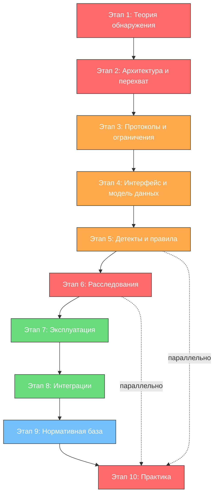

---
tags:
  - maxpatrol-nad
  - network-security
  - ndr
  - deep-packet-inspection
  - positive-technologies
  - learning-plan
status: в-progress
created: 2026-10-07
version: 12.3
---

# План изучения PT NAD 12.3

## Обзор продукта

PT NAD (Network Attack Discovery) — система глубокого анализа сетевого трафика (NDR) от Positive Technologies. Выявляет аномальную сетевую активность и сложные целенаправленные атаки на периметре и внутри сети организации.

Ключевые отличия от классического IDS/IPS:

- **Глубокий контент-анализ** — разбор сессий и протоколов прикладного уровня, извлечение и хранение передаваемых файлов, восстановление картины взаимодействий
- **Три вида детектов** — сигнатурные правила атак (включая Proofpoint ET), несигнатурные правила активностей с самообучением, обнаружение DGA-доменов и IOC по репутационным спискам
- **Доказательная база** — исходная копия трафика в PCAP, метаданные в JSON, ретроспективный анализ с обновлённой базой знаний
- **Связка с MaxPatrol 10** — сетевые события обогащаются активами и уязвимостями, из NAD можно зарегистрировать инцидент; файлы проверяются в PT MultiScanner / PT Sandbox

> [!note] Локальная документация
> Основной источник плана — [[attachments/nad_12.3_operator.pdf|Руководство оператора PT NAD 12.3]] (242 стр., редакция от 18.07.2025). В комплект документации также входят: руководство по проектированию, руководства по установке (на один / несколько серверов), руководство администратора и справочник REST API — их нет в этой папке, при необходимости запросить.

---

## Структура обучения — заметки-этапы

| № | Этап | Приоритет | Время (ориентир.) |
| --- | --- | --- | --- |
| 1 | [[1. Теоретические основы обнаружения сетевых атак]] | КРИТИЧЕСКИЙ | 1–2 недели |
| 2 | [[2. Архитектура и захват трафика]] | КРИТИЧЕСКИЙ | 1–2 недели |
| 3 | [[3. Протоколы, метаданные и ограничения анализа]] | ВЫСОКИЙ | 1 неделя |
| 4 | [[4. Интерфейс и модель данных]] | ВЫСОКИЙ | 1 неделя |
| 5 | [[5. Правила, атаки и активности]] | ВЫСОКИЙ (.core skill) | 2–3 недели |
| 6 | [[6. Расследования — фильтры, сессии, доказательства]] | КРИТИЧЕСКИЙ | 2–3 недели |
| 7 | [[7. Эксплуатация и управление захватом]] | СРЕДНИЙ | 1 неделя |
| 8 | [[8. Интеграции — MaxPatrol 10, MultiScanner, Sandbox, API]] | СРЕДНИЙ | 1 неделя |
| 9 | [[9. Нормативная база и отчётность]] | СРЕДНИЙ | 1 неделя |
| 10 | [[10. Практика и закрепление]] | КРИТИЧЕСКИЙ (параллельно) | постоянно |

---

## Предварительные требования

> [!important] Необходимая база
> Перед началом обучения желательно уверенно владеть следующим:

- **Сети и стек протоколов** — модель OSI, IP/TCP/UDP, DNS, HTTP(S), ключевые порты, NAT, маршрутизация, VLAN; умение читать вывод `tcpdump`/Wireshark
- **Основы перехвата трафика** — SPAN/mirror port, TAP, сетевой диод, размещение точки наблюдения
- **MITRE ATT&CK** — тактики и техники: язык, на котором описывается большинство детектов и отчётов
- **Типы систем обнаружения** — IDS/IPS vs NDR vs SIEM; сигнатурный vs аномальный vs поведенческий детект
- **Вредоносное ПО и инциденты** — C2, ботсети, фишинг, веб-шеллы, эксплуатация уязвимостей, туннелирование
- **ОС Linux** — администрирование, сервисы, логи (интерфейс веб-браузерный, диагностика — SSH)
- **Криптография (базово)** — TLS/HTTPS и его влияние на глубину анализа

---

## Этап 1 — Теоретические основы обнаружения сетевых атак

> [!todo] Приоритет: КРИТИЧЕСКИЙ
> Подробно: [[1. Теоретические основы обнаружения сетевых атак]]

- Алгоритм работы PT NAD: захват → сохранение PCAP → разбор сессий → обогащение метаданных → поиск активностей (раздел 2.1)
- Три вида правил: для атак (сигнатурные), для активностей (несигнатурные + самообучение), правила профилирования (ML, кластерный анализ, чувствительность ×2/×10/×100)
- Обнаружение DGA-доменов, репутационные списки, ретроспективный анализ
- Kill chain и MITRE ATT&CK как каркас расследования

## Этап 2 — Архитектура и захват трафика

> [!todo] Приоритет: КРИТИЧЕСКИЙ
> Подробно: [[2. Архитектура и захват трафика]]

- Модули `ptdpi`, страница «Сенсоры», фильтры захвата на языке BPF (`host`, `net`, `port`, `portrange`, `not` + VLAN)
- Хранилища: потоковое (ротация по конфигурации) и выделенное (для инцидентов/долгого хранения), импорт PCAP
- Иерархия «центральная консоль — дочерние системы» и расширенные операции 12.3; PT NAD Sensor (без PCAP, метаданные ≤ 1 дня, до 1 Гбит/с)
- Точки перехвата: SPAN/TAP, north-south vs east-west, типовые ошибки (перегруженный mirror-порт, только периметр)

## Этап 3 — Протоколы, метаданные и ограничения анализа

> [!todo] Приоритет: ВЫСОКИЙ
> Подробно: [[3. Протоколы, метаданные и ограничения анализа]]

- Метаданные сессии (JSON): адреса, порты, протоколы, приложения, объёмы, файлы; обогащение доменами, гео и IOC
- Приложение В — что разбирается и откуда извлекаются файлы; в 12.3 добавлено 4000+ приложений и протокол MQTT
- Туннелирование (приложение Г), MPLS в метаданных (`tunnels.type == "mpls"`)
- Шифрование: что видно в TLS (SNI, объёмы, гео, IOC) и чего не видно (содержимое, файлы) — ограничение для отчётов

## Этап 4 — Интерфейс и модель данных

> [!todo] Приоритет: ВЫСОКИЙ
> Подробно: [[4. Интерфейс и модель данных]]

- Вход (собственные учётные записи или PT MC), карта разделов главного меню
- Модель: сессия → атака / активность → узел → сетевые связи; Payload в карточке атаки
- Дашборды и виджеты (приложение А: Трафик, Атаки, DNS, HTTP, IOC, Учётные данные, Файлы…)
- Новое в 12.3: индексация нестандартных HTTP-заголовков, плейбуки, навигация по иерархии экземпляров

## Этап 5 — Правила, атаки и активности

> [!todo] Приоритет: ВЫСОКИЙ (.core skill)
> Подробно: [[5. Правила, атаки и активности]]

- Правила для атак: вендорские (PT, Proofpoint ET Open/Pro — загрузка автоматическая) и пользовательские; синтаксис — приложение Ж (Suricata 5, `ptrule`)
- Карточка атаки: описание и рекомендации вендора, ATT&CK, сработавшее правило, Payload / причина срабатывания
- Правила для активностей: обучение, перезапуск (по умолчанию раз в сутки), массовые операции
- Ложные срабатывания и справочник исключений (20.4), репутационные списки, исключения DGA, группы узлов и портов (обязательны для правил!)
- Плейбуки реагирования (новое в 12.3), улучшенные правила сканирований и DNS-туннелирования

## Этап 6 — Расследования: фильтры, сессии, доказательства

> [!todo] Приоритет: КРИТИЧЕСКИЙ
> Подробно: [[6. Расследования — фильтры, сессии, доказательства]]

- Фильтры по метаданным: операторы (`==`, `~`, `and/or/not`, `in [..]`), параметры (`alert.*`, `files.*`, `credentials.*`, `rpt.*`), полнотекстовый поиск (приложение Б)
- Сессии: карточка, флаги/ошибки, экспорт PCAP, копирование в хранилище, экспорт метаданных, скачивание файлов
- Активность: просмотр → дашборд → решение → комментарий; лента активностей
- Итог: отчёт PDF/DOCX (вручную и по расписанию), регистрация инцидента в MaxPatrol 10

## Этап 7 — Эксплуатация и управление захватом

> [!todo] Приоритет: СРЕДНИЙ
> Подробно: [[7. Эксплуатация и управление захватом]]

- Принципы безопасной работы (раздел 4): обновления, квалификация, обучение работе с продуктом
- Модули ptdpi: запуск/остановка, BPF-фильтры и их влияние на производительность, 5-минутная калибровка порогов после запуска
- Индикатор состояния продукта, хранилища и ротация, самозащита от сканирований/флуда/DDoS
- Уведомления о ретроспективном анализе (e-mail, syslog, интерфейс)

## Этап 8 — Интеграции

> [!todo] Приоритет: СРЕДНИЙ
> Подробно: [[8. Интеграции — MaxPatrol 10, MultiScanner, Sandbox, API]]

- MaxPatrol 10: обмен через API и агента; другие SIEM — syslog или webhook; группы активов и `alert.success` (успешность атаки по данным об уязвимостях)
- PT MultiScanner (АВ-сканирование, репутация) и PT Sandbox (поведенческий анализ) для файлов из трафика
- Открытый HTTP API и справочник REST API — выгрузки и автоматизация
- Внешние проверки: WHOIS, репутации, база знаний PT

## Этап 9 — Нормативная база и отчётность

> [!todo] Приоритет: СРЕДНИЙ
> Подробно: [[9. Нормативная база и отчётность]]

- Приказы ФСТЭК 117 / 239 / 187, ГОСТ Р 57580.1 — связь мер защиты с функциями контроля сетевой активности (сверять с действующими редакциями)
- Отчётность продукта: ручные и автоматические отчёты (PDF/DOCX), ограничения центральной консоли
- Язык отчётов для руководства: инцидент → цепочка → артефакты → рекомендации

## Этап 10 — Практика и закрепление

> [!todo] Приоритет: КРИТИЧЕСКИЙ (параллельно с каждым этапом)
> Подробно: [[10. Практика и закрепление]]

- Лаборатория и генерация трафика: nmap, hydra, веб-атаки, EICAR, DNS/ICMP-туннели, DGA, флуд
- Чек-лист навыков: базовый и продвинутый уровень (свои правила, обучение профилирования, BPF, иерархия, REST API)
- Курс Positive Technologies (требование раздела 4 руководства), итоговое досье по инциденту

---

## Приоритеты и порядок изучения

| Приоритет | Этапы | Время (ориентир.) | Результат |
| --- | --- | --- | --- |
| КРИТИЧЕСКИЙ | Теория + Архитектура + Практика | 3-4 недели | Понимание алгоритма и слепых зон |
| ВЫСОКИЙ | Протоколы + Интерфейс + Правила | 4-5 недели | Ориентирование в детектах и настройке |
| КРИТИЧЕСКИЙ | Расследования | 2-3 недели | Доказательный разбор инцидентов |
| СРЕДНИЙ | Эксплуатация + Интеграции + Нормативка | 2-3 недели | Стабильная работа и связка с SIEM |

---

## Ресурсы

### Документация Positive Technologies
- [[attachments/nad_12.3_operator.pdf|Руководство оператора PT NAD 12.3]] — локальная копия в этой папке (все разделы + приложения А–Ж, глоссарий)
- Руководство по проектированию, руководства по установке, руководство администратора, справочник REST API — комплект документации (запросить при необходимости)
- Портал технической поддержки PT — база знаний, новости обновлений (раздел 1.2 руководства)

### Обучение
- [Positive Education](https://edu.ptsecurity.com/) — курсы по продуктам PT, включая обучение работе с NAD (требование раздела 4 руководства)
- Вебинары PT (раздел «Исследования» на ptsecurity.com)

### Смежные стандарты и материалы
- [MITRE ATT&CK](https://attack.mitre.org/) — таксономия техник атак
- Приказ ФСТЭК № 117 от 18.12.2017, № 239 от 25.12.2017, № 187 от 11.02.2013
- [NIST SP 800-94 — Guide to Enterprise Intrusion Detection and Prevention](https://csrc.nist.gov/publications/detail/sp/800-94/final) — методология IDPS

### Связанные заметки в vault
- [[План изучения]] (MaxPatrol VM) — активы, значимость и PDQL как источник контекста для NAD
- Этапы 1–10 — см. таблицу «Структура обучения» выше
