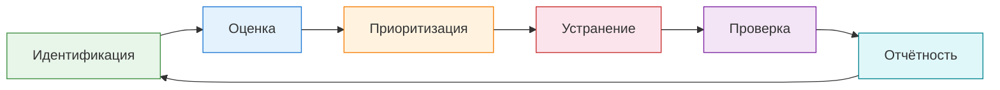
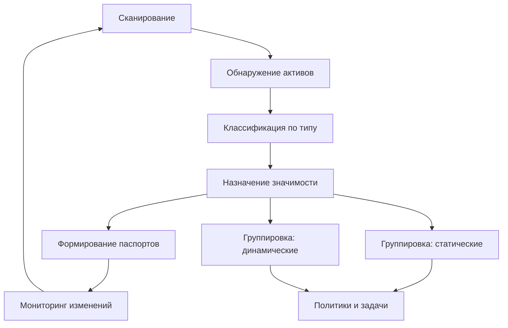

---
tags:
  - maxpatrol-vm
  - vulnerability-management
  - learning
  - stage-1
status: в-progress
created: 2026-08-25
stage: 1
---

# Этап 1 — Теоретические основы управления уязвимостями

> [!todo] Приоритет: КРИТИЧЕСКИЙ
> Без этого этапа инструмент не имеет смысла — это фундамент всего.

---

## 1.1 Процесс управления уязвимостями (VM Lifecycle)

### Зачем это нужно

MaxPatrol VM — это автоматизация именно этого процесса. Если вы не понимаете, *что* автоматизируете, инструмент превращается в чёрный ящик, выдающий списки CVE без реальной пользы для бизнеса.

### Фазы жизненного цикла VM

Управление уязвимостями — это не одноразовое сканирование, а непрерывный цикл. Каждая фаза важна, и пропуск любой из них обесценивает все предыдущие.

#### Фаза 1 — Идентификация активов (Asset Discovery)

> [!important] Принцип
> Невозможно защитить то, чего не знаешь.

- **Что делаем:** находим все устройства и ПО в инфраструктуре — серверы, рабочие станции, сетевое оборудование, виртуальные машины, контейнеры, облачные ресурсы
- **Как в MaxPatrol VM:** сканирование по IP-диапазонам (Discovery), импорт из Active Directory, SCCM, гипервизоров; пассивный сбор от коллекторов и агентов
- **Типичные ошибки:**
  - Отсутствие учёта теневых IT (Shadow IT) — сотрудники подключают свои роутеры, NAS, виртуалки
  - Забытые серверы в DMZ или тестовые среды
  - Сетевые сегменты, недоступные для сканирования из-за межсетевых экранов
- **Практический совет:** начните с широкого сканирования (whole network scan), затем уточняйте. Частая ошибка — сразу настраивать узкие диапазоны и терять часть инфраструктуры

#### Фаза 2 — Оценка уязвимостей (Vulnerability Assessment)

- **Что делаем:** определяем наличие уязвимостей на найденных активах
- **Как в MaxPatrol VM:** аудит (сканирование с учётными данными), проверка конфигураций, сверка с базой знаний
- **Два подхода:**
  - **Чёрный ящик** — сканирование без учётных данных: проверяются только открытые сервисы и версии ПО
  - **Белый ящик** — сканирование с учётными данными: глубокая проверка установленного ПО, конфигураций, патчей
- **Ключевой момент:**_MaxPatrol VM после сканирования «помнит» результаты. При обновлении базы знаний система автоматически пересчитывает, какие уязвимости применимы к каким активам — без повторного сканирования. Это принципиальное отличие от простых сканеров
- **Метрики оценки:**
  - CVSS (Common Vulnerability Scoring System) — числовая оценка тяжести (0–10)
  - CVE (Common Vulnerabilities and Exposures) — идентификатор уязвимости
  - CWE (Common Weakness Enumeration) — классификация типа слабости

#### Фаза 3 — Приоритизация (Prioritization)

> [!warning] Самая сложная фаза
> Типичная ситуация: 10 000 уязвимостей, 5 человек в ИТ-отделе, 2 недели до следующего релиза. *Что чинить первым?*

- **Что делаем:** ранжируем уязвимости по степени риска для бизнеса
- **Факторы приоритизации:**
  - Тяжесть уязвимости (CVSS score)
  - Значимость актива (критичность для бизнеса)
  - Наличие эксплита в открытом доступе
  - Доступность актива извне (интернет- facing)
  - Наличие компенсирующих мер
- **Как в MaxPatrol VM:** значимость активов (H/M/L/ND), комбинация CVSS + значимость актива для расчёта итогового приоритета, политики значимости на основе PDQL

#### Фаза 4 — Устранение (Remediation)

- **Что делаем:** закрываем уязвимости
- **Методы:**
  - Установка патчей и обновлений (Patch Management)
  - Изменение конфигурации (Hardening)
  - Установка компенсирующих мер (временные экраны, изоляция сегментов)
  - Отключение ненужных сервисов
  - Замена уязвимого ПО
- **Реальность:** устранение — самая «тяжёлая» фаза. Требует координации ИБ и ИТ, тестирования патчей, окон обслуживания, отчётов перед руководством
- **Как в MaxPatrol VM:** статусы обработки уязвимостей, сроки устранения, автоматическая эскалация, интеграция с ITSM для создания заявок

#### Фаза 5 — Проверка (Verification)

- **Что делаем:** убеждаемся, что уязвимость действительно устранена
- **Как делаем:** повторное сканирование (или переоценка в MaxPatrol VM без повторного сканирования)
- **Важно:** одна уязвимость может быть закрыта на одном уровне, но оставаться открытой на другом (например, обновили браузер, но старая версия осталась в кэше)

#### Фаза 6 — Отчётность (Reporting)

- **Что делаем:** фиксируем результаты, формируем отчёты для разных аудиторий
- **Типы отчётов:**
  - Оперативные (для ИБ-команды) — конкретные уязвимости, сроки, ответственные
  - Тактические (для ИТ-отдела) — статус патчинга, проблемы с интеграцией
  - Стратегические (для руководства) — тренды, риски, ROI investments в ИБ
- **Как в MaxPatrol VM:** встроенные отчёты, кастомные отчёты, дашборды с виджетами, экспорт в различные форматы

### VM Lifecycle в контексте MaxPatrol VM

> [!tip] Ключевое отличие MaxPatrol VM
> В отличие от простых сканеров (Nessus, Qualys в базовой конфигурации), MaxPatrol VM реализует подход Security Asset Management (SAM): инвентаризация и сканирование разделены, результаты хранятся постоянно, а переоценка уязвимостей происходит автоматически при обновлении базы знаний.

---

## 1.2 Модель управления активами

### Почему инвентаризация — основа VM

> [!quote] Управлять уязвимостями без управления активами — всё равно, что чинить машину, не открывая капот.

Инвентаризация в MaxPatrol VM — это не просто «список IP». Это структурированная модель инфраструктуры с привязкой к бизнес-значимости.

### Ключевые понятия

#### Актив (Asset)

- **Определение:** любая единица инфраструктуры, которую нужно защищать — сервер, рабочая станция, сетевое устройство, виртуальная машина, контейнер
- **В MaxPatrol VM:** каждый актив represented как экземпляр конкретного класса (WindowsHost, LinuxHost, NetworkDeviceHost и т.д.)
- **Примеры классов:**
  - `WindowsHost` — Windows-сервер или рабочая станция
  - `LinuxHost` — Linux/Unix-система
  - `NetworkDeviceHost` — маршрутизатор, коммутатор, межсетевой экран
  - `VirtualHost` — гипервизор (VMware, Hyper-V)
  - `DBMSHost` — система управления базами данных

#### Экземпляр (Instance)

- **Определение:**  конкретный актив на конкретном IP-адресе в конкретный момент времени
- **Зачем:** один и тот же сервер может быть обнаружен на разных IP, в разных сегментах — экземпляр привязывает данные к конкретному наблюдению
- **Отличие от паспорта:** экземпляр — это «я нашёл это на 192.168.1.50 сегодня в 14:00», паспорт — это «этот сервер существует, работает с 2019 года, и на нём вот эти уязвимости»

#### Паспорт уязвимости (Vulnerability Passport)

- **Определение:** обобщённое описание уязвимости — CVE, описание, CVSS, affected software, методы устранения
- **Пример:** CVE-2024-1234, CVSS 9.8, влияет на OpenSSL 3.0.x, исправлено в 3.0.15
- **Не привязан к конкретному активу** — это общая информация из базы знаний

#### Экземпляр уязвимости

- **Определение:** конкретный случай уязвимости на конкретном активе
- **Пример:** «Сервер SRV-DB-01 (192.168.1.50) имеет OpenSSL 3.0.12, что делает его уязвимым к CVE-2024-1234»
- **Статусы обработки:** новая, в обработке, устранена, ложное срабатывание, принято решение не устранять (с указанием причины)

#### Сегмент сети (Network Segment)

- **Определение:** логическая группировка активов по сетевому принципу
- **Типы:**
  - Подсети (CIDR-блоки)
  - VLAN
  - Географические расположения
  - Функциональные зоны (DMZ, корпоративная сеть, серверная)
- **В MaxPatrol VM:** используется для целей сканирования, группировки, политик и отчётности

### Классификация активов по значимости

> [!important] Значимость актива — ключевой фактор приоритизации уязвимостей

| Уровень | Обозначение | Описание | Пример |
| --- | --- | --- | --- |
| Высокая | **H** (High) | Критичные для бизнеса системы | ERP, базы данных клиентов, Active Directory, системы оплаты |
| Средняя | **M** (Medium) | Важные, но заменяемые системы | Корпоративный.portal, почтовый сервер, VPN-шлюз |
| Низкая | **L** (Low) | Вспомогательные системы | Тестовые стенды, личные рабочие станции, принтеры |
| Не определена | **ND** (Not Determined) | Значимость не назначена | Вновь обнаруженные активы, не классифицированные |

#### Автоматическая классификация

- **На основе PDQL-правил:** например, все серверы с БД = H, все рабочие станции = M, тестовые стенды = L
- **На основе данных из AD/CMDB:** привязка к OU, department, criticality field
- **Ручная классификация:** для случаев, которые невозможно автоматизировать

#### Динамические vs статические группы

**Статические группы:**
- Фиксированный набор активов, добавленных вручную
- Подходят для: разовых проектов, временных групп (например, «серверы для миграции»)
- Недостаток: требуют ручного обновления при появлении новых активов

**Динамические группы:**
- Определяются PDQL-запросом, автоматически обновляются
- Подходят для: постоянных политик, отчётности, назначения значимости
- Пример: «все Windows-серверы в подсети 10.0.0.0/24 с классом значимости H»
- Преимущество: при добавлении нового сервера в подсеть он автоматически попадает в группу

### Как это работает в MaxPatrol VM

---

## 1.3 Нормативная база (для работы в РФ)

### Зачем это нужно

MaxPatrol VM активно используется в России для контроля соответствия требованиям ФСТЭК. Понимание нормативной базы критично, потому что:

- Многие организации обязаны проводить контроль защищённости по ФСТЭК
- MaxPatrol VM входит в реестр СКЗИ (средств защиты информации), что важно для госзакупок
- Требования ФСТЭК определяют *что* проверять и *как часто*

### Приказ ФСТЭК № 117 — Базовые меры защиты

#### Что это такое

Приказ ФСТЭК России от 18.12.2017 № 117 «Об утверждении состава и содержания организационных и технических мер по обеспечению безопасности персональных данных при их обработке в информационных системах персональных данных».

> [!note] Актуальность
> Несмотря на название про персональные данные, требования 117-го приказа де-факто применяются к любой информации, подлежащей защите в рамках 152-ФЗ.

#### Связь с MaxPatrol VM

- MaxPatrol VM входит в **Единый реестр российских программ для ЭВМ и баз данных** (как средство защиты)
- Используется для выполнения **базовых мер защиты**, в частности:
  - Ведение и актуализация перечня информационных систем
  - Контроль защищённости информационных систем
  - Учёт и регистрация событий безопасности
  - Контроль защищённости от НСД (несанкционированного доступа)

#### Ключевые требования, закрываемые MaxPatrol VM

| Требование | Что проверяет MaxPatrol VM | Раздел приказа |
| --- | --- | --- |
| Ведение каталога активов | Инвентаризация, Discovery | Раздел 8 (базовая мера 8) |
| Контроль защищённости | Аудит конфигураций, проверка уязвимостей | Раздел 8 (базовая мера 9) |
| Учёт событий безопасности | Сбор данных от коллекторов, интеграция с SIEM | Раздел 8 (базовая мера 11) |
| Контроль средств защиты | Проверка установленных антивирусов, межсетевых экранов | Раздел 8 (базовая мера 7) |

> [!tip] Для справки
> Подробнее: [[ФСТЭК 117]] — нормативная база, в которой MaxPatrol VM фигурирует как средство контроля защищённости

### Приказ ФСТЭК № 239 — Контроль защищённости

#### Что это такое

Приказ ФСТЭК России от 25.12.2017 № 239 «Об утверждении требований к защите персональных данных при их обработке в информационных системах персональных данных».

#### Ключевое отличие от 117-го

- **117-й** — базовые меры (что делать)
- **239-й** — контроль защищённости (как проверять, что меры работают)

#### Связь с MaxPatrol VM

- MaxPatrol VM используется для проведения **внутреннего контроля защищённости** — это одна из ключевых функций системы
- Контроль проводится по методикам ФСТЭК (в том числе на основе контрольных вопросов)
- Результаты контроля оформляются в виде отчётов, которые можно передавать в ФСТЭК при проверках

#### Методики контроля защищённости

| Методика | Описание | Применение в MaxPatrol VM |
| --- | --- | --- |
| Контрольные вопросы | Проверка по списку требований | Автоматическая проверка конфигураций |
| Тестовый контроль | Автоматизированные проверки | Профили проверок (HCC), PDQL-запросы |
| Целевой контроль | Глубокий аудит конкретных систем | Глубокое сканирование с учётными данными |

### Другие нормативные акты

| Документ | Что регулирует | Как связано с MaxPatrol VM |
| --- | --- | --- |
| 187-ФЗ | Защита КИИ (критической информационной инфраструктуры) | MaxPatrol VM помогает контролировать защищённость систем КИИ |
| Приказ ФСТЭК № 21 | Требования к средствам защиты от НСД | Проверка соответствия средств защиты |
| Приказ ФСТЭК № 235 | Методика оценки защищённости | Методология, которую MaxPatrol VM помогает автоматизировать |
| ГОСТ Р 57580.1 | Безопасность финансовых систем | Требования для банков и финтех-компаний |

### Практические рекомендации

> [!tip] Для начинающих
> Не пытайтесь выучить все приказы наизусть. Сфокусируйтесь на:
> 1. Требованиях, которые напрямую касаются вашей организации (согласно сфере регулирования)
> 2. Структуре приказов — где найти нужное требование
> 3. Как MaxPatrol VM помогает выполнять/контролировать эти требования

---

## Краткое резюме Этапа 1

| Аспект | Ключевая мысль |
| --- | --- |
| VM Lifecycle | Непрерывный цикл из 6 фаз; MaxPatrol VM автоматизирует все, кроме устранения |
| Инвентаризация | Основа всего; без списка активов управление уязвимостями невозможно |
| Значимость актива | Определяет приоритет уязвимостей; без неё все CVE равнозначны |
| Динамические группы | PDQL-запрос определяет состав; автоматическое обновление |
| ФСТЭК № 117 | Базовые меры; MaxPatrol VM помогает выполнять и контролировать |
| ФСТЭК № 239 | Контроль защищённости; MaxPatrol VM — инструмент для проведения контроля |

---

## Связанные заметки

- [[План изучения]] — общий план обучения
- [[ФСТЭК 117]] — нормативная база

## Ресурсы

- [Справочный портал MaxPatrol VM](https://help.ptsecurity.com/ru-RU/projects/vm/2.8/help/4980710795)
- [Курс Positive Education: Применение MaxPatrol VM](https://edu.ptsecurity.com/kursy-po-ekspluatacii-productov-pt/mp-vm)
- [NIST SP 800-40 — Guide to Enterprise Patch Management Planning](https://csrc.nist.gov/publications/detail/sp/800-40/rev-4/final)
- Приказ ФСТЭК № 117 от 18.12.2017
- Приказ ФСТЭК № 239 от 25.12.2017

---

*Следующий этап: [[2. Архитектура и установка]]*
