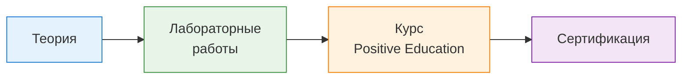

---
tags:
  - maxpatrol-vm
  - vulnerability-management
  - learning
  - stage-10
  - practice
status: in-progress
created: 2026-08-25
---
# Этап 10 — Практика и закрепление

---

## Обзор подхода

> [!important] Параллельно с каждым этапом
> Практика — не отдельный блок, а непрерывный процесс. Каждый этап плана должен сопровождаться лабораторными работами.

---

## 10.1 Лабораторные работы

### Лабораторная 1 — Установка и первоначальная настройка

> [!info] Этапы плана: 2 (Архитектура)

**Цель:** развернуть MaxPatrol VM и выполнить первоначальную настройку.

**Среда:**
- Виртуальная машина (VMware ESXi / VirtualBox / KVM)
- Ubuntu 22.04 LTS, 8 ядер, 32 ГБ RAM, 200 ГБ SSD
- Сетевой доступ к тестовым активам

**Задания:**

| # | Задание | Контрольная точка |
| --- | --- | --- |
| 1 | Установить Deployer | Роль в статусе «Активен» |
| 2 | Установить PT MC (SqlStorage, LogConnector, Observability, MC) | Веб-интерфейс доступен |
| 3 | Установить MP 10 Core (RMQ, Core) | Все роли активны |
| 4 | Установить MP 10 Collector | Collector в статусе «Активен» |
| 5 | Активировать лицензию | Лицензия действительна |
| 6 | Обновить базу знаний | Последняя версия загружена |
| 7 | Настроить SMTP для уведомлений | Тестовое письмо доставлено |
| 8 | Создать 2 учётные записи операторов с разными ролями | Доступ проверен |

**Результат:** рабочая инсталляция MaxPatrol VM, доступная через веб-интерфейс.

---

### Лабораторная 2 — Сбор данных и сканирование

> [!info] Этапы плана: 3 (Сбор данных)

**Цель:** настроить сканирование тестовой инфраструктуры и получить данные об активах.

**Тестовая инфраструктура (минимум):**
- 2-3 Windows-машины (виртуальные)
- 1-2 Linux-машины (виртуальные)
- 1 сетевое устройство (или симулятор)
- Диапазон IP: 192.168.100.0/24

**Задания:**

| # | Задание | Контрольная точка |
| --- | --- | --- |
| 1 | Создать группу «Тестовая инфраструктура» | Группа создана |
| 2 | Добавить 2 учётные записи (Windows Administrator, Linux root) | Тест подключения пройден |
| 3 | Запустить задачу Discovery на 192.168.100.0/24 | Активы обнаружены |
| 4 | Создать профиль сканирования «Быстрый аудит Windows» | Профиль создан |
| 5 | Запустить задачу Audit на Windows-машины | Установленное ПО, патчи |
| 6 | Запустить задачу Audit на Linux-машины | Пакеты, конфигурации |
| 7 | Сравнить результаты Discovery vs Audit | Audit показал больше данных |
| 8 | Импортировать компьютеры из AD (если есть) | Компьютеры из AD в системе |

**Результат:** все тестовые активы обнаружены, данные о ПО и уязвимостях собраны.

---

### Лабораторная 3 — PDQL-запросы (20-30 запросов)

> [!info] Этапы плана: 4 (PDQL)

**Цель:** освоить язык PDQL через выполнение запросов разной сложности.

> [!info] Синтаксис заданий
> Все запросы ниже записаны **в официальном синтаксисе PDQL** из документа «Синтаксис языка запросов PDQL». Синтаксис — в [[4. Язык PDQL]], полный справочник псевдонимов — в [[PDQL — синтаксис по документации PT]].
>
> проверки перед запуском:
> - объекты модели — без `@`: `Host`, `WindowsHost`, `UnixHost`, `NetworkDeviceHost`; псевдонимы — с `@`: `@Host`, `@Vulners`, `@IpAddresses`;
> 

#### Базовые (запросы 1-7)

| # | Задание | PDQL | Проверка |
| --- | --- | --- | --- |
| 1 | Вывести все активы | `Select(@Host, Host.Fqdn, Host.IpAddress)` | колонка заполнена |
| 2 | Вывести только Windows | `Select(WindowsHost, Host.Fqdn, Host.OsName)` | нет Unix-узлов |
| 3 | Вывести только Linux/Unix | `Select(UnixHost, Host.Fqdn, Host.OsName)` | нет Windows-узлов |
| 4 | Найти активы в подсети | `Filter(Host.@IpAddresses.Item in 192.168.100.0/24) \| Select(@Host, Host.Fqdn, Host.IpAddress)` | все IP в сети |
| 5 | Найти активы с критичными уязвимостями | `Filter(Host[@Vulners.CVSS3Score >= 9]) \| Select(@Host, Host.Fqdn, Host.@Vulners.CVEs)` | оценка ≥ 9 |
| 6 | Найти активы высокой значимости | `Filter(Host.@Importance in ['H', 'M']) \| Select(@Host, Host.Fqdn, Host.@Importance)` | работает в фильтре, **но не в динамической группе** |
| 7 | Поиск через строку поиска → условие фильтрации | Ввести `test` в строке поиска, преобразовать условие в фильтр, затем `Select(@Host, Host.Fqdn)` | поиск — не операция PDQL |

#### Средние (запросы 8-15)

| #   | Задание                              | PDQL                                                                                                                                              | Проверка                                   |
| --- | ------------------------------------ | ------------------------------------------------------------------------------------------------------------------------------------------------- | ------------------------------------------ |
| 8   | Установленное ПО на конкретном хосте | `Filter(Host.IpAddress = '192.168.100.10') \| Select(@Host, Host.Fqdn, Host.Softs.Name, Host.Softs.Version)`                                      | один хост                                  |
| 9   | Уязвимости ОС                        | `Select(@Host, Host.OsName, Host.@NodeVulners) \| Filter(Host.@NodeVulners)`                                                                      | только уязвимости ОС, без ПО               |
| 10  | Уязвимости ПО                        | `Select(@Host, Host.Softs.Name, Host.Softs.Version, Host.Softs.@NodeVulners) \| Filter(Host.Softs.@NodeVulners)`                                  | уязвимости уровня ПО                       |
| 11  | Уязвимости Linux-пакетов             | `Select(UnixHost.Packages.Name, UnixHost.Packages.Version, UnixHost.Packages.@NodeVulners) \| Filter(UnixHost.Packages.@NodeVulners)`             | только пакеты                              |
| 12  | Паспорта уязвимостей с CVSS > 7      | `Select(@Vulners.CVEs, @Vulners.Name, @Vulners.CVSS3BaseScore) \| Filter(@Vulners.CVSS3BaseScore > 7)`                                            | базовая оценка, не общая                   |
| 13  | Открытые порты известных служб       | `WindowsHost.Endpoints<TransportEndpoint>[Status = 'Open' and Protocol = 'tcp' and Port = 3389] \| Select(@Host, Host.Fqdn, Host.Endpoints.Port)` | найден RDP                                 |
| 14  | Серверы Windows                      | `WindowsHost and Host.HostType = 'Server'`                                                                                                        | работает и как условие динамической группы |
| 15  | Рабочие станции Windows              | `WindowsHost and Host.HostType = 'Desktop'`                                                                                                       | тоже для динамической группы               |

> [!tip] Задание 13 вместо «подобранных учётных записей»
> Путь `Host.Endpoints.Service.Checks.Login` в официальной документации не описан. Если подтвердите его по подсказкам интерфейса — верните задание; проверенная альтернатива выше.

#### Продвинутые (запросы 16-25)

| # | Задание | PDQL | Проверка |
| --- | --- | --- | --- |
| 16 | Количество уязвимостей по уровню опасности | `Select(@Host, Host.@Vulners.SeverityRating) \| Group(Host.@Vulners.SeverityRating, Count(*) as Total) \| Sort(Total DESC)` | сумма = числу уязвимостей |
| 17 | Топ-10 хостов по числу уязвимостей | `Select(@Host, Host.Fqdn) \| Filter(Host.@Vulners) \| Group(@Host, Count(All Host.@Vulners) as V) \| Sort(V DESC) \| Limit(10)` | ровно 10 строк |
| 18 | Активы не сканировались > 30 дней | `Filter(Host.@AuditTime < Now() - 30days) \| Select(@Host, Host.Fqdn, Host.@AuditTime)` | минус перед `Now()` |
| 19 | Новые активы за 7 дней | `Filter(Host.@CreationTime >= Now() - 7days) \| Select(@Host, Host.Fqdn, Host.@CreationTime)` | — |
| 20 | Активы, которые скоро устареют | `Filter(Host.@DeletionTime <= Now() + 7days) \| Select(@Host, Host.Fqdn, Host.@DeletionTime)` | плюс = будущее |
| 21 | Уязвимости с возможностью эксплуатации | `Select(@Vulners.CVEs, @Vulners.Name, @Vulners.CVSS3Score) \| Filter(@Vulners.Metrics.Exploitable)` | не `@Vulners.Score` — он не для динамических групп |
| 22 | Серверы с SQL Server | `Host.Softs.Name like '%SQL Server%'` | `%` — любое количество символов |
| 23 | Уязвимости без исправления | `Filter(Host[@Vulners.Metrics.HasFix = false]) \| Select(@Host, Host.Fqdn, Host.@Vulners.CVEs, Host.@Vulners.HowToFix)` | есть метод устранения |
| 24 | Активы с уязвимостями на сетевых службах | `Filter(Host.Endpoints[@Vulners]) \| Select(@Host, Host.Fqdn, Host.Endpoints.Port, Host.Endpoints.Protocol)` | — |
| 25 | ПРО: уязвимости по вендору ПО | `Select(Host.Softs.Vendor, Host.Softs.Name) \| Group(Host.Softs.Vendor, Count(*) as C) \| Sort(C DESC)` | `Count`, не `COUNT` |

#### Дополнительно (задания 26-30) — операции, которых нет в базовом списке

| # | Задание | PDQL | Что проверяет |
| --- | --- | --- | --- |
| 26 | Динамика опасных уязвимостей по дням | `Filter(Host[@Vulners.CVSS3Score >= 9]) \| Timeseries(30d, 1d, Endofday()) \| Select(@Host, Host.@Time) \| Group(Host.@Time, Count(*))` | `Timeseries` обязателен для временных виджетов |
| 27 | Срез на момент времени вчера | `Filter(Host[@Vulners]) \| Timepoint(Now() - 1days) \| Select(@Host, Host.Fqdn, Host.@Time)` | `Timepoint` |
| 28 | Изменение регистра для корреляции событий | `Filter(Host.HostRoles.Role = 'Domain Controller') \| Select(Host.Fqdn) \| Calc(lower(Host.FQDN) as fqdn) \| Select(fqdn)` | `Calc` + `upper`/`lower` |
| 29 | Объединение двух запросов (родительский и дочерний процессы) | `Select(@Host, Host.Endpoints.Port) \| Join(Select(@Host, Host.Fqdn) as H, @Host = H.@Host) \| Select(@Host, Host.Endpoints.Port, H.Host.Fqdn)` | `Join` с псевдонимом запроса |
| 30 | Уникальное ПО без дублей | `Select(Host.Softs.Name as name, Host.Softs.Version as version) \| Unique()` | `Unique()` |

**Результат:** 30 выполненных PDQL-запросов с освоением объектов модели и псевдонимов, предикатов, конвейера, фильтрации по времени, группировки, `Join` и `Calc`.

> [!warning] Что проверить отдельно
> - **Имена атрибутов модели** (`Host.Endpoints.Protocol`, `UnixHost.Packages`, `Host.HostType`, `Host.Softs.Vendor`) в документации не приводятся целиком — сверяйте по подсказкам интерфейса при вводе поля.
> - **`HostType = 'Desktop'`** — пример документации использует только `'Server'`. Значение `'Desktop'` подтвердите на своих данных.
> - **`@Importance` и «значимость не задана»** — код состояния `Undefined` в документации не приводится. Фильтр «без значимости» надёжнее делать через интерфейс, а не через PDQL.

---

### Лабораторная 4 — Карточки активов и уязвимости

> [!info] Этапы плана: 5 (Активы и уязвимости)

**Цель:** научиться анализировать конкретные активы и уязвимости.

**Задания:**

| # | Задание | Контрольная точка |
| --- | --- | --- |
| 1 | Открыть карточку Windows-сервера | Все вкладки доступны |
| 2 | Найти все установленное ПО | Список ПО с версиями |
| 3 | Найти все уязвимости на этом хосте | Таблица с CVE, CVSS |
| 4 | Сравнить конфигурацию двух сканирований | Diff отображён |
| 5 | Найти паспорт уязвимости CVE с CVSS >= 9 | Паспорт найден |
| 6 | Найти все экземпляры этой уязвимости | Список активов |
| 7 | Изменить статус уязвимости на «В обработке» | Статус обновлён |
| 8 | Создать динамическую группу «Критичные серверы» | Группа создана, PDQL работает |

**Результат:** понимание разницы паспорт/экземпляр, умение работать со статусами.

---

### Лабораторная 5 — Группы и значимость

> [!info] Этапы плана: 5 (Значимость)

**Цель:** построить иерархию групп и автоматизировать назначение значимости.

**Задания:**

| # | Задание | Контрольная точка |
| --- | --- | --- |
| 1 | Создать корневую группу «Организация» | Группа создана |
| 2 | Создать статическую группу «Серверная» | Группа создана |
| 3 | Создать динамическую группу «Windows-серверы» | Условие `WindowsHost and Host.HostType = 'Server'` отрабатывает |
| 4 | Создать динамическую группу «Linux-серверы» | Условие `UnixHost and Host.HostType = 'Server'` отрабатывает |
| 5 | Создать динамическую группу «Сетевое оборудование» | Условие `NetworkDeviceHost` отрабатывает |
| 6 | Создать политику значимости: контроллеры домена → H | Политика создана, значимость назначена |
| 7 | Создать политику значимости: рабочие станции → L | Политика создана |
| 8 | Найти активы без значимости и назначить | Все активы классифицированы |

> [!warning] Не используйте `@Importance` в условиях динамических групп
> Политику значимости стройте на признаках актива — ОС, роль, ПО, тип узла: `WindowsHost[HostRoles.Role = 'Domain Controller']`, `UnixHost and Host.Softs.Name like '%PostgreSQL%'`. Псевдоним `@IMPORTANCE` для динамических групп не поддерживается — иначе получится цикл «присвоили значимость → актив попал в группу → пересчитали значимость». Полный список ограничений — в [[PDQL — синтаксис по документации PT]], раздел 6.

**Результат:** иерархия групп, все активы с назначенной значимостью.

---

### Лабораторная 6 — Автоматизация и политики

> [!info] Этапы плана: 6 (Автоматизация)

**Цель:** настроить политики сканирования и обработки уязвимостей.

**Задания:**

| # | Задание | Контрольная точка |
| --- | --- | --- |
| 1 | Создать политику сканирования: еженедельно критичные серверы | Политика создана |
| 2 | Создать политику сканирования: ежемесячно рабочие станции | Политика создана |
| 3 | Создать политику значимости: все серверы → H | Политика работает |
| 4 | Создать политику обработки: патчинг Windows (HasFix, 1 мес) | Статус «Исправляется» назначен |
| 5 | Создать политику актуальности: 30 дней | Политика создана |
| 6 | Создать политику исключения: тестовый сегмент | Уязвимости исключены |
| 7 | Проверить, что политики применились | Статусы обновлены |
| 8 | Дождаться просроченной уязвимости (или смоделировать) | Статус «Просрочена» |

**Результат:** автоматизированный процесс обработки уязвимостей.

---

### Лабораторная 7 — Дашборды и отчёты

> [!info] Этапы плана: 7 (Визуализация)

**Цель:** создать дашборд с ключевыми метриками и настроить уведомления.

**Задания:**

| # | Задание | Контрольная точка |
| --- | --- | --- |
| 1 | Создать дашборд «Оперативный для ИБ» | Дашборд создан |
| 2 | Добавить виджет «Критичные уязвимости» (таблица) | Виджет работает |
| 3 | Добавить виджет «Уязвимости по severity» (столбчатый график) | Виджет работает |
| 4 | Добавить виджет «Количество активов» (метрика) | Виджет работает |
| 5 | Добавить виджет «Просроченные» (список) | Виджет работает |
| 6 | Настроить email-уведомление: критичная уязвимость | Уведомление получено |
| 7 | Настроить webhook-уведомление (опционально) | POST-запрос получен |
| 8 | Создать отчёт «Критичные уязвимости» и экспортировать PDF | PDF создан |

**Результат:** рабочий дашборд, настроенные уведомления, экспорт отчёта.

---

### Лабораторная 8 — HCC (опционально)

> [!info] Этапы плана: 8 (HCC)
>
> [!warning] Модуль HCC не описан в документации 2.8
> В локальной документации MaxPatrol VM 2.8 упоминаний HCC нет — эта лаборатория опирается на внешние материалы о продукте. Детали и замена на реальные страницы (чек-лист настройки системы и др.) — в [[8. Контроль соответствия и HCC]].

**Цель:** проверить активы на соответствие стандартам.

**Задания:**

| # | Задание | Контрольная точка |
| --- | --- | --- |
| 1 | Активировать модуль HCC | HCC доступен |
| 2 | Запустить стандарт PT Essentials (Linux) на Linux-серверы | Результаты получены |
| 3 | Запустить стандарт PT Essentials (Windows) на Windows-серверы | Результаты получены |
| 4 | Проанализировать несоответствия | Список нарушений |
| 5 | Исправить 3 критичных несоответствия | Повторная проверка: OK |
| 6 | Создать кастомную проверку (опционально) | Проверка работает |

**Результат:** понимание HCC, исправленные несоответствия.

---

### Лабораторная 9 — REST API (опционально)

> [!info] Этапы плана: 9 (API)

**Цель:** получить данные через API и автоматизировать задачу.

**Задания:**

| # | Задание | Контрольная точка |
| --- | --- | --- |
| 1 | Получить токен через PT MC | Токен создан |
| 2 | Выполнить PDQL-запрос через API | Данные получены |
| 3 | Экспорт критичных уязвимостей в CSV | CSV-файл создан |
| 4 | Написать скрипт еженедельного отчёта (Python) | Скрипт работает |
| 5 | Настроить cron для автоматического запуска | Cron настроен |

**Результат:** понимание API, рабочий скрипт автоматизации.

---

## 10.2 Курс Positive Education

### Рекомендация

> [!tip] Запишитесь на курс
> Курс «Применение MaxPatrol VM в процессе управления уязвимостями» — лучший способ закрепить знания на практике.

### Информация о курсе

| Параметр | Значение |
| --- | --- |
| Название | Применение MaxPatrol VM в процессе управления уязвимостями |
| Платформа | [Positive Education](https://edu.ptsecurity.com/kursy-po-ekspluatacii-productov-pt/mp-vm) |
| Длительность | ~4 недели |
| Доступ | 6 месяцев |
| Формат | Онлайн, интерактивная среда |
| Стоимость | Платный (есть бесплатные альтернативы ниже) |

### Бесплатные альтернативы

| Ресурс | Описание | Ссылка |
| --- | --- | --- |
| TS University: MaxPatrol VM Getting Started | Бесплатный курс, обзор возможностей | [university.tssolution.ru](https://university.tssolution.ru/maxpatrol-vm-getting-started/obzor-vozmozhnostej) |
| TS University: Построение процесса VM | Бесплатный курс, политики и процессы | [university.tssolution.ru](https://university.tssolution.ru/maxpatrol-vm-getting-started/postroenie-processa-upravleniya-uyazvimostyami) |
| Вебинары Positive Technologies | Записи вебинаров по различным темам | [ptsecurity.com](https://ptsecurity.com/research/webinar/) |

---

## 10.3 Подготовка к сертификации

### Сертификация Positive Technologies

> [!note] Сертификация
> Positive Technologies предлагает сертификацию по MaxPatrol VM. Подтверждает компетенции в области управления уязвимостями.

### Ресурсы для подготовки

| Ресурс | Тип | Описание |
| --- | --- | --- |
| Официальная документация | Справочник | [[Документация]] (индекс) или https://help.ptsecurity.com/ru-RU/projects/vm/2.8/help |
| Справочник PDQL | Язык запросов | [[PDQL — синтаксис по документации PT]], [[Псевдонимы уязвимостей]], [[Операторы]] |
| Вебинары PT | Видео | [ptsecurity.com/webinar](https://ptsecurity.com/research/webinar/) |
| Страничка продукта | Обзор | [ptsecurity.com/products/mp-vm](https://ptsecurity.com/products/mp-vm/) |

> Старые ссылки `help/4980710795` («Официальная документация») и `help/1505039755` («Справочник PDQL») удалены: первый doc_id в документации 2.8 принадлежит странице «Сбор телеметрических данных», второго не существует.

### Рекомендуемый порядок подготовки

1. Пройти все 10 этапов плана изучения
2. Выполнить все лабораторные работы (минимум 9)
3. Пройти курс Positive Education или бесплатные альтернативы
4. Повторить PDQL-запросы (минимум 30 уникальных)
5. Ознакомиться с официальной документацией как со справочником
6. Записаться на сертификацию

---

## Чек-лист завершения обучения

> [!checklist] Итоговый чек-лист
> Отметьте каждый пункт по мере выполнения.

### Теория
- [ ] Этап 1: VM Lifecycle, инвентаризация, ФСТЭК
- [ ] Этап 2: Архитектура, компоненты, развёртывание
- [ ] Этап 3: Режимы сканирования, учётные записи, профили
- [ ] Этап 4: PDQL — синтаксис, алиасы, запросы
- [ ] Этап 5: Карточки активов, паспорта/экземпляры, группы, значимость
- [ ] Этап 6: Политики сканирования, обработки, значимости
- [ ] Этап 7: Дашборды, виджеты, отчёты, уведомления
- [ ] Этап 8: HCC, PT Essentials, комплаенс
- [ ] Этап 9: REST API, автоматизация, интеграции

### Практика
- [ ] Лаб. 1: Установка и настройка
- [ ] Лаб. 2: Сбор данных и сканирование
- [ ] Лаб. 3: PDQL (20+ запросов)
- [ ] Лаб. 4: Карточки активов и уязвимости
- [ ] Лаб. 5: Группы и значимость
- [ ] Лаб. 6: Автоматизация и политики
- [ ] Лаб. 7: Дашборды и отчёты
- [ ] Лаб. 8: HCC (опционально)
- [ ] Лаб. 9: REST API (опционально)

### Курс и сертификация
- [ ] Курс Positive Education или бесплатная альтернатива
- [ ] Знакомство с официальной документацией
- [ ] Запись на сертификацию (опционально)

---

## Типичные ошибки при обучении

| Ошибка | Проблема | Решение |
| --- | --- | --- |
| Чтение без практики | Знания не закрепляются | Выполняйте лабораторные параллельно |
| Пропуск PDQL | Невозможно работать с данными | Минимум 30 запросов перед продолжением |
| Игнорирование групп | Нет организации активов | Создавайте группы с первого сканирования |
| Ручная обработка | Не масштабируется | Настройте политики как можно раньше |
| Один профиль сканирования | Потеря данных или времени | Разные профили для разных групп |
| Нет резервного копирования | Потеря всех данных | Настройте бэкап SqlStorage с первого дня |

---

## Связанные заметки

- [[9. REST API и интеграции]] — предыдущий этап
- [[План изучения]] — общий план обучения
- [[1. Теоретические основы управления уязвимостями]] — начало пути

## Ресурсы

- [Справочный портал MaxPatrol VM 2.8](https://help.ptsecurity.com/ru-RU/projects/vm/2.8/help) — корень документации (тот же, что в [[Документация]])
- [Positive Education: Курсы](https://edu.ptsecurity.com/kursy-po-ekspluatacii-productov-pt/mp-vm)
- [TS University: MaxPatrol VM Getting Started](https://university.tssolution.ru/maxpatrol-vm-getting-started/obzor-vozmozhnostej)
- [Вебинары Positive Technologies](https://ptsecurity.com/research/webinar/)
- [Страничка продукта](https://ptsecurity.com/products/mp-vm/)

---

*Конец обучения. Начало практики.*
