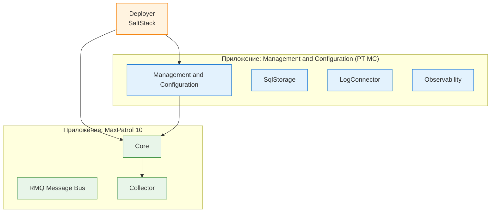
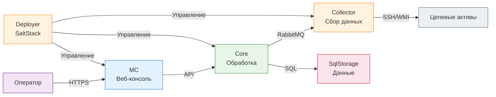
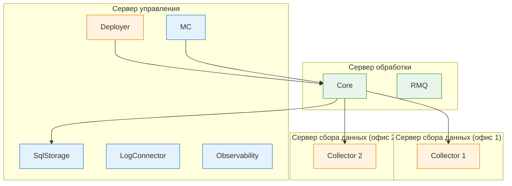

---
tags:
  - maxpatrol-vm
  - vulnerability-management
  - learning
  - stage-2
status: в-progress
created: 2026-08-25
stage: 2
---

# Этап 2 — Архитектура и установка MaxPatrol VM

> [!todo] Приоритет: ВЫСОКИЙ
> Понимание архитектуры критично для правильной настройки и диагностики проблем.

---

## 2.1 Архитектура MaxPatrol VM

### Общая архитектура

MaxPatrol VM построен на распределённой ролевой архитектуре. Компоненты системы разделяются на две группы приложений, каждая из которых содержит определённые роли:

### Компоненты и их роли

#### Deployer — развёртывание и управление конфигурациями

- **Технология:** построен на SaltStack (Salt Master + Salt Minion)
- **Функция:** управление установкой, обновлением и настройкой всех компонентов системы
- **Salt Master** — центральное управление: создаёт экземпляры ролей, раздаёт конфигурации
- **Salt Minion** — агенты на каждом сервере: принимают и исполняют команды Salt Master
- **Устанавливается первым** — это точка входа для всего развёртывания
- **Требования:** Ubuntu 20.04/22.04 или Debian 11/12

#### Management and Configuration (MC) — управление системой

- **Входит в приложение PT MC** (вместе с SqlStorage, LogConnector, Observability)
- **Функции:**
  - Веб-интерфейс (панель управления) — основной способ взаимодействия с системой
  - Управление пользователями и правами доступа
  - Управление лицензиями
  - Конфигурация задач сканирования
  - Настройка политик и групп
  - Настройка уведомлений
  - Браузер отчётов
- **Взаимодействие:** управляет Core через API

#### SqlStorage — хранение данных

- **Технология:** PostgreSQL (кастомизированный дистрибутив)
- **Функция:** хранение всех данных системы — активы, уязвимости, результаты сканирования, конфигурации
- **Важно:** это сам «мозг» системы — потеря данных SqlStorage = потеря всего
- **Рекомендация:** выделять на отдельный сервер при больших объёмах данных

#### LogConnector — сбор и маршрутизация логов

- **Функция:** сбор журналов событий компонентов MaxPatrol VM
- **Зачем:** для аудита действий операторов, диагностики проблем, интеграции с SIEM

#### Observability — мониторинг состояния системы

- **Функция:** сбор метрик здоровья всех компонентов
- **Зачем:** раннее обнаружение проблем с производительностью, доступностью компонентов
- **Интеграция:** Prometheus/Grafana (в контейнерах)

#### Core — основной рабочий компонент

> [!important] Core — это 95% вашей работы
> MP 10 Core — центральный компонент системы, с которым вы будете взаимодействовать большую часть времени.

- **Входит в приложение MaxPatrol 10** (вместе с RMQ Message Bus и Collector)
- **Функции:**
  - Централизованное хранение и обработка конфигурации активов
  - Выполнение PDQL-запросов
  - Переоценка уязвимостей при обновлении базы знаний
  - Управление задачами сканирования
  - Создание и отправка подзадач Collector'ам
  - Формирование отчётов
  - Поддержка веб-интерфейса (API для MC)
- **Устанавливается в:** центральном офисе или крупных территориальных подразделениях
- **Технологии:**
  - База данных AssetGrid — для высокопроизводительных PDQL-запросов
  - RabbitMQ — асинхронный обмен сообщениями между компонентами
  - Docker-контейнеры — изоляция служб

#### RMQ Message Bus — шина сообщений

- **Технология:** RabbitMQ
- **Функция:** обеспечение обмена сообщениями между компонентами MaxPatrol VM
- **Зачем:** асинхронная связь между Core и Collector, обработка событий в реальном времени
- **Устанавливается на сервере Core** (по умолчанию)

#### Collector — сбор данных

- **Функция:** непосредственный сбор данных с целевых активов
- **Методы сбора:**
  - **Безагентский (Remote)** — подключение по SSH (Linux) или WMI/SMB (Windows)
  - **Агентный (Agent)** — установка MP 10 Agent на целевые системы
  - **Импорт** — получение данных из внешних источников (AD, SCCM, гипервизоры)
- **Развёртывание:** в каждом сетевом сегменте, который нужно сканировать
- **Масштабирование:** несколько Collector'ов для распределения нагрузки
- **Требования к сети:** доступ к целевым активам и к серверу Core (RabbitMQ)

#### PT UCS — единая среда аутентификации

- **Функция:** централизованное управление учётными записями пользователей
- **Зачем:** единый вход (SSO), управление правами доступа, аудит действий
- **Интеграция:** поддержка LDAP/Active Directory

### Ключевые связи между компонентами

### База знаний — ядро системы

> [!note] База знаний — это не просто справочник CVE
> База знаний MaxPatrol VM содержит информацию об уязвимостях, методах их обнаружения, рекомендациях по устранению и критериях применимости к конкретным продуктам и версиям.

**Что хранит:**
- Описания уязвимостей (CVE, описание, CVSS)
- Методы обнаружения (check- скрипты, сигнатуры, версии ПО)
- Критерии применимости (какие версии уязвимы, какие — нет)
- Рекомендации по устранению (патчи, обновления, конфигурационные изменения)
- Эксплойты (наличие в эксплойт-фреймворках)

**Как обновляется:**
- Автоматически через интернет (по расписанию)
- Вручную (загрузка файлов обновлений)
- **Частота:** рекомендуется не реже 1 раза в неделю

**Как влияет на переоценку:**
- При обновлении базы знаний MaxPatrol VM **автоматически пересчитывает**, какие уязвимости применимы к каким активам
- **Не требуется повторное сканирование** — система использует ранее собранные данные об активах
- Это принципиальное отличие от простых сканеров: если Nessus/Qualys требуют повторного сканирования после обновления базы, MaxPatrol VM делает это автоматически

---

## 2.2 Типовые схемы развёртывания

### Минимальная конфигурация (All-in-One)

> [!tip] Для старта
> Минимальная конфигурация подходит для пилотного внедрения, лаборатории или небольших организаций (< 500 активов).

**Один сервер** содержит все компоненты:

| Компонент | Роль |
| --- | --- |
| Deployer | SaltStack — управление развёртыванием |
| SqlStorage | PostgreSQL — хранение данных |
| LogConnector | Сбор логов |
| Observability | Мониторинг |
| Management and Configuration | Веб-интерфейс, управление |
| Core | Основная обработка |
| RMQ Message Bus | Шина сообщений |
| Collector | Сбор данных (Linux-версия) |

**Порядок установки (авто-режим):**
1. Deployer
2. PT MC (SqlStorage → LogConnector → Observability → Management and Configuration)
3. MP 10 Core (RMQ Message Bus → Core)
4. MP 10 Collector (Linux-версия)

**Системные требования (минимум):**

| Параметр | Значение |
| --- | --- |
| CPU | 8 ядер, 2.2 ГГц |
| RAM | 32 ГБ |
| Диск | 200 ГБ SSD |
| ОС | Ubuntu 20.04/22.04 или Debian 11/12 |
| Сеть | 1 сетевой интерфейс |

### Расширенная конфигурация

> [!note] Для средних организаций
> Рекомендуется при 500–5000 активов или необходимости в распределённом сканировании.

**Разделение по серверам:**

**Преимущества:**
- Разделение нагрузки: управление ≠ обработка ≠ сбор данных
- Collector в каждом сетевом сегменте — нет проблем с межсетевыми экранами
- Отказоустойчивость: падение Collector'а не влияет на Core

### Кластерная конфигурация

> [!warning] Для крупных организаций
> Рекомендуется при > 5000 активов или высоких требованиях к доступности.

**Кластеризация компонентов:**

| Компонент | Метод кластеризации | Описание |
| --- | --- | --- |
| SqlStorage | PostgreSQL streaming replication | Основной + резервный сервер БД |
| Core | Встроенная кластеризация | Балансировка нагрузки между узлами |
| Collector | Распределение целей | Разные Collector'ы для разных сегментов |

**Требования к кластеру:**
- Минимум 2 узла для SqlStorage (primary + standby)
- Сетевое соединение между узлами: ≥ 1 Гбит/с, задержка < 5 мс
- Общее хранилище (SAN/NAS) для SqlStorage — опционально, но рекомендуется

### Требования к серверам

#### Общие требования

| Параметр | Минимум | Рекомендация |
| --- | --- | --- |
| CPU | 8 ядер, 2.2 ГГц | 12+ ядер, 2.2+ ГГц |
| RAM | 32 ГБ | 64 ГБ |
| Диск | 200 ГБ SSD | 300+ ГБ SSD |
| Сеть | 1 Гбит/с | 1 Гбит/с (10 Гбит/с для кластера) |
| ОС | Ubuntu 20.04/22.04, Debian 11/12 | Ubuntu 22.04 LTS |

#### Поддерживаемые ОС

| ОС | Тип | Примечание |
| --- | --- | --- |
| Ubuntu 20.04 LTS | Linux | Базовая поддержка |
| Ubuntu 22.04 LTS | Linux | Рекомендуется |
| Debian 11 | Linux | Базовая поддержка |
| Debian 12 | Linux | Рекомендуется |
| Astra Linux SE | Linux | Отечественная ОС, сертификат ФСТЭК |
| ALT Linux | Linux | Отечественная ОС |
| RED OS | Linux | Отечественная ОС |

> [!note] Windows
> На Windows серверы MaxPatrol VM не устанавливаются (начиная с версии 2.x). Все компоненты работают на Linux. Агенты (MP 10 Agent) устанавливаются и на Windows, и на Linux.

---

## 2.3 Первоначальная настройка

### Чек-лист настройки

> [!checklist] Порядок действий после установки
> Выполняйте последовательно. Пропуск шагов приведёт к некорректной работе системы.

#### Шаг 1 — Доступ к веб-интерфейсу

1. Откройте браузер и перейдите по адресу: `https://<IP-адрес-сервера-MC>`
2. Войдите под учётной записью администратора (создаётся при установке)
3. Убедитесь, что интерфейс загружается корректно

#### Шаг 2 — Проверка состояния компонентов

1. Перейдите в раздел **Система → Компоненты**
2. Убедитесь, что все роли в статусе **Активен**
3. Проверьте версии компонентов
4. Убедитесь, что лицензия активирована и действительна

| Компонент | Ожидаемый статус |
| --- | --- |
| Deployer | Активен |
| SqlStorage | Активен |
| LogConnector | Активен |
| Observability | Активен |
| Management and Configuration | Активен |
| Core | Активен |
| RMQ Message Bus | Активен |
| Collector | Активен |

#### Шаг 3 — Обновление базы знаний

> [!important] Критический шаг
> Без актуальной базы знаний система не может обнаруживать уязвимости.

1. Перейдите в раздел **Система → База знаний**
2. Проверьте текущую версию базы знаний
3. Запустите обновление (если доступна более новая версия)
4. Дождитесь завершения обновления
5. Настройте автоматическое обновление по расписанию (рекомендуется: еженедельно)

#### Шаг 4 — Настройка учётных записей для сканирования

1. Перейдите в раздел **Учётные записи**
2. Добавьте учётные записи для доступа к целевым системам:
   - **Windows:** учётная запись с правами локального администратора
   - **Linux:** учётная запись с правами root или sudo
   - **Сетевое оборудование:** учётная запись с правами на чтение конфигурации
3. Проверьте доступность учётных записей (тест подключения)

#### Шаг 5 — Создание группы активов

1. Перейдите в раздел **Активы → Группы**
2. Создайте корневую группу (например, «Все активы организации»)
3. Создайте подгруппы по функциональному принципу:
   - Серверы Windows
   - Серверы Linux
   - Рабочие станции
   - Сетевое оборудование
   - Базы данных
4. Рекомендация: начните с динамических групп на основе PDQL

#### Шаг 6 — Настройка первого сканирования

1. Перейдите в раздел **Сканирование → Задачи**
2. Создайте задачу Discovery (чёрный ящик):
   - Укажите целевые IP-диапазоны
   - Выберите профиль сканирования (базовый)
   - Запустите сканирование
3. Дождитесь завершения
4. Проверьте результаты в разделе **Активы**

#### Шаг 7 — Настройка уведомлений

1. Перейдите в раздел **Система → Уведомления**
2. Настройте email-уведомления:
   - Адрес сервера SMTP
   - Адреса получателей
   - Триггеры (новые критичные уязвимости, завершение сканирования и т.д.)

#### Шаг 8 — Настройка прав доступа

1. Перейдите в раздел **Система → Пользователи**
2. Создайте учётные записи для операторов
3. Назначьте роли:
   - **Администратор** — полный доступ
   - **Оператор** — сканирование, анализ, отчёты
   - **Аналитик** — просмотр, анализ без изменения настроек
4. Рекомендация: используйте принцип минимальных привилегий

### Настройка безопасности MaxPatrol VM

> [!warning] Не пропускайте этот шаг
> MaxPatrol VM — это система, которая знает *всё* об уязвимостях вашей инфраструктуры. Если её скомпрометируют, атакующий получит карту всех слабых мест.

**Обязательные меры:**

| Мера | Описание |
| --- | --- |
| Изолированная сеть | MaxPatrol VM должен быть в выделенном VLAN, доступном только ИБ-команде |
| Брандмауэр | Ограничить доступ к веб-интерфейсу только с рабочих станций ИБ |
| HTTPS | Использовать TLS для всех соединений (включая между компонентами) |
| Аудит | Настроить аудит всех действий через LogConnector |
| Резервное копирование | Регулярно бэкапить SqlStorage |
| Обновления | Своевременно обновлять компоненты и базу знаний |
| Мониторинг | Настроить Observability + алерты на аномалии |

### Типичные ошибки при развёртывании

| Ошибка | Последствия | Как избежать |
| --- | --- | --- |
| Установка на Windows Server | Некоторые компоненты не работают | Используйте Ubuntu/Debian |
| Недостаточно RAM (< 32 ГБ) | Медленные PDQL-запросы, таймауты | Минимум 32 ГБ, рекомендуется 64 ГБ |
| HDD вместо SSD | Катастрофическая производительность | Только SSD для SqlStorage |
| Collector в другом сегменте без маршрутизации | Сканирование невозможно | Проверьте маршрутизацию и firewall |
| Не обновлена база знаний | Пропуск уязвимостей | Настройте автоматическое обновление |
| Нет резервного копирования | Потеря всех данных при сбое | Настраивайте бэкап с первого дня |

---

## Краткое резюме Этапа 2

| Аспект | Ключевая мысль |
| --- | --- |
| Архитектура | Ролевая, на базе Docker-контейнеров; две группы приложений (PT MC и MaxPatrol 10) |
| Deployer | SaltStack — управляет развёртыванием всех компонентов; устанавливается первым |
| Core | Центральный компонент; 95% работы; обработка данных, PDQL, переоценка |
| Collector | Сбор данных с активов; по одному на сетевой сегмент |
| SqlStorage | PostgreSQL; хранит все данные; критично для отказоустойчивости |
| Схемы | All-in-One (1 сервер), расширенная (3+ сервера), кластер |
| Первоначальная настройка | 8 шагов: доступ → компоненты → база знаний → учётные записи → группы → сканирование → уведомления → права |
| Безопасность | Изоляция, HTTPS, аудит, бэкап — MaxPatrol VM знает всё об уязвимостях, защитите его |

---

## Связанные заметки

- [[Этап 1 — Теоретические основы управления уязвимостями]] — предыдущий этап
- [[План изучения MaxPatrol VM]] — общий план обучения

## Ресурсы

- [Справочный портал MaxPatrol VM](https://help.ptsecurity.com/ru-RU/projects/vm/2.8/help/4980710795)
- [Параметры конфигурации компонентов](https://help.ptsecurity.com/ru-RU/projects/vm/2.8/help/7197838731)
- [Установка компонентов на Linux с помощью ролей](https://help.ptsecurity.com/ru-RU/projects/vm/2.8/help/6192183691)
- [Сценарий развёртывания MaxPatrol VM](https://help.ptsecurity.com/ru-RU/projects/vm/2.8/help/6192179723)
- [Курс Positive Education: Применение MaxPatrol VM](https://edu.ptsecurity.com/kursy-po-ekspluatacii-productov-pt/mp-vm)
- [Бесплатный курс TS University: MaxPatrol VM Getting Started](https://university.tssolution.ru/maxpatrol-vm-getting-started/obzor-vozmozhnostej)

---

*Следующий этап: [[3. Сбор данных и сканирование]]*
