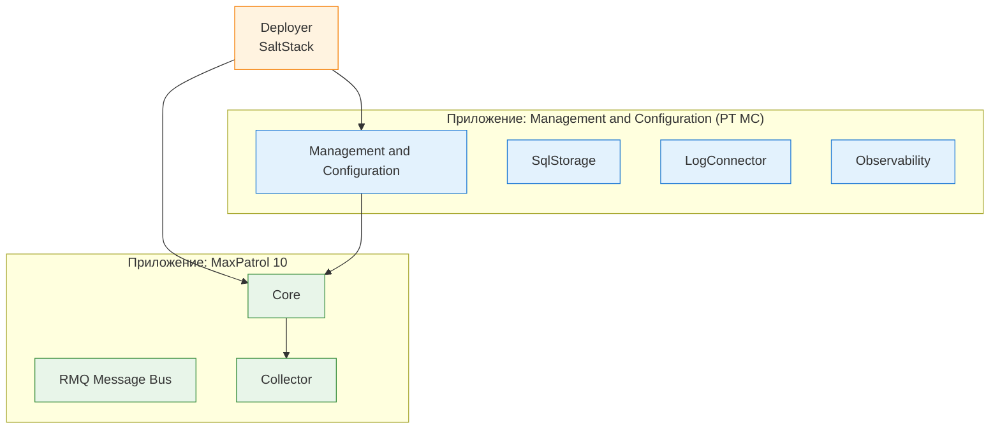
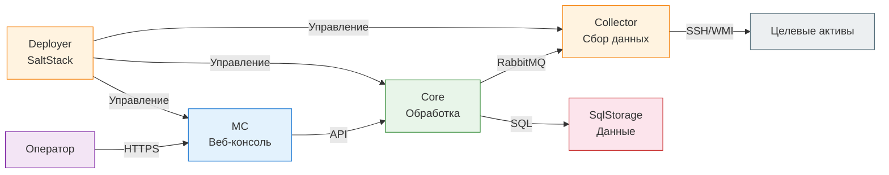
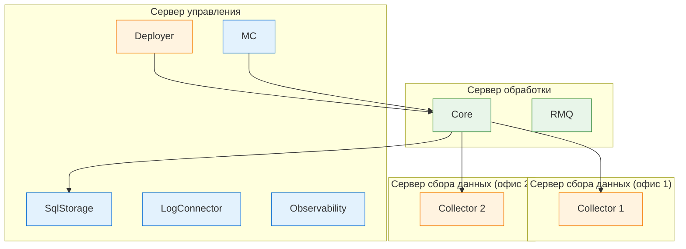

---
tags:
  - maxpatrol-vm
  - vulnerability-management
  - learning
  - stage-2
status: в-progress
created: 2026-08-25
stage: 2
---

# Этап 2 — Архитектура и установка MaxPatrol VM

> [!todo] Приоритет: ВЫСОКИЙ
> Понимание архитектуры критично для правильной настройки и диагностики проблем.

---

## 2.1 Архитектура MaxPatrol VM

### Общая архитектура

MaxPatrol VM построен на распределённой ролевой архитектуре. Компоненты системы разделяются на две группы приложений, каждая из которых содержит определённые роли:

```mermaid
graph TB
    subgraph "Приложение: Management and Configuration (PT MC)"
        MC[Management and Configuration]
        SQL[SqlStorage]
        LOG[LogConnector]
        OBS[Observability]
    end

    subgraph "Приложение: MaxPatrol 10"
        CORE[Core]
        RMQ[RMQ Message Bus]
        COLL[Collector]
    end

    DEPLOYER[Deployer<br/>SaltStack]

    DEPLOYER --> MC
    DEPLOYER --> CORE
    MC --> CORE
    CORE --> COLL

    style MC fill:#e3f2fd,stroke:#1976d2
    style SQL fill:#e3f2fd,stroke:#1976d2
    style LOG fill:#e3f2fd,stroke:#1976d2
    style OBS fill:#e3f2fd,stroke:#1976d2
    style CORE fill:#e8f5e9,stroke:#388e3c
    style RMQ fill:#e8f5e9,stroke:#388e3c
    style COLL fill:#e8f5e9,stroke:#388e3c
    style DEPLOYER fill:#fff3e0,stroke:#f57c00
```

### Компоненты и их роли

#### Deployer — развёртывание и управление конфигурациями

- **Технология:** построен на SaltStack (Salt Master + Salt Minion)
- **Функция:** управление установкой, обновлением и настройкой всех компонентов системы
- **Salt Master** — центральное управление: создаёт экземпляры ролей, раздаёт конфигурации
- **Salt Minion** — агенты на каждом сервере: принимают и исполняют команды Salt Master
- **Устанавливается первым** — это точка входа для всего развёртывания
- **ОС (как и для всех компонентов):** 64-разрядные Astra Linux Special Edition 1.7.5 и 1.7.6 («Воронеж», ядро Linux 5.15+), Debian 10.3 и выше, Debian 11 и 12

#### Management and Configuration (MC) — управление системой

- **Входит в приложение PT MC** (вместе с SqlStorage, LogConnector, Observability)
- **Функции:**
  - Веб-интерфейс (панель управления) — основной способ взаимодействия с системой
  - Управление пользователями и правами доступа
  - Управление лицензиями
  - Конфигурация задач сканирования
  - Настройка политик и групп
  - Настройка уведомлений
  - Браузер отчётов
- **Взаимодействие:** управляет Core через API

#### SqlStorage — хранение данных

- **Технология:** PostgreSQL (кастомизированный дистрибутив)
- **Функция:** хранение всех данных системы — активы, уязвимости, результаты сканирования, конфигурации
- **Важно:** это сам «мозг» системы — потеря данных SqlStorage = потеря всего
- **Рекомендация:** выделять на отдельный сервер при больших объёмах данных

#### LogConnector — сбор и маршрутизация логов

- **Функция:** сбор журналов событий компонентов MaxPatrol VM
- **Зачем:** для аудита действий операторов, диагностики проблем, интеграции с SIEM

#### Observability — мониторинг состояния системы

- **Функция:** сбор метрик здоровья всех компонентов
- **Зачем:** раннее обнаружение проблем с производительностью, доступностью компонентов
- **Интеграция:** Prometheus/Grafana (в контейнерах)

#### Core — основной рабочий компонент

> [!important] Core — это 95% вашей работы
> MP 10 Core — центральный компонент системы, с которым вы будете взаимодействовать большую часть времени.

- **Входит в приложение MaxPatrol 10** (вместе с RMQ Message Bus и Collector)
- **Функции:**
  - Централизованное хранение и обработка конфигурации активов
  - Выполнение PDQL-запросов
  - Переоценка уязвимостей при обновлении базы знаний
  - Управление задачами сканирования
  - Создание и отправка подзадач Collector'ам
  - Формирование отчётов
  - Поддержка веб-интерфейса (API для MC)
- **Устанавливается в:** центральном офисе или крупных территориальных подразделениях
- **Технологии:**
  - База данных AssetGrid — для высокопроизводительных PDQL-запросов
  - RabbitMQ — асинхронный обмен сообщениями между компонентами
  - Docker-контейнеры — изоляция служб

#### RMQ Message Bus — шина сообщений

- **Технология:** RabbitMQ
- **Функция:** обеспечение обмена сообщениями между компонентами MaxPatrol VM
- **Зачем:** асинхронная связь между Core и Collector, обработка событий в реальном времени
- **Устанавливается на сервере Core** (по умолчанию)

#### Collector — сбор данных

- **Функция:** непосредственный сбор данных с целевых активов
- **Методы сбора:**
  - **Безагентский (Remote)** — подключение по SSH (Linux), WMI/RPC (Windows)
  - **Импорт** — получение данных из внешних источников (Active Directory, SCCM, гипервизоры)
- **Развёртывание:** в каждом сетевом сегменте, который нужно сканировать
- **Масштабирование:** несколько Collector'ов для распределения нагрузки
- **Рекомендация:** не менее двух компонентов MP 10 Collector — чтобы распределить нагрузку и обслуживать систему без остановки сканирования
- **Требования к сети:** доступ к целевым активам и к серверу Core (RabbitMQ)

#### PT UCS — единая среда аутентификации

- **Функция:** централизованное управление учётными записями пользователей
- **Зачем:** единый вход (SSO), управление правами доступа, аудит действий
- **Интеграция:** поддержка LDAP/Active Directory

### Ключевые связи между компонентами

```mermaid
graph LR
    USER[Оператор] -->|HTTPS| MC[MC<br/>Веб-консоль]
    MC -->|API| CORE[Core<br/>Обработка]
    CORE -->|RabbitMQ| COLL[Collector<br/>Сбор данных]
    CORE -->|SQL| SQL[SqlStorage<br/>Данные]
    COLL -->|SSH/WMI| TARGET[Целевые активы]
    DEPLOYER[Deployer<br/>SaltStack] -->|Управление| CORE
    DEPLOYER -->|Управление| MC
    DEPLOYER -->|Управление| COLL

    style USER fill:#f3e5f5,stroke:#7b1fa2
    style MC fill:#e3f2fd,stroke:#1976d2
    style CORE fill:#e8f5e9,stroke:#388e3c
    style COLL fill:#fff3e0,stroke:#f57c00
    style SQL fill:#fce4ec,stroke:#c62828
    style TARGET fill:#eceff1,stroke:#546e7a
    style DEPLOYER fill:#fff3e0,stroke:#f57c00
```

### Алгоритм работы системы

> [!abstract] Источник
> [[Алгоритм работы MaxPatrol VM и схема взаимодействия компонентов]] — каноничное описание потока данных в документации 2.8.

1. Модули компонента MP 10 Collector сканируют IT-инфраструктуру и собирают сведения о сетевых узлах; собранные данные передаются в MP 10 Core.
2. MP 10 Core обрабатывает и хранит результаты сканирования (ОС, ПО, службы, порты, связи между узлами), а также параметры задач, профилей и справочников; осуществляет контроль доступа к данным и выполняет пользовательские запросы.
3. Используя данные базы уязвимостей MaxPatrol VM, MP 10 Core **рассчитывает уязвимости на активах**.
4. PT MC обеспечивает доступ к системе через сервис единого входа и журналирует действия пользователей.
5. Пользователь подключается к MP 10 Core через веб-интерфейс в соответствии с правами, назначенными в PT MC: управление, просмотр данных, отчёты, мониторинг.
6. PT UCS обеспечивает обновление модуля Pentest для коллекторов и загрузку дистрибутивов новых версий компонентов.
7. Локальный сервер обновлений принимает обновления с глобального сервера Positive Technologies и передаёт их в закрытый сегмент сети при отсутствии прямого доступа к интернету.
8. Мониторинг: локальные **OTEL-агенты** собирают данные всех компонентов и отправляют их в коллектор OTEL → хранилище → сервис **VictoriaMetrics** (часть роли Observability в PT MC) → дашборды Grafana.

![[6316137739.svg]]

### Порты взаимодействия компонентов

> [!important] Для настройки межсетевых экранов
> Для компонентов MaxPatrol VM должны быть доступны для **входящих** соединений следующие порты.

| Источник | Получатель | TCP-порт |
| --- | --- | --- |
| Рабочая станция пользователя | MP 10 Core | 443 |
| MP 10 Collector | MP 10 Core | 5671 |
| PT UCS | MP 10 Core | 443, 3334 |
| Рабочая станция пользователя | PT MC | 3334 |
| MP 10 Core, MP 10 Collector | PT UCS | 4505, 4506, 9035 |
| Docker Registry | Deployer | 5000 |
| PT UCS, локальный сервер обновлений | Глобальный сервер обновлений | 443 |
| PT MC | Локальный сервер обновлений | 8553, 8743 |
| Локальные агенты OTEL | Коллектор OTEL | 4318 |

> [!warning] Deployer
> На сервере, куда устанавливается роль Deployer, порты **4505/TCP, 4506/TCP, 5000/TCP** должны быть доступны для входящих соединений.

- Для **исходящих** соединений правила межсетевого экрана создавать не требуется.
- Удалённый доступ к серверам: 3389/TCP (Microsoft Windows), 22/TCP (Linux).
- Если роли Core и SqlStorage стоят на **разных серверах**: 5432/TCP от Core к SqlStorage и 4318/TCP обратно.
- Для обновлений межсетевой экран PT UCS не должен блокировать `update.ptsecurity.ru` и `update.ptsecurity.com`.
- Для локального сервера обновлений по умолчанию используются порты 8553 (HTTP) и 8743 (HTTPS) — их можно изменить в параметрах сервиса получения обновлений.

### База знаний — ядро системы

> [!note] База знаний — это не просто справочник CVE
> База знаний MaxPatrol VM содержит информацию об уязвимостях, методах их обнаружения, рекомендациях по устранению и критериях применимости к конкретным продуктам и версиям.

**Что хранит:**
- Описания уязвимостей (CVE, описание, CVSS)
- Методы обнаружения (check- скрипты, сигнатуры, версии ПО)
- Критерии применимости (какие версии уязвимы, какие — нет)
- Рекомендации по устранению (патчи, обновления, конфигурационные изменения)
- Эксплойты (наличие в эксплойт-фреймворках)

**Как обновляется:**
- Система автоматически проверяет наличие обновлений базы знаний каждые пять минут (по умолчанию)
- Обновление вручную — на странице **Система → Управление системой**, раздел **База знаний** (кнопка **Обновить**)
- Для обновлений модуля Pentest на сервере с ролью Deployer должен быть установлен компонент PT UCS
- Для закрытых сегментов сети — локальный сервер обновлений

**Как влияет на переоценку:**
- При обновлении базы знаний MaxPatrol VM **автоматически пересчитывает**, какие уязвимости применимы к каким активам
- **Не требуется повторное сканирование** — система использует ранее собранные данные об активах
- Это принципиальное отличие от простых сканеров: если Nessus/Qualys требуют повторного сканирования после обновления базы, MaxPatrol VM делает это автоматически

---

## 2.2 Типовые схемы развёртывания

### Минимальная конфигурация (All-in-One)

> [!tip] Для старта
> Минимальная конфигурация подходит для пилотного внедрения, лаборатории или небольших организаций (< 500 активов).

**Один сервер** содержит все компоненты:

| Компонент | Роль |
| --- | --- |
| Deployer | SaltStack — управление развёртыванием |
| SqlStorage | PostgreSQL — хранение данных |
| LogConnector | Сбор логов |
| Observability | Мониторинг |
| Management and Configuration | Веб-интерфейс, управление |
| Core | Основная обработка |
| RMQ Message Bus | Шина сообщений |
| Collector | Сбор данных (Linux-версия) |

**Порядок установки (по сценарию развертывания):**
1. Deployer
2. PT MC (SqlStorage → LogConnector → Observability → Management and Configuration)
3. Активация компонента PT MC
4. MP 10 Core (RMQ Message Bus → Core)
5. Активация лицензии MaxPatrol VM
6. MP 10 Collector
7. PT UCS
8. Настройка MaxPatrol VM для обеспечения его безопасной работы

> [!note] Источник
> Порядок действий — [[Сценарий развертывания MaxPatrol VM]]

**Системные требования (серверы MP 10 Core и PT MC, до 1000 активов):**

| Параметр | Значение |
| --- | --- |
| CPU | 12 ядер, тактовая частота от 2,2 ГГц (рекомендуется Hyper-Threading) |
| RAM | 64 ГБ |
| Диск | SSD от 30 000 IOPS в RAID (ext4), раздел `/var`: 450 ГБ при сканировании 1 раз в неделю, 300 ГБ — раз в 2 недели, 250 ГБ — раз в месяц; раздел `/` — 200 ГБ |
| ОС | Astra Linux SE 1.7.5/1.7.6 («Воронеж»), Debian 10.3+, Debian 11 и 12 |
| Сеть | сетевой адаптер не менее 1 Гбит/с |
| Подкачка | не менее 10% от объёма ОЗУ |

### Расширенная конфигурация

> [!note] Для средних организаций
> Рекомендуется при 500–5000 активов или необходимости в распределённом сканировании.

**Разделение по серверам:**

```mermaid
graph TB
    subgraph "Сервер управления"
        DEPLOYER[Deployer]
        MC[MC]
        SQL[SqlStorage]
        LOG[LogConnector]
        OBS[Observability]
    end

    subgraph "Сервер обработки"
        CORE[Core]
        RMQ[RMQ]
    end

    subgraph "Сервер сбора данных (офис 1)"
        COLL1[Collector 1]
    end

    subgraph "Сервер сбора данных (офис 2)"
        COLL2[Collector 2]
    end

    DEPLOYER --> CORE
    MC --> CORE
    CORE --> SQL
    CORE --> COLL1
    CORE --> COLL2

    style DEPLOYER fill:#fff3e0,stroke:#f57c00
    style MC fill:#e3f2fd,stroke:#1976d2
    style SQL fill:#e3f2fd,stroke:#1976d2
    style LOG fill:#e3f2fd,stroke:#1976d2
    style OBS fill:#e3f2fd,stroke:#1976d2
    style CORE fill:#e8f5e9,stroke:#388e3c
    style RMQ fill:#e8f5e9,stroke:#388e3c
    style COLL1 fill:#fff3e0,stroke:#f57c00
    style COLL2 fill:#fff3e0,stroke:#f57c00
```

**Преимущества:**
- Разделение нагрузки: управление ≠ обработка ≠ сбор данных
- Collector в каждом сетевом сегменте — нет проблем с межсетевыми экранами
- Отказоустойчивость: падение Collector'а не влияет на Core

### Кластерная конфигурация

> [!warning] Для крупных организаций
> Рекомендуется при > 5000 активов или высоких требованиях к доступности.

**Кластеризация компонентов:**

| Компонент | Метод кластеризации | Описание |
| --- | --- | --- |
| SqlStorage | PostgreSQL streaming replication | Основной + резервный сервер БД |
| Core | Встроенная кластеризация | Балансировка нагрузки между узлами |
| Collector | Распределение целей | Разные Collector'ы для разных сегментов |

**Требования к кластеру:**
- Минимум 2 узла для SqlStorage (primary + standby)
- Сетевое соединение между узлами: ≥ 1 Гбит/с, задержка < 5 мс
- Общее хранилище (SAN/NAS) для SqlStorage — опционально, но рекомендуется

### Требования к серверам

#### Общие требования (серверы MP 10 Core и PT MC, до 1000 активов)

| Параметр | Значение |
| --- | --- |
| CPU | 12 ядер, от 2,2 ГГц (рекомендуется Hyper-Threading, например Intel Xeon Scalable 2-го поколения и выше) |
| RAM | 64 ГБ |
| Диск | SSD не менее 30 000 IOPS в отказоустойчивом массиве RAID с ext4; `/` — 200 ГБ, `/var` — 450/300/250 ГБ (сканирование раз в неделю / 2 недели / месяц) |
| Сеть | не менее 1 Гбит/с |
| ОС | Astra Linux SE 1.7.5/1.7.6, Debian 10.3+, Debian 11 и 12 |
| Подкачка | не менее 10% от общего объёма ОЗУ |

При росте инфраструктуры требования к серверам MP 10 Core и PT MC увеличиваются:

| Количество активов | Ядра CPU | ОЗУ |
| --- | --- | --- |
| До 1000 | 12 | 64 ГБ |
| До 5000 | 14 | 64 ГБ |
| До 10 000 | 18 | 64 ГБ |
| До 20 000 | 24 | 80 ГБ |
| До 50 000 | 24 | 90 ГБ |
| До 100 000 | 32 | 100 ГБ |

Объём диска при этом рассчитывается по частоте сканирования (раз в неделю / 2 недели / месяц) — от 450 ГБ до 11,8 ТБ.

#### Поддерживаемые ОС

| ОС | Тип | Примечание |
| --- | --- | --- |
| Astra Linux Special Edition 1.7.5 и 1.7.6 | Linux | Режим защищённости «Воронеж», ядро Linux 5.15 и выше |
| Debian 10.3 и выше | Linux | 64-разрядные версии |
| Debian 11 и 12 | Linux | Ядро Linux 5.10 и выше |
| Microsoft Windows Server 2012, 2012 R2, 2016, 2019, 2022 | Windows | Только для компонента MP 10 Collector |

> [!note] Windows
> Серверы MaxPatrol VM (MP 10 Core и PT MC) устанавливаются на Linux. Компонент MP 10 Collector дополнительно можно установить на Microsoft Windows Server 2012, 2012 R2, 2016, 2019 и 2022. Для работы в интерфейсе рекомендуются последние версии Google Chrome, Mozilla Firefox, Microsoft Edge или Яндекс Браузер.

---

## 2.3 Первоначальная настройка

### Чек-лист настройки

> [!checklist] Порядок действий после установки
> Выполняйте последовательно. Пропуск шагов приведёт к некорректной работе системы.

#### Шаг 1 — Доступ к веб-интерфейсу

1. Откройте браузер и перейдите по адресу: `https://<IP-адрес-сервера-MC>`
2. Войдите через PT MC — вход в MaxPatrol VM выполняется через приложение PT MC: [[Вход в MaxPatrol VM через PT MC]]
3. Убедитесь, что интерфейс загружается корректно

#### Шаг 2 — Проверка состояния компонентов

1. Перейдите в раздел **Система → Управление системой**
2. Проверьте панель **Компоненты**:

| Раздел панели «Компоненты» | Что проверить |
| --- | --- |
| О системе | версия системы и компонента MP 10 Core |
| Коллекторы | наличие коллекторов, их версия и статус (Доступен, С ограничениями, Недоступен, Обновляется, Удаляется) |
| База знаний | состояние пакетов экспертизы |
| Обработка активов | длины очередей и скорость обработки службами MP 10 Core |

3. При необходимости обновите версию коллектора (кнопка **Обновить версию**) или удалите недоступный коллектор (кнопка **Удалить**)

#### Шаг 3 — Обновление базы знаний

> [!important] Критический шаг
> Без актуальной базы знаний система не может обнаруживать уязвимости.

1. Перейдите в раздел **Система → Управление системой**, раздел **База знаний**
2. Проверьте текущую версию базы знаний
3. При необходимости запустите обновление вручную (кнопка **Обновить**)
4. Убедитесь, что система проверяет обновления автоматически (по умолчанию — каждые пять минут)
5. Для обновлений модуля Pentest убедитесь, что на сервере с ролью Deployer установлен компонент PT UCS

#### Шаг 4 — Настройка учётных записей для сканирования

1. Перейдите в раздел **Сбор данных → Учетные записи**
2. Добавьте учётные записи для доступа к целевым системам:
   - **Windows:** учётная запись с правами локального администратора
   - **Linux:** учётная запись с правами root или sudo
   - **Сетевое оборудование:** учётная запись с правами на чтение конфигурации
3. Проверьте доступность учётных записей (тест подключения)

#### Шаг 5 — Создание группы активов

1. Откройте главную страницу **Активы** и панель **Группы**
2. Создайте корневую группу (например, «Все активы организации»)
3. Создайте подгруппы по функциональному принципу:
   - Серверы Windows
   - Серверы Linux
   - Рабочие станции
   - Сетевое оборудование
   - Базы данных
4. Рекомендация: начните с динамических групп на основе PDQL

#### Шаг 6 — Настройка первого сканирования

1. Перейдите в раздел **Сбор данных → Задачи на сбор данных**
2. Создайте задачу с модулем HostDiscovery (чёрный ящик):
   - Укажите целевые IP-диапазоны
   - Выберите профиль сканирования (базовый)
   - Запустите сканирование
3. Дождитесь завершения
4. Проверьте результаты на странице **Активы**

#### Шаг 7 — Настройка уведомлений

1. Перейдите в раздел **Система → Уведомления**
2. Настройте email-уведомления:
   - Адрес сервера SMTP
   - Адреса получателей
   - Триггеры (новые критичные уязвимости, завершение сканирования и т.д.)

#### Шаг 8 — Настройка прав доступа

1. Учётные записи и роли пользователей настраиваются в приложении Management and Configuration (PT MC)
2. Создайте учётные записи для операторов
3. Назначьте роли приложения MaxPatrol 10:
   - **Администратор** — полные права на просмотр и изменение данных
   - **Оператор** — ограниченные права на просмотр и изменение данных
   - **Наблюдатель** — только просмотр данных
4. Список привилегий ролей доступен на странице **Система → Права доступа**
5. Рекомендация: используйте принцип минимальных привилегий

### Настройка безопасности MaxPatrol VM

> [!warning] Не пропускайте этот шаг
> MaxPatrol VM — это система, которая знает *всё* об уязвимостях вашей инфраструктуры. Если её скомпрометируют, атакующий получит карту всех слабых мест.

**Обязательные меры:**

| Мера | Описание |
| --- | --- |
| Изолированная сеть | MaxPatrol VM должен быть в выделенном VLAN, доступном только ИБ-команде |
| Брандмауэр | Ограничить доступ к веб-интерфейсу только с рабочих станций ИБ |
| HTTPS | Использовать TLS для всех соединений (включая между компонентами) |
| Аудит | Настроить аудит всех действий через LogConnector |
| Резервное копирование | Регулярно бэкапить SqlStorage |
| Обновления | Своевременно обновлять компоненты и базу знаний |
| Мониторинг | Настроить Observability + алерты на аномалии |

### Типичные ошибки при развёртывании

| Ошибка | Последствия | Как избежать |
| --- | --- | --- |
| Установка на неподдерживаемую ОС (Ubuntu, ALT, RED OS) | Компоненты не устанавливаются | Используйте Astra Linux SE 1.7.5/1.7.6 («Воронеж») или Debian 10.3+, 11, 12; MP 10 Collector допустимо на Windows Server 2012—2022 |
| Недостаточно RAM (менее 64 ГБ на сервер MP 10 Core и PT MC) | Медленные PDQL-запросы, таймауты | Минимум 64 ГБ для инфраструктуры до 1000 активов |
| HDD вместо SSD | Катастрофическая производительность | SSD не менее 30 000 IOPS в RAID с файловой системой ext4 |
| Collector в другом сегменте без маршрутизации | Сканирование невозможно | Проверьте маршрутизацию и firewall |
| Не обновлена база знаний | Пропуск уязвимостей | Настройте автоматическое обновление |
| Нет резервного копирования | Потеря всех данных при сбое | Настраивайте бэкап с первого дня |

---

## Краткое резюме Этапа 2

| Аспект | Ключевая мысль |
| --- | --- |
| Архитектура | Ролевая, на базе Docker-контейнеров; две группы приложений (PT MC и MaxPatrol 10) |
| Deployer | SaltStack — управляет развёртыванием всех компонентов; устанавливается первым |
| Core | Центральный компонент; 95% работы; обработка данных, PDQL, переоценка |
| Collector | Сбор данных с активов; по одному на сетевой сегмент |
| SqlStorage | PostgreSQL; хранит все данные; критично для отказоустойчивости |
| Схемы | All-in-One (1 сервер), расширенная (3+ сервера), кластер |
| Первоначальная настройка | 8 шагов: доступ → компоненты → база знаний → учётные записи → группы → сканирование → уведомления → права |
| Безопасность | Изоляция, HTTPS, аудит, бэкап — MaxPatrol VM знает всё об уязвимостях, защитите его |

---

## Связанные заметки

- [[1. Теоретические основы управления уязвимостями]] — предыдущий этап
- [[План изучения]] — общий план обучения

## Ресурсы

- [[Документация]] — офлайн-копия документации MaxPatrol VM 2.8 (все разделы справочника)
- [[Требования к аппаратному обеспечению]] — системные требования к серверам
- [[Требования к программному обеспечению]] — поддерживаемые ОС
- [[Параметры конфигурации компонентов MaxPatrol VM на Linux]]
- [[Об установке компонентов на Linux с помощью ролей]]
- [[Сценарий развертывания MaxPatrol VM]]
- [[Привилегии и роли MaxPatrol VM]]
- [Курс Positive Education: Применение MaxPatrol VM](https://edu.ptsecurity.com/kursy-po-ekspluatacii-productov-pt/mp-vm)
- [Бесплатный курс TS University: MaxPatrol VM Getting Started](https://university.tssolution.ru/maxpatrol-vm-getting-started/obzor-vozmozhnostej)

---

*Следующий этап: [[3. Сбор данных и сканирование]]*
