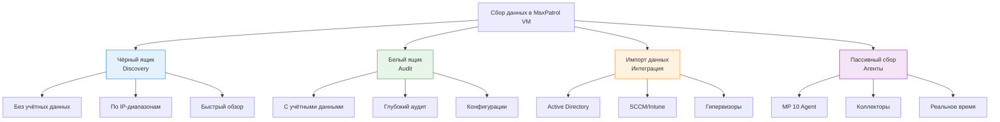
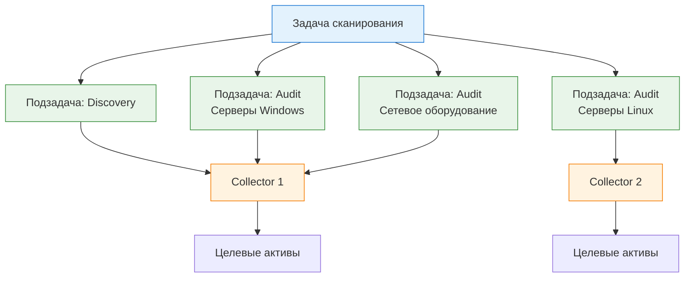

---
tags:
  - maxpatrol-vm
  - vulnerability-management
  - learning
  - stage-3
status: в-progress
created: 2026-08-25
stage: 3
---

# Этап 3 — Сбор данных и сканирование

> [!todo] Приоритет: ВЫСОКИЙ
> Это ядро продукта — без данных нет управления уязвимостями.

---

## 3.1 Режимы сканирования

### Обзор подходов к сбору данных

MaxPatrol VM поддерживает четыре основных режима сбора данных. Каждый подходит для разных сценариев, и эффективная стратегия комбинирует несколько режимов.



### Чёрный ящик (Discovery)

> [!note] Первый шаг
> Discovery — это способ быстро понять, *что* у вас есть в сети, не имея учётных данных для доступа к системам.

**Что делает:**
- Сканирует IP-диапазоны без учётных записей
- Определяет открытые порты и работающие сервисы
- Идентифицирует ОС по ответам (TCP/IP fingerprinting)
- Находит установленное ПО по версиям сервисов (HTTP-заголовки, SSH-баннеры, SMB-ответы)
- Обнаруживает уязвимости, доступные без аутентификации

**Что НЕ может:**
- Не видит установленное ПО, которое не слушает на сетевых портах
- Не может проверить конфигурации ОС и приложений
- Не определяет наличие/отсутствие патчей
- Не имеет доступа к реестру Windows, RPM/DPKG-менеджерам

**Когда использовать:**
- Первичное развёртывание — «что у нас вообще есть?»
- Поиск теневых IT (Shadow IT)
- Регулярный мониторинг открытых сервисов
- Проверка сегментов, недоступных для аудита

**Параметры сканирования:**
- Цели: IP-адреса, диапазоны, CIDR-блоки
- Порты: стовые наборы (top-100, top-1000) или пользовательские
- Скорость: нормальная / быстрая / медленная (влияет на нагрузку сеть)
- Модули: TCP-сканирование, UDP-сканирование, banner grabbing

### Белый ящик (Audit)

> [!important] Глубина данных
> Audit-сканирование с правильными учётными записями даёт в 10-100 раз больше информации, чем Discovery.

**Что делает:**
- Подключается к системам с использованием учётных записей
- Читает установленное ПО (реестр Windows, RPM/DPKG, AppStream)
- Проверяет версии всех установленных пакетов и компонентов
- Анализирует конфигурации ОС и приложений
- Проверяет наличие патчей и обновлений
- Считывает политики безопасности (password policy, audit policy)
- Проверяет запущенные сервисы и их настройки
- Для сетевого оборудования: читает конфигурацию, проверяет ACL, версии ПО

**Протоколы доступа:**

| ОС / Тип | Протокол | Порт | Привилегии |
| --- | --- | --- | --- |
| Windows | SMB/WMI | 445/135 | Локальный администратор |
| Linux/Unix | SSH | 22 | root или sudo |
| VMware ESXi | HTTPS API | 443 | Администратор ESXi |
| Cisco IOS | SSH/Telnet | 22/23 | Привилегированный режим (enable) |
| FortiGate | SSH/HTTPS | 22/443 | Администратор |
| Базы данных | SQL*Net/TDS | 1521/1433 | Администратор БД |

**Модули аудита (примеры):**

| Модуль | Проверяет |
| --- | --- |
| Windows Audit | Установленное ПО, патчи, реестр, политики, сервисы |
| Linux Audit | Пакеты (RPM/DPKG), конфигурации (/etc/*), cron, SUID-файлы |
| Network Device Audit | Конфигурация, ACL, NTP, SNMP, версии ПО |
| Database Audit | Пользователи, привилегии, конфигурация, патчи |
| Web Server Audit | Конфигурация Apache/IIS/Nginx, SSL/TLS, модули |

### Импорт данных (Интеграция)

> [!tip] Не дублируйте работу
> Если данные уже есть в другой системе, импортируйте их — не сканируйте повторно.

**Поддерживаемые источники:**

| Источник                | Тип данных                                     | Протокол   |
| ----------------------- | ---------------------------------------------- | ---------- |
| Active Directory        | Структура OU, компьютеры, пользователи, группы | LDAP/LDAPS |
| Microsoft SCCM/Intune   | Установленное ПО, обновления                   | WMI/API    |
| VMware vCenter          | Виртуальные машины, гипервизоры, конфигурации  | HTTPS API  |
| Hyper-V                 | Виртуальные машины, конфигурации               | WMI        |
| MaxPatrol SIEM          | События безопасности, инциденты                | API        |
| Сторонние SIEM/NTA      | Сетевые события, трафик                        | Syslog/API |
| Nessus/Qualys (экспорт) | Результаты сканирования                        | XML/CSV    |

**Пример интеграции с AD:**
- Импорт всей структуры OU как иерархии групп в MaxPatrol VM
- Автоматическое создание динамических групп на основе OU
- Привязка учётных записей к компьютерам из AD
- Синхронизация при обновлении (по расписанию)

### Пассивный сбор (Агенты и Коллекторы)

**MP 10 Agent — агентский сбор:**

> [!note] Когда нужен агент
> Агент необходим, когда целевая система находится за строгим файрволом или когда нужен постоянный мониторинг.

- **Что делает:** устанавливается на целевую систему, постоянно собирает данные
- **Преимущества:**
  - Не зависит от сетевой доступности (агент работает локально)
  - Собирает данные, недоступные при удалённом сканировании
  - Минимальная нагрузка на сеть (только передача данных)
  - Может собирать данные в off-line режиме
- **Недостатки:**
  - Требует установки и поддержки на каждой целевой системе
  - Дополнительная нагрузка на целевую систему
  - Нужно управлять жизненным циклом агентов

**Коллекторы — безагентский сбор:**

- **Что делает:** Collector в каждом сетевом сегменте собирает данные удалённо
- **Преимущества:**
  - Не требует установки ПО на целевые системы
  - Централизованное управление
- **Недостатки:**
  - Зависит от сетевой доступности
  - Требует маршрутизации между сегментами

### Сравнение режимов

| Критерий | Discovery | Audit | Импорт | Пассивный |
| --- | --- | --- | --- | --- |
| Глубина данных | Низкая | Высокая | Средняя | Высокая |
| Скорость | Быстро | Медленно | Быстро | Постоянно |
| Нагрузка на сеть | Средняя | Высокая | Минимальная | Низкая |
| Нагрузка на цель | Низкая | Средняя | Нет | Средняя |
| Требуются учётные записи | Нет | Да | Зависит от источника | Да (для агента) |
| Видит ПО без сервисов | Нет | Да | Да | Да |
| Проверяет конфигурации | Нет | Да | Частично | Да |
| Рекомендуемая частота | Еженедельно | Ежемесячно | По расписанию | Постоянно |

---

## 3.2 Учётные записи для сканирования

### Зачем нужны учётные записи

> [!important] Ключевой принцип
> Глубина аудита напрямую зависит от привилегий учётной записи. С «чтением» вы увидите установленное ПО; с «записью» — сможете проверить конфигурации; с полными привилегиями — всё.

### Типы учётных записей

#### Учётные записи для Windows

| Тип | Привилегии | Что видит MaxPatrol VM |
| --- | --- | --- |
| Локальный администратор | Полный доступ к локальной системе | Всё: ПО, реестр, патчи, политики, сервисы |
| Доменный администратор | Полный доступ ко всем доменным системам | Всё + доменная политика |
| Член группы Administrators | Доступ как локальный администратор | Всё |
| Обычный пользователь | Базовый доступ | Минимальная информация |

**Требования к учётной записи Windows:**
- Должна быть в группе **Administrators** на целевой системе
- Доступ по протоколу **SMB** (порт 445) и **WMI** (порт 135 + динамические порты)
- Рекомендуется: отдельная учётная запись для сканирования (не общая с ИТ)
- **Не используйте:** учётную запись администратора домена для сканирования рабочих станций

#### Учётные записи для Linux/Unix

| Тип | Привилегии | Что видит MaxPatrol VM |
| --- | --- | --- |
| root | Полный доступ | Всё: пакеты, конфигурации, cron, SUID, ядро |
| sudo без пароля | Доступ как root | Всё |
| sudo с паролем | Доступ как root (с вводом пароля) | Всё (нужна настройка sudo) |
| Обычный пользователь | Базовый доступ | Минимальная информация |

**Требования к учётной записи Linux:**
- Доступ по протоколу **SSH** (порт 22)
- Рекомендуется: root или sudo без пароля
- **Не используйте:** учётную запись с интерактивным вводом пароля sudo ( MaxPatrol VM не может вводить пароль)
- Для sudo: добавьте строку `NOPASSWD` в `/etc/sudoers.d/`

**Пример настройки sudo для MaxPatrol VM:**
```bash
# Создайте файл /etc/sudoers.d/maxpatrol
maxpatrol ALL=(ALL) NOPASSWD: ALL
```

#### Учётные записи для сетевого оборудования

| Тип | Протокол | Привилегии |
| --- | --- | --- |
| Привилегированный (enable/exec) | SSH/Telnet | Полный доступ к конфигурации |
| Read-only | SSH/SNMP | Только чтение конфигурации |
| SNMP v2c/v3 | SNMP | Чтение системной информации |

**Требования:**
- SSH-доступ с привилегированным режимом (enable mode)
- Для SNMP: чтение системных OID (sysDescr, sysUpTime, installed packages)
- **Не используйте:** Telnet (незашифрованный протокол)

### Сертификаты

- **Зачем:** для аутентификации по сертификатам (вместо паролей)
- **Когда:** в средах с высокими требованиями к безопасности (PKI-инфраструктура)
- **Поддержка:** MaxPatrol VM умеет работать с сертификатами для SSH-подключений

### Лучшие практики хранения учётных записей

> [!warning] Безопасность учётных записей
> Учётные записи для сканирования — это одна из самых уязвимых точек MaxPatrol VM. Если они скомпрометированы, атакующий получит доступ ко всей инфраструктуре.

| Практика | Описание |
| --- | ---|
| Отдельные учётные записи | Не используйте общие с ИТ-отделом |
| Минимальные привилегии | Только то, что нужно для сканирования |
| Ротация паролей | Регулярно меняйте пароли (рекомендуется: ежемесячно) |
| Шифрование хранения | MaxPatrol VM шифрует учётные записи в базе данных |
| Аудит использования | Отслеживайте, кто и когда использует учётные записи |
| Ограничение по IP | На стороне целевых систем: разрешить доступ только с IP Collector'а |
| Не хранить в текстовых файлах | Никогда! Только в MaxPatrol VM |

### Создание учётных записей в MaxPatrol VM

**Порядок действий:**
1. Перейдите в раздел **Учётные записи**
2. Нажмите **Создать**
3. Укажите:
   - Имя (для идентификации)
   - Тип: Windows / Linux / Сетевое оборудование / База данных
   - Логин и пароль (или сертификат)
   - Домен (для Windows)
4. Сохраните
5. Проверьте доступность: **Тест подключения**

> [!tip] Тестирование
> Всегда проверяйте учётную запись перед включением в задачу сканирования. Ошибка в учётной записи = пустые результаты + потраченное время.

---

## 3.3 Профили сканирования

### Что такое профиль сканирования

> [!note] Профиль = набор модулей
> Профиль сканирования — это набор модулей (checks), которые будут выполняться при сканировании. Каждый модуль проверяет конкретный аспект системы.

### Стандартные профили

MaxPatrol VM поставляется со встроенными профилями для типичных сценариев:

| Профиль | Описание | Что проверяет |
| --- | --- | --- |
| Базовый (Default) | Минимальный набор проверок | Открытые порты, версии сервисов, критичные уязвимости |
| Windows Server | Полный аудит Windows-серверов | ПО, патчи, реестр, политики, сервисы, группы |
| Windows Workstation | Аудит рабочих станций Windows | ПО, патчи, пользователи, политики |
| Linux Server | Полный аудит Linux-серверов | Пакеты, конфигурации, cron, ядро, SUID |
| Network Device | Аудит сетевого оборудования | Конфигурация, ACL, версии, протоколы |
| Database Server | Аудит СУБД | Пользователи, привилегии, конфигурация |
| VMware ESXi | Аудит гипервизоров | ВМ, конфигурации, сети, хранилища |

### Модули сканирования

> [!important] Модули — строительные блоки
> Каждый модуль — это отдельная проверка. Профиль = набор модулей. Можно включать/выключать модули для настройки профиля.

**Типы модулей:**

| Тип | Описание | Пример |
| --- | --- | --- |
| Проверка наличия ПО | Определяет установленные продукты | Проверка наличия Apache 2.4.x |
| Проверка версии | Сравнивает версию с базой знаний | Apache 2.4.49 → уязвим к CVE-2021-41773 |
| Проверка конфигурации | Анализирует настройки | SSL-протоколы, парольная политика |
| Проверка патча | Определяет наличие обновления | Установлен ли KB5001234? |
| Проверка политики | Анализирует групповые политики | Длина пароля, блокировка учётных записей |

**Примеры модулей для Windows:**

| Модуль | Что проверяет |
| --- | --- |
| Windows Software Inventory | Все установленные программы |
| Windows Patch Assessment | Установленные обновления (KB) |
| Windows Registry Audit | Ключи реестра (автозапуск, настройки) |
| Windows Service Audit | Запущенные сервисы и их параметры |
| Windows User Audit | Учётные записи, группы, политики |
| Windows Share Audit | Общие папки и права доступа |

**Примеры модулей для Linux:**

| Модуль | Что проверяет |
| --- | --- |
| RPM/DPKG Package Audit | Установленные пакеты |
| SSH Configuration Audit | Настройки SSH-сервера |
| Sudo Configuration Audit | Правила sudo |
| Cron Jobs Audit | Задачи планировщика |
| SUID/SGID Audit | Файлы с особыми правами |
| Kernel Parameters Audit | Параметры ядра (sysctl) |

### Пользовательские профили

**Зачем создавать свой профиль:**
- Специфичные требования вашей организации
- Оптимизация скорости сканирования (отключение ненужных модулей)
- Соответствие нормативным требованиям (ФСТЭК, PCI DSS)
- Точечные проверки (только конкретные уязвимости)

**Как создать:**
1. Перейдите в **Сканирование → Профили**
2. Нажмите **Создать профиль**
3. Скопируйте стандартный профиль (например, «Windows Server»)
4. Включите/выключите нужные модули
5. Настройте параметры модулей (порты, таймауты, глубина)
6. Сохраните с понятным именем

**Пример пользовательского профиля:**
- **Название:** «Быстрый аудит критичных серверов»
- **Основа:** Windows Server
- **Включены:** ПО, патчи, критичные уязвимости
- **Выключены:** Политики, общие папки, реестр (для скорости)
- **Порты:** только 445, 135, 3389
- **Целевое время:** < 5 минут на сервер

---

## 3.4 Задачи сканирования

### Архитектура задач



### Создание задачи сканирования

**Пошаговый процесс:**

#### Шаг 1 — Перейти в создание задачи
- Раздел **Сканирование → Задачи → Создать задачу**

#### Шаг 2 — Указать название и описание
- Понятное имя (например, «Еженедельное сканирование серверов Windows»)
- Описание (что сканируем, зачем, как часто)

#### Шаг 3 — Выбрать тип задачи
| Тип | Описание | Когда использовать |
| --- | --- | --- |
| Discovery | Без учётных данных | Первичное сканирование, поиск нового ПО |
| Audit | С учётными данными | Глубокий аудит, проверка патчей |
| Аудит с агентом | Через MP 10 Agent | Постоянный мониторинг, off-line системы |

#### Шаг 4 — Указать цели
- **IP-адреса/диапазоны:** `192.168.1.1-192.168.1.254`, `10.0.0.0/24`
- **Группы активов:** выбрать из созданных групп
- **PDQL-запрос:** динамическая выборка (например, все Windows-серверы с значимостью H)

#### Шаг 5 — Выбрать профиль
- Стандартный или пользовательский
- Рекомендация: для ежедневного сканирования — базовый; для периодического — полный

#### Шаг 6 — Назначить учётные записи
- Привязать учётные записи к целям
- Проверить доступность перед запуском

#### Шаг 7 — Настроить расписание (опционально)
| Интервал | Рекомендация |
| --- | --- |
| Discovery | Еженедельно |
| Audit (критичные серверы) | Еженедельно |
| Audit (рабочие станции) | Ежемесячно |
| Audit (сетевое оборудование) | Ежемесячно |
| Срочное сканирование | По требованию (ручной запуск) |

#### Шаг 8 — Настроить приоритет
- **Высокий:** критичные серверы, срочные проверки
- **Нормальный:** плановое сканирование
- **Низкий:** фоновые задачи, тестирование

#### Шаг 9 — Запустить
- **Немедленно:** ручной запуск
- **По расписанию:** автоматический запуск
- **Ожидание:** отложить запуск

### Мониторинг выполнения задач

**Статусы задачи:**

| Статус | Описание |
| --- | ---|
| Ожидание | Задача создана, ждёт запуска |
| Выполняется | Идёт сканирование |
| Приостановлена | Временно остановлена оператором |
| Завершена | Успешно завершена |
| Ошибка | Завершена с ошибками |
| Отменена | Отменена оператором |

**Что отслеживать:**
- Прогресс выполнения (процент, количество обработанных активов)
- Скорость сканирования (активов в минуту)
- Ошибки и предупреждения
- Время начала и предполагаемое время завершения
- Распределение по Collector'ам

**Где смотреть:**
- Раздел **Сканирование → Задачи** — список всех задач
- Детали задачи — подробная информация о выполнении
- **Система → Журналы** — логи для диагностики проблем

### Типичные проблемы сканирования

| Проблема | Вероятная причина | Решение |
| --- | --- | --- |
| Нет результатов | Неверные учётные записи | Проверить логин/пароль, протестировать подключение |
| Мало данных | Discovery вместо Audit | Использовать Audit с правильными учётными |
| Таймауты | Слишком много целей | Разбить задачу, увеличить таймауты |
| Медленно | Слишком много модулей | Упростить профиль, уменьшить количество целей |
| Ошибки подключения | Firewall между Collector и целью | Настроить правила firewall |
| Дубли активов | Один актив на разных IP | Настроить нормализацию активов |

### Рекомендации по расписанию сканирования

> [!tip] Стратегия сканирования
> Не сканируйте всё и всегда. Разделите инфраструктуру на группы с разной частотой сканирования.

| Группа активов | Частота | Режим | Профиль |
| --- | --- | --- | --- |
| Критичные серверы (H) | Еженедельно | Audit | Полный |
| Серверы средней значимости (M) | Ежемесячно | Audit | Стандартный |
| Рабочие станции | Ежемесячно | Audit | Базовый |
| Сетевое оборудование | Ежемесячно | Audit | Специализированный |
| Тестовые стенды | По требованию | Discovery | Базовый |
| Вся сеть (Discovery) | Еженедельно | Discovery | Top-1000 портов |

---

## Краткое резюме Этапа 3

| Аспект | Ключевая мысль |
| --- | --- |
| Discovery | Быстрый обзор без учётных данных; видит только открытые сервисы |
| Audit | Глубокий аудит с учётными данными; видит всё установленное ПО и конфигурации |
| Импорт | Используйте данные из AD, SCCM, гипервизоров — не дублируйте |
| Пассивный сбор | Агенты для постоянного мониторинга и off-line систем |
| Учётные записи | Отдельные, с минимальными привилегиями, с ротацией |
| Профили | Набор модулей; стандартные + пользовательские |
| Задачи | Цели → Профиль → Учётные записи → Расписание → Запуск |
| Расписание | Разная частота для разных групп активов |

---

## Связанные заметки

- [[Этап 2 — Архитектура и установка]] — предыдущий этап
- [[4. Язык PDQL]] — следующий этап
- [[План изучения MaxPatrol VM]] — общий план обучения

## Ресурсы

- [Справочный портал MaxPatrol VM](https://help.ptsecurity.com/ru-RU/projects/vm/2.8/help/4980710795)
- [Справочник PDQL-запросов для анализа активов](https://help.ptsecurity.com/ru-RU/projects/vm/2.8/help/1517373339)
- [Курс Positive Education: Применение MaxPatrol VM](https://edu.ptsecurity.com/kursy-po-ekspluatacii-productov-pt/mp-vm)
- [Бесплатный курс TS University: MaxPatrol VM Getting Started](https://university.tssolution.ru/maxpatrol-vm-getting-started/obzor-vozmozhnostej)

---

*Следующий этап: [[4. Язык PDQL]]*
