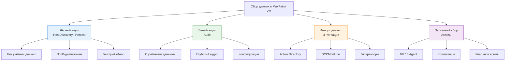
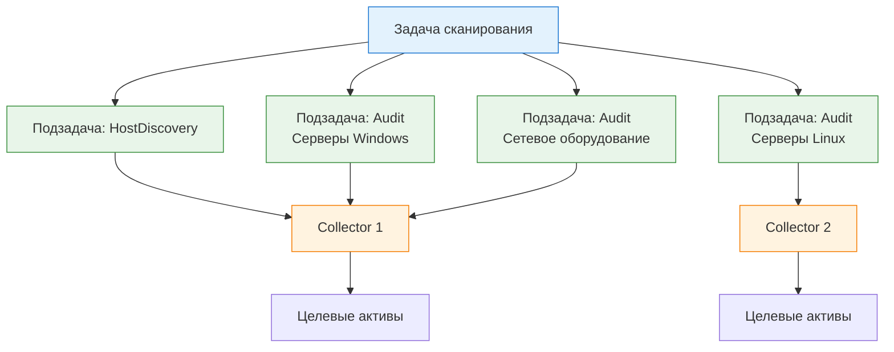

---
tags:
  - maxpatrol-vm
  - vulnerability-management
  - learning
  - stage-3
status: в-progress
created: 2026-08-25
stage: 3
---

# Этап 3 — Сбор данных и сканирование

> [!todo] Приоритет: ВЫСОКИЙ
> Это ядро продукта — без данных нет управления уязвимостями.

---

## 3.1 Режимы сканирования

### Обзор подходов к сбору данных

MaxPatrol VM поддерживает четыре основных режима сбора данных. Каждый подходит для разных сценариев, и эффективная стратегия комбинирует несколько режимов. Сканирование выполняют модули компонента MP 10 Collector «в режимах черного и белого ящика» — см. [[Архитектура MaxPatrol VM]].


```mermaid
graph TB
    A[Сбор данных в MaxPatrol VM] --> B[Чёрный ящик<br/>HostDiscovery / Pentest]
    A --> C[Белый ящик<br/>Audit]
    A --> D[Импорт данных<br/>Интеграция]
    A --> E[Пассивный сбор<br/>Агенты]

    B --> B1[Без учётных данных]
    B --> B2[По IP-диапазонам]
    B --> B3[Быстрый обзор]

    C --> C1[С учётными данными]
    C --> C2[Глубокий аудит]
    C --> C3[Конфигурации]

    D --> D1[Active Directory]
    D --> D2[SCCM/Intune]
    D --> D3[Гипервизоры]

    E --> E1[MP 10 Agent]
    E --> E2[Коллекторы]
    E --> E3[Реальное время]

    style B fill:#e3f2fd,stroke:#1976d2
    style C fill:#e8f5e9,stroke:#388e3c
    style D fill:#fff3e0,stroke:#f57c00
    style E fill:#f3e5f5,stroke:#7b1fa2
```

### Чёрный ящик (HostDiscovery и Pentest)

> [!note] Первый шаг
> Сканирование без учётных данных — это способ быстро понять, *что* у вас есть в сети, не имея учётных записей для доступа к системам. В MaxPatrol VM чёрный ящик реализован модулями **HostDiscovery** (поиск активов) и **Pentest** (пентест и поиск уязвимостей).

**Модуль HostDiscovery — только поиск активов:**
- Сканирует IP-диапазоны без учётных записей
- Проверяет доступность активов по ICMP ping, TCP ping или обоим методам
- Определяет открытые порты и работающие сервисы
- Идентифицирует семейство ОС (более точно ОС определяет модуль Pentest)
- **Не предназначен для поиска уязвимостей** — это прямо указано в документации ([[Модуль HostDiscovery]])

**Модуль Pentest — пентест и поиск уязвимостей:**
- Сканирует активы «без использования данных учетных записей на источнике (методом черного ящика)»
- Позволяет проводить тестирование на проникновение, поиск уязвимостей и информации о связанном с ними ПО
- Все профили модуля сканируют порты и определяют работающие службы (см. [[Определение ОС модулем Pentest]])

**Что НЕ может чёрный ящик:**
- Не видит установленное ПО, которое не слушает на сетевых портах
- Не может проверить конфигурации ОС и приложений
- Не определяет наличие/отсутствие патчей
- Не имеет доступа к реестру Windows, RPM/DPKG-менеджерам

**Когда использовать:**
- Первичное развёртывание — «что у нас вообще есть?»
- Поиск теневых IT (Shadow IT)
- Регулярный мониторинг открытых сервисов
- Проверка сегментов, недоступных для аудита

**Параметры сканирования (секции параметров профиля):**
- **Способы проверки узлов:** проверка с помощью эхо-запроса ICMP; порты TCP для проверки SYN-, ACK-, RST-пакетами; порты UDP для проверки
- **Параметры проверки узлов:** определение операционной системы, проверка с помощью ARP-запросов, тайм-аут ответа, максимальное количество неудачных проверок
- **Скорость:** «Максимальная скорость отправки ARP-запросов» и «Максимальная скорость отправки пакетов» — для безопасного первого сканирования рекомендуется `100` пак./с
- **Общие параметры сканирования (модуль Pentest):** метод сканирования портов — SYN-пакеты или Подключение ([[Общие параметры сканирования]])

> [!tip] Первая настройка
> Порядок действий для первого поиска активов (отключение ICMP-эхо, список SYN-портов, скорость 100 пак./с, подсети не мельче `/16`) описан в [[Первый поиск активов модулем HostDiscovery]] и [[Рекомендации по использованию профилей]].

### Белый ящик (Audit)

> [!important] Глубина данных
> «Модуль Audit предназначен для аудита активов методом белого ящика. В параметрах профиля нужно указать учетную запись, которой предоставлены права на выполнение команд для сбора данных об активе» ([[Создание задач на аудит]]).
>
> Аудит с правильными учётными записями даёт в 10–100 раз больше информации, чем сканирование в режиме чёрного ящика.

**Что делает:**
- Подключается к системам с использованием учётных записей
- Читает установленное ПО (реестр Windows, RPM/DPKG, AppStream)
- Проверяет версии всех установленных пакетов и компонентов
- Анализирует конфигурации ОС и приложений
- Проверяет наличие патчей и обновлений
- Считывает политики безопасности (password policy, audit policy)
- Проверяет запущенные сервисы и их настройки
- Для сетевого оборудования: читает конфигурацию, проверяет ACL, версии ПО

**Протоколы доступа:**

| ОС / Тип | Протокол | Порт | Привилегии |
| --- | --- | --- | --- |
| Windows | SMB/WMI | 445/135 | Локальный администратор |
| Linux/Unix | SSH | 22 | root или sudo |
| VMware ESXi | HTTPS API | 443 | Администратор ESXi |
| Cisco IOS | SSH/Telnet | 22/23 | Привилегированный режим (enable) |
| FortiGate | SSH/HTTPS | 22/443 | Администратор |
| Базы данных | SQL*Net/TDS | 1521/1433 | Администратор БД |

**Стандартные профили для аудита ([[Создание задач на аудит]]):**

| Профиль | Описание |
| --- | --- |
| Windows Audit | Аудит Windows и ПО, установленного на активах под управлением Windows |
| Windows Updates Discovery | Быстрый аудит Windows и проверки установки обновлений; собирает ограниченный объём информации |
| Windows DC Audit | Сбор данных о ресурсах службы каталогов AD и аудит Windows по LDAP и RPC; использовать, когда в сети один контроллер домена |
| Microsoft Active Directory Audit | Аудит ресурсов службы каталогов AD по LDAP; использовать на одном из контроллеров, если их несколько |
| Unix SSH Audit | Аудит ОС семейства Unix и установленного на них ПО |
| Windows Audit Vulnerabilities Discovery | Аудит с поиском уязвимостей (поддерживает обновления экспертных данных для аудита) |

### Импорт данных (Интеграция)

> [!tip] Не дублируйте работу
> Если данные уже есть в другой системе, импортируйте их — не сканируйте повторно.

**Поддерживаемые источники:**

> [!warning] Оговорка к таблице
> Прямых задач типов «Импорт», «Интеграция» в интерфейсе 2.8 нет — «импорт» там это импорт результатов сканирования и данных из MaxPatrol 8 (см. callout ниже). Таблица описывает источники, которые MaxPatrol VM учитывает косвенным обнаружением при аудите исходных активов либо встроенными механизмами поставки данных (обновления экспертных данных, экспорт в формате XML). Отдельных коннекторов «принеси данные из Nessus/Qualys» в MaxPatrol VM 2.8 нет.

| Источник                | Тип данных                                     | Механизм в MaxPatrol VM 2.8 |
| ----------------------- | ---------------------------------------------- | --------------------------- |
| Active Directory        | Структура OU, компьютеры, пользователи, группы | Аудит КД профилем Windows DC Audit / Microsoft Active Directory Audit (LDAP/RPC) |
| Microsoft SCCM/Intune   | Установленное ПО, обновления                   | Косвенное обнаружение клиентов SCCM при аудите исходных активов, см. [[Обнаружение активов]] |
| VMware vCenter / Hyper-V | Виртуальные машины, гипервизоры, конфигурации | Аудит гипервизора + косвенное обнаружение его виртуальных машин |
| Обновления баз уязвимостей | Данные об уязвимостях (после аудита)          | Встроенные механизмы поставки данных (PDF, XML), импорт результатов сканирования |
| Nessus/Qualys (экспорт) | Результаты сканирования                        | Поддерживается импорт результатов сканирования в формате ZIP ([[Импорт результатов сканирования]]) |

**Пример использования данных AD:**
- После аудита контроллеров домена структура OU, компьютеры, пользователи и группы отображаются в модели активов
- Динамические группы строятся по PDQL-условиям по объектам каталога (примеры запросов — в [[4. Язык PDQL]])
- Учётные записи для сканирования привязываются к целям задач
- Данные обновляются при каждом повторном аудите контроллеров домена

> [!important] Как это устроено в MaxPatrol VM 2.8
> В MaxPatrol VM 2.8 отдельной задачи-«импортера» для AD/SCCM/гипервизоров нет:
>
> - Данные Active Directory собираются **модулем Audit** в режиме белого ящика профилями **Windows DC Audit** (один контроллер домена) и **Microsoft Active Directory Audit** (несколько контроллеров, по протоколу LDAP) — см. [[Создание задач на аудит]].
> - Участники домена, клиенты SCCM и Kaspersky Security Center, виртуальные машины VMware ESXi / Microsoft Hyper-V, соседи по CDP/LLDP, узлы из ARP-таблиц и таблиц маршрутизации **обнаруживаются автоматически** при аудите исходных активов — это «косвенный» метод обнаружения ([[Обнаружение активов]]).
> - Импорт как таковой в 2.8 — это импорт **результатов сканирования** из ZIP-архива ([[Импорт результатов сканирования]]) и импорт данных из MaxPatrol 8 профилем модуля **MP8ScanImporter**.

### Пассивный сбор (Агенты и Коллекторы)

**MP 10 Agent — агентский сбор:**

> [!note] Когда нужен агент
> Агент необходим, когда целевая система находится за строгим файрволом или когда нужен постоянный мониторинг.

- **Что делает:** устанавливается на целевую систему, постоянно собирает данные
- **Преимущества:**
  - Не зависит от сетевой доступности (агент работает локально)
  - Собирает данные, недоступные при удалённом сканировании
  - Минимальная нагрузка на сеть (только передача данных)
  - Может собирать данные в off-line режиме
- **Недостатки:**
  - Требует установки и поддержки на каждой целевой системе
  - Дополнительная нагрузка на целевую систему
  - Нужно управлять жизненным циклом агентов

**Коллекторы — безагентский сбор:**

- **Что делает:** Collector в каждом сетевом сегменте собирает данные удалённо
- **Преимущества:**
  - Не требует установки ПО на целевые системы
  - Централизованное управление
- **Недостатки:**
  - Зависит от сетевой доступности
  - Требует маршрутизации между сегментами

### Сравнение режимов

| Критерий | Чёрный ящик | Audit | Импорт | Пассивный |
| --- | --- | --- | --- | --- |
| Глубина данных | Низкая | Высокая | Средняя | Высокая |
| Скорость | Быстро | Медленно | Быстро | Постоянно |
| Нагрузка на сеть | Средняя | Высокая | Минимальная | Низкая |
| Нагрузка на цель | Низкая | Средняя | Нет | Средняя |
| Требуются учётные записи | Нет | Да | Зависит от источника | Да (для агента) |
| Видит ПО без сервисов | Нет | Да | Да | Да |
| Проверяет конфигурации | Нет | Да | Частично | Да |
| Рекомендуемая частота | Еженедельно | Ежемесячно | По расписанию | Постоянно |

---

## 3.2 Учётные записи для сканирования

### Зачем нужны учётные записи

> [!important] Ключевой принцип
> Глубина аудита напрямую зависит от привилегий учётной записи. С «чтением» вы увидите установленное ПО; с «записью» — сможете проверить конфигурации; с полными привилегиями — всё.

### Типы учётных записей

> [!note] Типы учётных записей в интерфейсе MaxPatrol VM
> На странице **Учетные записи** ([[Страница «Учетные записи»]]) по кнопке **Добавить учетную запись** создаются учётные записи четырёх типов. Тип определяется способом аутентификации, а не ОС целевой системы:

| Тип | Что указывается | Когда используется |
| --- | --- | --- |
| **Логин — пароль** | Название, логин, пароль (+ подтверждение), домен (при необходимости), метки | Основной тип для аудита ОС, приложений, СУБД по SSH/WMI/API |
| **Пароль** | Название, пароль (+ подтверждение), метки | Протоколы с аутентификацией только паролем (например, SNMPv3, некоторые веб-API) |
| **Сертификат** | Путь к файлу сертификата (< 100 КБ), опционально логин и пароль, метки | Аутентификация по сертификатам (PKI) |
| **LAPS** | Адрес и порт контроллера домена AD, база поиска активов, учётная запись AD с правами просмотра атрибутов компьютеров, логин (по умолчанию `Administrator`) | Local Administrator Password Solution (LAPS 6.2) в сочетании с AD для сбора данных с активов |

> Документация: добавление учётных записей типов [«логин — пароль»](https://help.ptsecurity.com/ru-RU/projects/vm/2.8/help/700483723), [«пароль»](https://help.ptsecurity.com/ru-RU/projects/vm/2.8/help/700749195), [«сертификат»](https://help.ptsecurity.com/ru-RU/projects/vm/2.8/help/700776843) и [LAPS](https://help.ptsecurity.com/ru-RU/projects/vm/2.8/help/4767462283).

#### Учётные записи для Windows

| Тип | Привилегии | Что видит MaxPatrol VM |
| --- | --- | --- |
| Локальный администратор | Полный доступ к локальной системе | Всё: ПО, реестр, патчи, политики, сервисы |
| Доменный администратор | Полный доступ ко всем доменным системам | Всё + доменная политика |
| Член группы Administrators | Доступ как локальный администратор | Всё |
| Обычный пользователь | Базовый доступ | Минимальная информация |

**Требования к учётной записи Windows:**
- Должна быть в группе **Administrators** на целевой системе
- Доступ по протоколу **SMB** (порт 445) и **WMI** (порт 135 + динамические порты)
- Рекомендуется: отдельная учётная запись для сканирования (не общая с ИТ)
- **Не используйте:** учётную запись администратора домена для сканирования рабочих станций

#### Учётные записи для Linux/Unix

| Тип | Привилегии | Что видит MaxPatrol VM |
| --- | --- | --- |
| root | Полный доступ | Всё: пакеты, конфигурации, cron, SUID, ядро |
| sudo без пароля | Доступ как root | Всё |
| sudo с паролем | Доступ как root (с вводом пароля) | Всё (нужна настройка sudo) |
| Обычный пользователь | Базовый доступ | Минимальная информация |

**Требования к учётной записи Linux:**
- Доступ по протоколу **SSH** (порт 22)
- Рекомендуется: root или sudo без пароля
- **Не используйте:** учётную запись с интерактивным вводом пароля sudo ( MaxPatrol VM не может вводить пароль)
- Для sudo: добавьте строку `NOPASSWD` в `/etc/sudoers.d/`

**Пример настройки sudo для MaxPatrol VM:**
```bash
# Создайте файл /etc/sudoers.d/maxpatrol
maxpatrol ALL=(ALL) NOPASSWD: ALL
```

#### Учётные записи для сетевого оборудования

| Тип | Протокол | Привилегии |
| --- | --- | --- |
| Привилегированный (enable/exec) | SSH/Telnet | Полный доступ к конфигурации |
| Read-only | SSH/SNMP | Только чтение конфигурации |
| SNMP v2c/v3 | SNMP | Чтение системной информации |

**Требования:**
- SSH-доступ с привилегированным режимом (enable mode)
- Для SNMP: чтение системных OID (sysDescr, sysUpTime, installed packages)
- **Не используйте:** Telnet (незашифрованный протокол)

### Сертификаты

- **Зачем:** для аутентификации по сертификатам (вместо паролей)
- **Когда:** в средах с высокими требованиями к безопасности (PKI-инфраструктура)
- **Поддержка:** MaxPatrol VM умеет работать с сертификатами для SSH-подключений

### Лучшие практики хранения учётных записей

> [!warning] Безопасность учётных записей
> Учётные записи для сканирования — это одна из самых уязвимых точек MaxPatrol VM. Если они скомпрометированы, атакующий получит доступ ко всей инфраструктуре.

| Практика | Описание |
| --- | ---|
| Отдельные учётные записи | Не используйте общие с ИТ-отделом |
| Минимальные привилегии | Только то, что нужно для сканирования |
| Ротация паролей | Регулярно меняйте пароли (рекомендуется: ежемесячно) |
| Шифрование хранения | MaxPatrol VM шифрует учётные записи в базе данных |
| Аудит использования | Отслеживайте, кто и когда использует учётные записи |
| Ограничение по IP | На стороне целевых систем: разрешить доступ только с IP Collector'а |
| Не хранить в текстовых файлах | Никогда! Только в MaxPatrol VM |

### Создание учётных записей в MaxPatrol VM

**Порядок действий:**
1. В главном меню выберите **Сбор данных** → **Учетные записи** → откроется страница **Учетные записи**
2. Нажмите **Добавить учетную запись** и выберите тип: **Логин — пароль**, **Пароль**, **Сертификат** или **LAPS**
3. Укажите:
   - **Название** (для идентификации)
   - **Метки** — методы сбора данных, для которых будет доступна учётная запись (необязательно)
   - Поля, зависящие от типа (логин/пароль/домен, сертификат или параметры подключения к контроллеру домена для LAPS)
4. Нажмите **Сохранить**
5. Доступность проверяйте в задаче аудита: **Запустить** → **Проверить подключение** (режим проверки подключения доступен только для задач аудита, см. [[Запуск проверки подключения]])

> [!tip] Тестирование
> Проверка подключения к целевым активам и транспортам (кнопки **Запустить** → **Проверить подключение**) позволяет заранее убедиться, что к активам есть доступ с выбранной учётной записью. Ошибка в учётной записи = пустые результаты + потраченное время.

---

## 3.3 Профили сканирования

### Что такое профиль сканирования

> [!note] Профиль = параметры модуля
> Профиль сканирования — это набор параметров определённого **модуля** сканирования (HostDiscovery, Audit, Pentest, WebEngine, MP8ScanImporter и др.). Профиль привязан к одному модулю; старый профиль можно взять за основу пользовательского. На странице **Профили** для каждого профиля отображаются название, базовый профиль, название модуля и тип (стандартный или пользовательский) — см. [[Страница «Профили»]].

### Стандартные профили

MaxPatrol VM поставляется со стандартными профилями для типичных сценариев (группировка по модулям — по [[Модуль HostDiscovery]], [[Создание задач на аудит]], [[Рекомендации по использованию профилей]], [[Создание профилей на основе Web Scan Optimal для разных типов аутентификации]]):

| Модуль | Стандартные профили | Назначение |
| --- | --- | --- |
| HostDiscovery | **HostDiscovery**, **Inventory Profile**, **Os Detection Profile**, **PortScan Full Range** | Поиск активов по открытым TCP-портам / ICMP; определение ОС; полное сканирование портов TCP 1–65535 |
| Audit | **Windows Audit**, **Windows Updates Discovery**, **Windows DC Audit**, **Microsoft Active Directory Audit**, **Unix SSH Audit**, **Windows Audit Vulnerabilities Discovery** | Аудит «белого ящика» с учётными данными |
| Pentest | **Windows Services Discovery**, **Service Discovery**, **Safe PenTest** | Чёрный ящик: определение служб/ОС, безопасный пентест |
| WebEngine | **Web Scan Optimal** (и пользовательские на его основе) | Сканирование веб-приложений |
| MP8ScanImporter | **MP8ScanImporter** | Перенос данных из MaxPatrol 8 |

### Проверки внутри профилей

> [!important] Модули — строительные блоки
> Модули сбора данных в MaxPatrol VM 2.8: **HostDiscovery** (поиск активов), **Audit** (белый ящик), **Pentest** (чёрный ящик, пентест), **WebEngine** (веб-приложения), **MP8ScanImporter**, **AuditPLC**, **RemoteExecutor**. Профиль задаёт параметры одного модуля; в его составе — конкретные типы проверок.

**Типы проверок в профиле:**

| Тип | Описание | Пример |
| --- | --- | --- |
| Проверка наличия ПО | Определяет установленные продукты | Проверка наличия Apache 2.4.x |
| Проверка версии | Сравнивает версию с базой знаний | Поиск уязвимостей по CVE (модуль Pentest) |
| Проверка конфигурации | Анализирует настройки | SSL-протоколы, парольная политика |
| Проверка патча | Определяет наличие обновления | Windows Updates Discovery |
| Проверка политики | Анализирует групповые политики | Длина пароля, блокировка учётных записей |

**Примеры модулей для Windows:**

| Модуль | Что проверяет |
| --- | --- |
| Windows Software Inventory | Все установленные программы |
| Windows Patch Assessment | Установленные обновления (KB) |
| Windows Registry Audit | Ключи реестра (автозапуск, настройки) |
| Windows Service Audit | Запущенные сервисы и их параметры |
| Windows User Audit | Учётные записи, группы, политики |
| Windows Share Audit | Общие папки и права доступа |

**Примеры модулей для Linux:**

| Модуль | Что проверяет |
| --- | --- |
| RPM/DPKG Package Audit | Установленные пакеты |
| SSH Configuration Audit | Настройки SSH-сервера |
| Sudo Configuration Audit | Правила sudo |
| Cron Jobs Audit | Задачи планировщика |
| SUID/SGID Audit | Файлы с особыми правами |
| Kernel Parameters Audit | Параметры ядра (sysctl) |

### Пользовательские профили

**Зачем создавать свой профиль:**
- Специфичные требования вашей организации
- Оптимизация скорости сканирования (отключение ненужных модулей)
- Соответствие нормативным требованиям (ФСТЭК, PCI DSS)
- Точечные проверки (только конкретные уязвимости)

**Как создать:**
1. В главном меню выберите **Сбор данных** → **Профили** → откроется страница **Профили**
2. Выберите стандартный профиль в панели **Список профилей**
3. Нажмите **Создать** → **На базе выбранного профиля** (см. [[Создание пользовательского профиля на базе стандартного]])
4. Введите название; при необходимости укажите учётную запись и настройте параметры профиля
5. Сохраните с понятным именем

> [!note] Профиль для поиска конкретных уязвимостей
> По кнопке **Создать** → **Поиск выбранных уязвимостей в режиме BlackBox** создаётся профиль для проверки активов на наличие конкретных уязвимостей (по номеру CVE) в режиме чёрного ящика (см. [[Создание профиля для поиска уязвимостей]]).

**Пример пользовательского профиля:**
- **Название:** «Быстрый аудит критичных серверов»
- **Основа:** Windows Audit (стандартный)
- **Включены:** проверки ПО, патчей, критичных уязвимостей
- **Выключены:** лишние проверки политик и общих папок (для скорости)
- **Порты:** только 445, 135, 3389
- **Целевое время:** < 5 минут на сервер

---

## 3.4 Задачи сканирования

### Архитектура задач


```mermaid
graph TB
    TASK[Задача сканирования] --> SUB1[Подзадача: HostDiscovery]
    TASK --> SUB2[Подзадача: Audit<br/>Серверы Windows]
    TASK --> SUB3[Подзадача: Audit<br/>Серверы Linux]
    TASK --> SUB4[Подзадача: Audit<br/>Сетевое оборудование]

    SUB1 --> C1[Collector 1]
    SUB2 --> C1
    SUB3 --> C2[Collector 2]
    SUB4 --> C1

    C1 --> T1[Целевые активы]
    C2 --> T2[Целевые активы]

    style TASK fill:#e3f2fd,stroke:#1976d2
    style SUB1 fill:#e8f5e9,stroke:#388e3c
    style SUB2 fill:#e8f5e9,stroke:#388e3c
    style SUB3 fill:#e8f5e9,stroke:#388e3c
    style SUB4 fill:#e8f5e9,stroke:#388e3c
    style C1 fill:#fff3e0,stroke:#f57c00
    style C2 fill:#fff3e0,stroke:#f57c00
```

### Создание задачи сканирования

**Пошаговый процесс:**

#### Шаг 1 — Перейти в создание задачи
- В главном меню выберите **Сбор данных** → **Задачи** → откроется страница **Задачи по сбору данных**
- Нажмите **Создать задачу** и выберите пункт меню (см. [[Создание задачи на сбор данных]] и [[Создание задачи на поиск уязвимостей в режиме пентеста]])

#### Шаг 2 — Указать название и описание
- Понятное имя (например, «Еженедельное сканирование серверов Windows»)
- Описание (что сканируем, зачем, как часто)

#### Шаг 3 — Выбрать тип задачи и профиль
| Пункт «Создать задачу» | Что создаёт | Когда использовать |
| --- | --- | --- |
| **Сбор данных** | Задачу на сбор данных с выбранным профилем (модуль и режим определяет профиль) | Основной тип для поиска активов (HostDiscovery), аудита (Audit), пентеста (Pentest), веб-сканирования (WebEngine), переноса из MaxPatrol 8 (MP8ScanImporter) |
| **Поиск уязвимостей в режиме пентеста** | Задачу на поиск конкретных уязвимостей по CVE-идентификаторам; параметры профиля система создаёт сама | Проверка на наличие конкретных уязвимостей, для которых доступны проверки |

> Профиль выбирается в панели **Параметры сбора данных** → **Профиль**; для него же выбирается учётная запись (по умолчанию — указанная в профиле). В списке **Учетная запись** отображаются учётные записи с меткой используемого профилем метода сбора данных.

#### Шаг 4 — Указать цели
Панель **Цели сбора данных** → вкладка **Включить**:
- **Группы активов** — сканировать группу активов
- **Активы** — сканировать отдельные активы
- **Сетевые адреса** — IP-адреса, FQDN или маски подсетей (`192.168.1.1-192.168.1.254`, `10.0.0.0/24`)
- Вкладка **Исключить** — исключение отдельных целей (по IP/FQDN)

> [!note] Примечания к целям
> - По умолчанию подключение к активам выполняется по FQDN (приоритет к IP-адресу можно изменить).
> - Рекомендуется устанавливать флажок **Выполнить обнаружение узлов до начала сбора данных** — обнаружение узлов сокращает общее время сканирования.
> - Большие списки адресов рекомендуется разбивать на блоки и создавать отдельные задачи на каждый блок.
> - Подсети организации не должны совпадать с подсетями Docker-контейнеров (172.17.0.0—172.31.255.255 и 192.168.0.0—192.168.255.255).

#### Шаг 5 — Настроить дополнительные параметры
- **Коллекторы** — выбор коллекторов для сбора данных (для высоконагруженных инфраструктур, например Active Directory, рекомендуется MP 10 Collector на Linux)
- **Инфраструктура** — выбор инфраструктуры, если их несколько
- **Расположение** — группа задач, в которую войдёт новая задача (без выбора задача попадает в пространство **Задачи вне групп**)

#### Шаг 6 — Назначить учётные записи
- Учётная запись выбирается в панели **Параметры сбора данных** (для профиля)
- Проверка доступа перед запуском: **Запустить** → **Проверить подключение** (только для задач аудита, см. [[Запуск проверки подключения]])

#### Шаг 7 — Настроить расписание (опционально)
- Панель **Расписание** — включите автоматический запуск задачи и настройте периодичность
- Дополнительно можно настроить **запрещённое время сканирования**: в этот период сбор данных приостанавливается и возобновляется автоматически (см. [[Настройка запрещенного времени сканирования]])

| Интервал | Рекомендация |
| --- | --- |
| HostDiscovery (поиск активов) | Еженедельно |
| Audit (критичные серверы) | Еженедельно |
| Audit (рабочие станции) | Ежемесячно |
| Audit (сетевое оборудование) | Ежемесячно |
| Срочное сканирование | По требованию (ручной запуск) |

#### Шаг 8 — Настроить приоритет
- **Высокий:** критичные серверы, срочные проверки
- **Нормальный:** плановое сканирование
- **Низкий:** фоновые задачи, тестирование

#### Шаг 9 — Запустить
- **Сохранить и запустить** → **Запустить сбор данных** — немедленный запуск
- **Сохранить** — запуск по расписанию или позже
- Запуск вручную — по кнопке **Запустить** на странице задач ([[Запуск задачи вручную]])

### Группы задач

Задачи можно объединять в группы и выполнять действия над всеми задачами группы одновременно ([[Группы задач]]):
- Группа может содержать задачи и вложенные группы задач
- Стандартные группы по умолчанию: **Все задачи** и **Задачи вне групп**
- Действия над группой: запуск, остановка, приостановка всех задач группы
- Создание группы — **Сбор данных** → **Задачи** → панель **Группы задач** → кнопка создания группы, поле **Расположение** задаёт родительскую группу

### Исключения

Исключать активы, группы активов, IP-адреса, FQDN, подсети и отдельные узлы из целей сбора данных можно централизованно — для всех существующих и создаваемых задач сразу ([[Работа с исключениями]]):
- Страница **Сбор данных** → **Исключения**
- Исключение можно привязать к отдельным модулям сбора данных (например, только для модуля Audit) и к конкретным группам активов, активам, сетевым адресам

### Частичный сбор данных

Чтобы сократить время сканирования и снизить нагрузку, можно ограничить область сбора данных определёнными классами модели активов ([[Частичный сбор данных]]):
- Доступно только при сканировании в режиме Audit
- Настройка: **Изменить** → включить дополнительные параметры → **Область сбора данных**
- Варианты: **По классам модели активов** (поля **Имена пропускаемых классов** и **Имена заполняемых классов**) или **По маскам модели активов**
- Пример: чтобы не собирать данные из ARP-таблиц, в поле **Имена пропускаемых классов** укажите `Network.ARPTable`

### Мониторинг выполнения задач

**Статусы задачи** (по [[Анализ результатов аудита]]):

| Статус | Описание |
| --- | ---|
| Не запускалась | Задача ни разу не запускалась |
| Подготавливается | Создаётся запуск задачи, создаются подзадачи |
| Ожидает выполнения | Подзадачи назначены на коллекторы, ожидают запуска в очереди |
| Выполняется | Хотя бы одна подзадача запущена, идёт сбор данных |
| Завершается | Отправлен запрос об остановке подзадач (после ручной остановки) |
| Завершена | Подзадачи завершены (все без ошибок / часть с ошибками / все с ошибками) |

**Что отслеживать:**
- Прогресс выполнения (процент, количество обработанных активов)
- Скорость сканирования (активов в минуту)
- Ошибки и предупреждения
- Время начала и предполагаемое время завершения
- Распределение по Collector'ам

**Где смотреть:**
- **Сбор данных** → **Задачи** — страница **Задачи по сбору данных**, список всех задач
- Двойной клик по задаче → страница **История запусков <Название задачи>** ([[Просмотр истории запусков задачи]])
- Журнал подзадачи — страница **Журнал подзадачи <Время>**, скачивание журнала задач по кнопке **Скачать журнал** ([[Анализ результатов аудита]])
- Отчёт о выполнении задачи — [[Скачивание отчета о выполнении задачи]]

### Типичные проблемы сканирования

| Проблема | Вероятная причина | Решение |
| --- | --- | --- |
| Нет результатов | Неверные учётные записи | Проверить логин/пароль, протестировать подключение |
| Мало данных | Чёрный ящик (HostDiscovery/Pentest) вместо аудита | Использовать Audit с правильными учётными |
| Таймауты | Слишком много целей | Разбить задачу, увеличить таймауты |
| Медленно | Слишком много модулей | Упростить профиль, уменьшить количество целей |
| Ошибки подключения | Firewall между Collector и целью | Настроить правила firewall |
| Дубли активов | Один актив на разных IP | Настроить нормализацию активов |

### Рекомендации по расписанию сканирования

> [!tip] Стратегия сканирования
> Не сканируйте всё и всегда. Разделите инфраструктуру на группы с разной частотой сканирования.

| Группа активов | Частота | Режим (модуль) | Профиль |
| --- | --- | --- | --- |
| Критичные серверы (H) | Еженедельно | Audit | Windows Audit / Unix SSH Audit |
| Серверы средней значимости (M) | Ежемесячно | Audit | Windows Audit / Unix SSH Audit |
| Рабочие станции | Ежемесячно | Audit | Windows Updates Discovery (быстрый) |
| Сетевое оборудование | Ежемесячно | Audit | Пользовательский профиль на базе стандартного |
| Тестовые стенды | По требованию | Чёрный ящик | HostDiscovery / Safe PenTest |
| Вся сеть (поиск активов) | Еженедельно | HostDiscovery | HostDiscovery (SYN-порты из рекомендаций) |

---

## Краткое резюме Этапа 3

| Аспект | Ключевая мысль |
| --- | --- |
| Чёрный ящик | HostDiscovery — поиск активов без учётных данных; Pentest — пентест и поиск уязвимостей без учёток |
| Audit | Глубокий аудит «белого ящика» с учётными данными; видит всё установленное ПО и конфигурации |
| Данные AD/SCCM/гипервизоров | Получаются при аудите исходных активов и косвенном обнаружении; импорт — результаты сканирования / из MaxPatrol 8 |
| Пассивный сбор | Агенты для постоянного мониторинга и off-line систем |
| Учётные записи | 4 типа в интерфейсе: «логин — пароль», «пароль», «сертификат», LAPS |
| Профили | Набор параметров модуля; стандартные + пользовательские на базе стандартных |
| Задачи | Название → Тип/профиль → Цели → Коллекторы → Учётная запись → Расписание → Запуск |
| Расписание | Разная частота для разных групп активов; запрещённое время приостанавливает сбор |

---

## Связанные заметки

- [[2. Архитектура и установка]] — предыдущий этап
- [[4. Язык PDQL]] — следующий этап
- [[План изучения]] — общий план обучения

## Ресурсы

- [Справочный портал MaxPatrol VM](https://help.ptsecurity.com/ru-RU/projects/vm/2.8/help/4980710795)
- [Справочник PDQL-запросов для анализа активов](https://help.ptsecurity.com/ru-RU/projects/vm/2.8/help/1517373339)
- [Курс Positive Education: Применение MaxPatrol VM](https://edu.ptsecurity.com/kursy-po-ekspluatacii-productov-pt/mp-vm)
- [Бесплатный курс TS University: MaxPatrol VM Getting Started](https://university.tssolution.ru/maxpatrol-vm-getting-started/obzor-vozmozhnostej)

---

*Следующий этап: [[4. Язык PDQL]]*
