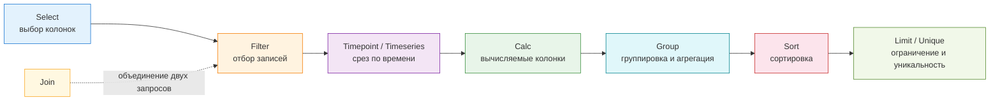

---
tags:
  - maxpatrol-vm
  - vulnerability-management
  - learning
  - stage-4
  - pdql
status: в-progress
created: 2026-08-25
updated: 2026-10-05
stage: 4
source-doc: Синтаксис языка запросов PDQL (MaxPatrol VM 2.0, ред. 28.07.2023)
---

# Этап 4 — Язык PDQL

> [!todo] Приоритет: ВЫСОКИЙ (.core skill)
> PDQL — это язык запросов MaxPatrol VM. Без него невозможно эффективно работать с активами и уязвимостями.

> [!info] Источник синтаксиса
> Заметка приведена в соответствие с официальным документом **«Синтаксис языка запросов PDQL»** (MaxPatrol VM 2.0, ред. от 28.07.2023). Полный перечень псевдонимов, типов данных и математических функций — в [[PDQL — синтаксис по документации PT]].

---

## 4.1 Основы синтаксиса

### Что такое PDQL

**PDQL** (Positive Data Query Language) — язык запросов MaxPatrol VM, разработанный Positive Technologies для фильтрации активов, настройки представления данных об активах, объединения активов в динамические группы и построения виджетов по активам.

> [!note] Аналогия
> Если SQL работает с реляционными таблицами, PDQL работает с **объектной моделью активов**: запрос ссылается на объекты и их атрибуты, а не на столбцы таблиц.

**Актив** — базовая единица MaxPatrol VM, представляющая собой сканируемый сетевой узел.

### Два понятия, которые нельзя путать

| Понятие | Синтаксис | Что это | Пример |
| --- | --- | --- | --- |
| **Объект модели активов** | `Host`, `WindowsHost`, `UnixHost`, `NetworkDeviceHost` | класс объектов в объектной модели; у него есть атрибуты | `Host.OsName` |
| **Псевдоним** | `@HOST`, `@NAME`, `@ID`, `@TYPE`, `@IPADDRESSES` | предопределённое имя, объединяющее несколько похожих атрибутов модели | `Host.@IpAddresses` |

> [!important] Ключ `@` = псевдоним
> Если в выражении есть `@` — это псевдоним. Без `@` — объект или атрибут модели активов. Это главный признак при чтении запроса.

> [!note] Регистр
> Все атрибуты модели активов, псевдонимы, названия и описания активов, идентификаторы CVE — **регистронезависимы**. Регистр имеет значение только там, где это явно оговорено: псевдоним колонки (`as`) для отображения в таблице и псевдоним запроса в `Join` для разрешения коллизий имён.

### Конвейер операций

Запрос собирается из операций, разделённых вертикальной чертой `" | "`.

> [!important] Порядок операций
> Жёстко заданного порядка нет — **каждая следующая операция применяется к результату предыдущей**. Поэтому `Select(...) | Filter(...)` и `Filter(...) | Select(...)` дают разный смысл: во втором случае фильтруются уже колонки.



| Операция | Синтаксис | Назначение |
| --- | --- | --- |
| Выбор колонок | `Select(<Поле 1>, …, <Поле N>)` | состав колонок таблицы |
| Фильтрация | `Filter(<Условие фильтрации>)` | отбор записей по условию |
| Данные за момент времени | `Timepoint(<Условие фильтрации>)` | срез данных на момент времени |
| Данные за период | `Timeseries(<Условие фильтрации>)` | срез за период — для виджетов с распределением по времени |
| Вычисляемые колонки | `Calc(<Условие>)` | вычисляемое поле, изменение регистра |
| Группировка и агрегация | `Group(<Поле 1>, …, <Поле N>, <Матем. функция>(<Поле>))` | группировка с агрегатом |
| Сортировка | `Sort(<Поле 1> ASC)` / `Sort(<Поле N> DESC)` | порядок записей |
| Ограничение | `Limit(<Количество записей>)` | ограничение выборки |
| Уникальность | `Unique()` | только уникальные записи |
| Объединение | `Join(<Условие> as <Псевдоним>, <Условие объединения>)` | объединение результатов двух запросов |

> [!note] Поиск — не операция PDQL
> В таблице активов есть отдельная **строка поиска**: условие из неё можно преобразовать в условие фильтрации. Это интерфейсная функция, а не операция конвейера PDQL, и в конвейере она не используется.

### Условие без конвейера

Для динамической группы конвейер не нужен — достаточно одного предиката:

```text
Host.HostType = 'Server'
```

Конвейер нужен только когда результат надо преобразовать: выбрать колонки, посчитать агрегат, отсортировать, ограничить.

### Предикаты

Предикат — логическое выражение на языке PDQL. Предикаты соединяются операторами `AND` / `OR` / `NOT` и скобками `()`.

**Предикат существования** — ищет активы, у которых есть указанный атрибут:

```text
Host                        — все сетевые узлы
WindowsHost                 — узлы с ОС семейства Windows
WindowsHost.Softs<KasperskySecurityCenter>.Plugins
                            — узлы с Windows и с Kaspersky Security Center, у которого есть плагины
```

**Прочие предикаты** — сравнение, вхождение, шаблон. Первый операнд задаётся как в предикате существования, значение — **только соответствующего типа данных**:

```text
Host.OsName = 'Windows 7'
Host.@IpAddresses.Item in 203.0.113.0/20
UnixHost.Softs.Name like '%Apache%'
```

**Вложенные условия** — квадратные скобки `[ ]`:

```text
Host[HostRoles.Role = 'File Service' and OsCandidates.Family = 'Windows' and OsName != 'Windows 7']
WindowsHost.Endpoints<TransportEndpoint>[Status = 'Open' and Protocol = 'tcp' and Port = 3389]
```

> [!warning] Операнды должны быть одного типа
> `@WindowsHost`, `WindowsHost.@CumulativeVulnerability`, `WindowsHost.@UpdateTime`, `WindowsHost.Groups.Name` — не взаимозаменяемы. Смешивание типов операндов в одном предикате — ошибка.

### Псевдоним колонки

```text
Синтаксис: <Поле> as <Имя>   или   <Выражение> as <Имя>
```

Допустимы только латинские буквы, цифры, символ подчёркивания и точка. В отличие от остального синтаксиса, **регистр псевдонима значим** — это отображаемое имя колонки.

```text
Select(Host.IpAddress as Ip, Host.FQDN as FQDN, Host.IsVirtual as IsVirtual) | Group(count(*) as Total)
```

---

## 4.2 Фильтрация по времени

```text
Синтаксис: <Атрибут актива или его псевдоним> <Оператор> <Момент времени> <Арифметическая операция> <Период>
```

- сложение `+` — период **в будущем** (например, скорое устаревание актива)
- вычитание `-` — период **в прошлом** (например, недавняя смена пароля)

> [!warning] Главная ошибка в периодах
> Период пишется как `Now() - 30days`, а **не** `days(-30)`. Знак «минус» ставится перед `Now()`, а не внутри функции.

### Моменты времени

| Момент | Функция |
| --- | --- |
| Пользовательское значение | `DateTime` — `YYYY-MM-DD'T'HH:MM:SS`, `YYYY-MM-DD'T'HH:MM`, `YYYY-MM-DD` |
| Сейчас | `Now()` |
| Начало / конец текущего часа | `Startofhour()` / `Endofhour()` |
| Начало / конец текущего дня | `Startofday()` / `Endofday()` |
| Начало / конец текущей недели | `Startofweek()` / `Endofweek()` |
| Начало / конец текущего месяца | `Startofmonth()` / `Endofmonth()` |
| Начало / конец текущего года | `Startofyear()` / `Endofyear()` |

### Единицы периода

| Единица | Сокращения |
| --- | --- |
| год | `y`, `year`, `years` |
| месяц | `mo`, `month`, `months` |
| неделя | `w`, `week`, `weeks` |
| день | `d`, `day`, `days` |
| час | `h`, `hour`, `hours` |
| минута | `mi`, `minute`, `minutes` |
| секунда | `s`, `second`, `seconds` |

> [!important] Единицы — по убыванию
> Единицы перечисляются строго **по убыванию**: `1year2months3weeks`, `4d5h6mi`. Единицы регистронезависимы.

> [!note] Часовой пояс
> Всё время в системе соответствует **UTC+0**.

### Примеры

```text
# Активы, которые устареют в течение недели
Select(@Host) | Filter(Host.@DeletionTime <= Now() + 7days)

# Учётные записи, у которых за последний месяц сменился пароль
Select(UnixHost.User<UnixUser>.Name, UnixHost.User<UnixUser>.PasswordLastChanged as "Смена пароля")
| Filter("Смена пароля" > Now() - 1Mo)

# Активы, появившиеся за последнюю неделю
Host.@CreationTime >= Now() - 1W
```

### Псевдонимы времени

| Псевдоним | Смысл |
| --- | --- |
| `@CREATIONTIME` | момент появления данных об активе в системе |
| `@UPDATETIME` | последнее обновление данных об активе |
| `@DELETIONTIME` | предполагаемое время устаревания (удаления из системы) |
| `@AUDITTIME` | последний сбор данных модулем Audit |
| `@PENTESTTIME` | последний сбор данных модулем Pentest |
| `@TIME` | расчёт актива на выбранный момент времени |
| `@PREVIOUSTIME` | расчёт на предыдущий момент времени |

---

## 4.3 Объединение запросов (Join)

```text
Синтаксис: <Запрос 1> | Join(<Запрос 2> as <Псевдоним>, <Условие объединения>)
```

Условие объединения — предикаты равенства, соединённые `AND` / `OR` и скобками. Псевдоним запроса не обязателен: без него используется название колонки.

```text
Select(@UnixHost, UnixHost.Groups.Name, UnixHost.Groups.Users)
| Join(
    Select(@UnixHost, UnixHost.User.ID, UnixHost.User.Name) as U,
    @UnixHost = U.@UnixHost and UnixHost.Groups.Users = U.UnixHost.User.Name
  )
| Select(@UnixHost, UnixHost.Groups.Name, U.UnixHost.User.ID, UnixHost.Groups.Users)
```

> [!note] Как работает псевдоним запроса
> Псевдоним добавляется ко всем колонкам объединяемого запроса: `1, 2, …, n, U.1, U.2, …, U.n`. Псевдоним запроса может содержать латинские или русские буквы, цифры, `_` и `-`; не может состоять только из цифр и не может начинаться с дефиса.
>
> Колонки вида `@HOST`, `@ACTIVEDIRECTORY` при объединении сравниваются **по ID актива**, а не по имени.

---

## 4.4 Изменение регистра данных

Нужно, когда регистр данных об активах отличается от регистра данных о событиях — иначе не работают правила корреляции и обогащения.

```text
Синтаксис: Calc(<upper|lower>(<Поле>) as <Псевдоним>)
```

После выполнения операции в конец таблицы добавляется колонка с указанным именем.

```text
Filter(Host.HostRoles.Role = 'Domain Controller')
| Select(Host.Fqdn, Host.@IpAddresses as ip, Host.@Id as id)
| Calc(lower(Host.FQDN) as fqdn)
| Select(fqdn, ip, id)
```

---

## 4.5 Типичные запросы

### Поиск активов по типу

```text
# Все серверы
Host.HostType = 'Server'

# Узлы не из семейства Windows
not WindowsHost

# Все узлы с Windows 7
Host.OsName = 'Windows 7'
```

### Поиск ПО

```text
# Apache на узлах семейства Unix
UnixHost.Softs.Name like '%Apache%'

# Узлы без ПО Kaspersky
Host [not Softs.Name = "Kaspersky"]

# Список ПО с дедупликацией
Select(Host.Softs.Name as name, Host.Softs.Version as version, Host.Softs.Vendor as vendor, Host.Softs.@Type as t)
| Filter(t = 'Software')
| Select(name, version, vendor)
| Unique()
```

### Поиск по адресам

```text
# Актив с конкретным IP
Host.@IpAddresses contains 192.0.2.10

# Активы, у которых есть хотя бы один из IP
Host.@IpAddresses intersect [192.0.2.10, 192.0.2.12]

# Активы из подсети
Host.@IpAddresses.Item in 192.0.2.0/24
```

> [!warning] `.Item` — только в условии фильтрации
> `@IPADDRESSES.ITEM` и `@MACADDRESSES.ITEM` можно использовать **только в условии фильтрации, до выбора полей**.

### Поиск учётных записей

```text
# Учётные записи Windows, где пароль менялся за последний месяц
Select(WindowsHost.User<WindowsUser>.Name, WindowsHost.User<WindowsUser>.PasswordLastChanged as t)
| Filter(t > Now() - 1M)

# Учётные записи на узлах
Select(@Host, Host.User.Name) | Filter(Host.User.Name) | Group(@Host) | Sort(@Host ASC)
```

### Поиск по сетевым службам

```text
# Узлы с открытым RDP (TCP 3389)
WindowsHost.Endpoints<TransportEndpoint>[Status = 'Open' and Protocol = 'tcp' and Port = 3389]
```

### Поиск уязвимостей

```text
# Активы с конкретной CVE
Host.@Vulners.CVEs.Item = 'CVE-1999-1113'

# Уязвимости по шаблону идентификатора
@Vulners.Cves.Item like '%14833%'

# Опасные уязвимости
Host[@Vulners.SeverityRating = 'Critical']

# Уязвимости с высоким CVSS
Select(@VulnerPassport, VulnerPassport.CVEs, VulnerPassport.Name, VulnerPassport.Score)
| Filter(VulnerPassport.Score >= 9)
```

---

## 4.6 Продвинутые запросы

### Группировка и агрегация

```text
# Активы по операционной системе
Select(@Host, Host.OsName) | Group(Host.OsName, Count(*) as Total) | Sort(Total DESC)
```

> [!warning] Имя математической функции регистрозависимо
> Функции из документации: `Avg`, `Count`, `Countunique`, `Max`, `Median`, `Min`, `Sum`. Написание `COUNT(*)` вместо `Count(*)` — ошибка.

| Функция | Аргумент | Что считает |
| --- | --- | --- |
| `Count` | — | количество значений за период (любой тип) |
| `Count` | `All <Поле>` | количество всех значений, кроме `Null` |
| `Count` | `Distinct <Поле>` | количество уникальных значений, кроме `Null` |
| `Count` | `*` | количество всех значений, включая повторяющиеся и `Null` |
| `Countunique` | `<Поле 1>, …, <Поле N>` | количество уникальных записей по набору колонок |
| `Avg` / `Max` / `Median` / `Min` / `Sum` | `All <Поле>` | агрегат по колонке; только тип `Number` |

> [!note] Пустые значения
> `Avg`, `Max`, `Median`, `Min`, `Sum` игнорируют значения типа `Null`. Если все значения `Null` — возвращается `0`.

### Динамические группы

> [!tip] Динамические группы
> Активы → Группы → Создать группу → **Динамическая**, затем вставить условие. Состав группы пересчитывается при каждом обновлении данных.

| Группа | Условие PDQL |
| --- | --- |
| Серверы | `Host.HostType = 'Server'` |
| Узлы не из семейства Windows | `not WindowsHost` |
| Windows 7 | `Host.OsName = 'Windows 7'` |
| Apache на Unix | `UnixHost.Softs.Name like '%Apache%'` |
| Активы с конкретной CVE | `Host.@Vulners.CVEs.Item = 'CVE-1999-1113'` |
| Вне подсети 203.0.113.0/20 | `not Host.@IpAddresses.Item in 203.0.113.0/20` |
| Появились за неделю | `Host.@CreationTime >= Now() - 1W` |

> [!warning] Ограничения псевдонимов для динамических групп
> Для объединения активов в динамическую группу **нельзя** использовать:
> `@IMPORTANCE`, `@CUMULATIVEVULNERABILITY`, `@VULNERS.SCORE`, `@VULNERS.SEVERITYRATING`, `@VULNERPASSPORT.SCORE`, контекстные оценки и векторы CVSS, а также все псевдонимы групп активов (`@GROUPS*`).
>
> `@GROUPS` не учитывает группу «Все активы».

### Динамика по времени

```text
# Высокозначимые активы с опасными уязвимостями — распределение по дням
Filter(Host.@Importance in ['H', 'M'])
| Timeseries(30d, 1d, Endofday())
| Filter(Host.@Vulners.CVSS2SCORE > 7)
| Select(@Host, Host.@Time)
| Group(Host.@Time, Count(*))
```

> [!note] `Timepoint` и `Timeseries`
> `Timepoint` — срез на момент времени, `Timeseries` — срез за период. `Timeseries` обязателен для виджетов с распределением по времени.
>
> Этот запрос — фильтр таблицы активов, а не условие динамической группы: `@IMPORTANCE` в динамических группах не поддерживается (см. ограничения выше).

### Поиск значимости

```text
# Активы высокой значимости
Select(@Host, Host.Fqdn, Host.@Importance) | Filter(Host.@Importance in ['H', 'M'])
```

> [!note] Значения значимости
> В паспорте актива значимость указана как `High`, `Medium`, `Low` или `Undefined`. В запросах используются короткие коды — например `Host.@Importance in ['H', 'M']`. Кода для «не определено» в документации не приводится — надёжнее фильтровать по перечисленным значениям, а не по предполагаемому сокращению.

### `@Vulners` и `@NodeVulners`

| Псевдоним | Что возвращает |
| --- | --- |
| `@Vulners` | все уязвимости актива, включая уязвимости вложенных узлов — ПО, служб, пакетов |
| `@NodeVulners` | уязвимости только текущего узла, без вложенных |

```text
# Все уязвимости хоста
Select(@Host, Host.OsName, Host.@Vulners) | Filter(Host.@Vulners)

# Только уязвимости ОС
Select(@Host, Host.OsName, Host.OsVersion, Host.@NodeVulners) | Filter(Host.@NodeVulners)
```

### Объединение условий

```text
Select(@Host, Host.Fqdn, Host.@Importance)
| Filter(
    (Host.OsName = 'Windows Server 2019' or Host.OsName = 'Windows Server 2022')
    and Host.@Importance in ['H', 'M']
    and Host.@Vulners
  )
```

---

## 4.7 Типы данных

Каждое поле или ячейка в MaxPatrol VM имеют определённый тип данных. Значение в условии фильтрации должно соответствовать типу операнда.

| Тип | Описание | Пример |
| --- | --- | --- |
| `Bool` | логическое значение | `True`, `False` |
| `DateTime` | время | `2020-07-22T18:08:38` |
| `Enum` | один из элементов предопределённого списка | — |
| `IPAddress` | IPv4 или IPv6 | `192.0.2.235` |
| `MACAddress` | MAC-адрес | `00:53:00:B8:DF:B8` |
| `Network` | адрес подсети в формате CIDR | `192.0.2.0/24` |
| `Number` | целое число | `-3`, `0`, `12` |
| `String` | строка | `"Порт 22 открыт"` |
| `List` | список, элементы могут быть разных типов | `["Порт ", 22, " открыт"]` |
| `StringList` | список строк | `["Красный", "Оранжевый"]` |
| `KeyValue` | ассоциативный массив «ключ — значение» | `{"Красный":"Каждый"}` |
| `UUID` / `UUIDList` | идентификатор RFC 4122 и список таких идентификаторов | `123e4567-e89b-12d3-a456-426655440000` |
| `Null` | отсутствие данных | `null` |

---

## 4.8 Общие ошибки и советы

| Ошибка | Проблема | Решение |
| --- | --- | --- |
| `days(-30)` | неверный синтаксис периода | `Now() - 30days` |
| `COUNT(*)` | неверное имя функции | `Count(*)` |
| `1mo2w3d4h` | единицы не по убыванию | `1mo 2w 3d 4h` в порядке убывания |
| `Host.@Importance = 'ND'` | код для «не определено» в документации не приведён | используйте документированные значения значимости |
| `Host.IpAddress in '10.0.0.1/24'` | тип `Network`, а не строка | `Host.@IpAddresses.Item in 10.0.0.0/24` |
| `@IpAddresses.Item` в `Select` | псевдоним работает только до выбора полей | используйте `@IpAddresses` в колонках |
| `@Importance` в динамической группе | псевдоним не поддерживается для динамических групп | используйте `@Vulners.CVSS3SCORE` вместо `@Vulners.Score` |
| Смешение типов операндов | операнды должны быть одного типа | проверьте типы полей |
| Пропущен pipe `\|` | операции не разделены | каждая операция отделяется `\|` |
| Порядок операций | каждая операция применяется к результату предыдущей | `Select` до `Filter` — колонки, `Filter` до `Select` — строки |

### Советы

1. **Начинайте с одного предиката.** Пустое условие — почти всегда опечатка в имени поля; сверьтесь с подсказками интерфейса.
2. **Не пишите `Select` без нужды.** Условие проверяется без выбора колонок — так быстрее.
3. **Фильтруйте раньше группировки.** `Filter` до `Group` сужает набор данных до агрегации.
4. **Псевдонимы упрощают читаемость.** Длинный путь выносите в `as` и используйте короткое имя дальше.
5. **Проверяйте, поддерживается ли псевдоним для динамической группы** — часть псевдонимов работает только в фильтрах и колонках таблицы.

---

## Краткое резюме Этапа 4

| Аспект | Ключевая мысль |
| --- | --- |
| Назначение | фильтрация активов, представление данных, динамические группы, виджеты |
| Объект модели | `Host`, `WindowsHost`, `UnixHost`, `NetworkDeviceHost` — без `@` |
| Псевдоним | `@HOST`, `@NAME`, `@Vulners.CVEs` — с `@` |
| Конвейер | операции через `" \| "`, каждая применяется к результату предыдущей |
| Операции | `Select`, `Filter`, `Timepoint`, `Timeseries`, `Calc`, `Group`, `Sort`, `Limit`, `Unique`, `Join` |
| Предикаты | существования, сравнения, вхождения; вложение через `[ ]` |
| Период | `Now() - 30days`, `Now() + 7days`; единицы строго по убыванию; UTC+0 |
| `@Vulners` | все уязвимости, включая вложенные |
| `@NodeVulners` | уязвимости только текущего узла |
| `@VulnerPassport` | паспорт уязвимости: CVE, CVSS, методы устранения |
| Функции | `Avg`, `Count`, `Countunique`, `Max`, `Median`, `Min`, `Sum` |
| Регистр | синтаксис регистронезависим, кроме псевдонимов колонок |

---

## Связанные заметки

- [[PDQL — синтаксис по документации PT]] — полный справочник по официальной документации: все псевдонимы, типы данных, математические функции, приложения
- [[3. Сбор данных и сканирование]] — предыдущий этап
- [[5. Работа с активами и уязвимостями]] — следующий этап
- [[10. Практика и закрепление]] — лабораторная 3: 20–30 PDQL-запросов
- [[План изучения]] — общий план изучения MaxPatrol VM

## Ресурсы

- [!pdqlsyntax.pdf](pdqlsyntax.pdf) — официальный документ «Синтаксис языка запросов PDQL» (MaxPatrol VM 2.0, ред. 28.07.2023)
- [Справочник по языку PDQL](https://help.ptsecurity.com/ru-RU/projects/vm/2.8/help/1505039755)
- [Справочник PDQL-запросов для анализа активов](https://help.ptsecurity.com/ru-RU/projects/vm/2.8/help/1517373339)
- [Синтаксис PDQL для фильтрации активов](https://help.ptsecurity.com/ru-RU/projects/vm/2.8/help/1501321995)
- [first.org](https://www.first.org) — метрики и векторы CVSS
- [mitre.org](https://www.mitre.org) — база уязвимостей CVE

---

*Следующий этап: [[5. Работа с активами и уязвимостями]]*