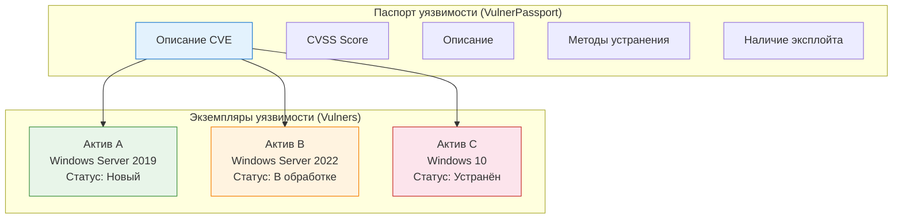
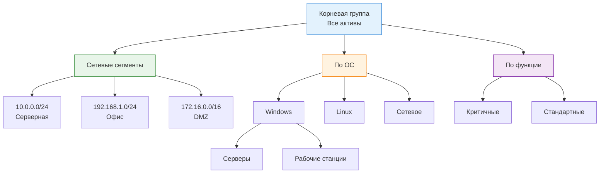
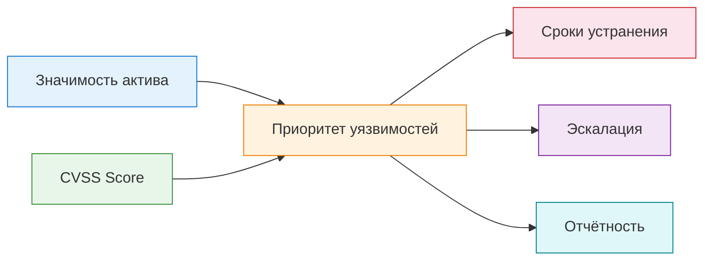

---
tags:
  - maxpatrol-vm
  - vulnerability-management
  - learning
  - stage-5
status: в-progress
created: 2026-08-25
stage: 5
---

# Этап 5 — Работа с активами и уязвимостями

> [!todo] Приоритет: ВЫСОКИЙ
> Ежедневная рутина оператора MaxPatrol VM.

---

## 5.1 Карточки активов

### Что такое карточка актива

> [!note] Карточка = рабочий инструмент
> Карточка актива — это основной интерфейс для анализа конкретного узла. Здесь собрана вся информация об активе: конфигурация, уязвимости, история изменений, принадлежность к группам.

### Структура карточки

Карточка актива состоит из нескольких вкладок:

#### Вкладка «Сводка» (Summary)

Краткая сводная информация об активе:

| Поле | Описание | Пример |
| --- | --- | --- |
| Имя / FQDN | DNS-имя хоста | `SRV-DB-01.corp.local` |
| IP-адрес | Текущий IP | `192.168.1.50` |
| ОС | Операционная система | `Windows Server 2022` |
| Тип хоста | Сервер / Рабочая станция | `Server` |
| Вендор | Производитель ОС | `Microsoft` |
| Значимость | Уровень критичности | `H` (High) |
| Последнее сканирование | Дата и время аудита | `2026-08-20 14:30` |
| Collector | Какой Collector собрал данные | `collector-01` |

#### Вкладка «Конфигурация» (Configuration)

Подробная информация об аппаратном и программном обеспечении:

- **Аппаратное обеспечение:** процессор, ОЗУ, диски, сетевые адаптеры
- **Установленное ПО:** полный список программ с версиями и путями установки
- **Сетевые настройки:** IP-адреса, подсети, шлюзы, DNS, открытые порты и сервисы
- **Пользователи:** локальные учётные записи и группы
- **Сервисы:** запущенные службы, тип запуска, учётные записи

#### Вкладка «Уязвимости» (Vulnerabilities)

Список всех уязвимостей, обнаруженных на данном активе:

| Столбец | Описание |
| --- | --- |
| Название | Наименование уязвимости |
| CVE | Идентификатор CVE |
| CVSS | Оценка тяжести (0-10) |
| Уровень | Critical / High / Medium / Low / Info |
| HasFix | Есть ли исправление |
| Статус | Новый / В обработке / Устранён / Ложное |
| ПО / Сервис | На что повлиял |

#### Вкладка «Метрики CVSS» (CVSS Metrics)

Контекстные метрики CVSS, которые можно настраивать:

> [!tip] Кастомизация CVSS
> Стандартный CVSS не учитывает контекст вашей сети. MaxPatrol VM позволяет изменять метрики CVSS для конкретного актива, чтобы оценка отражала реальный риск.

| Метрика | Описание | Влияние |
| --- | --- | --- |
| Attack Vector (AV) | Вектор атаки | Network / Adjacent / Local / Physical |
| Attack Complexity (AC) | Сложность атаки | Low / High |
| Privileges Required (PR) | Необходимые привилегии | None / Low / High |
| User Interaction (UI) | Взаимодействие пользователя | None / Required |
| Scope (S) | Область воздействия | Unchanged / Changed |

#### История изменений (Change History)

> [!important] Аудит изменений
> История показывает, что изменилось в конфигурации актива между сканированиями. Это критично для отслеживания нежелательных изменений.

- Добавленное / удалённое ПО
- Изменения в конфигурации ОС
- Изменения в сетевых настройках
- Новые открытые порты / сервисы
- Изменения значимости

**Сравнение конфигураций во времени:**
- Выберите два сканирования
- Система покажет различия (diff)
- Можно сравнить ПО, конфигурации, уязвимости

### Как найти карточку актива

1. **Через поиск:** введите IP, FQDN или имя в строке поиска
2. **Через группу активов:** откройте группу → найдите актив → нажмите на имя
3. **Через PDQL:** `qsearch("SRV-DB-01") | select(@Host)` → кликните на результат
4. **Через уязвимость:** откройте паспорт уязвимости → вкладка «Активы» → выберите актив

---

## 5.2 Паспорта и экземпляры уязвимостей

### Модель данных: два уровня

> [!important] Ключевое понимание
> MaxPatrol VM различает два уровня представления уязвимостей: **паспорт** (описание) и **экземпляр** (конкретный случай на конкретном активе). Это не одно и то же.



### Паспорт уязвимости (VulnerPassport)

Паспорт — это **описание** уязвимости, не привязанное к конкретному активу.

| Поле | Описание | Пример |
| --- | --- | --- |
| CVE | Уникальный идентификатор | `CVE-2024-12345` |
| Название | Наименование уязвимости | `Remote Code Execution in OpenSSL` |
| Описание | Подробное описание | `Allows remote attackers to execute...` |
| CVSS Score | Оценка тяжести | `9.8` |
| Уровень | Critical / High / Medium / Low | `Critical` |
| CVSS Vector | Вектор оценки | `CVSS:3.1/AV:N/AC:L/PR:N/UI:N/S:U/C:H/I:H/A:H` |
| HasFix | Наличие исправления | `true` |
| HasExploit | Наличие эксплойта | `true` |
| Дата публикации | Когда CVE был опубликован | `2024-03-15` |
| Метод устранения | Рекомендации | `Обновить OpenSSL до версии 3.0.15` |
| Затронутое ПО | Какие продукты уязвимы | `OpenSSL 3.0.x < 3.0.15` |

### Экземпляр уязвимости (Vulner)

Экземпляр — это **конкретный случай** уязвимости на **конкретном активе**.

| Поле | Описание | Пример |
| --- | --- | --- |
| Актив | На каком хосте | `SRV-DB-01 (192.168.1.50)` |
| ПО / Сервис | Что уязвимо | `OpenSSL 3.0.12` |
| Путь установки | Куда установлено | `/usr/lib/x86_64-linux-gnu/` |
| Статус | Состояние обработки | `Новый` |
| Срок устранения | До когда нужно исправить | `2026-09-15` |
| Ответственный | Кто отвечает | `ИТ-отдел` |
| Компенсирующие меры | Временные решения | `Изоляция сегмента` |
| Дата обнаружения | Когда нашли | `2026-08-20` |

### Статусы обработки уязвимостей

> [!tip] Жизненный цикл уязвимости
> Каждая уязвимость проходит путь от обнаружения до закрытия. Статусы позволяют отслеживать этот процесс.

| Статус | Описание | Кто назначает |
| --- | --- | --- |
| **Новый** | Впервые обнаружена | Автоматически (при сканировании) |
| **В обработке** | Принята к устранению | Оператор ИБ |
| **Устранена** | Исправлена | Автоматически (при проверке) или оператор |
| **Ложное срабатывание** | Не является реальной уязвимостью | Оператор ИБ |
| **Принято решение не устранять** | Решение бизнеса принять риск | Руководство ИБ |
| **Компенсировано** | Закрыто компенсирующей мерой | Оператор ИБ |
| **Просрочена** | Срок устранения истёк | Автоматически |

### HasFix — есть ли исправление

| Значение | Описание | Действие |
| --- | --- | --- |
| `true` | Есть патч или обновление | Установить исправление |
| `false` | Исправления нет | Компенсирующие меры или принятие риска |

> [!warning] HasFix = false
> Если для уязвимости нет исправления, единственные варианты — компенсирующие меры (изоляция, экраны, отключение сервиса) или принятие риска. Это должно быть документально оформлено.

### Сроки устранения

Сроки рассчитываются на основе:
- **Даты публикации CVE** — от неё отсчитывается срок
- **CVSS Score** — чем выше, тем короче срок
- **Значимости актива** — критичные активы = короче сроки
- **Политики организации** — внутренние регламенты

**Типичные сроки:**

| CVSS | Значимость актива | Рекомендуемый срок |
| --- | --- | --- |
| 9.0-10.0 (Critical) | H | 7 дней |
| 9.0-10.0 (Critical) | M | 14 дней |
| 7.0-8.9 (High) | H | 30 дней |
| 7.0-8.9 (High) | M | 60 дней |
| 4.0-6.9 (Medium) | Любая | 90 дней |
| 0.1-3.9 (Low) | Любая | По решению |

---

## 5.3 Группы активов

### Назначение групп

> [!note] Группировка — основа управления
> Группы активов позволяют:
> - Organize инфраструктуру по функциональному / территориальному / бизнес-принципу
> - Назначать политики сканирования на группы
> - Задавать значимость для групп
> - Фильтровать активы в отчётах и виджетах
> - Управлять сроками устранения

### Статические группы

**Определение:** фиксированный набор активов, добавленных оператором вручную.

**Когда использовать:**
- Разовые проекты (миграция, редизайн сети)
- Временные группы («серверы для аудита», «теневые IT»)
- Активы, которые невозможно найти автоматически

**Как создать:**
1. Раздел **Активы → Группы → Создать группу**
2. Выбрать **Статическая**
3. Дать название и описание
4. Добавить активы вручную (через поиск или импорт)

**Недостатки:**
- Требуют ручного обновления
- Новые активы не попадают автоматически
- Трудно поддерживать при большом количестве активов

### Динамические группы

> [!important] Динамические группы — сила MaxPatrol VM
> Динамическая группа определяется PDQL-запросом. При каждом обновлении данных система пересчитывает состав группы автоматически.

**Когда использовать:**
- Постоянные политики (сканирование, значимость, сроки)
- Автоматическая классификация новых активов
- Мониторинг изменений в инфраструктуре

**Как создать:**
1. Раздел **Активы → Группы → Создать группу**
2. Выбрать **Динамическая**
3. Ввести PDQL-запрос

**Примеры PDQL-запросов для динамических групп:**

| Группа | PDQL-запрос |
| --- | --- |
| Все серверы Windows | `@WindowsHost and WindowsHost.HostType = 'Server'` |
| Рабочие станции Windows | `@WindowsHost and WindowsHost.HostType = 'Desktop'` |
| Серверы Linux | `@UnixHost` |
| Cisco-оборудование | `@NetworkDeviceHost and NetworkDeviceHost.Vendor = 'Cisco'` |
| Серверы без сканирования > 30 дней | `@Host and Host.@LastAuditTime < days(-30)` |
| Критичные активы | `@Host and Host.@Importance = 'H'` |
| Ubuntu-серверы | `@UnixHost and UnixHost.OsName = 'Ubuntu'` |
| Активы с критичными уязвимостями | `@Host and Host.@Vulners[@Vulners.Severity = 'Critical']` |

### Иерархия групп



> [!tip] Рекомендация
> Используйте комбинацию: статические группы для логической структуры (иерархия), динамические — для автоматического наполнения.

---

## 5.4 Значимость активов

### Зачем нужна значимость

> [!important] Ключевой принцип
> Приоритизация уязвимостей напрямую зависит от значимости актива. Уязвимость CVSS 9.0 на тестовом стенде менее критична, чем уязвимость CVSS 7.0 на сервере с базой данных клиентов.

### Уровни значимости

| Уровень | Обозначение | Описание | Критичность |
| --- | --- | --- | --- |
| Высокая | **H** (High) | Критичные для бизнеса системы | Немедленное внимание |
| Средняя | **M** (Medium) | Важные, но заменяемые системы | Плановое устранение |
| Низкая | **L** (Low) | Вспомогательные системы | По возможности |
| Не определена | **ND** (Not Determined) | Значимость не назначена | Требует классификации |

### Методы присвоения значимости

#### Ручное присвоение

1. Открыть карточку актива
2. Назначить значимость вручную
3. **Недостаток:** не масштабируется при большом количестве активов

#### Автоматическое через политики значимости

> [!tip] Политики значимости
> Политика значимости — это PDQL-правило, которое автоматически назначает значимость активам, соответствующим критериям.

**Пример политики:**

| Политика | Критерий | Значимость |
| --- | --- | --- |
| Серверы с БД | `@Host and Host.Softs.Name contains 'SQL Server'` | **H** |
| Контроллеры домена | `@WindowsHost and Host.Roles contains 'DomainController'` | **H** |
| Серверы Exchange | `@WindowsHost and Host.Softs.Name contains 'Exchange'` | **H** |
| Рабочие станции руководства | `@WindowsHost and Host.Department = 'Руководство'` | **M** |
| Тестовые стенды | `@Host and Host.Name contains 'TEST'` | **L** |
| Принтеры | `@NetworkDeviceHost and NetworkDeviceHost.Type = 'Printer'` | **L** |

**Порядок назначения:**
1. Перейти в **Система → Политики значимости**
2. Создать политику
3. Указать PDQL-фильтр активов
4. Указать уровень значимости
5. Задать приоритет политики (при конфликтах побеждает политика с высшим приоритетом)

### Влияние значимости на уязвимости



### Активы без значимости (ND)

> [!warning] Риск
> Активы с значимостью **ND** не имеют приоритета. Уязвимости на них обрабатываются в последнюю очередь, что создаёт слепую зону.

**Как найти:**
```sql
select(@Host, Host.Fqdn, Host.IpAddress, Host.@Importance)
| filter(Host.@Importance = 'ND')
```

**Что делать:**
1. Найти все активы с ND
2. Проанализировать назначение каждого
3. Назначить значимость (вручную или через политику)
4. Настроить автоматическое назначение для новых активов

---

## Краткое резюме Этапа 5

| Аспект | Ключевая мысль |
| --- | --- |
| Карточка актива | Сводка → Конфигурация → Уязвимости → Метрики CVSS → История |
| Паспорт уязвимости | Описание CVE: CVSS, методы устранения, HasFix, HasExploit |
| Экземпляр уязвимости | Конкретный случай на конкретном активе: статус, срок, ответственный |
| Статусы | Новый → В обработке → Устранён / Ложное / Компенсировано |
| HasFix | Наличие исправления определяет стратегию: патчинг или компенсация |
| Статические группы | Ручное управление; для проектов и временных задач |
| Динамические группы | PDQL-запрос; автоматическое обновление состава |
| Значимость | H / M / L / ND; определяет приоритет и сроки устранения |
| Политики значимости | Автоматическое назначение на основе PDQL-правил |

---

## Связанные заметки

- [[Этап 4 — Язык PDQL]] — предыдущий этап
- [[6. Автоматизация и политики]] — следующий этап
- [[План изучения MaxPatrol VM]] — общий план обучения

## Ресурсы

- [Справочный портал MaxPatrol VM](https://help.ptsecurity.com/ru-RU/projects/vm/2.8/help/4980710795)
- [Выявление дублирования уязвимостей](https://help.ptsecurity.com/ru-RU/projects/vm/2.8/help/6079650955)
- [Курс Positive Education: Применение MaxPatrol VM](https://edu.ptsecurity.com/kursy-po-ekspluatacii-productov-pt/mp-vm)
- [Бесплатный курс TS University: MaxPatrol VM Getting Started](https://university.tssolution.ru/maxpatrol-vm-getting-started/obzor-vozmozhnostej)

---

*Следующий этап: [[6. Автоматизация и политики]]*
