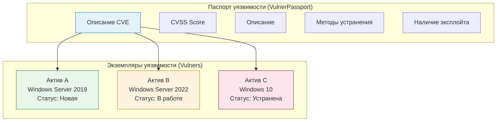
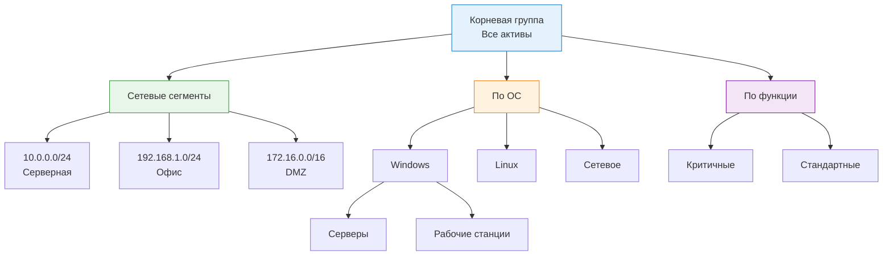
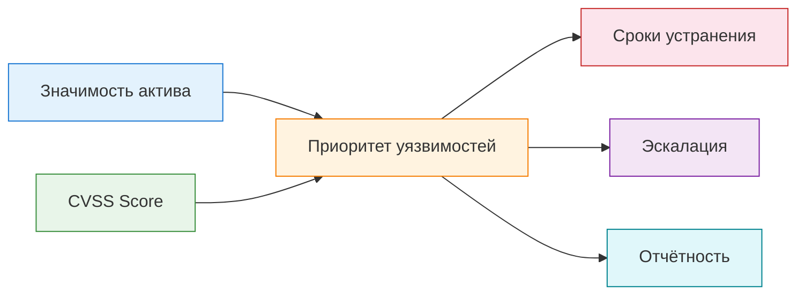

---
tags:
  - maxpatrol-vm
  - vulnerability-management
  - learning
  - stage-5
status: in-progress
created: 2026-08-25
---
# Этап 5 — Работа с активами и уязвимостями

> [!todo] Приоритет: ВЫСОКИЙ
> Ежедневная рутина оператора MaxPatrol VM.

---

## 5.1 Карточки активов

### Что такое карточка актива

> [!note] Карточка = рабочий инструмент
> Карточка актива — это основной интерфейс для анализа конкретного узла. Здесь собрана вся информация об активе: конфигурация, уязвимости, история изменений, принадлежность к группам.

### Структура карточки

> [!info] Как открывается карточка
> Из таблицы активов — щелчком по названию актива. Быстрый просмотр доступен в боковой панели **Актив**. Под именем актива располагаются сведения о его жизненном цикле, интегральная уязвимость и метрика значимости актива (низкая, средняя, высокая или не определена). Ниже — график интегральной уязвимости за выбранный период (по умолчанию за последние 7 дней), на котором отмечаются моменты получения новых данных об активе.

Под графиком расположены вкладки. Для сетевых узлов и служб каталогов Microsoft Active Directory отображаются вкладки **Сводка**, **Уязвимости**, **Конфигурация** и **Метрики CVSS**; для учётных записей — **Сводка**, **Конфигурация** и **Метрики CVSS** ([[Карточка актива]]). Отдельной вкладки «История» в карточке нет: сравнение конфигураций и экспорт истории выполняются отдельными действиями на странице **Активы** (см. ниже).

Интегральная уязвимость — это сумма оценок опасности всех уязвимостей актива. Для расчёта берётся оценка CVSS v3, а если её нет — CVSS v2.

#### Вкладка «Сводка» (Summary)

Краткая сводная информация об активе. Для актива типа «сетевой узел» здесь отображаются краткие сведения об аппаратном и программном обеспечении, **10 самых опасных уязвимостей**, сетевая конфигурация, а также список с оценками уязвимостей сетевых служб, ОС и ПО — из этих оценок складывается интегральная уязвимость актива. Для актива типа «служба каталогов Microsoft Active Directory» эти данные не отображаются. В карточке могут дополнительно показываться пользовательские поля модели актива и их значения ([[Карточка актива]]).

| Поле | Описание | Пример |
| --- | --- | --- |
| Имя / FQDN | DNS-имя хоста | `SRV-DB-01.corp.local` |
| IP-адрес | Текущий IP | `192.168.1.50` |
| ОС | Операционная система | `Windows Server 2022` |
| Тип хоста | Сервер / Рабочая станция | `Server` |
| Вендор | Производитель ОС | `Microsoft` |
| Значимость | Уровень критичности | `H` (High) |
| Последнее сканирование | Дата и время аудита | `2026-08-20 14:30` |
| Collector | Какой Collector собрал данные | `collector-01` |

#### Вкладка «Конфигурация» (Configuration)

Подробная информация об аппаратном и программном обеспечении:

- **Аппаратное обеспечение:** процессор, ОЗУ, диски, сетевые адаптеры
- **Установленное ПО:** полный список программ с версиями и путями установки
- **Сетевые настройки:** IP-адреса, подсети, шлюзы, DNS, открытые порты и сервисы
- **Пользователи:** локальные учётные записи и группы
- **Сервисы:** запущенные службы, тип запуска, учётные записи

#### Вкладка «Уязвимости» (Vulnerabilities)

Список всех уязвимостей, обнаруженных на данном активе. Вкладка содержит блоки **Уязвимости ОС и ПО** и **Уязвимости сетевых служб**; для каждой уязвимости указана оценка опасности и есть ссылка на CVE, по названию открывается карточка уязвимости.

| Столбец | Описание |
| --- | --- |
| Название | Наименование уязвимости |
| CVE | Идентификатор CVE |
| CVSS | Оценка тяжести (0-10) |
| Уровень опасности | Критический / Высокий / Средний / Низкий / Не определен |
| HasFix | Есть ли опубликованный способ устранения или снижения риска |
| Статус | Новая / В работе / Исправляется / Требуется проверка / Просрочено / Исключена / Устранена |
| ПО / Сервис | На что повлиял |

Статусы здесь и далее — документированные статусы экземпляров уязвимостей (см. [«Статусы обработки уязвимостей»](#статусы-обработки-уязвимостей) и [[Изменение статуса уязвимостей]]).

#### Вкладка «Метрики CVSS» (CVSS Metrics)

Контекстные метрики CVSS, которые можно настраивать:

> [!tip] Кастомизация CVSS
> Стандартный CVSS не учитывает контекст вашей сети. MaxPatrol VM позволяет изменять метрики CVSS для конкретного актива, чтобы оценка отражала реальный риск.

Значения метрик можно устанавливать и изменять как для актива, так и для группы, в которую он непосредственно входит. Эффективное значение определяется автоматически как **максимум** из значений, заданных для актива и его непосредственной родительской группы; значения метрик из групп, расположенных выше в иерархии, при расчёте метрик актива не учитываются.

| Метрика | Описание | Влияние |
| --- | --- | --- |
| Attack Vector (AV) | Вектор атаки | Network / Adjacent / Local / Physical |
| Attack Complexity (AC) | Сложность атаки | Low / High |
| Privileges Required (PR) | Необходимые привилегии | None / Low / High |
| User Interaction (UI) | Взаимодействие пользователя | None / Required |
| Scope (S) | Область воздействия | Unchanged / Changed |

#### История изменений (Change History)

> [!important] Аудит изменений
> История показывает, что изменилось в конфигурации актива между сканированиями. Это критично для отслеживания нежелательных изменений.

- Добавленное / удалённое ПО
- Изменения в конфигурации ОС
- Изменения в сетевых настройках
- Новые открытые порты / сервисы
- Изменения значимости

**Сравнение конфигураций во времени** — отдельное действие на странице **Активы**, а не вкладка карточки:

1. Главное меню → **Активы**, выберите один или несколько активов.
2. В панели инструментов нажмите кнопку сравнения → откроется окно **Сравнение конфигураций для \<N\> активов**.
3. Выберите два момента времени и нажмите **Сравнить**.
4. При необходимости включите **Только изменения**, чтобы убрать активы без изменений.

История конфигураций также доступна для экспорта в XML-формате (кнопка экспорта истории конфигураций в панели инструментов страницы **Активы**) — см. [[Сравнение конфигураций актива]] и [[Экспорт истории конфигурации актива]].

### Как найти карточку актива

1. **Через поиск:** введите IP, FQDN или имя в строке поиска
2. **Через группу активов:** откройте группу → найдите актив → нажмите на имя
3. **Через PDQL:** `Filter(Host.Fqdn = 'SRV-DB-01') | Select(@Host, Host.Fqdn, Host.IpAddress)` → кликните на результат
4. **Через строку поиска:** введите `SRV-DB-01` в строке поиска и преобразуйте условие поиска в условие фильтрации — это быстрее, чем писать PDQL
5. **Через уязвимость:** откройте паспорт уязвимости → вкладка «Активы» → выберите актив

---

## 5.2 Паспорта и экземпляры уязвимостей

### Модель данных: два уровня

> [!important] Ключевое понимание
> MaxPatrol VM различает два уровня представления уязвимостей: **паспорт** (описание) и **экземпляр** (конкретный случай на конкретном активе). Это не одно и то же.

Все уязвимости на активах типизированы: у каждого типа есть паспорт с общей справочной информацией обо всех уязвимостях, которые к нему принадлежат. Паспорт выглядит так же и содержит ту же информацию, что и карточка уязвимости, **за исключением** того, что в паспорте нет информации об уязвимостях на конкретных активах — не указаны даты и способы обнаружения, контекстные метрики CVSS ([[Карточка уязвимости]]).

В карточке уязвимости можно менять статус, отмечать уязвимость как важную и проставлять метки. Для уязвимости в карточке отображаются метки ключевых параметров: **Трендовая**, **Есть эксплойт** (для веб-приложений — **Эксплойт подтвержден**), **Удаленно**, **Можно исправить**, **Есть патч**, а также типы последствий эксплуатации — **RCE**, **LPE**, **DoS**.


```mermaid
graph TB
    subgraph "Паспорт уязвимости (VulnerPassport)"
        VP[Описание CVE]
        VP1[CVSS Score]
        VP2[Описание]
        VP3[Методы устранения]
        VP4[Наличие эксплойта]
    end

    subgraph "Экземпляры уязвимости (Vulners)"
        E1[Актив A<br/>Windows Server 2019<br/>Статус: Новая]
        E2[Актив B<br/>Windows Server 2022<br/>Статус: В работе]
        E3[Актив C<br/>Windows 10<br/>Статус: Устранена]
    end

    VP --> E1
    VP --> E2
    VP --> E3

    style VP fill:#e3f2fd,stroke:#1976d2
    style E1 fill:#e8f5e9,stroke:#388e3c
    style E2 fill:#fff3e0,stroke:#f57c00
    style E3 fill:#fce4ec,stroke:#c62828
```

### Паспорт уязвимости (VulnerPassport)

Паспорт — это **описание** уязвимости, не привязанное к конкретному активу.

| Поле | Описание | Пример |
| --- | --- | --- |
| CVE | Уникальный идентификатор | `CVE-2024-12345` |
| Название | Наименование уязвимости | `Remote Code Execution in OpenSSL` |
| Описание | Подробное описание | `Allows remote attackers to execute...` |
| CVSS Score | Оценка тяжести | `9.8` |
| Уровень | Critical / High / Medium / Low | `Critical` |
| CVSS Vector | Вектор оценки | `CVSS:3.1/AV:N/AC:L/PR:N/UI:N/S:U/C:H/I:H/A:H` |
| Наличие исправления | `@VulnerPassport.Metrics.HasFix` | `true` |
| Возможность эксплуатации | `@VulnerPassport.Metrics.Exploitable` | `true` |
| Эксплуатация по сети | `@VulnerPassport.Metrics.HasNetworkAttackVector` | `true` |
| Дата публикации | Когда CVE был опубликован | `2024-03-15` |
| Метод устранения | Рекомендации | `Обновить OpenSSL до версии 3.0.15` |
| Затронутое ПО | Какие продукты уязвимы | `OpenSSL 3.0.x < 3.0.15` |

### Экземпляр уязвимости (Vulner)

Экземпляр — это **конкретный случай** уязвимости на **конкретном активе**.

| Поле | Описание | Пример |
| --- | --- | --- |
| Актив | На каком хосте | `SRV-DB-01 (192.168.1.50)` |
| ПО / Сервис | Что уязвимо | `OpenSSL 3.0.12` |
| Путь установки | Куда установлено | `/usr/lib/x86_64-linux-gnu/` |
| Статус | Состояние обработки (`Host.@Vulners.Status`) | `Новая` |
| Срок устранения | До когда нужно исправить (`Host.@Vulners.DueTime`) | `2026-09-15` |
| Ответственный | Кто отвечает | `ИТ-отдел` |
| Компенсирующие меры | Временные решения | `Изоляция сегмента` |
| Дата обнаружения | Когда нашли | `2026-08-20` |

### Статусы обработки уязвимостей

> [!tip] Жизненный цикл уязвимости
> Каждая уязвимость проходит путь от обнаружения до закрытия. Статусы позволяют отслеживать этот процесс.

Статус хранится в `Host.@Vulners.Status` — по нему можно искать и фильтровать активы (см. [[Псевдонимы уязвимостей]], [[4. Язык PDQL]]).

| Статус (в интерфейсе) | Код `Host.@Vulners.Status` | Описание | Как назначается |
| --- | --- | --- | --- |
| **Новая** | `new` | Впервые обнаружена | Автоматически (при сканировании); также политикой при действии «Устранение вручную» |
| **В работе** | `inProgress` | Принята в работу | Оператор ИБ, вручную |
| **Исправляется** | `awaitingFix` | Запланировано устранение | Политика «Плановое устранение» или вручную |
| **Требуется проверка** | `stale` | Нужно проверить, удалось ли исправить | Автоматически: уязвимость не исправлена в указанный срок |
| **Просрочено** | `overdue` | Истёк запланированный срок исправления | Автоматически: при следующем сканировании уязвимость подтверждена |
| **Исключена** | `excluded` | Исключена из числа подлежащих устранению | Политика «Исключить» (с причиной и сроком) |
| **Устранена** | `fixed` | Исправлена | Автоматически (при проверке/сканировании) или оператор |
| — | `null` | Уязвимость не указана | |

Вместе со статусом фиксируется **тип устранения** (`Host.@Vulners.FixType`) и **срок** (`Host.@Vulners.DueTime`), а для исключения — **уточнение к статусу** (причина):

| Причина (псевдоним `@Vulners.StatusReason`) | Описание |
| --- | --- |
| `AcceptedAsLowRisk` | Низкий риск |
| `CannotFix` | Не может быть устранена |
| `CompensatingControl` | Приняты меры по её устранению |
| `FalsePositive` | Ложное срабатывание |
| `FalsePositiveResolved` | Ложное срабатывание устранено |
| `OfficialFix` | Устранена в штатном режиме либо после нового сканирования неактуальна |

> [!warning] Правила политик и ручные правки
> При ручном изменении уязвимостей правила политик перестают действовать по этим экземплярам. Вернуть управление правилами можно кнопкой **Использовать правила** — см. [[Использование правил]]. Массовое изменение статуса: страница **Активы** → поле `Host.@Vulners` → вкладка **Уязвимость** → **Изменить статус** ([[Изменение статуса уязвимостей]]).

### HasFix — есть ли исправление

| Значение | Описание | Действие |
| --- | --- | --- |
| `true` | Есть **опубликованные способы устранения или снижения риска**: рекомендации, компенсирующие меры, обновления, патчи и другие действия, предложенные производителями и сообществом | Устранение одним из указанных способов |
| `false` | Опубликованных способов нет | Компенсирующие меры или принятие риска |

> [!note] HasFix ≠ патч
> `HasFix = true` **не гарантирует наличие патча** — это могут быть и рекомендации, и компенсирующие меры. Рекомендуемый патч от экспертов Positive Technologies (тип исправления, отличный от `EndOfSupport`) отражается отдельной метрикой `HasPatch` — см. [[Псевдонимы уязвимостей]].

> [!warning] HasFix = false
> Если для уязвимости нет исправления, единственные варианты — компенсирующие меры (изоляция, экраны, отключение сервиса) или принятие риска. Это должно быть документально оформлено.

### Сроки устранения

Срок задаётся не «автоматически от CVE», а **правилом политики «Статусы уязвимостей»**:

1. В окне создания правила выбирается действие (**Плановое устранение** / **Устранение вручную** / **Исключить**) и **срок** — до какой даты уязвимость должна быть устранена или исключена.
2. Значение срока хранится в `Host.@Vulners.DueTime`, время последнего изменения статуса — в `Host.@Vulners.StatusUpdateTime`, комментарий — в `Host.@Vulners.StatusComment`.
3. Если до указанного срока уязвимость не устранена, статус автоматически становится **Требуется проверка** (`stale`), а при подтверждении проблемы при следующем сканировании — **Просрочено** (`overdue`).
4. Для исключения срок задаётся отдельно; по его истечении экземпляры по умолчанию планируются к устранению в течение **семи дней**.

Создание правил — см. [[Создание правила для статусов уязвимостей]] и [[Настройка политик]].

> [!note] Типовой пример документации
> Документация оговаривает: «Рекомендуем подбирать параметры политик в зависимости от стандартов, принятых в организации». Пример параметров из «Настройки политик»:

| Группа / тип активов | Действие и срок |
| --- | --- |
| Windows | Плановое устранение — **1 месяц** |
| Linux, Unix | Плановое устранение — **1 месяц** |
| Cisco (сетевое оборудование) | Устранение вручную |
| Тестовая инфраструктура | Исключить, уточнение к статусу: низкий риск — **12 месяцев** |

> [!tip] Как проверить сроки
> - Стандартный виджет **Плановое устранение и новые без политики** на дашборде «Управление уязвимостями»;
> - Запрос по псевдониму: `Filter(Host.@Vulners.DueTime < Now())`.

---

## 5.3 Группы активов

### Назначение групп

> [!note] Группировка — основа управления
> Группы активов позволяют:
> - Организовать инфраструктуру по функциональному / территориальному / бизнес-принципу
> - Назначать политики (значимость, статусы уязвимостей, сроки актуальности) на группы
> - Задавать значимость для групп
> - Фильтровать активы в отчётах и виджетах, а также в таблице активов
> - Управлять сроками устранения уязвимостей

### Статические группы

**Определение:** фиксированный набор активов, добавленных оператором вручную.

**Когда использовать:**
- Разовые проекты (миграция, редизайн сети)
- Временные группы («серверы для аудита», «теневые IT»)
- Активы, которые невозможно найти автоматически

**Как создать:**

1. Главное меню → **Активы** → на странице **Активы** открыть панель **Группы**.
2. Нажать кнопку создания группы.
3. В окне создания указать **Название**, **Расположение** и тип группы — **Статическая**.
4. Добавить активы вручную.

**Недостатки:**
- Требуют ручного обновления
- Новые активы не попадают автоматически
- Трудно поддерживать при большом количестве активов

### Динамические группы

> [!important] Динамические группы — сила MaxPatrol VM
> Динамическая группа определяется PDQL-запросом. При каждом обновлении данных система пересчитывает состав группы автоматически.

**Когда использовать:**
- Постоянные политики (сканирование, значимость, сроки)
- Автоматическая классификация новых активов
- Мониторинг изменений в инфраструктуре

**Как создать:**

1. Главное меню → **Активы** → панель **Группы** → кнопка создания группы.
2. В окне создания выбрать тип **Динамическая**.
3. В поле **Фильтр** ввести PDQL-запрос.

> [!warning] Доступ к активам
> Создать динамическую группу может только пользователь, у которого есть доступ ко **всем** активам системы. Создание групп описано в «Создание группы активов» (раздел «Работа с активами»).

**Примеры PDQL-запросов для динамических групп:**

| Группа | PDQL-запрос |
| --- | --- |
| Все серверы Windows | `WindowsHost and Host.HostType = 'Server'` |
| Рабочие станции Windows | `WindowsHost and Host.HostType = 'Desktop'` |
| Серверы Linux | `UnixHost` |
| Cisco-оборудование | `NetworkDeviceHost and NetworkDeviceHost.Vendor = 'Cisco'` |
| Серверы без сканирования > 30 дней | `Host.@AuditTime < Now() - 30days` |
| Ubuntu-серверы | `UnixHost and Host.OsName = 'Ubuntu'` |
| Активы с уязвимостью CVSS ≥ 9 | `Host[@Vulners.CVSS3Score >= 9]` |
| Активы с известным CVE-эксплойтом | `Host[@Vulners.Metrics.Exploitable]` |
| Активы вне подсети DMZ | `not Host.@IpAddresses.Item in 203.0.113.0/20` |
| Активы, появившиеся за неделю | `Host.@CreationTime >= Now() - 7days` |

> [!note] Почему здесь нет `SeverityRating`
> По официальному документу `@Vulners.SeverityRating` **не поддерживается в динамических группах** — условие с ним сработает в конвейере, но не в группе. Поэтому критичные уязвимости в группах выбираются по `@Vulners.CVSS3Score >= 9`, а группу «Критичные активы» нельзя строить по `@Importance`: используйте `@Vulners.CVSS3Score` или признаки актива (`Host.HostType`, ОС, ПО).

> [!warning] Ограничения псевдонимов для динамических групп
> `@IMPORTANCE`, `@CUMULATIVEVULNERABILITY`, `@VULNERS.SCORE`, `@VULNERS.SEVERITYRATING`, `@VULNERPASSPORT.SCORE`, контекстные оценки и векторы CVSS, а также псевдонимы групп (`@GROUPS*`) в динамических группах **не поддерживаются**. Поэтому группу «Критичные активы» нельзя построить по `@Importance` — используйте `@Vulners.CVSS3Score` или признаки актива (`Host.HostType`, ОС, ПО).
> Полный список ограничений — в [[PDQL — синтаксис по документации PT]], раздел 6.
> Полный синтаксис конвейера — в [[4. Язык PDQL]].

### Иерархия групп


```mermaid
graph TB
    ROOT["Корневая группа<br/>Все активы"] --> NET["Сетевые сегменты"]
    ROOT --> OS["По ОС"]
    ROOT --> FUNC["По функции"]

    NET --> NET1["10.0.0.0/24<br/>Серверная"]
    NET --> NET2["192.168.1.0/24<br/>Офис"]
    NET --> NET3["172.16.0.0/16<br/>DMZ"]

    OS --> WIN["Windows"]
    OS --> LIN["Linux"]
    OS --> NW["Сетевое"]

    WIN --> WIN_SRV["Серверы"]
    WIN --> WIN_WS["Рабочие станции"]

    FUNC --> CRIT["Критичные"]
    FUNC --> STD["Стандартные"]

    style ROOT fill:#e3f2fd,stroke:#1976d2
    style NET fill:#e8f5e9,stroke:#388e3c
    style OS fill:#fff3e0,stroke:#f57c00
    style FUNC fill:#f3e5f5,stroke:#7b1fa2
```

> [!tip] Рекомендация
> Используйте комбинацию: статические группы для логической структуры (иерархия), динамические — для автоматического наполнения.

---

## 5.4 Значимость активов

### Зачем нужна значимость

> [!important] Ключевой принцип
> Приоритизация уязвимостей напрямую зависит от значимости актива. Уязвимость CVSS 9.0 на тестовом стенде менее критична, чем уязвимость CVSS 7.0 на сервере с базой данных клиентов.

### Уровни значимости

| Уровень | Обозначение | Описание | Критичность |
| --- | --- | --- | --- |
| Высокая | **H** (High) | Критичные для бизнеса системы | Немедленное внимание |
| Средняя | **M** (Medium) | Важные, но заменяемые системы | Плановое устранение |
| Низкая | **L** (Low) | Вспомогательные системы | По возможности |
| Не определена | **ND** (Not Determined) | Значимость не назначена | Требует классификации |

> [!note] Названия в интерфейсе и в запросах
> В паспорте актива значимость отображается как **High / Medium / Low / Undefined**, в примерах запросов PDQL используются значения **H / M / L / ND** (см. [[Общие псевдонимы активов]]). Для новых активов значимость не определяется автоматически, поэтому она становится обязательным полем для классификации ([[Присвоение значимости активам]]).

### Методы присвоения значимости

#### Ручное присвоение

1. Главное меню → **Активы**, выбрать активы.
2. В панели инструментов нажать кнопку изменения значимости → окно **Изменение значимости <N> активов**.
3. Выбрать уровень значимости и нажать **Применить**.
4. Из карточки актива значимость задаётся кнопкой **Установить значимость** (или **Редактировать** → вкладка **Паспорт**).

**Недостаток:** не масштабируется при большом количестве активов.

#### Автоматическое через политику «Значимость активов»

> [!tip] Политика значимости
> Политика **«Значимость активов»** (раздел **Система → Политики**) — это набор правил, каждое из которых автоматически назначает значимость активам, соответствующим критериям. Создание правил — см. [[Создание правила для значимости активов]] и [[Страница «Политики»]].

**Пример правила:**

| Правило | Критерий | Значимость |
| --- | --- | --- |
| Серверы с БД | `Host.Softs.Name like '%SQL Server%'` | **H** |
| Контроллеры домена | `WindowsHost[HostRoles.Role = 'Domain Controller']` | **H** |
| Серверы Exchange | `Host.Softs.Name like '%Exchange%'` | **H** |
| Рабочие станции руководства | `WindowsHost` и пользовательское поле отдела = «Руководство» | **M** |
| Тестовые стенды | `Host.Fqdn like '%TEST%'` | **L** |
| Принтеры | `NetworkDeviceHost` и `@Devicetype` = принтер | **L** |

> [!note] Пример условия из документации
> В окне создания правила активы выбираются по отдельным активам, группам активов, динамическим группам и/или условию PDQL ([[Создание правила для значимости активов]]). Пример условия из документации: активы с общими критически важными ролями через запрос `Host.HostRoles.Role in ['DNS Server', 'Mail Server', 'DHCP Server']` — можно скопировать из стандартных запросов папки **Определение значимости** в панели **Запросы** на странице **Активы** ([[Настройка политик]]).

> [!warning] Не стройте условие на `@Importance`
> Критерий правила должен опираться на признаки актива — роль хоста, ПО, тип устройства, `@Vulners.CVSS3Score`. Справочник PDQL прямо указывает: «Псевдоним значимости не может использоваться для объединения активов в динамическую группу» ([[Общие псевдонимы активов]]); при этом в разделе «Настройка политик» приведён пример запроса динамической группы по `Host.@Importance` — документация противоречит сама себе, поэтому полагаться на `@Importance` в группах не стоит.

**Порядок создания правила:**

1. Главное меню → **Система → Политики** → политика **«Значимость активов»**.
2. Нажать **Создать правило** — настройка политик доступна только пользователям с правами администратора.
3. Указать название правила.
4. Выбрать активы: по отдельным активам, группам активов, динамическим группам и/или по PDQL-условию (кнопка **Вставить условие**).
5. Выбрать значимость в выпадающем списке.
6. Нажать **Сохранить**.
7. Нажать **Применить изменения** — до этого момента созданное правило не работает.

> [!note] Правила внутри политики
> Применение правил внутри политики происходит **согласно установленному порядку**, установленному при создании. Если в правилах есть ошибки, политика становится недействующей.

### Влияние значимости на уязвимости


```mermaid
graph LR
    A[Значимость актива] --> B[Приоритет уязвимостей]
    C[CVSS Score] --> B
    B --> D[Сроки устранения]
    B --> E[Эскалация]
    B --> F[Отчётность]

    style A fill:#e3f2fd,stroke:#1976d2
    style C fill:#e8f5e9,stroke:#388e3c
    style B fill:#fff3e0,stroke:#f57c00
    style D fill:#fce4ec,stroke:#c62828
    style E fill:#f3e5f5,stroke:#7b1fa2
    style F fill:#e0f7fa,stroke:#00838f
```

### Активы без назначенной значимости

> [!warning] Риск
> Активы без значимости не имеют приоритета. Уязвимости на них обрабатываются в последнюю очередь, что создаёт слепую зону.

**Как найти:**

- Стандартный запрос **«Значимость не задана»** из папки **Определение значимости** (панель **Запросы** на странице **Активы**).
- Значение состояния «не определена» в запросах — `ND` (в паспорте — `Undefined`).
- На дашборде «Управление уязвимостями» — виджет **Значимость активов**: он показывает общее число активов и количество активов, для которых значимость не указана.

> [!note] Ограничение `@IMPORTANCE`
> В справочнике PDQL указано, что псевдоним значимости **не может использоваться для объединения активов в динамическую группу** ([[Общие псевдонимы активов]]), поэтому поиск активов без значимости делается стандартным запросом или фильтром интерфейса, а не динамической группой.

Через PDQL можно оперировать только документированными значениями значимости:

```text
Filter(Host.@Importance in ['H', 'M'])
| Select(@Host, Host.Fqdn, Host.IpAddress, Host.@Importance)
```

> [!tip] Практический приём
> Разделите активы на две группы: те, что попали в фильтр по значимости `['H', 'M', 'L']`, и все остальные (`Host` минус первая группа). Второй набор и есть «без значимости». Либо заведите статическую группу и пополняйте её по итогам инвентаризации.

**Что делать:**
1. Найти активы без значимости (через фильтр интерфейса)
2. Проанализировать назначение каждого
3. Назначить значимость (вручную или через политику)
4. Настроить автоматическое назначение для новых активов — через политики значимости на признаках актива (роль, ПО, тип узла), а не через `@Importance`

---

## 5.5 Оценка уровня опасности по методике ФСТЭК

> [!important] Отдельная методика, не CVSS
> В MaxPatrol VM есть встроенная оценка уровня опасности уязвимостей на активах по методике ФСТЭК России. Расчёт выполняется по документу ФСТЭК «Методика оценки уровня критичности уязвимостей программных, программно-аппаратных средств» — см. [[Оценка уровня опасности уязвимостей на активах по методике ФСТЭК]].

**Подготовка — три группы активов:**

- группа активов, для которых рассчитывается уровень опасности;
- группа **«Периметр»** — активы на периметре, уязвимые и доступные из интернета;
- группа **«Критически важные активы»** — уязвимые активы, обеспечивающие критически важные функции и процессы.

Если группы статические, активы в них добавляются вручную.

**Формула:** `Total = Score × I × IiIat`, где `I = kK + lL + pP` (`Score` — оценка уязвимости из `Host.@Vulners.Score`).

| Коэффициент | Значения |
| --- | --- |
| `kK` — значимость функций актива | `0.4` — актив в группе «Критически важные активы»; `0.32` — `Server` / `Server Controller`; `0.32` — `Network Device`; `0.2` — `Desktop`; `0.2` — иначе |
| `lL` — распространённость уязвимости | по доле активов с тем же `KB` (`alikePercent`): `< 0.1` → `0.1`; `< 0.5` → `0.12`; `< 0.7` → `0.16`; иначе `0.2` |
| `pP` — принадлежность к периметру | `0.4` — актив в группе «Периметр»; иначе `0.2` |
| `Ii` — последствия эксплуатации | `RCE` → `0.5`, `LPE` → `0.5`, `DOS` → `0.26`, иначе `0.12` |
| `Iat` — актуальность | трендовая → `0.6`, есть эксплойт → `0.3`, иначе `0.1` |

**Уровни опасности (пороги `Total`):**

| Уровень | Условие |
| --- | --- |
| Critical | `> 8` |
| High | `≥ 5` |
| Medium | `≥ 2` |
| Low | меньше 2 |

> [!warning] Ограничения расчёта
> - В расчёт критичности принимаются только последствия **RCE**, **LPE**, **DOS**.
> - Повышение критичности уязвимостей сертифицированных средств выполняется при ручной верификации.

**Как выполнить:** главное меню → **Активы** → в панели **Группы** выбрать нужную группу → в панели фильтрации открыть поле ввода → вставить PDQL-запрос из документации (с `calc(...)` по коэффициентам выше) → **Выполнить**. В таблице появятся «Оценка уязвимости» и «Уровень критичности уязвимости», записи отсортированы по убыванию оценки.

---

## 5.6 Топология сети и карта сети

### Что показывает карта сети

> [!note] Страница «Топология»
> MaxPatrol VM «собирает информацию об активах в сети и представляет ее в виде карты» — карта открывается из главного меню на странице **Топология** ([[Экспорт топологии активов]]). На ней отображаются активы, объекты типа «Сеть» и связи между активами; настроенную топологию можно экспортировать в графическом виде.

**Обозначения на карте** ([[Просмотр информации об активе]]):

| Цвет значка | Что означает |
| --- | --- |
| Тёмно-серый | Актив по умолчанию |
| Серый | Активы и связи, не удовлетворяющие условиям фильтра |
| Синий | Выбранный на карте актив |

- Кнопки сворачивания и разворачивания скрывают/показывают содержимое объектов типа «Сеть».
- По нажатию на актив открывается окно с базовой информацией — **мини-карточка актива**, из неё ссылка **Карточка актива** ведёт к просмотру состояния актива.
- Для объекта типа «Сеть» в окне есть вкладки **Свойства** (параметры сети) и **Активы** (список входящих активов).
- По нажатию на связь между активами открывается окно с типом активов, их параметрами и информацией о самой связи.
- Вид карты сети и расположение активов на ней сохраняются для каждой учётной записи пользователя.

### Настройка отображения активов на карте

В панели инструментов страницы **Топология** — кнопка **Настройка отображения** ([[Настройка отображения активов на карте сети]]):

- **Прокрутка выключена** — на карте видны все активы и связи между ними; карта занимает всю рабочую область, масштаб зависит от количества активов.
- **Прокрутка включена** — масштаб отображения увеличивается, карта выходит за пределы рабочей области; в поле **Показывать по** задаётся количество узлов одной сети, отображаемых одновременно (по умолчанию — не более **20** узлов, входящих в одну сеть).
- Можно выключить отображение названий узлов и сетей.
- Расположение активов меняется курсором; вернуть вид карты по умолчанию можно кнопкой **Расположить узлы по умолчанию**.

### Достижимость: «Куда открыт доступ» и «Откуда открыт доступ»

> [!important] Зачем нужен расчёт достижимости
> Расчёт показывает, какие маршруты реально существуют между активами — по парам «протокол — порт», с правилами маршрутизации, трансляции сетевых адресов (NAT) и списков управления доступом (ACL). Это основа для анализа векторов атак и проверки сегментации сети.

| Пункт меню **Расчет достижимости** | Что считается | Блоки окна расчёта |
| --- | --- | --- |
| **Куда открыт доступ** ([[Расчет достижимости от актива]]) | Достижимость от выбранного актива и (или) группы активов к другому активу, группе активов, сетевому адресу или диапазону сетевых адресов | **Источники** — откуда считаем, **Цели** — конечные точки маршрутов |
| **Откуда открыт доступ** ([[Расчет достижимости к активу]]) | Достижимость от актива, группы активов или всех активов и сетевых адресов к выбранному активу и (или) группе активов | **Цели** — к чему считаем, **Источники** — начальные точки маршрутов (активы, группы активов или все активы и сетевые адреса) |

**Общий ход расчёта:**

1. Главное меню → **Топология** → выбрать актив на карте сети.
2. В панели инструментов нажать **Расчет достижимости** и выбрать **Куда открыт доступ** или **Откуда открыт доступ**.
3. При необходимости уточнить протоколы и порты цели по ссылке **Уточнить протоколы и порты цели**.
4. Заполнить блок параметров (**Цели** или **Источники**) и нажать **Рассчитать маршруты**.
5. Результат — вкладка **Доступные**: список доступных целей (или источников) и маршрутов к ним; способ группировки маршрутов выбирается кнопкой в панели инструментов.
6. В раскрывающемся блоке выбранной конечной или начальной точки маршрута отображаются маршруты, сгруппированные по парам «протокол — порт»; для маршрутов также могут показываться правила маршрутизации, NAT и ACL.
7. Маршрут достижимости отображается и на карте сети. Тот же расчёт доступен по кнопке **Расчет достижимости** на вкладке **Актив** страницы **Активы**.

### Разметка пограничных сетей и имена сетей

**Пограничные сети** ([[Разметка пограничных сетей]]):
- Зачем: «для расчета векторов атак на IT-инфраструктуру организации важно понимать, какие сети находятся на границе инфраструктуры».
- Для объектов типа «Сеть» устанавливается признак **Пограничная сеть**, такие объекты отмечаются на карте отдельным значком.
- По умолчанию все объекты типа «Сеть» имеют признак **Внутренняя сеть**.
- Как сделать: **Топология** → выбрать сеть → в меню объекта выбрать **Пограничная сеть**.

**Имена сетей** ([[Изменение имени сети]]):
- Для любого объекта типа «Сеть» можно указать имя — на карте под значком объекта отображается имя, а рядом в скобках — адрес.
- Как сделать: **Топология** → выбрать сеть → меню → **Изменить** → в поле **Имя сети** ввести имя → **Сохранить**.

### Экспорт топологии активов

> [!tip] Графический файл вместо скриншота
> «Вы можете экспортировать настроенную топологию сети в виде графического файла для последующего анализа» ([[Экспорт топологии активов]]).

1. Главное меню → **Топология**.
2. В панели инструментов нажать кнопку **Скачать** и выбрать формат графического файла: **PNG** или **SVG**.

### Переход к событиям и инцидентам с карты сети

Из карты сети можно перейти к работе с событиями и инцидентами, связанными с выбранным активом ([[Переход к работе с событиями и инцидентами с карты сети]]):

1. Главное меню → **Топология** → выбрать актив на карте сети → откроется окно с информацией об активе.
2. Нажать кнопку меню и выбрать пункт **Найти события** → откроется страница **События** со списком событий, связанных с этим активом.
3. Тем же меню пункт **Найти инциденты** — переход к работе с инцидентами по активу.

---

## Краткое резюме Этапа 5

| Аспект | Ключевая мысль |
| --- | --- |
| Карточка актива | Сводка → Уязвимости → Конфигурация → Метрики CVSS (для учётных записей — без «Уязвимостей») |
| Паспорт уязвимости | Описание CVE: CVSS, методы устранения, наличие исправления и эксплойта |
| Экземпляр уязвимости | Конкретный случай на конкретном активе: статус, срок, ответственный |
| Статусы | Новая → В работе → Исправляется → Требуется проверка → Просрочено / Устранена / Исключена |
| Наличие исправления | Определяет стратегию: патчинг или компенсирующая мера |
| Статические группы | Ручное управление; для проектов и временных задач |
| Динамические группы | PDQL-запрос; автоматическое обновление состава |
| Значимость | H / M / L / ND; определяет приоритет и сроки устранения |
| Политики значимости | Автоматическое назначение значимости правилами политики «Значимость активов» |
| Оценка по методике ФСТЭК | `Total = Score × I × IiIat`; уровни: `> 8` Critical, `≥ 5` High, `≥ 2` Medium; нужны группы «Периметр» и «Критически важные активы» |

---

## Связанные заметки

- [[4. Язык PDQL]] — предыдущий этап
- [[6. Автоматизация и политики]] — следующий этап
- [[План изучения]] — общий план обучения

## Ресурсы

- [Справочный портал MaxPatrol VM](https://help.ptsecurity.com/ru-RU/projects/vm/2.8/help)
- [[Выявление дублирования уязвимостей]]
- [Курс Positive Education: Применение MaxPatrol VM](https://edu.ptsecurity.com/kursy-po-ekspluatacii-productov-pt/mp-vm)
- [Бесплатный курс TS University: MaxPatrol VM Getting Started](https://university.tssolution.ru/maxpatrol-vm-getting-started/obzor-vozmozhnostej)

---

*Следующий этап: [[6. Автоматизация и политики]]*

