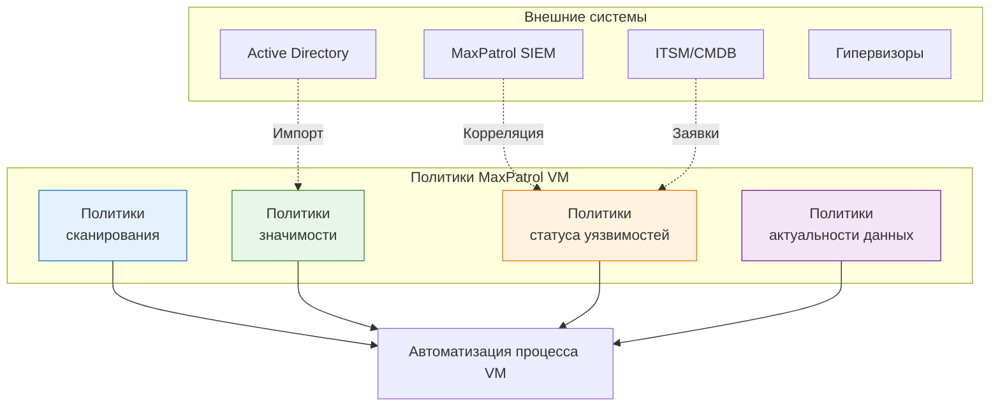
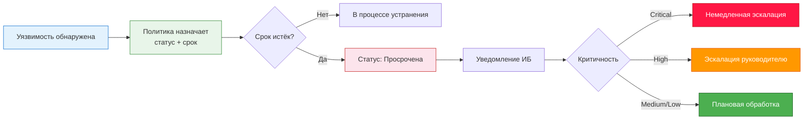
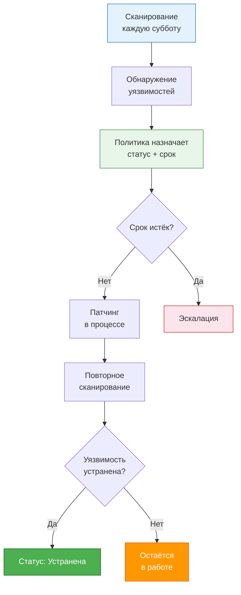

---
tags:
  - maxpatrol-vm
  - vulnerability-management
  - learning
  - stage-6
status: в-progress
created: 2026-08-25
stage: 6
---

# Этап 6 — Автоматизация и политики

> [!todo] Приоритет: СРЕДНИЙ (переход на продвинутый уровень)
> Автоматизация — то, что отличает «сканер» от «системы управления».

---

## Обзор: зачем нужна автоматизация

> [!warning] Проблема масштаба
> Одна рабочая станция Windows в среднем содержит 500-1000 уязвимостей. При 2000-3000 активах суммарное количество уязвимостей исчисляется миллионами. Вручную обработать такое невозможно — нужна автоматизация.

Политики MaxPatrol VM позволяют:
- Автоматически назначать значимость активам
- Автоматически запускать сканирование по расписанию
- Автоматически назначать статусы и сроки устранения уязвимостей
- Автоматически помечать устаревшие данные
- Интегрироваться с внешними системами (SIEM, ITSM, AD)



---

## 6.1 Политики сканирования

### Назначение

Политики сканирования автоматизируют запуск задач по сбору данных и аудиту по расписанию, привязывая их к конкретным группам активов.

### Как создать политику сканирования

**Пошаговый процесс:**

1. Перейдите в **Сканирование → Политики сканирования**
2. Нажмите **Создать политику**
3. Заполните параметры:

| Параметр | Описание | Пример |
| --- | --- | --- |
| Название | Понятное имя политики | «Еженедельное сканирование серверов H» |
| Описание | Что делает политика | Автоматический аудит критичных серверов |
| Группа активов | Целевая группа | «Критичные серверы» |
| Профиль сканирования | Какой профиль использовать | «Windows Server Full» |
| Учётные записи | Привязанные УЗ | Администратор домена |
| Расписание | Когда запускать | Каждую субботу в 02:00 |
| Приоритет | Важность задачи | Высокий |

### Типовые политики сканирования

| Политика | Группа | Частота | Профиль | Приоритет |
| --- | --- | --- | --- | --- |
| Критичные серверы | H-серверы | Еженедельно | Полный аудит | Высокий |
| Серверы M/L | Остальные серверы | Ежемесячно | Стандартный | Нормальный |
| Рабочие станции | Windows WS | Ежемесячно | Базовый | Нормальный |
| Сетевое оборудование | Network devices | Ежемесячно | Специализированный | Нормальный |
| Вся сеть (Discovery) | Все активы | Еженедельно | Discovery top-1000 | Низкий |
| Новые активы | ND-значимость | Ежедневно | Базовый | Высокий |

### Расписание

> [!tip] Разделяйте по времени
> Не запускайте все политики одновременно — это создаст нагрузку на сеть и Collector'ы. Распределяйте по дням и часам.

**Пример расписания на неделю:**

| День | Время | Политика |
| --- | --- | --- |
| Понедельник | 02:00 | Критичные серверы |
| Вторник | 02:00 | Серверы M/L |
| Среда | 02:00 | Сетевое оборудование |
| Четверг | 02:00 | Рабочие станции |
| Пятница | Выходной | — |
| Суббота | 02:00 | Вся сеть (Discovery) |
| Воскресенье | 02:00 | Новые активы |

---

## 6.2 Политики обработки уязвимостей

### Назначение

> [!important] Ядро автоматизации
> Политики обработки уязвимостей переносят ваши договорённости с ИТ-отделом в MaxPatrol VM. Вместо ручного назначения статусов — автоматическое.

Этот тип политик определяет:
- Какие уязвимости считать «принятыми к обработке»
- Какие статусы назначать
- Какие сроки устанавливать
- Что делать при нарушении сроков

### Типы политик обработки

#### Плановое устранение (патчинг)

> [!note] Самый распространённый тип
> Переносит договорённости по патчингу между ИБ и ИТ в MaxPatrol VM.

**Пример: «Патчинг Windows-серверов»**

| Параметр | Значение |
| --- | --- |
| Название | Патчинг Windows-серверов |
| Фильтр активов | `WindowsHost.HostType = 'Server'` |
| Фильтр уязвимостей | `Host.@NodeVulners.Metrics.HasFix = true` |
| Действие | Плановое устранение |
| Срок исправления | 1 месяц |
| Рассчитывать срок от | Даты публикации CVE |
| Статус при назначении | Исправляется |

**Пример: «Патчинг рабочих станций»**

| Параметр | Значение |
| --- | --- |
| Название | Патчинг Windows рабочих станций |
| Фильтр активов | `WindowsHost.HostType = 'Desktop'` |
| Фильтр уязвимостей | `Host.@NodeVulners.Metrics.HasFix = true` |
| Действие | Плановое устранение |
| Срок исправления | 2 месяца |
| Рассчитывать срок от | Даты публикации CVE |
| Статус при назначении | Исправляется |

**Пример: «Патчинг PostgreSQL»**

| Параметр | Значение |
| --- | --- |
| Название | Патчинг PostgreSQL |
| Фильтр активов | Все хосты |
| Фильтр уязвимостей | `Host.Softs.Name like '%PostgreSQL%' and Host.Softs.@Vulners.Metrics.HasFix = true` |
| Действие | Плановое устранение |
| Срок исправления | 2 недели |

#### Исключение уязвимостей

> [!tip] Исключения — не признак слабости
> Исключение уязвимостей — осознанное решение бизнеса принять риск. Это нормальная часть процесса VM.

**Пример: «Исключение тестового сегмента»**

| Параметр | Значение |
| --- | --- |
| Название | Исключение тестового сегмента |
| Фильтр активов | Группа «10.10.41.0/24» (тестовый сегмент) |
| Фильтр уязвимостей | Все уязвимости |
| Действие | Исключена |
| Причина | Тестовые стенды с малым сроком жизни |

#### Устранение вручную

**Пример: «Уязвимости без исправления»**

| Параметр | Значение |
| --- | --- |
| Название | Уязвимости без фикса — ручной анализ |
| Фильтр активов | Все хосты |
| Фильтр уязвимостей | `Host.@NodeVulners.Metrics.HasFix = false` |
| Действие | В обработке |
| Срок | Не установлен (анализ вручную) |

### Статусы, назначаемые политиками

| Статус | Когда назначается | Что означает |
| --- | --- | ---|
| **Исправляется** | Политика «Плановое устранение» | Принято к обработке, ожидает патчинга |
| **Исключена** | Политика «Исключение» | Решение не устранять |
| **В обработке** | Ручное назначение или политика | Анализируется |
| **Устранена** | Автоматически при повторном сканировании | Патч установлен, уязвимость закрыта |
| **Просрочена** | Автоматически при истечении срока | Срок устранения истёк |

### Эскалация при нарушении сроков



---

## 6.3 Политики значимости

### Назначение

Автоматическое присвоение значимости активам на основе PDQL-правил. Решает проблему «ND-значимости» — активов, для которых значимость не определена.

### Примеры политик значимости

| Политика | PDQL-фильтр активов | Значимость | Приоритет |
| --- | --- | --- | --- |
| Контроллеры домена | `Host.HostRoles.Role = 'Domain Controller'` | H | 1 (высший) |
| Серверы с БД | `Host.Softs.Name like '%SQL Server%' or Host.Softs.Name like '%PostgreSQL%' or Host.Softs.Name like '%Oracle%'` | H | 1 |
| Межсетевые экраны | `NetworkDeviceHost.HostRoles.Role = 'Firewall'` | H | 1 |
| Серверы Exchange | `Host.Softs.Name like '%Exchange%'` | H | 1 |
| Маршрутизаторы | `NetworkDeviceHost.HostRoles.Role = 'Router'` | M | 2 |
| Коммутаторы | `NetworkDeviceHost.HostRoles.Role = 'Switch'` | M | 2 |
| Рабочие станции | `WindowsHost.HostType = 'Desktop'` | L | 3 |
| Принтеры | `NetworkDeviceHost.Type = 'Printer'` | L | 3 |
| Тестовые стенды | `Host.Name contains 'TEST'` | L | 3 |

### Порядок назначения

> [!note] Приоритет политик
> Если актив попадает под несколько политик, побеждает политика с **наименьшим** номером приоритета (1 > 2 > 3). При равных приоритетах — политика, созданная позже.

### Мониторинг

- Виджет **«Значимость активов»** показывает распределение по уровням
- Отслеживайте количество активов с ND — они требуют классификации
- Регулярно пересматривайте политики (раз в квартал)

---

## 6.4 Политики актуальности данных

### Назначение

> [!warning] Устаревшие данные = слепая зона
> Если последнее сканирование активу было 3 месяца назад, данные о нём могут быть неактуальны. Новые уязвимости, изменения конфигурации, новый ПО — всё это не будет учтено.

Политики актуальности данных контролируют срок годности результатов сканирования.

### Как работает

| Параметр | Описание | Пример |
| --- | --- | --- |
| Группа активов | Для каких активов | Критичные серверы |
| Срок актуальности данных | Через сколько дней данные считаются устаревшими | 30 дней (аудит), 7 дней (пентест) |
| Действие при устаревании | Что делать | Уведомление, автоматическое сканирование |

### Типовые политики

| Политика | Группа | Срок аудита | Срок пентеста |
| --- | --- | --- | --- |
| Критичные серверы | H-серверы | 30 дней | 90 дней |
| Серверы M/L | Остальные серверы | 60 дней | 180 дней |
| Рабочие станции | Windows WS | 90 дней | Не применяется |
| Сетевое оборудование | Network devices | 60 дней | Не применяется |

---

## 6.5 Интеграция с другими системами

### MaxPatrol SIEM

> [!tip] Синергия продуктов
> MaxPatrol SIEM + MaxPatrol VM = полная картина: события безопасности (что происходит) + уязвимости (где слабые места).

| Направление | Описание |
| --- | --- |
| SIEM → VM | События безопасности обогащают данные об активах |
| VM → SIEM | Информация об уязвимостях для корреляции с событиями |
| Корреляция | Обнаружение атак с учётом наличия уязвимостей на целевых активах |
| Обогащение событий | Событие крутится вокруг уязвимого сервера → повышение приоритета |

**Кейс:** SIEM видит массовый login fail на сервере. VM показывает, что на этом сервере есть критичная уязвимость с эксплойтом. Комбинация = приоритет инцидента повышается до «Критичный».

### Active Directory

| Направление | Описание |
| --- | --- |
| AD → VM | Импорт структуры OU, компьютеров, пользователей |
| Автоматическая синхронизация | По расписанию (рекомендуется: ежедневно) |
| Группы из AD | Используются как основа для динамических групп |
| Учётные записи | Из AD для сканирования доменных систем |

### ITSM/CMDB

| Направление | Описание |
| --- | --- |
| VM → ITSM | Создание заявок на устранение уязвимостей |
| ITSM → VM | Обновление статусов (в обработке → исправлено) |
| Отслеживание | Контроль выполнения заявок |

### Гипервизоры (VMware, Hyper-V)

| Направление | Описание |
| --- | --- |
| Гипервизор → VM | Импорт виртуальных машин, конфигураций |
| Обнаружение | Автоматическое выявление новых ВМ |
| Контроль | Проверка несанкционированных ВМ |

### HashiCorp Vault

| Направление | Описание |
| --- | --- |
| Vault → VM | Хранение учётных записей для сканирования |
| Безопасность | Пароли не хранятся в MaxPatrol VM, берутся из Vault |

---

## Практический пример: полный цикл политики

> [!example] Кейс: патчинг Windows-серверов
> Полный пример создания цепочки политик для автоматического управления уязвимостями Windows-серверов.

### Шаг 1 — Динамическая группа

```
Название: Windows-серверы
PDQL: @WindowsHost and WindowsHost.HostType = 'Server'
```

### Шаг 2 — Политика значимости

```
Название: Серверы — высокая значимость
Фильтр: Host.HostRoles.Role = 'Domain Controller' or Host.Softs.Name like '%SQL Server%'
Значимость: H
Приоритет: 1
```

### Шаг 3 — Политика сканирования

```
Название: Еженедельный аудит Windows-серверов
Группа: Windows-серверы
Профиль: Windows Server Full
Расписание: Каждую субботу в 02:00
Приоритет: Высокий
```

### Шаг 4 — Политика актуальности

```
Название: Актуальность данных Windows-серверов
Группа: Windows-серверы
Срок аудита: 30 дней
Действие: Уведомление + автоматическое сканирование
```

### Шаг 5 — Политика обработки

```
Название: Патчинг Windows-серверов
Группа: Windows-серверы
Фильтр уязвимостей: Host.@NodeVulners.Metrics.HasFix = true
Действие: Плановое устранение
Срок: 1 месяц от даты публикации
Статус: Исправляется
```

### Шаг 6 — Мониторинг

```
Виджет: «Уязвимости Windows-серверов»
Фильтр: Группа «Windows-серверы» + статус «Просрочена»
Цель: 0 просроченных уязвимостей
```

### Результат



---

## Краткое резюме Этапа 6

| Аспект | Ключевая мысль |
| --- | --- |
| Политики сканирования | Автоматизация запуска по расписанию, привязка к группам |
| Политики обработки | Автоматическое назначение статусов, сроков, эскалация |
| Политики значимости | Автоматическое назначение значимости по PDQL |
| Политики актуальности | Контроль свежести данных сканирования |
| Интеграция SIEM | Корреляция событий и уязвимостей |
| Интеграция AD | Импорт структуры, синхронизация |
| Интеграция ITSM | Создание заявок на устранение |

---

## Связанные заметки

- [[Этап 5 — Работа с активами и уязвимостями]] — предыдущий этап
- [[7. Визуализация, отчётность и мониторинг]] — следующий этап
- [[План изучения MaxPatrol VM]] — общий план обучения

## Ресурсы

- [Справочный портал MaxPatrol VM](https://help.ptsecurity.com/ru-RU/projects/vm/2.8/help/4980710795)
- [TS University: Построение процесса управления уязвимостями](https://university.tssolution.ru/maxpatrol-vm-getting-started/postroenie-processa-upravleniya-uyazvimostyami)
- [Курс Positive Education: Применение MaxPatrol VM](https://edu.ptsecurity.com/kursy-po-ekspluatacii-productov-pt/mp-vm)

---

*Следующий этап: [[7. Визуализация, отчётность и мониторинг]]*
