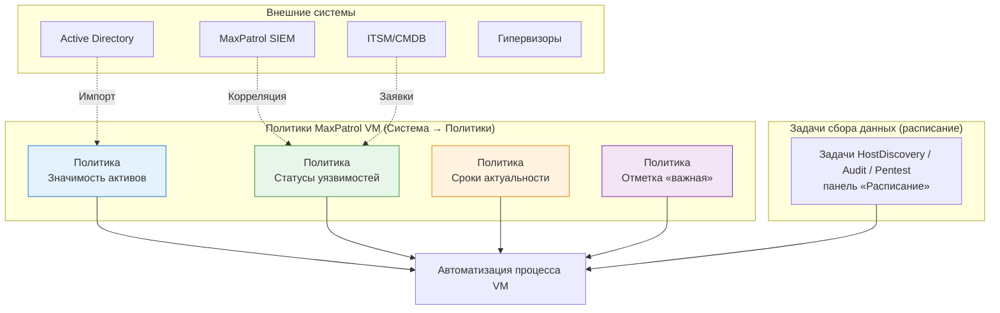
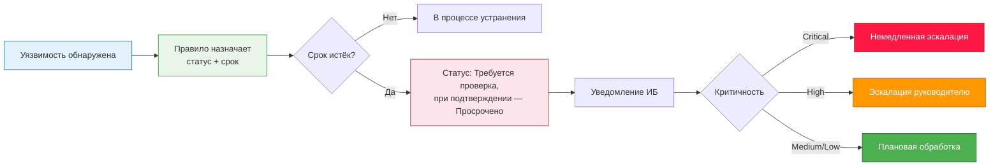
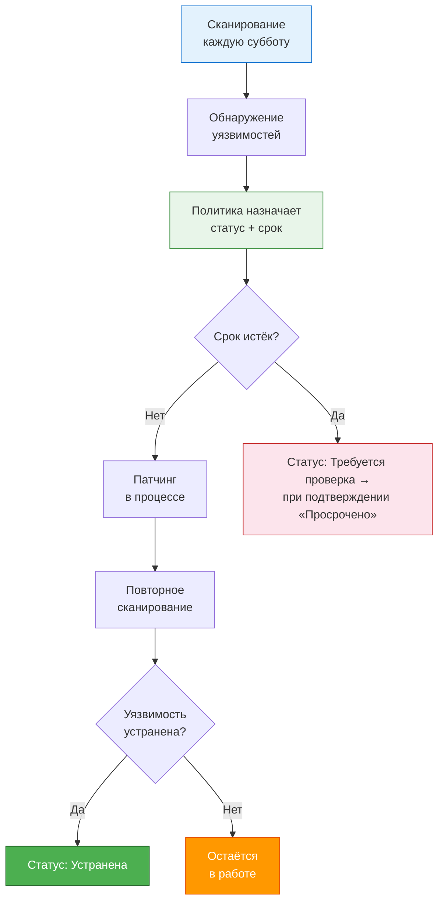

---
tags:
  - maxpatrol-vm
  - vulnerability-management
  - learning
  - stage-6
status: в-progress
created: 2026-08-25
stage: 6
---

# Этап 6 — Автоматизация и политики

> [!todo] Приоритет: СРЕДНИЙ (переход на продвинутый уровень)
> Автоматизация — то, что отличает «сканер» от «системы управления».

---

## Обзор: зачем нужна автоматизация

> [!warning] Проблема масштаба
> Одна рабочая станция Windows в среднем содержит 500-1000 уязвимостей. При 2000-3000 активах суммарное количество уязвимостей исчисляется миллионами. Вручную обработать такое невозможно — нужна автоматизация.

Политики MaxPatrol VM позволяют:
- Автоматически назначать значимость активам
- Автоматически назначать статусы и сроки устранения уязвимостей (а также отметку «важная»)
- Автоматически отслеживать сроки актуальности данных сканирования
- Плюс к этому сами задачи сбора данных запускаются по расписанию (панель **Расписание** в задаче) — см. [[Создание задачи на сбор данных]]
- Интегрироваться с внешними системами (SIEM, ITSM, AD)

> [!note] Важно: «политик сканирования» в MaxPatrol VM 2.8 нет
> Управление периодичностью и параметрами сканирования — это свойство **задач на сбор данных** (профиль, расписание, группы активов), а не политик. Настройка политик (раздел **Система → Политики**) и создание задач сбора данных — независимые механизмы.


```mermaid
graph TB
    subgraph "Политики MaxPatrol VM (Система → Политики)"
        P1[Политика<br/>Значимость активов]
        P2[Политика<br/>Статусы уязвимостей]
        P3[Политика<br/>Сроки актуальности]
        P4[Политика<br/>Отметка «важная»]
    end

    subgraph "Задачи сбора данных (расписание)"
        T1[Задачи HostDiscovery / Audit / Pentest<br/>панель «Расписание»]
    end

    subgraph "Внешние системы"
        SIEM[MaxPatrol SIEM]
        AD[Active Directory]
        ITSM[ITSM/CMDB]
        VMWARE[Гипервизоры]
    end

    P1 --> A[Автоматизация процесса VM]
    P2 --> A
    P3 --> A
    P4 --> A
    T1 --> A

    AD -.->|Импорт| P1
    SIEM -.->|Корреляция| P2
    ITSM -.->|Заявки| P2

    style P1 fill:#e3f2fd,stroke:#1976d2
    style P2 fill:#e8f5e9,stroke:#388e3c
    style P3 fill:#fff3e0,stroke:#f57c00
    style P4 fill:#f3e5f5,stroke:#7b1fa2
```

---

## 6.1 Планирование сбора данных (задачи, а не политики)

### Назначение

Периодичность сканирования задаётся **в самих задачах сбора данных** (HostDiscovery, Audit, Pentest, веб-сканер и др.): задача привязывается к группам активов и профилю модуля, а в панели **Расписание** включается и настраивается автоматический запуск. См. [[Создание задачи на сбор данных]] (у [[Запуск задач по расписанию]] речь идёт о задачах на выпуск отчётов и экспорт записей).

### Как создать задачу на сбор данных

**Пошаговый процесс:**

1. Перейдите в **Сбор данных → Задачи** — откроется страница **Задачи по сбору данных**.
2. Нажмите **Создать задачу** и выберите пункт **Сбор данных**.
3. Заполните параметры задачи — метод сбора данных определяется выбранным **профилем** (аудит, пентест, обнаружение узлов и т. д.):

| Параметр | Описание | Пример |
| --- | --- | --- |
| Название | Понятное имя задачи | «Еженедельное сканирование серверов H» |
| Расположение | Группа задач; если не выбрана — «Задачи вне групп» | «Сканирование серверов» |
| Профиль | Профиль модуля (задаёт метод сбора данных) | «Windows Server Full» |
| Учётная запись | УЗ для сбора данных (по умолчанию — из профиля) | Администратор домена |
| Коллекторы | Какие MP 10 Collector собирают данные | `collector-01` |
| Цели сбора данных | Группы активов, отдельные активы, сетевые адреса (вкладка **Исключить** — для исключений) | Группа «Критичные серверы» |
| Расписание | Когда запускать (панель **Расписание**) | Каждую субботу в 02:00 |
| Приоритет | Важность задачи | Высокий |

Если в системе несколько инфраструктур, дополнительно выбирается **Инфраструктура**. Если требуется ускорить сканирование, включается флажок **Выполнить обнаружение узлов до начала сбора данных**. Создание и изменение задачи — см. [[Создание задачи на сбор данных]] и [[Настройка задачи]].

> [!tip] Пример из документации
> «Если требуется, в панели **Расписание** включите и настройте автоматический запуск задачи» — это и есть «политика сканирования» в понимании многих пользователей. Никакой отдельной сущности «политика сканирования» в 2.8 нет (проверено по разделам «Сбор данных», «Политики» и «Главное меню»).

### Типовой график задач сбора данных (рекомендация)

> Пример графика, чтобы разнести нагрузку между задачами. Параметры подбирайте под свою инфраструктуру.

| Политика | Группа | Частота | Профиль | Приоритет |
| --- | --- | --- | --- | --- |
| Критичные серверы | H-серверы | Еженедельно | Полный аудит | Высокий |
| Серверы M/L | Остальные серверы | Ежемесячно | Стандартный | Нормальный |
| Рабочие станции | Windows WS | Ежемесячно | Базовый | Нормальный |
| Сетевое оборудование | Network devices | Ежемесячно | Специализированный | Нормальный |
| Вся сеть (Discovery) | Все активы | Еженедельно | Discovery top-1000 | Низкий |
| Новые активы | ND-значимость | Ежедневно | Базовый | Высокий |

### Расписание

> [!tip] Разделяйте по времени
> Не запускайте все политики одновременно — это создаст нагрузку на сеть и Collector'ы. Распределяйте по дням и часам.

**Пример расписания на неделю:**

| День | Время | Политика |
| --- | --- | --- |
| Понедельник | 02:00 | Критичные серверы |
| Вторник | 02:00 | Серверы M/L |
| Среда | 02:00 | Сетевое оборудование |
| Четверг | 02:00 | Рабочие станции |
| Пятница | Выходной | — |
| Суббота | 02:00 | Вся сеть (Discovery) |
| Воскресенье | 02:00 | Новые активы |

---

## 6.2 Политика «Статусы уязвимостей»

### Назначение

> [!important] Ядро автоматизации
> Политика переносит ваши договорённости с ИТ-отделом в MaxPatrol VM. Вместо ручного назначения статусов — автоматическое.

Эта политика (раздел **Система → Политики**, [[Страница «Политики»]]) определяет:
- Какие уязвимости считать «принятыми к обработке»
- Какой **статус** (`Host.@Vulners.Status`) и какой **тип устранения** (`Host.@Vulners.FixType`) назначать
- До какой даты уязвимость должна быть устранена или исключена (`Host.@Vulners.DueTime`)
- Что происходит по истечении срока (статус «Требуется проверка» → «Просрочено»)

### Действия правила

Правило политики состоит из **фильтра уязвимостей** (PDQL) и выбранного **действия** — одного из трёх документированных:

| Действие | Назначаемый статус | Срок | Комментарий |
| --- | --- | --- | --- |
| **Плановое устранение** | Исправляется (`awaitingFix`) | срок исправления | для уязвимостей, которые планируется исправить |
| **Устранение вручную** | Новая (`new`) | — | для уязвимостей, решение по которым принимает человек; далее оператор может вручную назначить статус **В работе**, **Исправляется** или **Исключена** |
| **Исключить** | Исключена (`excluded`) | срок исключения | с причиной («Уточнение к статусу»), сроком действия исключения и статусом, который будет назначен по истечении срока |

> [!note] Жизненный цикл и сроки ([[Настройка политик]], [[Создание правила для статусов уязвимостей]])
> - Для действия **Плановое устранение** указывается срок — до какой даты уязвимость должна быть устранена. До истечения срока статус «Исправляется»; по истечении, если уязвимость не исправлена, становится «Требуется проверка» (`stale`), а если при следующем сканировании проблема подтверждена — «Просрочено» (`overdue`).
> - Для действия **Устранение вручную** срок не задаётся: экземплярам назначается статус «Новая», а статус, тип устранения и срок оператор задаёт сам — вручную можно выбрать статусы **В работе**, **Исправляется** или **Исключена**.
> - Для действия **Исключить** задаётся причина («Уточнение к статусу»), срок исключения и статус, который будет назначен по истечении срока. По истечении срока исключения экземпляры **по умолчанию планируются к устранению в течение семи дней**.

**Пример: «Патчинг Windows-серверов»**

| Параметр | Значение |
| --- | --- |
| Название | Патчинг Windows-серверов |
| Группа / фильтр активов | `WindowsHost.HostType = 'Server'` |
| Фильтр уязвимостей | `Host.@NodeVulners.Metrics.HasFix = true` |
| Действие | Плановое устранение |
| Срок исправления | 1 месяц |

**Пример: «Патчинг Windows рабочих станций»**

| Параметр | Значение |
| --- | --- |
| Название | Патчинг Windows рабочих станций |
| Группа / фильтр активов | `WindowsHost.HostType = 'Desktop'` |
| Фильтр уязвимостей | `Host.@NodeVulners.Metrics.HasFix = true` |
| Действие | Плановое устранение |
| Срок исправления | 2 месяца |

**Пример: «Патчинг PostgreSQL»**

| Параметр | Значение |
| --- | --- |
| Название | Патчинг PostgreSQL |
| Группа / фильтр активов | Все хосты |
| Фильтр уязвимостей | `Host.@NodeVulners.Metrics.HasFix = true` и `Host.Softs.Name like '%PostgreSQL%'` |
| Действие | Плановое устранение |
| Срок исправления | 2 недели |

**Пример: «Исключение тестового сегмента»**

| Параметр | Значение |
| --- | --- |
| Название | Исключение тестового сегмента |
| Группа активов | Группа «10.10.41.0/24» (тестовый сегмент) |
| Фильтр уязвимостей | Все уязвимости |
| Действие | Исключить |
| Уточнение к статусу | Например, `AcceptedAsLowRisk` — низкий риск |
| Срок исключения | 12 месяцев |

**Пример: «Уязвимости без исправления»**

| Параметр | Значение |
| --- | --- |
| Название | Уязвимости без фикса — ручной анализ |
| Группа / фильтр активов | Все хосты |
| Фильтр уязвимостей | `Host.@NodeVulners.Metrics.HasFix = false` |
| Действие | Устранение вручную |

> [!tip] Пример фильтра из документации
> `Host.@Vulners.SeverityRating in ['Critical', 'High']` — уязвимости с уровнем опасности «Критический» и «Высокий». См. [[Настройка политик]].
> Пример для критерия отметки «важная» в другой политике — `Host.@Vulners.IsTrend = True` (трендовые уязвимости), [[Создание правила для отметки «важная»]].

### Статусы, назначаемые политиками

| Статус | Код | Когда назначается |
| --- | --- | ---|
| **Исправляется** | `awaitingFix` | Плановое устранение — запланировано устранение |
| **Новая** | `new` | Устранение вручную — уязвимость ждёт решения оператора |
| **Исключена** | `excluded` | Исключить — решение не устранять |
| **Требуется проверка** | `stale` | Срок устранения истёк, требуется проверка |
| **Просрочено** | `overdue` | При следующем сканировании уязвимость подтверждена |
| **Устранена** | `fixed` | Автоматически при повторном сканировании, либо вручную |

Полный список и коды: `Host.@Vulners.Status in ['new', 'inProgress', 'awaitingFix', 'stale', 'overdue', 'fixed', 'excluded']` ([[Псевдонимы уязвимостей]]).

> [!warning] Правила и ручные правки
> На уязвимости, изменённые вручную, правила политики перестают действовать. Вернуть автоматику можно кнопкой **Использовать правила** ([[Использование правил]]). Массовое изменение статуса: страница **Активы** → поле `Host.@Vulners` → вкладка **Уязвимость** → **Изменить статус** ([[Изменение статуса уязвимостей]]).

### Эскалация при нарушении сроков


```mermaid
graph LR
    A[Уязвимость обнаружена] --> B[Правило назначает<br/>статус + срок]
    B --> C{Срок истёк?}
    C -->|Нет| D[В процессе устранения]
    C -->|Да| E[Статус: Требуется проверка,<br/>при подтверждении — Просрочено]
    E --> F[Уведомление ИБ]
    F --> G{Критичность}
    G -->|Critical| H[Немедленная эскалация]
    G -->|High| I[Эскалация руководителю]
    G -->|Medium/Low| J[Плановая обработка]

    style A fill:#e3f2fd,stroke:#1976d2
    style B fill:#e8f5e9,stroke:#388e3c
    style E fill:#fce4ec,stroke:#c62828
    style H fill:#ff1744,stroke:#b71c1c,color:#fff
    style I fill:#ff9800,stroke:#e65100,color:#fff
    style J fill:#4caf50,stroke:#1b5e20,color:#fff
```

---

## 6.3 Политика «Значимость активов»

### Назначение

Автоматическое присвоение значимости активам правилами политики **«Значимость активов»** (раздел **Система → Политики**). Решает проблему активов, для которых значимость не определена (ND). Создание правил описано в [[Создание правила для значимости активов]]; подробнее про механизм — в [[5. Работа с активами и уязвимостями]].

### Примеры правил

| Правило | PDQL-фильтр активов | Значимость | Порядок |
| --- | --- | --- | --- |
| Контроллеры домена | `Host.HostRoles.Role = 'Domain Controller'` | H | 1 |
| Серверы с БД | `Host.Softs.Name like '%SQL Server%' or Host.Softs.Name like '%PostgreSQL%' or Host.Softs.Name like '%Oracle%'` | H | 1 |
| Межсетевые экраны | `NetworkDeviceHost.HostRoles.Role = 'Firewall'` | H | 1 |
| Серверы Exchange | `Host.Softs.Name like '%Exchange%'` | H | 1 |
| Маршрутизаторы | `NetworkDeviceHost.HostRoles.Role = 'Router'` | M | 2 |
| Коммутаторы | `NetworkDeviceHost.HostRoles.Role = 'Switch'` | M | 2 |
| Рабочие станции | `WindowsHost and Host.HostType = 'Desktop'` | L | 3 |
| Принтеры | `NetworkDeviceHost` и `@Devicetype` = принтер | L | 3 |
| Тестовые стенды | `Host.Fqdn like '%TEST%'` | L | 3 |

> [!warning] Не фильтруйте по `@Importance` внутри правила
> Критерий правила должен опираться на признаки актива — роль хоста, ПО, тип устройства, `@Vulners.CVSS3Score`. Справочник PDQL прямо указывает: «Псевдоним значимости не может использоваться для объединения активов в динамическую группу» ([[Общие псевдонимы активов]]); при этом раздел «Настройка политик» приводит пример динамической группы по `Host.@Importance` — документация противоречит сама себе, полагаться на `@Importance` в группах рискованно.

### Порядок применения правил

> [!note] Порядок правил в политике
> Правила внутри политики применяются **согласно установленному порядку**, который задаётся при создании/редактировании политики. Если в правилах есть ошибки, политика становится недействующей ([[Страница «Политики»]]). После создания правила не забудьте нажать **Применить изменения** — до этого правило не работает.
> Настройка политик доступна только пользователям с правами администратора ([[Привилегии и роли MaxPatrol VM]]).

### Мониторинг

- Виджет **«Значимость активов»** на дашборде «Управление уязвимостями» показывает общее число активов и количество активов без значимости ([[Виджеты по активам]]).
- Отслеживайте количество активов с ND — они требуют классификации; стандартные запросы из папки **Определение значимости** (панель **Запросы**): «Группировка по значимости», «Значимость задана», «Значимость не задана», «Все, кроме высокой значимости».
- Регулярно пересматривайте правила (раз в квартал).

---

## 6.4 Политика «Сроки актуальности»

### Назначение

> [!warning] Устаревшие данные = слепая зона
> Если актив не сканировался давно, данные о нём могут быть неактуальны: новые уязвимости, изменения конфигурации, новый ПО — всё это не будет учтено.

Политика **«Сроки актуальности»** контролирует срок годности результатов сканирования аудита и пентеста. В системе есть отдельные политики для **аудита** и для **пентеста** (в списке политик — оба названия). Создание правил — [[Создание правила для сроков актуальности данных]].

### Как работает

| Параметр | Описание | Пример |
| --- | --- | --- |
| Группа активов | Для каких активов | Критичные серверы |
| Срок актуальности данных | Через сколько дней данные считаются устаревшими | 30 дней (аудит), 7 дней (пентест) |
| Результат | Данные сканирования помечаются устаревшими | Актив виден в виджете **Актуальность данных об активах** |

Статусы данных сканирования хранятся в `Host.@ScanningInfo`:

| Статус | Значение `Host.@ScanningInfo` |
| --- | --- |
| Данные нужно обновить | `NeedUpdate` |
| Данные устарели | `Obsolete` |
| Данные никогда не собирались | `NeverHappened` |

Типы данных — `Audit` и `Pentest`. Примеры запросов из документации ([[Настройка политик]]):

```text
Host.@ScanningInfo = "Audit: Obsolete"
filter(Host and Host.@ScanningInfo[Status in ['NeedUpdate', 'Obsolete', 'NeverHappened'] and Type in ['audit', 'pentest']])
```

> [!note] Различие с устареванием актива
> Политика «Сроки актуальности» лишь помечает данные как устаревшие. Существует отдельный механизм **устаревания актива** (времени, через которое актив считается удалённым; `DefaultAssetTtl`, по умолчанию — 90 дней) и его последующего удаления из системы — см. [[Устаревание актива]].

### Типовые политики (рекомендация)

Пример значений, подбирайте под свой регламент:

| Правило | Группа | Срок аудита | Срок пентеста |
| --- | --- | --- | --- |
| Критичные серверы | H-серверы | 30 дней | 90 дней |
| Серверы M/L | Остальные серверы | 60 дней | 180 дней |
| Рабочие станции | Windows WS | 90 дней | Не применяется |
| Сетевое оборудование | Network devices | 60 дней | Не применяется |

---

## 6.5 Политика «Отметка „важная"»

### Назначение

Политика **«Отметка „важная"»** ([[Страница «Политики»]]) автоматически помечает уязвимости на выбранных активах как **важные** — отдельным клиентским флагом, не зависящим от статуса обработки. Отметка «важная» хранится в `Host.@Vulners.IsDanger`, поиск по ней: `Host.@Vulners[IsDanger = True]` ([[Псевдонимы уязвимостей]]).

### Создание правила

1. Главное меню → **Система → Политики** → политика **«Отметка „важная"»**.
2. **Создать правило** → введите название.
3. В поле **Фильтр уязвимостей** введите PDQL-запрос, отбирающий экземпляры уязвимостей, которые нужно отмечать как важные (отдельный шаг выбора активов для этой политики в документации не описан). Пример условия из документации: `Host.@Vulners.IsTrend = True` — отмечать как важные все трендовые уязвимости ([[Создание правила для отметки «важная»]]).
4. **Сохранить** → **Применить изменения**.

> [!note] Ручная отметка
> В карточке уязвимости и на вкладке **Уязвимость** (раздел по активам) отметка ставится вручную — **Отметить как важную** / **Снять отметку «важная»** ([[Выделение важных уязвимостей]]). Виджеты дашбордов «Уязвимости на важных активах» и «Отметка важная» используют этот флаг.

---

## 6.6 Интеграция с другими системами

### MaxPatrol SIEM

> [!tip] Синергия продуктов
> MaxPatrol SIEM + MaxPatrol VM = полная картина: события безопасности (что происходит) + уязвимости (где слабые места).

| Направление | Описание |
| --- | --- |
| SIEM → VM | События безопасности обогащают данные об активах |
| VM → SIEM | Информация об уязвимостях для корреляции с событиями |
| Корреляция | Обнаружение атак с учётом наличия уязвимостей на целевых активах |
| Обогащение событий | Событие крутится вокруг уязвимого сервера → повышение приоритета |

**Кейс:** SIEM видит массовый login fail на сервере. VM показывает, что на этом сервере есть критичная уязвимость с эксплойтом. Комбинация = приоритет инцидента повышается до «Критичный».

### Active Directory

| Направление | Описание |
| --- | --- |
| AD → VM | Импорт структуры OU, компьютеров, пользователей |
| Автоматическая синхронизация | По расписанию (рекомендуется: ежедневно) |
| Группы из AD | Используются как основа для динамических групп |
| Учётные записи | Из AD для сканирования доменных систем |

### ITSM/CMDB

| Направление | Описание |
| --- | --- |
| VM → ITSM | Создание заявок на устранение уязвимостей |
| ITSM → VM | Обновление статусов (в обработке → исправлено) |
| Отслеживание | Контроль выполнения заявок |

### Гипервизоры (VMware, Hyper-V)

| Направление | Описание |
| --- | --- |
| Гипервизор → VM | Импорт виртуальных машин, конфигураций |
| Обнаружение | Автоматическое выявление новых ВМ |
| Контроль | Проверка несанкционированных ВМ |

### HashiCorp Vault

| Направление | Описание |
| --- | --- |
| Vault → VM | Хранение учётных записей для сканирования |
| Безопасность | Пароли не хранятся в MaxPatrol VM, берутся из Vault |

---

## Практический пример: полный цикл политики

> [!example] Кейс: патчинг Windows-серверов
> Полный пример создания цепочки политик для автоматического управления уязвимостями Windows-серверов.

### Шаг 1 — Динамическая группа

```
Название: Windows-серверы
PDQL: `WindowsHost and Host.HostType = 'Server'`
```

### Шаг 2 — Правило значимости

```
Название правила: Серверы — высокая значимость
Политика: Значимость активов (Система → Политики)
Фильтр: Host.HostRoles.Role = 'Domain Controller' or Host.Softs.Name like '%SQL Server%'
Значимость: Высокая
```

### Шаг 3 — Задача сбора данных

```
Название: Еженедельный аудит Windows-серверов
Группа: Windows-серверы
Профиль: Windows Server Full
Расписание: Каждую субботу в 02:00
```

> Запуск по расписанию настраивается в панели **Расписание** задачи сбора данных ([[Создание задачи на сбор данных]]).

### Шаг 4 — Политика «Сроки актуальности»

```
Название: Актуальность данных Windows-серверов
Группа: Windows-серверы
Срок аудита: 30 дней
```

### Шаг 5 — Политика «Статусы уязвимостей»

```
Название правила: Патчинг Windows-серверов
Группа: Windows-серверы
Фильтр уязвимостей: Host.@NodeVulners.Metrics.HasFix = true
Действие: Плановое устранение
Срок: 1 месяц
```

### Шаг 6 — Мониторинг

```
Виджет: «Уязвимости Windows-серверов»
Фильтр: Группа «Windows-серверы» + статус «Просрочено»
Цель: 0 просроченных уязвимостей
```

### Результат


```mermaid
graph TB
    A[Сканирование<br/>каждую субботу] --> B[Обнаружение<br/>уязвимостей]
    B --> C[Политика назначает<br/>статус + срок]
    C --> D{Срок истёк?}
    D -->|Нет| E[Патчинг<br/>в процессе]
    D -->|Да| F[Статус: Требуется проверка →<br/>при подтверждении «Просрочено»]
    E --> G[Повторное<br/>сканирование]
    G --> H{Уязвимость<br/>устранена?}
    H -->|Да| I[Статус: Устранена]
    H -->|Нет| J[Остаётся<br/>в работе]

    style A fill:#e3f2fd,stroke:#1976d2
    style C fill:#e8f5e9,stroke:#388e3c
    style F fill:#fce4ec,stroke:#c62828
    style I fill:#4caf50,stroke:#1b5e20,color:#fff
    style J fill:#ff9800,stroke:#e65100,color:#fff
```

---

## Краткое резюме Этапа 6

| Аспект | Ключевая мысль |
| --- | --- |
| Задачи сбора данных | Запуск по расписанию — это свойство задач (панель «Расписание»), а не политик |
| Политика «Статусы уязвимостей» | Действия: Плановое устранение / Устранение вручную / Исключить; автоматические статусы и сроки |
| Политика «Значимость активов» | Автоматическое назначение значимости по PDQL |
| Политика «Сроки актуальности» | Контроль свежести данных аудита и пентеста (`Host.@ScanningInfo`) |
| Политика «Отметка „важная"» | Автоматическая отметка важных уязвимостей (`Host.@Vulners.IsDanger`) |
| Интеграция SIEM | Корреляция событий и уязвимостей |
| Интеграция AD | Импорт структуры, синхронизация |
| Интеграция ITSM | Создание заявок на устранение |

---

## Связанные заметки

- [[5. Работа с активами и уязвимостями]] — предыдущий этап
- [[7. Визуализация, отчётность и мониторинг]] — следующий этап
- [[План изучения]] — общий план обучения

## Ресурсы

- [Справочный портал MaxPatrol VM](https://help.ptsecurity.com/ru-RU/projects/vm/2.8/help)
- [TS University: Построение процесса управления уязвимостями](https://university.tssolution.ru/maxpatrol-vm-getting-started/postroenie-processa-upravleniya-uyazvimostyami)
- [Курс Positive Education: Применение MaxPatrol VM](https://edu.ptsecurity.com/kursy-po-ekspluatacii-productov-pt/mp-vm)

---

*Следующий этап: [[7. Визуализация, отчётность и мониторинг]]*

