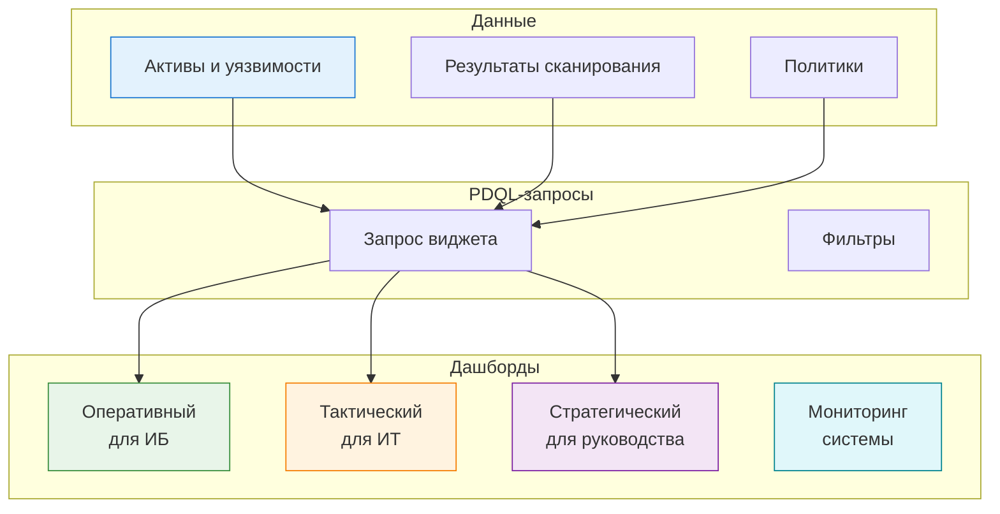
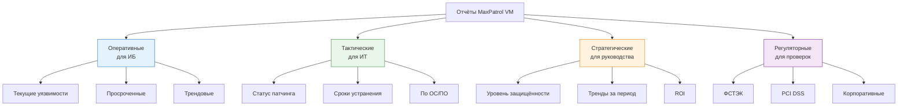

---
tags:
  - maxpatrol-vm
  - vulnerability-management
  - learning
  - stage-7
status: в-progress
created: 2026-08-25
stage: 7
---

# Этап 7 — Визуализация, отчётность и мониторинг

> [!todo] Приоритет: СРЕДНИЙ
> Необходимо для представления руководству и контроля процесса.

---

## 7.1 Дашборды и виджеты

### Зачем нужны дашборды

> [!note] Визуализация = понимание
> Дашборды превращают миллионы строк данных в понятные графики и метрики. Без них руководство не поймёт, насколько защищена инфраструктура, а оператор не увидит проблем.

### Архитектура дашбордов


```mermaid
graph TB
    subgraph "Данные"
        A[Активы и уязвимости]
        B[Результаты сканирования]
        C[Политики]
    end

    subgraph "PDQL-запросы"
        D[Запрос виджета]
        E[Фильтры]
    end

    subgraph "Дашборды"
        F[Оперативный<br/>для ИБ]
        G[Тактический<br/>для ИТ]
        H[Стратегический<br/>для руководства]
        I[Мониторинг<br/>системы]
    end

    A --> D
    B --> D
    C --> D
    D --> F
    D --> G
    D --> H

    style A fill:#e3f2fd,stroke:#1976d2
    style F fill:#e8f5e9,stroke:#388e3c
    style G fill:#fff3e0,stroke:#f57c00
    style H fill:#f3e5f5,stroke:#7b1fa2
    style I fill:#e0f7fa,stroke:#00838f
```

### Типы виджетов

| Тип виджета | Описание | Когда использовать |
| --- | --- | --- |
| **Таблица** | Данные в табличном виде | Детальный анализ, списки уязвимостей |
| **График (линейный)** | Тренды во времени | Динамика уязвимостей, покрытие сканированием |
| **График (столбчатый)** | Сравнение категорий | Распределение по severity, по ОС |
| **Круговая диаграмма** | Доля категорий | Распределение значимости, статусов |
| **Количественный показатель** | Одна ключевая цифра (вид представления виджета) | Количество уязвимостей, % покрытия |
| **Тепловая карта** | Интенсивность по двум осям | Уязвимости по сегментам и severity |
| **Список** | Простой список | Активы без сканирования, просроченные |
| **Таймлайн** | События во времени | История изменений, инциденты |

> [!note] Документированные виды представления виджета
> При создании виджета по активам выбор представления из документации — **таблица, столбчатая диаграмма, график, круговая диаграмма** ([[Создание виджета по активам]]). Остальные строки таблицы — из пользовательского опыта; в документации 2.8 они не описаны.

### Стандартные дашборды и виджеты

> [!note] Что поставляется «из коробки» ([[Виджеты по активам]])
> Рядом с графиком активов на главной странице расположен стандартный дашборд **Управление уязвимостями**; также доступен дашборд **Общая информация**. На этих дашбордах предустановлены стандартные виджеты:
>
> - **Количество активов**, **Значимость активов** (общее число активов и число активов без значимости), **Актуальность данных об активах** (активы, для которых данные сканирования устарели или отсутствуют);
> - **Топ-20 уязвимых активов в веб-приложениях**, **Уязвимости на важных активах**, **Критически важные веб-уязвимости на активах**, **Последние добавленные уязвимости**;
> - **Плановое устранение и новые без политики**, **Устранение вручную**, **Трендовые уязвимости на активах**, **Трендовые уязвимости**, **Уязвимости с эксплойтом**, **Последние добавленные опасные уязвимости в ПО Microsoft**, **Список уязвимостей**.

### Ключевые метрики для дашбордов

> [!tip] Начните с базовых
> Не пытайтесь построить идеальный дашборд сразу. Начните с 5-7 ключевых метрик, затем расширяйте.

#### Метрики для ИБ-команды (оперативный дашборд)

> [!important] Два разных синтаксиса — не путайте
>
> | Где | Что используется |
> | --- | --- |
> | Вкладка **Активы**, динамические группы, REST API | **PDQL** — синтаксис из документа «Синтаксис языка запросов PDQL» |
> | **Конструктор виджетов и отчётов** MaxPatrol 10 | **Собственный диалект**: операторы `==`, агрегаты `count()` в конце конвейера, без `Filter(...)` в скобках |
>
> Официальный документ покрывает **только PDQL**. Диалект конструктора виджетов в нём не описан — поэтому запросы для виджетов ниже приведены как иллюстративные, их нужно сверять с готовыми запросами в библиотеке «Запросы».

**Официальный PDQL (вкладка «Активы», динамические группы):**

| Метрика                                  | PDQL-запрос (по оф. документации)                                                                                           |
| ---------------------------------------- | --------------------------------------------------------------------------------------------------------------------------- |
| Всего активов                            | `Filter(@Host) \| Group(Count(*))`                                                                                          |
| Активы с уязвимостями                    | `Filter(@Host[@Vulners]) \| Group(Count(*))`                                                                                |
| Критичные уязвимости (CVSSv3 ≥ 9)        | `Filter(Host[@Vulners.CVSS3BaseScore >= 9]) \| Group(Host.@Vulners, Count(*))`                                              |
| Уязвимости с эксплойтом                  | `Filter(Host[@Vulners.Metrics.Exploitable = true]) \| Group(Host.@Vulners, Count(*))`                                       |
| Устаревшие данные (> 30 дней)            | `Filter(Host.@AuditTime < Now() - 30days) \| Group(Count(*))`                                                               |
| Просроченные уязвимости                  | `Filter(Host[@Vulners.Status = 'overdue']) \| Group(Host.@Vulners, Count(*))`                                                                                     |
| Активы без значимости                    | `Filter(Host.@Importance = 'ND') \| Group(Count(*))`                                                                                                               |
| Новые активы за 7 дней                   | `Filter(Host.@CreationTime >= Now() - 7days) \| Group(Count(*))`                                                            |
| Уязвимости с возможностью эксплуатации   | `Filter(Host[@Vulners.Metrics.Exploitable]) \| Select(@Host, Host.Fqdn, Host.@Vulners.CVEs)`                                |
| Устаревшие данные (нет аудита > 30 дней) | `Filter(Host.@AuditTime < Now() - 30days) \| Select(@Host, Host.Fqdn, Host.@AuditTime)`                                     |
| Просроченные уязвимости                  | `Filter(Host[@Vulners.DueTime < Now()]) \| Select(@Host, Host.Fqdn, Host.@Vulners.DueTime)`                                 |
| Новые активы за 7 дней                   | `Filter(Host.@CreationTime >= Now() - 7days) \| Select(@Host, Host.Fqdn, Host.@CreationTime)`                               |
| Распределение по уровню опасности        | `Select(@Host, Host.@Vulners.SeverityRating) \| Group(Host.@Vulners.SeverityRating, Count(*) as Total) \| Sort(Total DESC)` |

> [!warning] Почему «активы без значимости» нестабильны
> Значение состояния «не определена» в запросах — `ND` (в паспорте актива — `Undefined`, [[Общие псевдонимы активов]]). Надёжнее пользоваться стандартным запросом **«Значимость не задана»** (папка **Определение значимости**, панель **Запросы**) или виджетом **Значимость активов** на дашборде «Управление уязвимостями», который показывает число активов без значимости ([[Виджеты по активам]]). В запросе выше `'ND'` приведено для единообразия с примерами документации ([[Настройка политик]]).
>
> Обратите внимание и на ограничения псевдонимов: `@Importance`, `@CumulativeVulnerability`, `@Vulners.Score`, `@Vulners.SeverityRating`, контекстные оценки и векторы CVSS, а также псевдонимы групп активов не поддерживаются в динамических группах ([[Общие псевдонимы активов]], [[Псевдонимы уязвимостей]], [[Псевдонимы групп активов]]) — для значимости используйте `@Vulners.CVSS3Score`.

**Запросы конструктора виджетов (диалект MaxPatrol 10 — сверять с библиотекой «Запросы»):**

| Метрика                 | Запрос виджета                                                         |
| ----------------------- | ---------------------------------------------------------------------- |
| Всего уязвимостей       | `@Vulners \| count()`                                                  |
| Критичные уязвимости    | `@Vulners \| filter(CVSS3BaseScore >= 9) \| count()`                   |
| Уязвимости с эксплойтом | `@Vulners \| filter(HasExploit == true or HasExploit == 1) \| count()` |
| Устаревшие данные       | `@Host \| filter(LastAuditTime < Now() - 30days) \| count()`           |
| Просроченные            | `@Vulners \| filter(Status == "Просрочена") \| count()`                |
| Новые активы за 7 дней  | `@Host \| filter(CreationTime > Now() - 7days) \| count()`             |

#### Метрики для ИТ-отдела (тактический дашборд)

| Метрика | Описание | Формула / Источник |
| --- | --- | --- |
| Статус патчинга | Уязвимости по статусам | Разбивка: Исправляется / Устранена / Просрочено |
| Сроки устранения | Сколько уязвимостей в рамках срока | Процент «в работе» vs «просрочено» |
| Уязвимости по ОС | Распределение Windows/Linux/Другие | Группировка по OsName |
| Уязвимости по ПО | Топ уязвимого ПО | Группировка по Softs.Name |
| Уже исправлено | Динамика закрытия | Тренд: сколько закрыто за месяц |

#### Метрики для руководства (стратегический дашборд)

| Метрика | Описание | Формула / Источник |
| --- | --- | --- |
| Общий уровень защищённости | % уязвимостей в пределах срока | `(Устранённые + В работе) / Всего * 100` |
| Тренд защищённости | Динамика за 3/6/12 месяцев | Сравнение с предыдущим периодом |
| Покрытие сканированием | % активов с актуальными данными | `(Активные данные / Всего активов) * 100` |
| Критичные риски | Количество критичных на активах высокой значимости | PDQL: `Filter(Host[@Vulners.CVSS3Score >= 9]) \| Select(@Host, Host.Fqdn, Host.@Vulners.CVEs)` — значимость учитывается на стороне виджета или через группы активов, т.к. `@Importance` не поддерживается в динамических группах |
| ROI Investments | Снижение количества уязвимостей | Сравнение: до внедрения vs после |

### Создание кастомного дашборда

> [!important] Типа «Метрика (число)» в MaxPatrol 10 нет
> В библиотеке виджетов нет готового пункта «метрика». Собственные виджеты создаются из сохранённых PDQL-запросов, а вид представления (в т.ч. количественный показатель) задаётся у самого виджета.

Создание дашбордов и виджетов в MaxPatrol VM 2.8 описывается разделом «Работа с дашбордами и виджетами».

**Создание дашборда ([[Создание дашборда]]):**

1. При первом входе система предлагает создать стандартный дашборд на главной странице — его можно использовать как основу.
2. На главной странице в панели инструментов создайте дашборд: укажите название, сетку/расположение и подтвердите создание — **НЕ** через «Дашборды → Создать» (такого пункта в меню 2.8 нет; дашборды живут на главной странице).
3. Дашборд можно создавать по стандартному или пользовательскому шаблону; дашборд, созданный по шаблону, сохраняет связь с ним.

**Создание виджета по активам ([[Создание виджета по активам]]):**

1. На странице **Активы** сгруппируйте и отфильтруйте активы по требуемому принципу (в т.ч. по периоду времени).
2. Постройте виджет по полученным результатам и выберите представление: **таблица, столбчатая диаграмма, график, круговая диаграмма**.
3. Укажите название и PDQL-запрос, нажмите **Сохранить в библиотеку виджетов** — виджет появится в библиотеке виджетов и стандартных запросах панели **Запросы**.

**Добавление виджета на дашборд ([[Добавление виджета на дашборд]]):**

1. В свободной ячейке дашборда нажмите **Добавить виджет** → откроется окно **Добавление виджета из библиотеки**.
2. Выберите виджет (стандартный из дашборда или из собственной библиотеки) и нажмите **Добавить**.
3. Добавление виджета возможно **только в пустые ячейки** дашборда.

> [!note] Одна формула = один виджет
> Процентные формулы вида `(A + B) / Всего * 100` одним агрегатом не выражаются — их делают через группировку с агрегатом (`Group(Host.OsName, Count(*) as Total)`), таблицу-виджет или готовый отчёт.

**PDQL-запрос для таблицы «Критичные уязвимости на активах» (вкладка «Активы»):**

```text
Filter(Host[@Vulners.CVSS3BaseScore >= 9])
| Select(
    Host.Fqdn as "Имя",
    Host.@IpAddresses as "IP",
    Host.@Vulners.CVSS3BaseScore as "CVSS",
    Host.@Vulners.CVEs as "CVE",
    Host.@Vulners.Metrics.Exploitable as "Эксплойт"
  )
| Sort(Host.@Vulners.CVSS3BaseScore DESC)
```

**PDQL-запрос «Распределение уязвимостей по уровню критичности» (официальный PDQL):**

```text
Filter(@Vulners)
| Group(@Vulners.SeverityRating as "Уровень критичности", Count(*) as "Количество")
| Sort("Количество" DESC)
```

### Мониторинг ресурсов системы (Grafana)

> [!note] Observability = здоровье MaxPatrol VM
> MaxPatrol VM включает Grafana для мониторинга собственных ресурсов (роль **Observability**). Это не виджеты данных об активах и уязвимостях, а метрики работоспособности системы.

**Стандартные дашборды Grafana:**

| Дашборд | Что показывает |
| --- | --- |
| CPU usage | Загрузка процессоров серверов |
| Memory usage | Использование ОЗУ |
| Disk usage | Использование дисков |
| PostgreSQL metrics | Запросы, размер БД, логи |
| RabbitMQ metrics | Очереди сообщений, потребители |
| Docker containers | Состояние контейнеров |

> [!note] Дашборд PostgreSQL в документации 2.8
> В локальном зеркале документации описан **дашборд PostgreSQL** ([[Работа с дашбордом PostgreSQL]]): сбор метрик производительности СУБД и вывод их на виджеты Grafana — **Databases** (count, size, temp bytes), **commit** / **rollback** (транзакции), **timed** / **req** (записи по расписанию и вне очереди), **return / fetch / insert / delete / update** (операции со записями), **PostgreSQL settings** (size, limits, time), **Database size** (семь самых объёмных БД), а также соединения — **idle / active / wait / total backends**.

**Доступ:**
- URL: `https://<IP-адрес или FQDN сервера MaxPatrol VM>:3334/grafana` (см. «Оптимизация выполнения PDQL-запросов для высоконагруженных систем»).
- После установки роли **Observability** метрики также доступны по адресу `https://<IP-адрес или FQDN сервера компонента>:9002` ([[Установка роли Observability]]).
- В конфигурации роли **Observability** порт задаётся параметрами `GrafanaServerHttpPort` (по умолчанию `9002`) и `GrafanaServerSubUri` (`grafana`).
- Логин/пароль по умолчанию — `admin` / `P@ssw0rd` (параметры `GrafanaAdminLogin` / `GrafanaAdminPassword`; сменяется через изменение конфигурации роли).

---

## 7.2 Отчёты

### Типы отчётов


```mermaid
graph TB
    A[Отчёты MaxPatrol VM] --> B[Оперативные<br/>для ИБ]
    A --> C[Тактические<br/>для ИТ]
    A --> D[Стратегические<br/>для руководства]
    A --> E[Регуляторные<br/>для проверок]

    B --> B1[Текущие уязвимости]
    B --> B2[Просроченные]
    B --> B3[Трендовые]

    C --> C1[Статус патчинга]
    C --> C2[Сроки устранения]
    C --> C3[По ОС/ПО]

    D --> D1[Уровень защищённости]
    D --> D2[Тренды за период]
    D --> D3[ROI]

    E --> E1[ФСТЭК]
    E --> E2[PCI DSS]
    E --> E3[Корпоративные]

    style B fill:#e3f2fd,stroke:#1976d2
    style C fill:#e8f5e9,stroke:#388e3c
    style D fill:#fff3e0,stroke:#f57c00
    style E fill:#f3e5f5,stroke:#7b1fa2
```

### Стандартные отчёты

| Отчёт | Назначение | Периодичность |
| --- | --- | --- |
| Сводка по уязвимостям | Общая картина: количество, severity, тренды | Еженедельно |
| Критичные уязвимости | Детали по критичным уязвимостям | По требованию |
| Статус патчинга | Прогресс устранения по группам | Ежемесячно |
| Устаревшие данные | Активы без актуального сканирования | Еженедельно |
| Новые активы | Впервые обнаруженные за период | Еженедельно |
| Сравнение с предыдущим периодом | Динамика изменений | Ежемесячно |
| Соответствие ФСТЭК | Результаты контроля защищённости | По требованию |

### Кастомные отчёты

> [!note] Где создаются отчёты в 2.8
> Отчёты создаются как **задачи на выпуск отчётов**: главное меню → **Система → Отчеты** → кнопка **Создать** ([[Страница «Отчеты»]]). Для отчёта выбирается шаблон из групп **Отчеты по активам и инцидентам** ([[Создание задачи на выпуск отчета по активам]]), **Важные уязвимости** и **Показатели управления уязвимостями** ([[Создание задачи на выпуск отчета по уязвимостям]]) или пункт **Без шаблона** для полностью пользовательского отчёта ([[Создание задачи на выпуск пользовательского отчета]]). В шаблонной задаче задаются **Источник** (например, «Активы»), сам шаблон и группа активов; PDQL-запрос используется в задаче **экспорта записей** (поля **Источник**, **Группы**, **Запросы**, [[Создание задачи на экспорт записей об активах]]) и в виджетах, из которых состоит пользовательский отчёт.

Создание пользовательского отчёта ([[Создание задачи на выпуск пользовательского отчета]]):

1. Главное меню → **Система → Отчеты** → **Создать**.
2. В списке шаблонов выберите **Без шаблона** и нажмите **Далее** — откроется страница **Редактирование задачи \<Название отчета\>**.
3. В панели **Настройка задачи** на вкладке **Параметры отчета** настройте внешний вид (название задачи, колонтитулы).
4. Перейдите на вкладку **Параметры выпуска** и при необходимости настройте расписание выпуска.
5. В рабочей области добавьте объекты — тексты, изображения, виджеты, а также типы визуализации (диаграммы, графики, гистограммы) — и настройте каждый объект.
6. **Сохранить** → **Сохранить задачу** → **Обновить** → **Закрыть**.

**Примеры кастомных отчётов:**

| Отчёт | PDQL-запрос (вкладка «Активы») |
| --- | --- |
| Уязвимости Windows с эксплойтом (PDQL) | `Filter(WindowsHost[@Vulners.Metrics.Exploitable = true]) \| Select(@Host, Host.Fqdn, Host.OsName, Host.@Vulners.CVEs)` |
| Активы без сканирования > 60 дней (PDQL) | `Filter(Host.@AuditTime < Now() - 60days) \| Select(@Host, Host.Fqdn, Host.@AuditTime)` |
| Топ-10 ПО по количеству уязвимостей | `Select(Host.Softs.Name, Host.Softs.Version) \| Group(Host.Softs.Name, Count(*) as Total) \| Sort(Total DESC) \| Limit(10)` |
| Уязвимости без исправления | `Filter(Host[@Vulners.Metrics.HasFix = false]) \| Select(@Host, Host.Fqdn, Host.@Vulners.CVEs, Host.@Vulners.HowToFix)` |
| Уязвимости с истёкшим сроком устранения | `Filter(Host[@Vulners.DueTime < Now()]) \| Select(@Host, Host.Fqdn, Host.@Vulners.DueTime, Host.@Vulners.Status)` |

> [!note] Какой синтаксис использовать
> Источник данных задаётся по-разному: в шаблонной задаче отчёта — **Источник** и группа активов; в задаче экспорта записей и в виджетах отчёта — PDQL-запросом с вкладки «Активы» либо запросом в собственном диалекте конструктора (`==`, `count()`, атрибуты вида `HasExploit`). Для проверяемых и воспроизводимых конструкций берите PDQL-версию; синтаксис — в [[4. Язык PDQL]].

### Очередь выпуска отчётов

> [!tip] Автоматизация отчётности
> Автоматическая генерация и отправка отчётов по расписанию настраивается в задаче на выпуск отчёта (вкладка **Параметры выпуска**).

| Параметр | Описание |
| --- | --- |
| Расписание | Периодичность автоматического выпуска (вкладка **Параметры выпуска**, кнопка **Расписание**) |
| Формат | PDF (шаблоны), XLSX, экспорт записей CSV/JSON/XML |
| Макс. одновременно выпускаемых отчётов | Параметр `PrintingQueueJobsLimit` роли Core — по умолчанию **5** |

> [!note] Как работает очередь ([[Просмотр очереди выпуска отчетов]], [[Страница «Отчеты»]])
> На странице **Отчеты** нажмите **Очередь** — откроется таблица выпускаемых отчётов. Пока не завершится хотя бы одна из одновременно запущенных задач, последующие помещаются в очередь. Статусы задач: **Задача создана**, **В очереди**, **Выпускается**, **Выпуск отменен**, **Выпущен**. Для отчёта PDF в карточке дополнительно видны этапы подготовки: **Получение данных**, **Подготовка к выпуску**, **Выпуск**. Выпуск можно отменить по ссылке **Отменить** в колонке **Действие**; готовые отчёты скачиваются из панели **История выпусков**.
> Кнопки панели инструментов страницы **Отчеты**: **Создать**, **Копировать**, **Редактировать**, **Удалить**, **Выпустить отчет**, **Расписание**, **Очередь**.

### Экспорт данных

| Формат | Назначение |
| --- | --- |
| PDF | Отчёт для руководства, для проверок ФСТЭК (шаблоны отчетов выпускаются в PDF) |
| XLSX | Отчёт/экспорт по шаблону в формате XLSX, табличный анализ |
| CSV | Дальнейший анализ в Excel (экспорт записей) |
| JSON | Интеграция с внешними системами (экспорт записей) |
| XML | Обмен данными между инсталляциями (экспорт записей) |

**Экспорт записей** создаётся той же кнопкой **Создать** на странице **Отчеты**: пункт **Экспорт записей** → формат файла → **Источник** (Активы) → группы и PDQL-**Запросы** → при необходимости расписание. В файл любого из поддерживаемых форматов можно экспортировать **не более одного миллиона записей** ([[Создание задачи на экспорт записей об активах]]).

**Экспорт данных с виджетов** ([[Экспорт статистических данных]]): с графического виджета — **Скачать в PNG**; с табличного — выбор варианта экспорта, формата (CSV, XLSX, JSON, XML) и количества записей, для XLSX можно применить стандартный или собственный шаблон.

---

## 7.3 Уведомления

### Назначение

> [!important] Оповещение = оперативная реакция
> Уведомления позволяют мгновенно реагировать на критичные события: новые уязвимости, устаревшие данные, истёкшие сроки.

### Типы триггеров

| Триггер | Описание | Пример | `notification_source` |
| --- | --- | --- | --- |
| **Изменение состава активов** | Появление/удаление актива | Новый сервер в сети | `AssetStateMetaTrigger` |
| **Изменение состава группы** | Актив вошёл/вышел из группы | Критичный актив добавлен | `GroupContentMetaTrigger` |
| **Событие** | Соответствие фильтру событий | Критичная уязвимость обнаружена | `EventsMetaTrigger` |
| **Мониторинг потока событий** | Отклонение от нормы | Рост событий безопасности | `EventsMonitoringControlsMetaTrigger` |
| **Состояние системы** | Проблема с компонентами | Collector недоступен | `HealthMonitoringIssuesMetaTrigger` |
| **Задача сканирования** | Запуск/остановка задачи | Сканирование завершено | `ScannerTaskNotificationsMetaTrigger` |

Коды `notification_source` — из [[Поля POST-запроса для уведомления]].

### Каналы доставки

| Канал | Описание | Настройка |
| --- | --- | --- |
| **Email** | Письма на указанные адреса | SMTP-сервер, адреса получателей |
| **POST-запрос (webhook)** | HTTP POST на внешний URL | URL, формат JSON |
| **MaxPatrol SIEM** | Отправка событий в SIEM | Интеграция через API |

### Настройка уведомлений

**Пошаговый процесс ([[Страница «Уведомления»]]):**

1. Перейдите в **Система → Уведомления**.
2. Нажмите **Создать** → откроется окно **Новое уведомление**.
3. Заполните параметры:

| Параметр | Описание | Пример |
| --- | --- | --- |
| Название | Понятное имя | «Критичная уязвимость» |
| Сообщать | Тип события из списка: «Об изменениях в группах активов», «Об изменении общего числа активов», «О состоянии системы», «О задачах сбора данных» | Об изменениях в группах активов |
| (флажки события) | Конкретизация события, напр. «Добавление активов в группу» / «Исключение активов из группы» | Оба |
| В группах | Для типов «об изменениях» — группы активов, об изменениях которых сообщать | «Критичные активы» |
| Уведомление при срабатывании | Способ отправки: **Email** (поле **Кому** — адреса) и/или **POST-запрос** (адрес сервера) | Email: ib@example.ru |
| Макс. частота | Как часто система может отправлять уведомление | Не чаще 1 раза в час |
| Часовой пояс | Часовой пояс для времени отправки и отображения в тексте уведомления | Москва |

4. Нажмите **Сохранить** — после создания задача запускается автоматически.

После создания задачу можно копировать, редактировать, останавливать/запускать и удалять (кнопки **Копировать**, **Редактировать**, **Остановить**, **Запустить**, **Удалить**). В рабочей области страницы — панель **Типы уведомлений** с перечнем разделов по типам объектов.

> [!note] Перед отправкой по email настройте SMTP
> Настройка выполняется в конфигурации MP 10 Core (параметры `SmtpHost`, `SmtpPort`, `SmtpUser`, `SmtpPassword`, `SmtpSender`, `SmtpIgnoreCertificateValidation`, `SmtpSecureSocketOptions`) — см. [[Настройка SMTP-сервера для отправки уведомлений по электронной почте]]. Соответствие `notification_source` задачам: полный перечень значений типа триггера — в [[Поля POST-запроса для уведомления]].

### Типичные уведомления

| Уведомление | Триггер | Канал | Получатели |
| --- | --- | --- | --- |
| Новая критичная уязвимость | `@Vulners.CVSS3Score >= 9` | Email + SIEM | ИБ |
| Уязвимость с эксплойтом | `@Vulners.Metrics.Exploitable` | Email | ИБ + ИТ |
| Просроченная уязвимость | Срок истёк | Email | ИБ + ИТ |
| Устаревшие данные сканирования | Последнее сканирование > 30 дней | Email | ИБ |
| Новый актив в сети | Появление актива | Email | ИБ |
| Сканирование завершено | Задача завершена | Email | Оператор |
| Collector недоступен | Проблема с компонентом | Email + SIEM | ИБ + ИТ |

### POST-запрос (webhook)

> [!note] Интеграция через webhook
> POST-запрос позволяет интегрировать MaxPatrol VM с любыми внешними системами: ITSM, чат-боты, автоматизация.

**Структура POST-запроса:**

```json
{
  "notification_type": "event",
  "notification_source": "EventsMetaTrigger",
  "notification_name": "Критичная уязвимость",
  "uri": "https://vm-server:8733/api/...",
  "event_time_stamp": "2026-08-25T14:30:00Z"
}
```

**Поля POST-запроса:**

| Поле | Описание |
| --- | --- |
| `message_id` | Идентификатор запроса |
| `notification_type` | test / event / schedule |
| `notification_source` | Тип триггера |
| `notification_uid` | Уникальный ID уведомления |
| `notification_name` | Название задачи |
| `uri` | Ссылка на данные (доступны 24 ч) |
| `schema_uri` | Ссылка на схему данных |
| `event_time_stamp` | Время события (UTC) |
| `time_interval` | Для schedule: начало и конец периода |

---

## Краткое резюме Этапа 7

| Аспект | Ключевая мысль |
| --- | --- |
| Дашборды | Визуализация данных через виджеты, привязанные к PDQL; стандартный дашборд «Управление уязвимостями» |
| Типы виджетов | Таблица, столбчатая диаграмма, график, круговая диаграмма (+ стандартные виджеты дашбордов) |
| Ключевые метрики | Критичные, просроченные, покрытие, тренды |
| Отчёты | Оперативные (ИБ), тактические (ИТ), стратегические (руководство); задачи на выпуск отчётов |
| Автоматизация отчётов | Очередь выпуска (Queue, `PrintingQueueJobsLimit` = 5), email, PDF/XLSX/CSV/JSON/XML |
| Уведомления | Типы «Сообщать» → способ отправки (email, POST-запрос); задача запускается после создания |
| Grafana | Мониторинг ресурсов самого MaxPatrol VM (роль Observability, /grafana) |

---

## Связанные заметки

- [[6. Автоматизация и политики]] — предыдущий этап
- [[8. Контроль соответствия и HCC]] — следующий этап
- [[План изучения]] — общий план обучения

## Ресурсы

- [Справочный портал MaxPatrol VM](https://help.ptsecurity.com/ru-RU/projects/vm/2.8/help/4980710795)
- [Мониторинг ресурсов в Grafana](https://help.ptsecurity.com/ru-RU/projects/vm/2.8/help/4994784267)
- [Вебинар PT: Отчёты MaxPatrol VM](https://ptsecurity.com/research/webinar/otchety-maxpatrol-vm-klyuch-k-ehffektivnomu-processu-upravleniya-uyazvimostyami/)
- [Курс Positive Education: Применение MaxPatrol VM](https://edu.ptsecurity.com/kursy-po-ekspluatacii-productov-pt/mp-vm)

---

*Следующий этап: [[8. Контроль соответствия и HCC]]*
