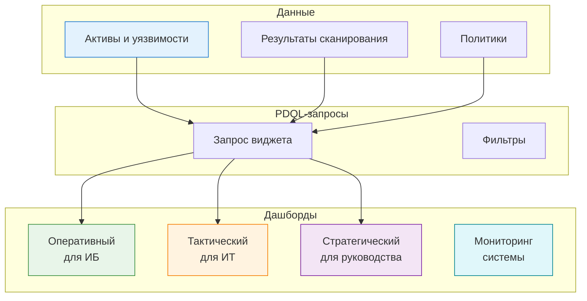
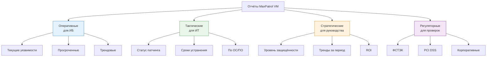

---
tags:
  - maxpatrol-vm
  - vulnerability-management
  - learning
  - stage-7
status: в-progress
created: 2026-08-25
stage: 7
---

# Этап 7 — Визуализация, отчётность и мониторинг

> [!todo] Приоритет: СРЕДНИЙ
> Необходимо для представления руководству и контроля процесса.

---

## 7.1 Дашборды и виджеты

### Зачем нужны дашборды

> [!note] Визуализация = понимание
> Дашборды превращают миллионы строк данных в понятные графики и метрики. Без них руководство не поймёт, насколько защищена инфраструктура, а оператор не увидит проблем.

### Архитектура дашбордов


```mermaid
graph TB
    subgraph "Данные"
        A[Активы и уязвимости]
        B[Результаты сканирования]
        C[Политики]
    end

    subgraph "PDQL-запросы"
        D[Запрос виджета]
        E[Фильтры]
    end

    subgraph "Дашборды"
        F[Оперативный<br/>для ИБ]
        G[Тактический<br/>для ИТ]
        H[Стратегический<br/>для руководства]
        I[Мониторинг<br/>системы]
    end

    A --> D
    B --> D
    C --> D
    D --> F
    D --> G
    D --> H

    style A fill:#e3f2fd,stroke:#1976d2
    style F fill:#e8f5e9,stroke:#388e3c
    style G fill:#fff3e0,stroke:#f57c00
    style H fill:#f3e5f5,stroke:#7b1fa2
    style I fill:#e0f7fa,stroke:#00838f
```

### Типы виджетов

| Тип виджета | Описание | Когда использовать |
| --- | --- | --- |
| **Таблица** | Данные в табличном виде | Детальный анализ, списки уязвимостей |
| **График (линейный)** | Тренды во времени | Динамика уязвимостей, покрытие сканированием |
| **График (столбчатый)** | Сравнение категорий | Распределение по severity, по ОС |
| **Круговая диаграмма** | Доля категорий | Распределение значимости, статусов |
| **Количественный показатель** | Одна ключевая цифра (вид представления виджета) | Количество уязвимостей, % покрытия |
| **Тепловая карта** | Интенсивность по двум осям | Уязвимости по сегментам и severity |
| **Список** | Простой список | Активы без сканирования, просроченные |
| **Таймлайн** | События во времени | История изменений, инциденты |

### Ключевые метрики для дашбордов

> [!tip] Начните с базовых
> Не пытайтесь построить идеальный дашборд сразу. Начните с 5-7 ключевых метрик, затем расширяйте.

#### Метрики для ИБ-команды (оперативный дашборд)

> [!important] Два разных синтаксиса — не путайте
>
> | Где | Что используется |
> | --- | --- |
> | Вкладка **Активы**, динамические группы, REST API | **PDQL** — синтаксис из документа «Синтаксис языка запросов PDQL» |
> | **Конструктор виджетов и отчётов** MaxPatrol 10 | **Собственный диалект**: операторы `==`, агрегаты `count()` в конце конвейера, без `Filter(...)` в скобках |
>
> Официальный документ покрывает **только PDQL**. Диалект конструктора виджетов в нём не описан — поэтому запросы для виджетов ниже приведены как иллюстративные, их нужно сверять с готовыми запросами в библиотеке «Запросы».

**Официальный PDQL (вкладка «Активы», динамические группы):**

| Метрика | PDQL-запрос (по оф. документации) |
| --- | --- |
| Всего активов | `Filter(@Host) \| Group(Count(*))` |
| Активы с уязвимостями | `Filter(@Host[@Vulners]) \| Group(Count(*))` |
| Критичные уязвимости (CVSSv3 ≥ 9) | `Filter(Host[@Vulners.CVSS3BaseScore >= 9]) \| Group(Host.@Vulners, Count(*))` |
| Уязвимости с эксплойтом | `Filter(Host[@Vulners.Metrics.Exploitable = true]) \| Group(Host.@Vulners, Count(*))` |
| Устаревшие данные (> 30 дней) | `Filter(Host.@AuditTime < Now() - 30days) \| Group(Count(*))` |
| Просроченные уязвимости | `Filter(Host[@Vulners.Status = "Просрочена"]) \| Group(Host.@Vulners, Count(*))` |
| Активы без значимости | `Filter(Host.@Importance = "Undefined") \| Group(Count(*))` |
| Новые активы за 7 дней | `Filter(Host.@CreationTime >= Now() - 7days) \| Group(Count(*))` |
| Уязвимости с возможностью эксплуатации | `Filter(Host[@Vulners.Metrics.Exploitable]) \| Select(@Host, Host.Fqdn, Host.@Vulners.CVEs)` |
| Устаревшие данные (нет аудита > 30 дней) | `Filter(Host.@AuditTime < Now() - 30days) \| Select(@Host, Host.Fqdn, Host.@AuditTime)` |
| Просроченные уязвимости | `Filter(Host[@Vulners.DueTime < Now()]) \| Select(@Host, Host.Fqdn, Host.@Vulners.DueTime)` |
| Новые активы за 7 дней | `Filter(Host.@CreationTime >= Now() - 7days) \| Select(@Host, Host.Fqdn, Host.@CreationTime)` |
| Распределение по уровню опасности | `Select(@Host, Host.@Vulners.SeverityRating) \| Group(Host.@Vulners.SeverityRating, Count(*) as Total) \| Sort(Total DESC)` |

> [!warning] Почему здесь нет «активов без значимости»
> Фильтр «значимость не задана» нельзя выразить через псевдоним `@IMPORTANCE` надёжно: в документации указано, что `@Importance` **нельзя использовать в динамических группах**, а код для состояния «не определено» не приводится. Практический путь — взять за основу перечень активов, значимость которых не назначена, через интерфейс (сводка → фильтр по незаполненному полю) и от него строить виджет.
>
> Обратите внимание и на другие ограничения: `@Importance`, `@CumulativeVulnerability`, `@Vulners.Score`, `@Vulners.SeverityRating`, `@VulnerPassport.Score`, контекстные оценки и векторы CVSS не поддерживаются в динамических группах — для значимости используйте `@Vulners.CVSS3Score`.

**Запросы конструктора виджетов (диалект MaxPatrol 10 — сверять с библиотекой «Запросы»):**

| Метрика | Запрос виджета |
| --- | --- |
| Всего уязвимостей | `@Vulners \| count()` |
| Критичные уязвимости | `@Vulners \| filter(CVSS3BaseScore >= 9) \| count()` |
| Уязвимости с эксплойтом | `@Vulners \| filter(HasExploit == true or HasExploit == 1) \| count()` |
| Устаревшие данные | `@Host \| filter(LastAuditTime < Now() - 30days) \| count()` |
| Просроченные | `@Vulners \| filter(Status == "Просрочена") \| count()` |
| Новые активы за 7 дней | `@Host \| filter(CreationTime > Now() - 7days) \| count()` |

#### Метрики для ИТ-отдела (тактический дашборд)

| Метрика | Описание | Формула / Источник |
| --- | --- | --- |
| Статус патчинга | Уязвимости по статусам | Разбивка: Исправляется / Устранена / Просрочена |
| Сроки устранения | Сколько уязвимостей в рамках срока | Процент «в работе» vs «просрочено» |
| Уязвимости по ОС | Распределение Windows/Linux/Другие | Группировка по OsName |
| Уязвимости по ПО | Топ уязвимого ПО | Группировка по Softs.Name |
| Уже исправлено | Динамика закрытия | Тренд: сколько закрыто за месяц |

#### Метрики для руководства (стратегический дашборд)

| Метрика | Описание | Формула / Источник |
| --- | --- | --- |
| Общий уровень защищённости | % уязвимостей в пределах срока | `(Устранённые + В работе) / Всего * 100` |
| Тренд защищённости | Динамика за 3/6/12 месяцев | Сравнение с предыдущим периодом |
| Покрытие сканированием | % активов с актуальными данными | `(Активные данные / Всего активов) * 100` |
| Критичные риски | Количество критичных на активах высокой значимости | PDQL: `Filter(Host[@Vulners.CVSS3Score >= 9]) \| Select(@Host, Host.Fqdn, Host.@Vulners.CVEs)` — значимость учитывается на стороне виджета или через группы активов, т.к. `@Importance` не поддерживается в динамических группах |
| ROI Investments | Снижение количества уязвимостей | Сравнение: до внедрения vs после |

### Создание кастомного дашборда

**Пошаговый процесс (MaxPatrol 10):**

> [!important] Типа «Метрика (число)» в MaxPatrol 10 нет
> В библиотеке виджетов нет готового пункта «метрика». Собственные виджеты создаются из сохранённых PDQL-запросов, а вид представления (в т.ч. количественный показатель) задаётся у самого виджета.

1. Перейдите в **Дашборды → Создать дашборд**
2. Дайте название и описание
3. Создайте собственные виджеты из запросов:
   - **Для PDQL-запроса**: в разделе **Активы** введите запрос в официальном синтаксисе, например `Filter(Host[@Vulners.CVSS3Score >= 9]) | Select(@Host, Host.Fqdn, Host.@Vulners.CVEs)`
   - **Сохраните запрос** — он появится в панели «Запросы»
   - В контекстном меню запроса выберите **Преобразовать в виджет**
   - У виджета выберите **вид представления** (количественный показатель, таблица, диаграмма и др.)
   - Если виджету нужен счётчик, агрегат задаётся уже в конструкторе виджета (диалект виджетов: `@Vulners | filter(...) | count()`)
4. **Добавить виджет → Из библиотеки виджетов** — выберите созданный или стандартный виджет
5. Расположите виджеты на сетке, настройте отображение
6. Сохраните

> [!note] Одна формула = один виджет
> Процентные формулы вида `(A + B) / Всего * 100` одним агрегатом не выражаются — их делают через группировку с агрегатом (`Group(Host.OsName, Count(*) as Total)`), таблицу-виджет или готовый отчёт.

**PDQL-запрос для виджета «Критичные уязвимости на активах»:**

```text
Filter(Host[@Vulners.CVSS3Score >= 9])
| Select(
    Host.Fqdn as "Имя",
    Host.IpAddress as "IP",
    Host.@Vulners.CVSS3Score as "CVSS",
    Host.@Vulners.CVEs as "CVE",
    Host.@Vulners.Metrics.Exploitable as "Эксплойт"
  )
| Sort(Host.@Vulners.CVSS3Score DESC)
```

**PDQL-запрос для виджета «Распределение уязвимостей по уровню критичности»:**

```text
Select(@Host, Host.@Vulners.SeverityRating)
| Group(Host.@Vulners.SeverityRating, Count(*) as "Количество")
| Sort("Количество" DESC)
```

### Мониторинг ресурсов системы (Grafana)

> [!note] Observability = здоровье MaxPatrol VM
> MaxPatrol VM включает Grafana для мониторинга собственных ресурсов. Это не виджеты业务数据, а метрики системы.

**Стандартные дашборды Grafana:**

| Дашборд | Что показывает |
| --- | --- |
| CPU usage | Загрузка процессоров серверов |
| Memory usage | Использование ОЗУ |
| Disk usage | Использование дисков |
| PostgreSQL metrics | Запросы, размер БД, логи |
| RabbitMQ metrics | Очереди сообщений, потребители |
| Docker containers | Состояние контейнеров |

**Доступ:**
- URL: `https://<IP-сервера-MC>:3000`
- Логин/пароль: при установке Observability

---

## 7.2 Отчёты

### Типы отчётов


```mermaid
graph TB
    A[Отчёты MaxPatrol VM] --> B[Оперативные<br/>для ИБ]
    A --> C[Тактические<br/>для ИТ]
    A --> D[Стратегические<br/>для руководства]
    A --> E[Регуляторные<br/>для проверок]

    B --> B1[Текущие уязвимости]
    B --> B2[Просроченные]
    B --> B3[Трендовые]

    C --> C1[Статус патчинга]
    C --> C2[Сроки устранения]
    C --> C3[По ОС/ПО]

    D --> D1[Уровень защищённости]
    D --> D2[Тренды за период]
    D --> D3[ROI]

    E --> E1[ФСТЭК]
    E --> E2[PCI DSS]
    E --> E3[Корпоративные]

    style B fill:#e3f2fd,stroke:#1976d2
    style C fill:#e8f5e9,stroke:#388e3c
    style D fill:#fff3e0,stroke:#f57c00
    style E fill:#f3e5f5,stroke:#7b1fa2
```

### Стандартные отчёты

| Отчёт | Назначение | Периодичность |
| --- | --- | --- |
| Сводка по уязвимостям | Общая картина: количество, severity, тренды | Еженедельно |
| Критичные уязвимости | Детали по критичным уязвимостям | По требованию |
| Статус патчинга | Прогресс устранения по группам | Ежемесячно |
| Устаревшие данные | Активы без актуального сканирования | Еженедельно |
| Новые активы | Впервые обнаруженные за период | Еженедельно |
| Сравнение с предыдущим периодом | Динамика изменений | Ежемесячно |
| Соответствие ФСТЭК | Результаты контроля защищённости | По требованию |

### Кастомные отчёты

**Создание пользовательского отчёта:**

1. Перейдите в **Отчёты → Создать отчёт**
2. Выберите шаблон (таблица, график, комбинированный)
3. Настройте PDQL-запросы для данных
4. Настройте форматирование
5. Сохраните

**Примеры кастомных отчётов:**

| Отчёт | PDQL-запрос (вкладка «Активы») |
| --- | --- |
| Уязвимости Windows с эксплойтом | `Filter(WindowsHost[@Vulners.Metrics.Exploitable]) \| Select(@Host, Host.Fqdn, Host.OsName, Host.@Vulners.CVEs)` |
| Активы без сканирования > 60 дней | `Filter(Host.@AuditTime < Now() - 60days) \| Select(@Host, Host.Fqdn, Host.@AuditTime)` |
| Топ-10 ПО по количеству уязвимостей | `Select(Host.Softs.Name, Host.Softs.Version) \| Group(Host.Softs.Name, Count(*) as Total) \| Sort(Total DESC) \| Limit(10)` |
| Уязвимости без исправления | `Filter(Host[@Vulners.Metrics.HasFix = false]) \| Select(@Host, Host.Fqdn, Host.@Vulners.CVEs, Host.@Vulners.HowToFix)` |
| Уязвимости с истёкшим сроком устранения | `Filter(Host[@Vulners.DueTime < Now()]) \| Select(@Host, Host.Fqdn, Host.@Vulners.DueTime, Host.@Vulners.Status)` |

> [!note] Какой синтаксис использовать
> Источник данных отчёта задаётся либо PDQL-запросом с вкладки «Активы», либо запросом в собственном диалекте конструктора отчётов (`==`, `count()`, атрибуты вида `HasExploit`). Для проверяемых и воспроизводимых конструкций берите PDQL-версию; синтаксис — в [[4. Язык PDQL]].

### Очередь выпуска отчётов

> [!tip] Автоматизация отчётности
> Настройте автоматическую генерацию и отправку отчётов по расписанию.

| Параметр | Описание |
| --- | --- |
| Расписание | Еженедельно / Ежемесячно / По требованию |
| Получатели | Email-адреса (ИБ-команда, руководство) |
| Формат | PDF / HTML / CSV |
| Фильтры | Группы активов, период, severity |

### Экспорт данных

| Формат | Назначение |
| --- | --- |
| PDF | Отчёт для руководства, для проверок ФСТЭК |
| CSV | Дальнейший анализ в Excel |
| JSON | Интеграция с внешними системами |
| XML | Обмен данными между инсталляциями |

---

## 7.3 Уведомления

### Назначение

> [!important] Оповещение = оперативная реакция
> Уведомления позволяют мгновенно реагировать на критичные события: новые уязвимости, устаревшие данные, истёкшие сроки.

### Типы триггеров

| Триггер | Описание | Пример |
| --- | --- | --- |
| **Изменение состава активов** | Появление/удаление актива | Новый сервер в сети |
| **Изменение состава группы** | Актив вошёл/вышел из группы | Критичный актив добавлен |
| **Событие** | Соответствие фильтру событий | Критичная уязвимость обнаружена |
| **Мониторинг потока событий** | Отклонение от нормы | Рост событий безопасности |
| **Состояние системы** | Проблема с компонентами | Collector недоступен |
| **Задача сканирования** | Запуск/остановка задачи | Сканирование завершено |

### Каналы доставки

| Канал | Описание | Настройка |
| --- | --- | --- |
| **Email** | Письма на указанные адреса | SMTP-сервер, адреса получателей |
| **POST-запрос (webhook)** | HTTP POST на внешний URL | URL, формат JSON |
| **MaxPatrol SIEM** | Отправка событий в SIEM | Интеграция через API |

### Настройка уведомлений

**Пошаговый процесс:**

1. Перейдите в **Система → Уведомления**
2. Нажмите **Создать уведомление**
3. Заполните параметры:

| Параметр | Описание | Пример |
| --- | --- | --- |
| Название | Понятное имя | «Критичная уязвимость» |
| Триггер | Что вызывает | Событие: новая критичная уязвимость |
| Фильтр | Условия срабатывания | PDQL-фильтр события, например `@Vulners.CVSS3Score >= 9 and @Vulners.Metrics.Exploitable` |
| Канал | Куда отправлять | Email + POST |
| Получатели | Кому | ИБ-команда |
| Шаблон | Формат сообщения | Стандартный или пользовательский |
| Расписание проверки | Как часто проверять | Каждые 15 минут |

### Типичные уведомления

| Уведомление | Триггер | Канал | Получатели |
| --- | --- | --- | --- |
| Новая критичная уязвимость | `@Vulners.CVSS3Score >= 9` | Email + SIEM | ИБ |
| Уязвимость с эксплойтом | `@Vulners.Metrics.Exploitable` | Email | ИБ + ИТ |
| Просроченная уязвимость | Срок истёк | Email | ИБ + ИТ |
| Устаревшие данные сканирования | Последнее сканирование > 30 дней | Email | ИБ |
| Новый актив в сети | Появление актива | Email | ИБ |
| Сканирование завершено | Задача завершена | Email | Оператор |
| Collector недоступен | Проблема с компонентом | Email + SIEM | ИБ + ИТ |

### POST-запрос (webhook)

> [!note] Интеграция через webhook
> POST-запрос позволяет интегрировать MaxPatrol VM с любыми внешними системами: ITSM, чат-боты, автоматизация.

**Структура POST-запроса:**

```json
{
  "notification_type": "event",
  "notification_source": "EventsMetaTrigger",
  "notification_name": "Критичная уязвимость",
  "uri": "https://vm-server:8733/api/...",
  "event_time_stamp": "2026-08-25T14:30:00Z"
}
```

**Поля POST-запроса:**

| Поле | Описание |
| --- | --- |
| `message_id` | Идентификатор запроса |
| `notification_type` | test / event / schedule |
| `notification_source` | Тип триггера |
| `notification_uid` | Уникальный ID уведомления |
| `notification_name` | Название задачи |
| `uri` | Ссылка на данные (доступны 24 ч) |
| `schema_uri` | Ссылка на схему данных |
| `event_time_stamp` | Время события (UTC) |
| `time_interval` | Для schedule: начало и конец периода |

---

## Краткое резюме Этапа 7

| Аспект | Ключевая мысль |
| --- | --- |
| Дашборды | Визуализация данных через виджеты, привязанные к PDQL |
| Типы виджетов | Таблицы, графики, метрики, круговые диаграммы |
| Ключевые метрики | Критичные, просроченные, покрытие, тренды |
| Отчёты | Оперативные (ИБ), тактические (ИТ), стратегические (руководство) |
| Автоматизация отчётов | Очередь выпуска, email, PDF/CSV/JSON |
| Уведомления | Триггеры → фильтры → каналы (email, webhook, SIEM) |
| Grafana | Мониторинг ресурсов самого MaxPatrol VM |

---

## Связанные заметки

- [[Этап 6 — Автоматизация и политики]] — предыдущий этап
- [[8. Контроль соответствия и HCC]] — следующий этап
- [[План изучения MaxPatrol VM]] — общий план обучения

## Ресурсы

- [Справочный портал MaxPatrol VM](https://help.ptsecurity.com/ru-RU/projects/vm/2.8/help/4980710795)
- [Мониторинг ресурсов в Grafana](https://help.ptsecurity.com/ru-RU/projects/vm/2.8/help/4994784267)
- [Вебинар PT: Отчёты MaxPatrol VM](https://ptsecurity.com/research/webinar/otchety-maxpatrol-vm-klyuch-k-ehffektivnomu-processu-upravleniya-uyazvimostyami/)
- [Курс Positive Education: Применение MaxPatrol VM](https://edu.ptsecurity.com/kursy-po-ekspluatacii-productov-pt/mp-vm)

---

*Следующий этап: [[8. Контроль соответствия и HCC]]*
