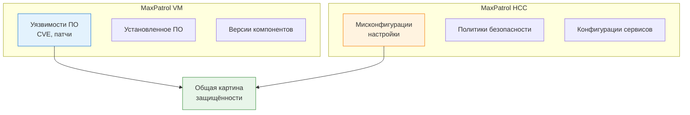
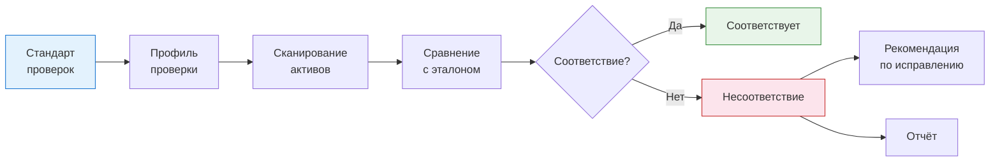
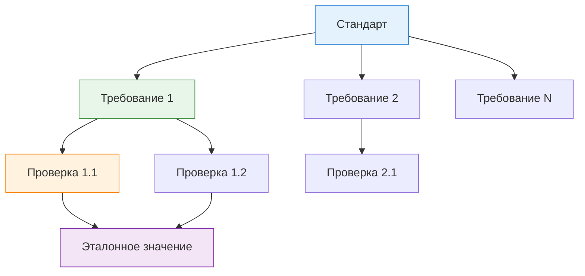
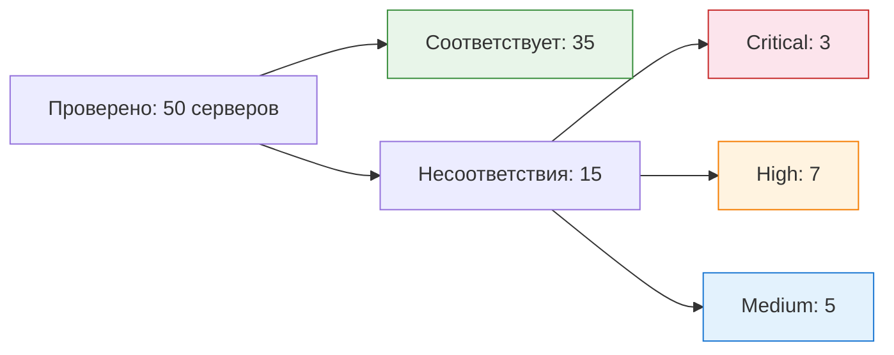

---
tags:
  - maxpatrol-vm
  - vulnerability-management
  - learning
  - stage-8
  - hcc
  - compliance
status: в-progress
created: 2026-08-25
stage: 8
---

# Этап 8 — Контроль соответствия и HCC

> [!todo] Приоритет: СРЕДНИЙ-НИЗКИЙ (специфичная тема)
> MaxPatrol HCC (Host Configuration Control) — для организаций, которым нужен жёсткий контроль соответствия стандартам.

---

## 8.1 Контроль соответствия стандартам

### Что такое HCC

**MaxPatrol HCC** (Host Configuration Control) — модуль MaxPatrol VM для комплаенс-контроля и харденинга инфраструктуры. Проверяет активы на соответствие внутренним и регуляторным требованиям безопасности.

> [!important] Разница между VM и HCC
> - **MaxPatrol VM** ищет *уязвимости* — известные ошибки в ПО (CVE, патчи)
> - **MaxPatrol HCC** ищет *мисконфигурации* — небезопасные настройки систем (избыточные права, открытые порты, слабые пароли, некорректные политики)



### Зачем нужен HCC

> [!warning] Проблема
> Уязвимости конфигураций сложно обнаружить: нет единого реестра, не находятся простым сканированием, нет готовых патчей, сложно объяснить ИТ-отделу необходимость изменений.

HCC решает эту проблему:

| Задача | Как решает HCC |
| --- | --- |
| Проверка соответствия стандартам | Готовые профили проверок (PT Essentials, ФСТЭК) |
| Кастомные требования | Конструктор собственных проверок |
| Контроль харденинга | Рекомендации по исправлению |
| Мониторинг | Дашборды с метриками соответствия |
| Отчётность | Отчёты для руководства и проверяющих |

### Как работает HCC



### Стандарты и профили проверок

#### PT Essentials

> [!tip] Рекомендация: начните с PT Essentials
> PT Essentials — оптимальный базовый набор проверок, созданный на основе мировых стандартов и опыта экспертов Positive Technologies в проведении пентестов.

**Ключевой принцип PT Essentials:**
> 20% самых важных требований закрывают до 80% уязвимых мест инфраструктуры.

**Модули PT Essentials:**

| Модуль | Описание | Проверяет |
| --- | --- | --- |
| **Доступ** | Управление доступом | Лишние учётные записи, права, пароли |
| **Сеть** | Сетевая безопасность | Открытые порты, правила файрвола, шифрование |
| **Шифрование** | Криптографическая защита | TLS/SSL, шифрование дисков, SSH |
| **Пароли** | Парольная политика | Сложность, срок жизни, история |
| **Регистрация** | Аудит и логирование | Настройки аудита, журналы |
| **Сервисы** | Безопасность сервисов | Настройки веб-серверов, БД, почты |
| **Организация** | Организационные меры | Бэкапы, обновления, резервирование |

#### Стандарты ФСТЭК

| Стандарт | Описание | Применение |
| --- | --- | --- |
| Базовые меры защиты (117) | Минимальные требования к защите ПДн | Обязательно для обработки ПДн |
| Контроль защищённости (239) | Проверка выполнения мер | Контроль соответствия |
| Оценка защищённости (235) | Методика оценки | Периодический аудит |

#### Встроенные стандарты HCC

| Стандарт | Описание |
| --- | ---|
| PT Essentials (Linux) | Базовый харденинг Linux-систем |
| PT Essentials (Windows) | Базовый харденинг Windows-систем |
| PT Essentials (Network) | Безопасность сетевого оборудования |
| PT Essentials (Database) | Безопасность СУБД |
| CIS Benchmarks | Центре Интернет-безопасности (через кастомизацию) |

---

## 8.2 Настройка политик соответствия

### Архитектура политик



| Уровень | Описание | Пример |
| --- | --- | --- |
| **Стандарт** | Набор требований | «Безопасность Linux-серверов» |
| **Требование** | Группа проверок | «Безопасность SSH» |
| **Проверка** | Конкретная проверка | «SSH-сервер использует только протокол 2» |
| **Эталон** | Ожидаемое значение | `Protocol = 2` |

### Создание профиля проверки

**Пошаговый процесс:**

1. Перейдите в **HCC → Стандарты → Создать стандарт**
2. Дайте название и описание
3. Добавьте требования:
   - Название требования
   - Описание
   - PDQL-фильтр активов (для каких активов проверять)
4. Добавьте проверки в каждом требовании:
   - Название проверки
   - Описание
   - Метод проверки (PDQL, Audit Extension)
   - Эталонное значение
   - Критичность (Critical / High / Medium / Low)
5. Сохраните стандарт
6. Запустите проверку

### Сравнение с эталоном

> [!note] Каждая проверка = PDQL-запрос + эталон
> Проверка HCC — это PDQL-запрос, который собирает значение параметра, и сравнение этого значения с эталоном.

**Пример проверки: «SSH использует только протокол 2»**

| Параметр | Значение |
| --- | --- |
| Проверка | Версия протокола SSH |
| PDQL-запрос | `select(@UnixHost, UnixHost.SSH.Protocol) \| filter(UnixHost.SSH)` |
| Эталон | `Protocol = 2` |
| Результат при несоответствии | `Protocol = 1` → Несоответствие (High) |

**Пример проверки: «Нет избыточных прав»**

| Параметр | Значение |
| --- | --- |
| Проверка | Учётные записи в группе Administrators |
| PDQL-запрос | `select(@WindowsHost, WindowsHost.LocalGroups.Members)` |
| Эталон | Количество членов <= 3 |
| Результат при несоответствии | Количество > 3 → Несоответствие (Medium) |

### Кастомные проверки

> [!tip] Свой контент
> MaxPatrol HCC позволяет создавать собственные проверки с помощью Audit Extension — скриптов сбора данных.

**Процесс создания кастомной проверки:**

1. **Audit Extension** — скрипт сбора данных:
   - Язык: PowerShell (Windows) / Bash (Linux)
   - Собирает нужный параметр с актива
   - Пример: наличие Telegram, настройки Sysmon, версия EDR-агента

2. **Комплаенсовая проверка** — PDQL-правило:
   - Использует данные из Audit Extension
   - Сравнивает с эталоном
   - Возвращает результат: Соответствует / Не соответствует

3. **Загрузка в библиотеку**:
   - Упаковать в ZIP-архив
   - Загрузить в библиотеку требований HCC
   - Импортировать в стандарт

**Примеры кастомных проверок:**

| Проверка | Что собирает | Эталон |
| --- | --- | --- |
| Наличие Telegram | Список установленного ПО | Telegram отсутствует |
| Наличие EDR-агента | Статус службы EDR | Служба запущена |
| Настройки Sysmon | Конфигурация Sysmon | Sysmon установлен и настроен |
| Политика макросов | Реестр Office | Макросы заблокированы |
| Версия PostgreSQL | Параметры СУБД | Версия >= 14 |

### Результаты проверок

| Статус | Описание | Цвет |
| --- | --- | --- |
| **Соответствует** | Параметр совпадает с эталоном | Зелёный |
| **Не соответствует** | Параметр не совпадает | Красный |
| **Не проверено** | Проверка не выполнена | Серый |
| **Ошибка** | Проблема с выполнением | Оранжевый |

---

## 8.3 Мониторинг и отчётность

### Дашборды HCC

| Метрика | Описание |
| --- | --- |
| Общий % соответствия | Доля проверок «Соответствует» от общего числа |
| Несоответствия по критичности | Распределение по Critical/High/Medium/Low |
| Несоответствия по стандартам | По каким стандартам больше нарушений |
| Динамика соответствия | Тренд за 3/6/12 месяцев |
| Топ активов по нарушениям | Активы с наибольшим количеством несоответствий |
| Топ требований по нарушениям | Какие требования нарушены чаще всего |

### Отчёты

| Отчёт | Назначение | Периодичность |
| --- | ---| --- |
| Статус соответствия | Общая картина | Еженедельно |
| Несоответствия по активам | Детали по каждому активу | По требованию |
| Динамика исправлений | Прогресс харденинга | Ежемесячно |
| Для проверок ФСТЭК | Результаты контроля | По требованию |

### PDQL-запросы для анализа HCC

**Все несоответствия:**

```sql
select(@Host, Host.Fqdn, Host.HCC.CheckName, Host.HCC.Status)
| filter(Host.HCC.Status = 'NonCompliant')
| sort(Host.HCC.CheckName)
```

**Несоответствия с критичностью Critical:**

```sql
select(@Host, Host.Fqdn, Host.HCC.CheckName, Host.HCC.Severity)
| filter(Host.HCC.Status = 'NonCompliant' and Host.HCC.Severity = 'Critical')
```

**Активы с наибольшим количеством нарушений:**

```sql
select(@Host, Host.Fqdn)
| filter(Host.HCC.Status = 'NonCompliant')
| group(@Host, COUNT(*) as Violations)
| sort(Violations DESC)
| limit(10)
```

---

## Практический пример: харденинг Linux-серверов

> [!example] Кейс
> Проверка Linux-серверов на соответствие базовым требованиям безопасности.

### Шаг 1 — Выбор стандарта

Стандарт: **PT Essentials (Linux)**

### Шаг 2 — Ключевые проверки

| Требование | Проверка | Эталон | Критичность |
| --- | --- | --- | --- |
| SSH | Протокол | Version = 2 | High |
| SSH | Root login | PermitRootLogin = no | Critical |
| SSH | Парольная аутентификация | PasswordAuthentication = no | High |
| Пароли | Минимальная длина | MinLen >= 8 | High |
| Пароли | Срок жизни | MaxDays <= 90 | Medium |
| Ядро | ASLR | RandomizeVaSpace = 2 | High |
| Сеть | IP forwarding | Forwarding = 0 | Medium |
| Сеть | ICMP redirect | AcceptRedirects = 0 | Medium |
| Файлы | SUID-файлы | Количество <= 10 | Low |
| Сервисы | Лишние сервисы | Список разрешённых | Medium |

### Шаг 3 — Результаты



### Шаг 4 — Действия

1. **Critical (3):** Немедленное исправление (Root login, SSH-протокол)
2. **High (7):** В течение 2 недель (пароли, ASLR)
3. **Medium (5):** В течение 1 месяца (сеть, сервисы)

---

## Краткое резюме Этапа 8

| Аспект | Ключевая мысль |
| --- | --- |
| HCC | Модуль для комплаенс-контроля и харденинга |
| VM vs HCC | VM = уязвимости ПО, HCC = мисконфигурации |
| PT Essentials | 20% требований закрывают 80% проблем |
| Стандарты | Встроенные (PT Essentials, ФСТЭК) + кастомные |
| Кастомные проверки | Audit Extension + PDQL-правило |
| Результаты | Соответствует / Не соответствует / Не проверено |
| Мониторинг | Дашборды, PDQL-запросы, отчёты |

---

## Связанные заметки

- [[Этап 7 — Визуализация, отчётность и мониторинг]] — предыдущий этап
- [[9. REST API и интеграции]] — следующий этап
- [[Этап 1 — Теоретические основы управления уязвимостями]] — ФСТЭК нормативная база
- [[План изучения MaxPatrol VM]] — общий план обучения

## Ресурсы

- [MaxPatrol HCC — продукт](https://ptsecurity.com/products/maxpatrol-hcc/)
- [MaxPatrol HCC — брифкнига](https://static.ptsecurity.com/uploads/files/maxpatrol_vm_mphcc_briefbook_b2e3a61dd7.pdf)
- [Вебинар: MaxPatrol HCC — что нового](https://ptsecurity.com/research/webinar/maxpatrol-hcc-what-s-new-in-the-module/)
- [Вебинар: Комплаенс-контроль с результатом](https://ptsecurity.com/research/webinar/compliance-control-with-result-maxpatrol-hcc-and-maxpatrol-vm-2-0/)
- [Вебинар: Свои требования в HCC](https://ptsecurity.com/research/webinar/zhivi-po-svoim-trebovaniyam-kak-nastroit-komplaens-kontrol-nuzhnyj-imenno-vam/)
- [Добавление своего контента в HCC](https://avleonov.ru/2024/09/13/1866-dobavlenie-svoego-kontenta-v-maxpatrol-hcc/)

---

*Следующий этап: [[9. REST API и интеграции]]*
