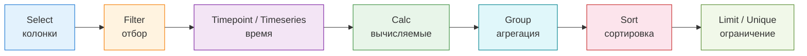

---
tags:
  - maxpatrol-vm
  - vulnerability-management
  - positive-technologies
  - pdql
  - reference
status: reference
created: 2026-10-05
product-version: 2.0
source-doc: Синтаксис языка запросов PDQL (ред. от 28.07.2023)
---

# PDQL — синтаксис по официальной документации PT

> [!info] Источник
> [!pdqlsyntax.pdf](pdqlsyntax.pdf) — MaxPatrol VM, версия 2.0, документ «Синтаксис языка запросов PDQL», дата редакции 28.07.2023, © Positive Technologies.
> Заметка — выжимка этого документа: полный перечень операций, предикатов, псевдонимов, операторов, типов данных и математических функций. Дополнительно сверено с локальной документацией **MaxPatrol VM 2.8** (раздел «Справочник по языку запросов PDQL») — расхождения исправлены по ней.

PDQL (Positive Data Query Language) — язык запросов MaxPatrol VM для фильтрации активов, настройки представления данных, объединения активов в динамические группы и построения виджетов. Условие на PDQL — это логическое выражение (предикат) над объектами модели активов.

---

## 1. Операции запроса (конвейер)

Запрос собирается из операций, разделённых вертикальной чертой `" | "`. **Каждая следующая операция применяется к результату предыдущей** — порядок важен.

| Операция | Синтаксис | Назначение |
| --- | --- | --- |
| Выбор колонок | `Select(<Поле 1>, …, <Поле N>)` | состав колонок таблицы |
| Фильтрация | `Filter(<Условие фильтрации>)` | отбор записей по условию |
| Данные за момент времени | `Timepoint(<Условие фильтрации>)` | срез данных на момент времени |
| Данные за период | `Timeseries(<Условие фильтрации>)` | срез данных за период (для виджетов) |
| Группировка и агрегация | `Group(<Поле 1>, …, <Поле N>, <Матем. функция>(<Поле>))` | группировка + агрегат |
| Сортировка | `Sort(<Поле 1> ASC)` / `Sort(<Поле N> DESC)` | порядок записей |
| Вычисляемые колонки | `Calc(<Условие>)` | вычисляемое поле, смена регистра |
| Ограничение | `Limit(<Количество записей в таблице>)` | ограничение выборки |
| Уникальность | `Unique()` | только уникальные записи |
| Объединение | `Join(<Условие фильтрации> as <Псевдоним>, <Условие объединения>)` | объединение двух запросов |
| Быстрый поиск | `qsearch(<Строка>)` | поиск по заданной строке (например, FQDN или IP актива) |

> [!note] Операции по списку зарезервированных слов
> В [[Зарезервированные слова]] как операции перечислены: `qsearch, select, filter, sort, limit, unique, group, join, calc`. `Timepoint` и `Timeseries` в этом списке не названы, но описаны в [[Фильтрация активов в таблице]] и используются в конвейере так же, как остальные операции.



> [!important] Условие можно вводить и без конвейера
> В динамической группе достаточно одного условия — например `Host.HostType = 'Server'`. Конвейер нужен только когда результат надо преобразовать (выбрать колонки, отсортировать, посчитать).

---

## 2. Предикаты

Предикат — логическое выражение на языке PDQL. Строится из объектов и атрибутов модели активов, данных паспортов активов, данных об уязвимостях, псевдонимов и операторов.

### 2.1 Предикат существования

Ищет активы, у которых есть указанный атрибут.

```text
Host                                          — все сетевые узлы
Host<WindowsHost>                             — узлы с ОС семейства Windows
WindowsHost.Softs<KasperskySecurityCenter>.Plugins
```

### 2.2 Предикат равенства

Используется в `Join` — объединяет названия колонок из разных таблиц результатов.

```text
@UnixHost = U.@UnixHost
```

> [!note] Про колонки с `@<Актив>`
> Колонки вида `@HOST`, `@ACTIVEDIRECTORY` при сравнении в `Join` сравниваются **по ID актива**, а не по имени.

### 2.3 Прочие предикаты

Сравнение (`>`, `<`, `>=`, `<=`), вхождение (`IN`), а также предикаты на других операторах (`LIKE`, `MATCH`, `CONTAINS`, `INTERSECT`). Первый операнд задаётся как в предикате существования, значение — **только соответствующего типа данных**.

```text
Host.@IpAddresses.Item in 203.0.113.0/20
UnixHost.Softs.Name like '%Apache%'
```

### 2.4 Вложенные условия

Для сложных условий используются квадратные скобки `[ ]`, логические операторы `AND` / `OR` / `NOT` и круглые скобки `()` для приоритета.

```text
Host[HostRoles.Role = 'File Service' and Host.OsCandidates.Family = 'Windows' and Host.OsName != 'Windows 7']
WindowsHost.Endpoints<TransportEndpoint>[Status = 'Open' and Protocol = 'tcp' and Port = 3389]
Host [not Softs.Name = "Kaspersky"]
```

Из запросов документации: `Filter(Host.HostRoles.Role = 'File Service' and Host.OsCandidates.Family = 'Windows' and Host.OsName != 'Windows 7') | Select(@Host)` — файловые службы на ОС, отличных от Windows 7 (см. [[Предикаты для создания условия фильтрации]]).

> [!warning] Операнды должны быть одного типа
> В предикатах нельзя смешивать типы операндов: `@WindowsHost`, `WindowsHost.@CumulativeVulnerability`, `WindowsHost.@UpdateTime`, `WindowsHost.Groups.Name` — не взаимозаменяемы.

> [!warning] Полный модельный путь — через двоеточия
> В предикатах, которые обращаются к полному модельному пути (`@FullType`), вместо точек используются двоеточия: `WindowsHost.Softs<Software:Kaspersky:KasperskySecurityCenter>.Plugins`.

### 2.5 Значение `null`

`<Операнд> = null` проверяет отсутствие значения, `<Операнд> != null` — наличие. Вместо `<Операнд> != null` можно писать просто `<Операнд>`.

> [!warning] Ограничение
> `= null` **не применяется к псевдонимам**.

### 2.6 Форматы времени

При фильтрации по времени значение поля `time` задаётся в форматах:

- `YYYY-MM-DD'T'HH:MM:SS`
- `YYYY-MM-DD'T'HH:MM`
- `YYYY-MM-DD`

---

## 3. Фильтрация по времени

```text
Синтаксис: <Атрибут актива или его псевдоним> <Оператор> <Момент времени>() <Арифметическая операция> <Период>
```

- сложение `+` — период **в будущем** (например, скорое устаревание актива)
- вычитание `-` — период **в прошлом** (например, недавняя смена пароля)

### 3.1 Моменты времени

| Момент | Функция |
| --- | --- |
| Пользовательское значение | `DateTime` в формате из п. 2.6 |
| Сейчас | `Now()` |
| Начало / конец текущего часа | `Startofhour()` / `Endofhour()` |
| Начало / конец текущего дня | `Startofday()` / `Endofday()` |
| Начало / конец текущей недели | `Startofweek()` / `Endofweek()` |
| Начало / конец текущего месяца | `Startofmonth()` / `Endofmonth()` |
| Начало / конец текущего года | `Startofyear()` / `Endofyear()` |

### 3.2 Период

```text
<Количество><Ед. времени 1><Количество><Ед. времени 2>…<Количество><Ед. времени N>
```

| Единица | Сокращения |
| --- | --- |
| год | `y`, `year`, `years` |
| месяц | `mo`, `month`, `months` |
| неделя | `w`, `week`, `weeks` |
| день | `d`, `day`, `days` |
| час | `h`, `hour`, `hours` |
| минута | `mi`, `minute`, `minutes` |
| секунда | `s`, `second`, `seconds` |

> [!important] Два правила записи периода
> - Единицы перечисляются **по убыванию**: `1year2months3weeks`, `4d5h6mi`.
> - Единицы **регистронезависимы**.

> [!note] Часовой пояс
> Всё время в системе — **UTC+0**.

### 3.3 Примеры

```text
# Активы, которые устареют в течение недели
Select(@Host, Host.@DeletionTime) | Filter(Host.@DeletionTime <= Now() + 7days)

# Учётные записи, у которых за месяц сменился пароль
Select(UnixHost.User<UnixUser>.Name, UnixHost.User<UnixUser>.PasswordLastChanged as "Смена пароля")
| Filter("Смена пароля" > Now() - 1Mo)

# Активы, появившиеся за последнюю неделю (динамическая группа)
Host.@CreationTime >= Now() - 1W

# Высокозначимые активы с опасными уязвимостями — динамика по дням
Filter(Host.@Importance in ['H', 'M'])
| Timeseries(30d, 1d, Endofday())
| Filter(Host.@Vulners.CVSS2SCORE > 7)
| Select(@Host, Host.@Time)
| Group(Host.@Time, Count(*))
```

---

## 4. Объединение запросов (Join)

```text
Синтаксис: <Запрос 1> | Join(<Запрос 2> as <Псевдоним>, <Условие объединения>)
```

Условие объединения образуется предикатами равенства, соединёнными `AND` / `OR` и скобками. Псевдоним запроса не обязателен — без него используется название колонки.

```text
Select(@UnixHost, UnixHost.Groups.Name, UnixHost.Groups.Users)
| Join(
    Select(@UnixHost, UnixHost.User.ID, UnixHost.User.Name) as U,
    @UnixHost = U.@UnixHost and UnixHost.Groups.Users = U.UnixHost.User.Name
  )
| Select(@UnixHost, UnixHost.Groups.Name, U.UnixHost.User.ID, UnixHost.Groups.Users)
```

---

## 5. Изменение регистра данных (Calc)

Нужно, когда регистр данных об активах отличается от регистра данных о событиях — иначе не работают правила корреляции и обогащения.

```text
Синтаксис: Calc(<upper|lower>(<Поле>) as <Псевдоним>)
```

```text
Filter(Host.HostRoles.Role = 'Domain Controller')
| Select(Host.Fqdn, Host.@IpAddresses as ip, Host.@Id as id)
| Calc(lower(Host.FQDN) as fqdn)
| Select(fqdn, ip, id)
```

`Calc` используется не только для смены регистра, но и для вычислений, в том числе с условным оператором `if / then / else` (входит в [[Зарезервированные слова]]). Пример из документации — расчёт уровня критичности уязвимости:

```text
calc(if total > 8 then "Critical" else if total >= 5 then "High" else if total >= 2 then "Medium" else "Low" as criticality)
```

Источник: [[Оценка уровня опасности уязвимостей на активах по методике ФСТЭК]].

---

## 6. Псевдонимы

Псевдонимы объединяют похожие атрибуты модели активов, имена и описания активов, данные об уязвимостях. Принимаются в любом регистре.

### 6.1 Общие псевдонимы активов

| Псевдоним | Что ищет | Динамическая группа |
| --- | --- | --- |
| `@HOST` | узлы (отображаемое имя, ID, тип актива, тип устройства) | ✅ |
| `@ACTIVEDIRECTORY` | службы каталогов Active Directory | ✅ |
| `@WEBSITE` | веб-приложения | ✅ |
| `@NAME` | атрибут `DisplayName` | ✅ |
| `@ID` | атрибут `GUID` | ✅ |
| `@TYPE` | тип актива (полное или краткое наименование) | ✅ |
| `@FULLTYPE` | полное наименование типа актива в доменной модели | ✅ |
| `@TYPEALIAS` | значение для импорта активов; по умолчанию `@CoreHost` | ✅ |
| `@DEVICETYPE` | атрибут `DeviceType` | ✅ |
| `@DESCRIPTION` | атрибут `Description` | ✅ |
| `@IMPORTANCE` | значимость: High / Medium / Low / Undefined | ❌ |
| `@CUMULATIVEVULNERABILITY` | интегральная уязвимость актива | ❌ |

> [!note] `@ACTIVEDIRECTORY` и `@WEBSITE`
> Активы служб каталогов Active Directory доступны в таблице активов только после создания динамической группы с фильтром `ActiveDirectory`, а активы веб-приложений — после создания группы с фильтром на основе корневой сущности `WebSite` (см. [[Общие псевдонимы активов]]).

### 6.2 Адреса узлов

| Псевдоним | Назначение |
| --- | --- |
| `@IPADDRESSES` | IP-адреса актива; объединяет `Host.IpAddress`, `Host.Interfaces.L3Settings.Address.Address.Address` и др. |
| `@IPADDRESSES.ITEM` | отдельный IP — только в условии фильтрации **до выбора полей** |
| `@MACADDRESSES` | MAC-адреса: `Host.MacAddress`, `Host.Interfaces.L2Settings.MacAddress`, `Host<Computer>.NetworkCard.Mac` |
| `@MACADDRESSES.ITEM` | отдельный MAC — только до выбора полей |
| `@IPLIST` | список IP через разделитель `" \| "` |
| `@MACLIST` | список MAC через разделитель `" \| "` — *в документации 2.8 не описан* |
| `@IPENDPOINTLIST` | список IP-адресов целей межсетевого взаимодействия |
| `@ETHERNETENDPOINTLIST` | список MAC-адресов целей межсетевого взаимодействия |

> [!warning] Имена списков адресов
> В документации MaxPatrol VM 2.8 приведены `@IPENDPOINTLIST` (список IP-адресов целей) и `@ETHERNETENDPOINTLIST` (список MAC-адресов целей) — записи вида `@ETHERNETIPENDPOINTLIST` не существует. Псевдоним `@MACLIST` в документации 2.8 не описан; при ошибке используйте `@MACADDRESSES` / `@MACADDRESSES.ITEM`. См. [[Псевдонимы адресов узлов]].

```text
Host.@IpAddresses contains 192.0.2.10
Host.@IpAddresses intersect [192.0.2.10, 192.0.2.12]
Host.@IpAddresses.Item in 192.0.2.0/24
```

### 6.3 Псевдонимы времени

| Псевдоним | Смысл |
| --- | --- |
| `@CREATIONTIME` | момент появления данных об активе в системе |
| `@UPDATETIME` | последнее обновление данных об активе |
| `@DELETIONTIME` | предполагаемое время устаревания (удаления из системы) |
| `@AUDITTIME` | последний сбор данных модулем Audit |
| `@PENTESTTIME` | последний сбор данных модулем Pentest |
| `@TIME` | расчёт актива на выбранный момент времени |
| `@PREVIOUSTIME` | расчёт на предыдущий момент времени |

### 6.4 Инфраструктуры

| Псевдоним | Смысл |
| --- | --- |
| `@SCOPE` | параметры инфраструктуры (ID и название) |
| `@SCOPE.ID` | идентификатор инфраструктуры |
| `@SCOPE.NAME` | название инфраструктуры |

### 6.5 Группы активов

| Псевдоним | Смысл |
| --- | --- |
| `@GROUPS` | ID, название и тип группы (динамическая / статическая) |
| `@GROUPS.ID` | идентификатор группы |
| `@GROUPS.NAME` | название группы |
| `@GROUPS.TYPE` | тип группы |
| `@GROUPS.PATH` | полный путь к группе, группы разделены `/`: `Group A/Group B/Group C/My Group` |

> [!warning] Ограничения по группам
> - Группа «Все активы» не учитывается при фильтрации по псевдонимам групп.
> - Псевдонимы групп **нельзя** использовать для объединения активов в динамическую группу.

### 6.6 Псевдонимы уязвимостей

Уязвимости рассматриваются как виртуальные объекты типа `Vulners`. Чтобы показать уязвимости **только текущего узла**, а не вложенных, добавьте префикс `NODE` — например `@NODEVULNERS.NAME`.

| Псевдоним | Смысл | Динамическая группа |
| --- | --- | --- |
| `@VULNERS` | название и описание уязвимости | ✅ |
| `@VULNERS.NAME` / `.DESCRIPTION` | название / описание | ✅ |
| `@VULNERS.SEVERITYRATING` | уровень опасности | ❌ |
| `@VULNERABILITYSEVERITYRATING` | максимальный уровень опасности по активу | ✅ |
| `@VULNERS.DISCOVERYTIME` | время обнаружения | ✅ |
| `@VULNERS.HOWTOFIX` | способ устранения | ✅ |
| `@VULNERS.LINKS` | ссылки на информацию об уязвимости | ✅ |
| `@VULNERS.ISSUETIME` | дата публикации | ✅ |
| `@VULNERS.ISDANGER` | отметка «важная» | ✅ |
| `@VULNERS.TAGS` / `.TAGS.ITEM` | пользовательские метки / отдельные метки | ✅ |
| `@VULNERS.HASPENTESTCHECK` | наличие пентест-проверки | ✅ |
| `@NODEVULNERS` | уязвимости ОС | ✅ |
| `@VULNERS.IMPACT` | тип последствий эксплуатации | ✅ |
| `@VULNERS.ID` | идентификатор уязвимости | ✅ |
| `@VULNERS.CVES` / `.CVES.ITEM` | идентификаторы CVE | ✅ |
| `@VULNERS.KB` | ID в базе Knowledge Base MaxPatrol VM (встречается в примерах запросов документации, например `Host.Softs.@Vulners.KB`) | ✅ |
| `@VULNERS.IDS` | любые ID из публичных баз (CVE, банк данных угроз ФСТЭК), кроме KB | ✅ |
| `@VULNERS.SCORE` | общая оценка | ❌ |
| `@VULNERS.CVSS2SCORE` / `@VULNERS.CVSS3SCORE` | оценки CVSS v2 / v3 | ✅ |
| `@VULNERS.CVSS2BASESCORE` / `@VULNERS.CVSS3BASESCORE` | базовые оценки | ✅ |
| `@VULNERS.CVSS2TEMPORALSCORE` / `@VULNERS.CVSS3TEMPORALSCORE` | временные оценки | ✅ |
| `@VULNERS.CVSS2ENVIRONMENTALSCORE` / `@VULNERS.CVSS3ENVIRONMENTALSCORE` | контекстные оценки | ❌ |
| `@VULNERS.CVSS2BASEVECTOR` / `@VULNERS.CVSS3BASEVECTOR` | базовые векторы | ✅ |
| `@VULNERS.CVSS2TEMPORALVECTOR` / `@VULNERS.CVSS3TEMPORALVECTOR` | временные векторы | ✅ |
| `@VULNERS.CVSS2ENVIRONMENTALVECTOR` / `@VULNERS.CVSS3ENVIRONMENTALVECTOR` | контекстные векторы | ❌ |
| `@VULNERS.CVSS2VECTOR` / `@VULNERS.CVSS3VECTOR` | общий вектор (если задан базовый) | ❌ |
| `@VULNERS.STATUS` / `.STATUSUPDATETIME` | статус уязвимости / время его изменения | ✅ |
| `@VULNERS.STATUSREASON` | уточнение к статусу | ✅ |
| `@VULNERS.STATUSCOMMENT` | комментарий к статусу | ✅ |
| `@VULNERS.TYPE` | тип уязвимости | ✅ |
| `@VULNERS.THREATID` | идентификатор экземпляра веб-уязвимости, заданный в модуле WebEngine | ✅ |
| `@VULNERS.FIXTYPE` | тип устранения | ✅ |
| `@VULNERS.LASTFIXTIME` | время последнего устранения | ✅ |
| `@VULNERS.DUETIME` | срок устранения или исключения | ✅ |
| `@VULNERS.METRICS` | метрики уязвимости | ✅ |
| `@VULNERS.METRICS.EXPLOITABLE` | возможность эксплуатации | ✅ |
| `@VULNERS.METRICS.HASFIX` | возможность устранения | ✅ |
| `@VULNERS.METRICS.HASPATCH` | наличие патча для устранения | ✅ |
| `@VULNERS.METRICS.HASNETWORKATTACKVECTOR` | эксплуатация по сети | ✅ |
| `@VULNERS.PATCH` + `.DISPLAYNAME`, `.PATCHTYPE`, `.PATCHDATE`, `.PATCHLINK` | патч: название, тип, дата, ссылка | ✅ |
| `@VULNERS.ISTREND` / `.ISTRENDSINCE` | трендовая уязвимость / дата попадания в список | ✅ |
| `@VULNERS.PACKAGEID` / `.PACKAGEVERSION` / `.PACKAGEDESCRIPTION` | пакет уязвимостей | ✅ |

> [!note] Значения статусов
> `@VULNERS.STATUS` — `null`, `new`, `excluded`, `inProgress`, `awaitingFix`, `fixed`, `overdue`, `stale`.
> `@VULNERS.STATUSREASON` — `AcceptedAsLowRisk`, `CannotFix`, `CompensatingControl`, `FalsePositive`, `FalsePositiveResolved`, `OfficialFix`.
>
> Пример запроса из документации:
> ```text
> Host.@Vulners.Status in ['new', 'inProgress', 'awaitingFix', 'stale', 'overdue', 'fixed', 'excluded']
> ```
> См. [[Псевдонимы уязвимостей]].

### 6.7 Псевдонимы полей паспорта уязвимости

Виртуальные объекты типа `VulnerPassport.<Поле>`.

| Псевдоним | Смысл |
| --- | --- |
| `@VULNERPASSPORT` | поля паспорта уязвимости |
| `@VULNERPASSPORT.NAME` / `.DESCRIPTION` | название / описание |
| `@VULNERPASSPORT.TYPE` | тип уязвимости (для поиска по типу) |
| `@VULNERPASSPORT.SEVERITYRATING` | уровень опасности |
| `@VULNERPASSPORT.ISSUETIME` | дата публикации паспорта |
| `@VULNERPASSPORT.HOWTOFIX` / `.LINKS` | устранение / ссылки |
| `@VULNERPASSPORT.HASPENTESTCHECK` | наличие пентест-проверки |
| `@VULNERPASSPORT.ID` | ID паспорта |
| `@VULNERPASSPORT.KB` | *в документации 2.8 не описан*; в примерах запросов используется обращение `Host.Softs.@Vulners.KB` (см. 6.6) |
| `@VULNERPASSPORT.IDS` | ID из публичных баз (кроме KB) |
| `@VULNERPASSPORT.CVES` | идентификаторы CVE |
| `@VULNERPASSPORT.SCORE` | общая оценка (берётся из CVSS3, иначе CVSS2) |
| `@VULNERPASSPORT.CVSS2SCORE` / `@VULNERPASSPORT.CVSS3SCORE` | оценки CVSS |
| `@VULNERPASSPORT.CVSS2BASESCORE` / `CVSS3BASESCORE` | базовые оценки |
| `@VULNERPASSPORT.CVSS2TEMPORALSCORE` / `CVSS3TEMPORALSCORE` | временные оценки |
| `@VULNERPASSPORT.CVSS2BASEVECTOR` / `CVSS3BASEVECTOR` | базовые векторы |
| `@VULNERPASSPORT.CVSS2TEMPORALVECTOR` / `CVSS3TEMPORALVECTOR` | временные векторы |
| `@VULNERPASSPORT.CVSS2VECTOR` / `CVSS3VECTOR` | общий вектор |
| `@VULNERPASSPORT.METRICS` + `.EXPLOITABLE`, `.HASFIX`, `.HASNETWORKATTACKVECTOR` | метрики |
| `@VULNERPASSPORT.AFFECTEDCOMPONENTS` + `.NAME`, `.VENDOR` | уязвимое ПО: название / поставщик |
| `@VULNERPASSPORT.ISTREND` / `.ISTRENDSINCE` | трендовая уязвимость / дата |
| `@VULNERPASSPORT.PACKAGEID` / `.PACKAGEVERSION` / `.PACKAGEDESCRIPTION` | пакет уязвимостей |

### 6.8 Псевдонимы колонок и запросов

```text
Синтаксис колонки: <Поле> as <Имя>   или   <Выражение> as <Имя>
Синтаксис запроса: <Запрос> as <Псевдоним>
```

- Псевдоним колонки может содержать любые символы стандарта UTF-8 и не может начинаться либо заканчиваться пробелом; в кавычки (одинарные или двойные) заключается, если: содержит символы, отличные от латиницы, кириллицы, цифр и `_`; начинается с цифры; совпадает с зарезервированным словом или нестроковой константой
- Псевдоним запроса: латинские или русские буквы, цифры, `_` и `-`; не может состоять только из цифр и не может начинаться с дефиса
- Псевдоним запроса добавляется ко всем колонкам: `1, 2, …, n, A.1, A.2, …, A.n`

```text
Select(Host.IpAddress as Ip, Host.FQDN as FQDN, Host.IsVirtual as IsVirtual)
| Group(count(*) as "Count")
```

`Count` — зарезервированное слово, поэтому заключено в кавычки (пример из [[Псевдонимы колонок таблицы]]).

---

## 7. Операторы

Все операторы **регистронезависимы**.

### 7.1 Сравнения и множественные операции

| Оператор | Значение | Синтаксис |
| --- | --- | --- |
| `=` | равенство | `<Операнд> = <Значение>` |
| `!=` | неравенство (можно `<Операнд>`) | `<Операнд> != <Значение>` |
| `>` | строгое больше | `<Операнд> > <Значение>` |
| `<` | строгое меньше | `<Операнд> < <Значение>` |
| `>=` | больше или равно | `<Операнд> >= <Значение>` |
| `<=` | меньше или равно | `<Операнд> <= <Значение>` |
| `IN` | вхождение в массив или диапазон | `<Операнд> IN [<Значение 1>, …, <Значение N>]`, `<Операнд> IN <Сеть>` |
| `LIKE` | шаблон с `_` (один символ) и `%` (любое количество) | `<Операнд> LIKE <Шаблон>` |
| `MATCH` | шаблон на регулярных выражениях | `<Операнд> MATCH <Шаблон>` |
| `-` | период в прошлом | `Now() - <Период>` |
| `+` | период в будущем | `Now() + <Период>` |
| `CONTAINS` | значение входит в список значений операнда | `<Операнд> CONTAINS <Значение>` |
| `INTERSECT` | пересечение множеств значений | `<Операнд> INTERSECT [<Массив значений>]` |

> [!note] `LIKE` и `MATCH`
> Перед применением оператора все неслужебные символы приводятся к нижнему регистру.

### 7.2 Логические операторы

| Оператор | Значение | Синтаксис |
| --- | --- | --- |
| `AND` | пересечение выборок | `<Предикат 1> AND <Предикат 2>` |
| `OR` | объединение выборок | `<Предикат 1> OR <Предикат 2>` |
| `NOT` | отрицание ветки актива | `NOT <Предикат>` |

Также доступны `NOT LIKE`, `NOT IN`, `NOT CONTAINS`, `NOT INTERSECT`, `NOT MATCH`.

> [!warning] Разница между `NOT` и постфиксным отрицанием
>
> ```text
> not Host.Softs.Name like 'A'
> ```
> — узлы, где нет **никакого** ПО, **плюс** узлы, где есть ПО, но ни одно не называется «A».
>
> ```text
> Host.Softs.Name not like 'A'
> ```
> — только узлы, где есть хотя бы одно ПО и ни одно не называется «A».

---

## 8. Типы данных (приложение А)

| Тип | Описание | Пример |
| --- | --- | --- |
| `Bool` | логическое значение | `True`, `False` |
| `Buffer` | массив байтов | `[0x68, 0x65, 0x6c, 0x6c, 0x6f]` |
| `DateTime` | время для фильтрации активов | `2020-07-22T18:08:38` |
| `Enum` | один из элементов предопределённого списка | — |
| `IPAddress` | IPv4 или IPv6 | `192.0.2.235`, `1080:0:0:0:8:800:200C:417A` |
| `KeyValue` | ассоциативный массив «ключ — значение» | `{"Красный":"Каждый"}` |
| `List` | список, элементы могут быть разных типов | `["Порт ", 22, " открыт"]` |
| `MACAddress` | MAC-адрес | `00:53:00:B8:DF:B8` |
| `Network` | адрес подсети в формате CIDR | `192.0.2.0/24` |
| `Null` | отсутствие данных | `null` |
| `Number` | целое число (диапазон int64) | `-3`, `0`, `12` |
| `String` | строка | `"Порт 22 открыт"` |
| `StringList` | список строк | `["Красный", "Оранжевый"]` |
| `UUID` | идентификатор RFC 4122, 128 бит | `123e4567-e89b-12d3-a456-426655440000` |
| `UUIDList` | список UUID | `["00000005-9d7c-011d-f000-0001e5c6e294"]` |

---

## 9. Математические функции (приложение Б)

Все функции агрегации: `Avg`, `Compact`, `Compactunique`, `Count`, `Countunique`, `Max`, `Median`, `Min`, `Sum` (см. [[Математические функции для работы с данными в системе]], [[Зарезервированные слова]]).

```text
Select [Поле 1], …, [Поле N] <Функция>([All] [Поле 1]) Where [Условие фильтрации] Group by [Поле 2] Over time [Период]
```

(для `Count` — `Count ([All] [Поле 1])`, `Count ([Distinct] [Поле 1])`, `Count (*)`; для `Countunique` — `Countunique ([Поле 1], …, [Поле N])`; пример `Avg`: `Select [Поле 1], …, [Поле N] Avg ([All] [Поле 1]) Where … Group by … Over time …` — см. [[Математические функции для работы с данными в системе]]).

| Функция | Аргументы | Что считает |
| --- | --- | --- |
| `Avg` | `All [Поле 1]` | среднее по колонке (только `Number`) |
| `Compact` | `Compact [Поле 1]` | компактная строка: значение объекта (`String`) + количество (`Number`); к данным любого типа |
| `Compactunique` | `Compactunique [Поле 1]` | то же, но по уникальным значениям |
| `Count` | — | количество значений за период (любой тип) |
| `Count` | `All [Поле 1]` | количество всех значений, кроме `Null` |
| `Count` | `Distinct [Поле 1]` | количество уникальных значений, кроме `Null` |
| `Count` | `*` | количество **всех** значений, включая повторяющиеся и `Null` |
| `Countunique` | `[Поле 1], …, [Поле N]` | количество уникальных значений / уникальных записей по набору колонок |
| `Max` | `All [Поле 1]` | максимум (только `Number`) |
| `Median` | `All [Поле 1]` | медиана (только `Number`) |
| `Min` | `All [Поле 1]` | минимум (только `Number`) |
| `Sum` | `All [Поле 1]` | сумма (только `Number`) |

> [!note] Пустые значения
> `Avg`, `Compact`, `Compactunique`, `Max`, `Median`, `Min`, `Sum` не учитывают значения типа `Null`. Если все значения в колонке `Null` — возвращается `0`. Исключение — `Count (*)`: он считает и `Null`.
> Аргумент `Distinct` у `Count` считает уникальные значения **кроме** `Null`.

> [!note] Оговорка про `median` в зарезервированных словах
> В [[Зарезервированные слова]] пункт `median` помечен как зарезервированный для использования в следующих версиях, но функция `Median` описана в документации и используется в примерах запросов.

---

## 10. Значения `@TYPEALIAS` (приложение В)

Используется при ручном создании активов и при импорте из файла.

| Значение | Тип устройства или ОС |
| --- | --- |
| `acs` | Cisco ACS |
| `aix` | AIX |
| `asa` | межсетевой экран Cisco ASA |
| `bsd` | BSD, FreeBSD, macOS, OS X |
| `checkpoint` | Check Point Gaia и SPLAT |
| `eos` | ОС Arista EOS |
| `esxi` | VMware ESX/ESXi |
| `fortigate` | Fortinet FortiGate |
| `ftd` | межсетевой экран Cisco FTD |
| `fwsm` | Cisco FWSM |
| `hp_ux` | HP-UX |
| `ios` | Cisco IOS и Cisco IOS XE |
| `ise` | Cisco ISE |
| `junos` | Juniper Jun OS |
| `linux` | семейство Linux |
| `nexus` | Cisco Nexus |
| `omniswitch` | Alcatel-Lucent OmniSwitch под AOS |
| `pan_os` | Palo Alto под PAN-OS |
| `pix` | Cisco PIX |
| `solaris` | Solaris |
| `vrp` | Huawei VRP |
| `windows` | семейство Windows |

---

## 11. Сводка примеров из документации

### Динамические группы

```text
Host.HostType = 'Server'                                          — все серверы
not WindowsHost                                                  — не Windows
Host.OsName = 'Windows 7'                                        — Windows 7
UnixHost.Softs.Name like '%Apache%'                              — Apache на Unix
Host.@Vulners.CVEs.Item = 'CVE-1999-1113'                        — активы с конкретной CVE
not Host.@IpAddresses.Item in 203.0.113.0/20                     — вне подсети
WindowsHost.Endpoints<TransportEndpoint>[Status = 'Open' and Protocol = 'tcp' and Port = 3389]
Host [not Softs.Name = "Kaspersky"]                              — без ПО Kaspersky
```

### Работа с таблицей активов

```text
# Список узлов с ОС, отсортированный по имени и версии ОС
Select(@Host, Host.OsName, Host.OsVersion) | Sort(Host.OsName ASC, Host.OsVersion ASC)

# Сетевые устройства с моделями
Select(@NetworkDeviceHost, NetworkDeviceHost.ModelNumber) | Sort(@NetworkDeviceHost ASC) | Filter(NetworkDeviceHost)

# Учётные записи на узлах
Select(@Host, Host.User.Name) | Filter(Host.User.Name) | Group(@Host) | Sort(@Host ASC)

# Группы пользователей на Unix-узлах + их состав
Select(@UnixHost, UnixHost.Groups.Name, UnixHost.Groups.Users)
| Join(Select(@UnixHost, UnixHost.User.ID, UnixHost.User.Name) as U,
       @UnixHost = U.@UnixHost and UnixHost.Groups.Users = U.UnixHost.User.Name)
| Select(@UnixHost, UnixHost.Groups.Name, U.UnixHost.User.ID, UnixHost.Groups.Users)

# Учётные записи Windows, где пароль менялся за последний месяц
Select(WindowsHost.User<WindowsUser>.Name, WindowsHost.User<WindowsUser>.PasswordLastChanged as t)
| Filter(t > Now() - 1Mo)

# Уникальное ПО, которое есть в системе
Select(Host.Softs.Name as name, Host.Softs.Version as version, Host.Softs.Vendor as vendor, Host.Softs.@Type as t)
| Filter(t = 'Software')
| Select(name, version, vendor)
| Unique()

# Родительские и дочерние процессы
Select(@Computer, Computer.Processes.Name, Computer.Processes.PID, Computer.Processes.ParentPID)
| Join(Select(@Computer, Computer.Processes.Name, Computer.Processes.PID) as P,
       @Computer = P.@Computer and Computer.Processes.ParentPID = P.Computer.Processes.PID)
| Select(@Computer, Computer.Processes.Name as child_proc, P.Computer.Processes.Name as parent_proc)
```

### Быстрый поиск (`qsearch`)

```text
qsearch("<FQDN актива>") | select(@Host, Host.OsName, Host.@CreationTime, Host.@UpdateTime,
  Host.Softs.@Id, Host.Softs, Host.Softs.Name, Host.Softs.Version, Host.Softs.InstallPath,
  Host.Softs.@Vulners, Host.Softs.@Vulners.KB) | sort(Host.Softs.@Vulners.KB DESC)
```

Источник — [[Выявление дублирования уязвимостей]]: в источнике также приведены варианты с `qsearch("<FQDN актива> (<IP-адрес актива>)")` и `qsearch("<IP-адрес актива>")`.

### Сводка колонок и оценок

```text
# Опасные уязвимости
Host.@Vulners.SeverityRating in ['Critical', 'High']

# Расчёт критичности
calc(if total > 8 then "Critical" else if total >= 5 then "High" else if total >= 2 then "Medium" else "Low" as criticality)
```

---

## 12. Что важно знать

> [!important] Общие правила
> - Все атрибуты модели активов, псевдонимы, названия и описания активов, идентификаторы CVE, поля и значения пользовательских полей — **регистронезависимы**.
> - Зарезервированные слова (операции, функции, операторы) тоже **регистронезависимы**: `COUNT(*)` и `Count(*)` — одно и то же.
> - `<Операнд> = null` не применяется к псевдонимам — используйте `<Операнд> != null`.
> - В динамических группах нельзя использовать `@Importance`, `@CumulativeVulnerability`, `@Vulners.Score`, `@VulnerPassport.Score`, контекстные метрики и векторы CVSS (`@Vulners.CVSS2ENVIRONMENTALSCORE`, `@VULNERS.CVSS2VECTOR` и им подобные), а также псевдонимы групп активов (`@GROUPS*`); можно `@Vulners.CVSS2SCORE` / `@VULNERS.CVSS3SCORE`, временные оценки и `@VulnerabilitySeverityRating` (максимальный уровень опасности по активу); `@Vulners.SeverityRating` в динамические группы не включается.
> - Операторы фильтрации применяются к **моменту времени или периоду**, а не ко всей истории.
> - `Timepoint` — срез на момент; `Timeseries` — срез за период, нужен для виджетов с распределением по времени.
> - Условие фильтрации вставляется в поле «Фильтр» или в поле «Указать на языке PDQL».
> - Колонки `@IpAddresses.Item` и `@MacAddresses.Item` работают **только** в условии фильтрации, до выбора полей.

---

## Связанные заметки

- [[4. Язык PDQL]] — учебная заметка этапа 4
- [[5. Работа с активами и уязвимостями]] — следующий этап
- [[План изучения]] — общий план изучения MaxPatrol VM
- [[Регламент управления уязвимостями]] — процесс VM уровня организации

## Ресурсы

- [!pdqlsyntax.pdf](pdqlsyntax.pdf) — исходный документ (вложение)
- [Синтаксис PDQL для фильтрации активов](https://help.ptsecurity.com/ru-RU/projects/vm/2.8/help/1501321995)
- [Справочник по языку PDQL](https://help.ptsecurity.com/ru-RU/projects/vm/2.8/help/1505039755)
- [PDQL-запросы для анализа активов](https://help.ptsecurity.com/ru-RU/projects/vm/2.8/help/1517373339)
- [first.org](https://www.first.org) — описание метрик и векторов CVSS
- [mitre.org](https://www.mitre.org) — база уязвимостей CVE

### Локальная документация MaxPatrol VM 2.8

- [[Фильтрация активов в таблице]] — операции конвейера и примеры запросов
- [[Фильтрация активов с помощью PDQL-запроса]] — фильтрация по заданному запросу
- [[Фильтрация активов по времени]] — моменты времени и периоды
- [[Создание динамической группы активов]] — примеры условий и ограничения псевдонимов
- [[Предикаты для создания условия фильтрации]] — виды предикатов
- [[Зарезервированные слова]] — операции, функции, операторы
- [[Типы данных]] — типы данных PDQL
- [[Математические функции для работы с данными в системе]] — функции агрегации
- [[Общие псевдонимы активов]] — псевдонимы корневых сущностей
- [[Псевдонимы уязвимостей]] — статусы, метрики, патчи
- [[Псевдонимы полей паспорта уязвимости]] — поля `VulnerPassport.*`
- [[Псевдонимы времени]] — `@CreationTime`, `@UpdateTime` и др.
- [[Псевдонимы адресов узлов]] — IP/MAC-псевдонимы
- [[Псевдонимы колонок таблицы]] — правила записи псевдонима колонки
- [[Значения псевдонима TypeAlias]] — значения типа актива
- [[Выявление дублирования уязвимостей]] — пример с `qsearch`
- [[Оценка уровня опасности уязвимостей на активах по методике ФСТЭК]] — пример с `calc(if …)`
- [[Оптимизация выполнения PDQL-запросов для высоконагруженных систем]] — режимы оптимизации
- [Справочник PDQL-запросов для анализа активов](https://help.ptsecurity.com/ru-RU/projects/vm/2.8/help/1517373339) — описания запросов без литерального синтаксиса (в локальной документации — папка `Справочник PDQL-запросов для анализа активов`, заметок нет)