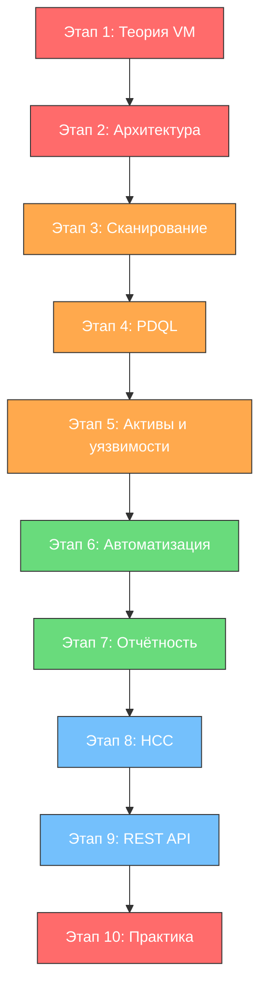

---
tags:
  - maxpatrol-vm
  - vulnerability-management
  - positive-technologies
  - learning-plan
status: в-progress
created: 2026-08-25
---

# План изучения MaxPatrol VM

## Обзор продукта

MaxPatrol VM — система управления уязвимостями (Vulnerability Management) от Positive Technologies. Построена на технологии Security Asset Management (SAM): собирает данные об активах, находит уязвимости, автоматизирует процесс обработки и контроля защищённости инфраструктуры.

Ключевые отличия от простых сканеров: разделение инвентаризации и поиска уязвимостей, автоматическая переоценка уязвимостей при обновлении базы знаний без повторного сканирования, встроенные политики и регламенты.

---

## Предварительные требования

> [!important] Необходимая база
> Перед началом обучения желательно уверенно владеть следующим:

- **ОС Windows и Linux** — файловая система, управление пакетами, основы администрирования
- **Сети** — IP-адресация, CIDR-нотация, модель OSI, TCP/UDP, основные порты
- **CVSS** — методика оценки уязвимостей, версии 2.0/3.0/3.1, векторы
- **Типы проверок** — метод чёрного ящика (без учётных данных) vs белого ящика (с учётными данными)
- **Алгебра логики** — операторы AND/OR/NOT, приоритет операций
- **Основы ООП** — класс, объект, атрибут, наследование (нужно для понимания модели данных PDQL)

---

## Этап 1 — Теоретические основы управления уязвимостями

> [!todo] Приоритет: КРИТИЧЕСКИЙ
> Без этого этапа инструмент не имеет смысла — это фундамент всего.

### 1.1 Процесс управления уязвимостями (VM Lifecycle)

- **Что изучить:** фазы жизненного цикла VM — идентификация, оценка, приоритизация, устранение, проверка, отчётность
- **Зачем:** MaxPatrol VM — это автоматизация именно этого процесса
- **Ресурсы:**
  - Курс Positive Education: «Применение MaxPatrol VM в процессе управления уязвимостями»
  - Вебинар PT: управление уязвимостями с MaxPatrol VM
  - Стандарты: NIST SP 800-40, ISO 27001

### 1.2 Модель управления активами

- **Что изучить:** инвентаризация как основа VM, классификация активов по значимости (H/M/L/ND), динамические vs статические группы
- **Зачем:** MaxPatrol VM отделяет инвентаризацию от сканирования — «помнит» результаты прошлых проверок и автоматически пересчитывает применимость уязвимостей
- **Ключевые понятия:** актив, экземпляр, паспорт уязвимости, сегмент сети

### 1.3 Нормативная база (для работы в РФ)

- **Что изучить:** Приказ ФСТЭК № 117 (базовые меры защиты), Приказ ФСТЭК № 239 (контроль защищённости)
- **Зачем:** MaxPatrol VM используется для контроля соответствия требованиям ФСТЭК — это один из ключевых кейсов применения в России
- **Связь:** [[ФСТЭК 117]] — MaxPatrol VM входит в реестр СКЗИ

---

## Этап 2 — Архитектура и установка

> [!todo] Приоритет: ВЫСОКИЙ
> Понимание архитектуры критично для правильной настройки и диагностики проблем.

### 2.1 Архитектура MaxPatrol VM

- **Что изучить:** компоненты системы — Management and Configuration, Core, Collector, Deployer, PT UCS; роли серверов; кластеризация
- **Зачем:** понимание распределённой архитектуры нужно для масштабирования и выбора схемы развёртывания
- **Ключевые темы:**
  - Соотношение ролей: MC (управление), Core (база данных и обработка), Collector (сбор данных), Deployer (развёртывание агентов)
  - Интерфейс — веб-консоль, основные разделы
  - База знаний — как обновляется, что хранит, как влияет на переоценку уязвимостей

### 2.2 Типовые схемы развёртывания

- **Что изучить:** минимальная конфигурация, расширенная конфигурация, кластер; требования к серверам
- **Зачем:** правильная архитектура на старте экономит время при масштабировании

### 2.3 Первоначальная настройка

- **Что изучить:** чек-лист настройки системы, первичная конфигурация, обновление базы знаний
- **Ресурс:** [Чек-лист настройки системы](https://help.ptsecurity.com/ru-RU/projects/vm/2.8/help/4980710795)

---

## Этап 3 — Сбор данных и сканирование

> [!todo] Приоритет: ВЫСОКИЙ
> Это ядро продукта — без данных нет управления уязвимостями.

### 3.1 Режимы сканирования

- **Чёрный ящик (Discovery)** — без учётных данных, поиск по IP-диапазонам
- **Белый ящик (Audit)** — с учётными данными, глубокая проверка конфигураций
- **Импорт данных** — Active Directory, SCCM, гипервизоры, другие SIEM/NTA
- **Пассивный сбор** — данные от коллекторов и агентов

### 3.2 Учётные записи для сканирования

- **Что изучить:** типы учётных записей, сертификаты, привилегии, лучшие практики хранения
- **Зачем:** от правильности учётных записей зависит глубина аудита

### 3.3 Профили сканирования

- **Что изучить:** стандартные vs пользовательские профили, параметры модулей, настройка под конкретную инфраструктуру
- **Примеры:** профиль для Windows, профиль для Linux, профиль для сетевого оборудования (Cisco, FortiGate)

### 3.4 Задачи сканирования

- **Что изучить:** создание задач, указание целей (IP, группы активов), расписание, приоритет, мониторинг выполнения
- **Практика:** настроить задачу на сканирование тестового диапазона

---

## Этап 4 — Язык PDQL

> [!todo] Приоритет: ВЫСОКИЙ (.core skill)
> PDQL — это язык запросов MaxPatrol VM. Без него невозможно эффективно работать с активами и уязвимостями.

### 4.1 Основы синтаксиса

- **Что изучить:** `SELECT`, `FILTER`, `GROUP`, `SORT`, `LIMIT`; алиасы (`@Host`, `@Vulners`, `@NodeVulners`, `@VulnerPassport`, `@WindowsHost`, `@UnixHost`)
- **Структура запроса:** `select(алиасы) | filter(условия) | group(агрегация) | sort() | limit()`
- **Pipeline:** до SELECT (QSearch, фильтрация источников) и после SELECT (пост-фильтрация, группировка)

### 4.2 Типичные запросы

- **Поиск активов по типу:**
  - Windows рабочие станции: `WindowsHost.HostType = 'Desktop'`
  - Cisco оборудование: `NetworkDeviceHost.Vendor = 'Cisco'`
  - Linux/Unix: `LinuxHost or UnixHost`
- **Поиск по сетевым сегментам:** `Host.IpAddress in 192.168.2.0/24`
- **Поиск ПО:** `Host[Softs[Vendor = 'Adobe' and Name = 'Reader']]`
- **Поиск уязвимостей:** фильтрация через `@Vulners`, `@NodeVulners`
- **Поиск учётных записей:** подобранные логины/пароли при сканировании
- **Паспорта уязвимостей:** CVE, оценки CVSS > N

### 4.3 Продвинутые запросы

- Группировка и агрегация (COUNT, SUM)
- Динамические группы на основе PDQL
- Сравнение данных во времени
- Объединение запросов
- **Ресурс:** вебинар PT «Анализируем инфраструктуру в MaxPatrol VM: продвинутые PDQL-запросы»

---

## Этап 5 — Работа с активами и уязвимостями

> [!todo] Приоритет: ВЫСОКИЙ
> Ежедневная рутина оператора MaxPatrol VM.

### 5.1 Карточки активов

- **Что изучить:** информация в карточке, история изменений, сравнение конфигураций во времени
- **Зачем:** карточка — основной рабочий инструмент для анализа конкретного узла

### 5.2 Паспорта и экземпляры уязвимостей

- **Что изучить:** разница между паспортом уязвимости (общее описание) и экземпляром (конкретный случай на конкретном активе), CVSS, CVE, методы устранения, статусы обработки
- **Ключевые понятия:** HasFix (есть ли исправление), сроки устранения, компенсирующие меры

### 5.3 Группы активов

- **Статические** — фиксированный набор активов
- **Динамические** — на основе PDQL-запроса, автоматически обновляются
- **Зачем:** группировка для назначения политик, сканирования, отчётности

### 5.4 Значимость активов

- **Что изучить:** автоматическое и ручное присвоение значимости, политики значимости
- **Зачем:** приоритизация уязвимостей напрямую зависит от значимости актива

---

## Этап 6 — Автоматизация и политики

> [!todo] Приоритет: СРЕДНИЙ (переход на中级 уровень)
> Автоматизация — то, что отличает «сканер» от «системы управления».

### 6.1 Политики сканирования

- **Что изучить:** автоматизация запуска сканирования по расписанию, привязка к группам активов
- **Пример:** еженедельное сканирование критичных серверов, ежемесячное — рабочих станций

### 6.2 Политики обработки уязвимостей

- **Что изучить:** автоматическое назначение статусов, сроков устранения, эскалация
- **Пример:** политика «Патчинг Windows рабочих станций» — фильтр активов + фильтр уязвимостей с HasFix + срок 2 месяца от даты публикации

### 6.3 Политики значимости

- **Что изучить:** автоматическое присвоение значимости на основе PDQL-правил

### 6.4 Интеграция с другими системами

- MaxPatrol SIEM — корреляция событий и уязвимостей
- Active Directory — импорт структуры
- ITSM/CMDB — создание заявок на устранение

---

## Этап 7 — Визуализация, отчётность и мониторинг

> [!todo] Приоритет: СРЕДНИЙ
> Необходимо для представления руководству и контроля процесса.

### 7.1 Дашборды и виджеты

- **Что изучить:** типы виджетов (графики, таблицы, метрики), создание кастомных дашбордов, привязка виджетов к PDQL-запросам
- **Ключевые метрики:** количество уязвимостей по severity, сроки устранения, тренды, покрытие сканированием

### 7.2 Отчёты

- **Что изучить:** стандартные отчёты, кастомные отчёты, очередь выпуска отчётов, экспорт данных
- **Типы:** оперативные (для ИБ), тактические (для ИТ-отдела), стратегические (для руководства)

### 7.3 Уведомления

- **Что изучить:** настройка уведомлений по email, триггеры, шаблоны

---

## Этап 8 — Контроль соответствия и HCC

> [!todo] Приоритет: СРЕДНИЙ-НИЗКИЙ (специфичная тема)
> MaxPatrol HCC (Host Configuration Control) — для организаций, которым нужен жёсткий контроль соответствия стандартам.

### 8.1 Контроль соответствия стандартам

- **Что изучить:** что такое HCC, как работает, какие стандарты поддерживаются
- **Зачем:** для организаций, обязанных контролировать конфигурации по ФСТЭК или корпоративным стандартам

### 8.2 Настройка политик соответствия

- **Что изучить:** создание профилей проверки, сравнение с эталоном, отчётность по несоответствиям

---

## Этап 9 — REST API и интеграции

> [!todo] Приоритет: НИЗКИЙ (продвинутый уровень)
> Для автоматизации и интеграции MaxPatrol VM с внешними системами.

### 9.1 REST API

- **Что изучить:** доступные эндпоинты, аутентификация, типичные сценарии использования
- **Ресурс:** [Справочник разработчика](https://help.ptsecurity.com/ru-RU/projects/vm/2.8/help/1505039755)

### 9.2 Автоматизация на основе API

- **Что изучить:** автоматическое создание отчётов, интеграция с ITSM, пайплайны CI/CD для контроля защищённости

---

## Этап 10 — Практика и закрепление

> [!todo] Приоритет: КРИТИЧЕСКИЙ (параллельно с каждым этапом)
> Теория без практики бесполезна.

### 10.1 Лабораторные работы

- Установка и настройка MaxPatrol VM (виртуальная среда или курс Positive Education)
- Настройка сканирования тестовой инфраструктуры
- Написание PDQL-запросов (минимум 20-30 различных запросов)
- Создание дашборда с ключевыми метриками
- Настройка политики автоматической обработки уязвимостей

### 10.2 Курс Positive Education

- **Рекомендация:** записаться на курс «Применение MaxPatrol VM в процессе управления уязвимостями»
- Курс включает доступ к интерактивной среде — не нужно устанавливать продукт самостоятельно
- Длительность: ~4 недели с доступом на 6 месяцев

### 10.3 Подготовка к сертификации

- Рассмотреть сертификацию Positive Technologies по MaxPatrol VM
- Использовать официальную документацию как справочник

---

## Приоритеты и порядок изучения

| Приоритет | Этап | Время (ориентир.) | Результат |
| --- | --- | --- | --- |
| КРИТИЧЕСКИЙ | Теория VM + Практика | 2-3 недели | Понимание процесса, не путать инструмент с целью |
| ВЫСОКИЙ | Архитектура + Сканирование + PDQL | 3-4 недели | Уверенная настройка и работа с данными |
| ВЫСОКИЙ | Активы и уязвимости | 2-3 недели | Ежедневная рутина оператора |
| СРЕДНИЙ | Автоматизация + Отчётность | 2 недели | Переход от ручной работы к процессам |
| НИЗКИЙ | HCC + REST API | 1-2 недели | Продвинутый уровень, по необходимости |

---

## Ресурсы

### Документация Positive Technologies
- [Справочный портал MaxPatrol VM](https://help.ptsecurity.com/ru-RU/projects/vm/2.8/help/4980710795)
- [Справочник по языку PDQL](https://help.ptsecurity.com/ru-RU/projects/vm/2.8/help/1505039755)
- [Справочник PDQL-запросов для анализа активов](https://help.ptsecurity.com/ru-RU/projects/vm/2.8/help/1517373339)
- [Справочник разработчика (REST API)](https://help.ptsecurity.com/ru-RU/projects/vm/2.8/help/1505039755)
- [Параметры конфигурации компонентов](https://help.ptsecurity.com/ru-RU/projects/vm/2.8/help/7197838731)

### Обучение
- [Курс Positive Education: Применение MaxPatrol VM](https://edu.ptsecurity.com/kursy-po-ekspluatacii-productov-pt/mp-vm)
- [Бесплатный курс TS University: MaxPatrol VM Getting Started](https://university.tssolution.ru/maxpatrol-vm-getting-started/obzor-vozmozhnostej)

### Вебинары PT
- [Работа с активами: что могут показать PDQL-запросы](https://ptsecurity.com/research/webinar/rabota-s-aktivami-v-maxpatrol-vm-chto-mogu-pokazat-pdql-zaprosy/)
- [Продвинутые PDQL-запросы](https://ptsecurity.com/research/webinar/analiziruem-infrastrukturu-v-maxpatrol-vm-prodvinutye-pdql-zaprosy/)

### Связанные заметки в vault
- [[ФСТЭК 117]] — нормативная база, в которой MaxPatrol VM фигурирует как средство контроля защищённости
