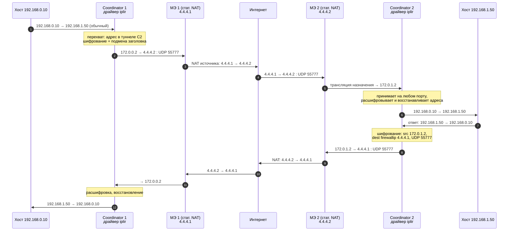
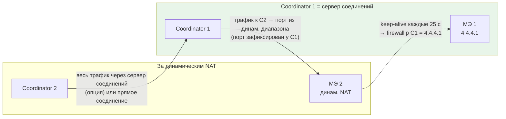

Как защищённый трафик передаётся от одного ViPNet Coordinator к другому: от перехвата IP-пакета драйвером iplir до расшифровки на удалённом узле. Схемы построены на примере из [[Виртуализированный криптошлюз ViPNet Coordinator VA. Инструкция по применению]].

## Общий принцип

- Драйвер `iplir` перехватывает IP-пакет **до** стека TCP/IP, по адресу назначения определяет, что адресат защищён (сравнение с `accessip` узлов из справочников).
- Пакет **шифруется**, заголовок подменяется: адрес назначения = `firewallip` удалённого координатора, источник = адрес интерфейса по таблице маршрутизации.
- Наружу пакет инкапсулируется: **UDP 55777** (по умолчанию), **IP/241** — в одном широковещательном домене, **TCP** — если UDP недоступен (актуально для клиентов, между координаторами — только UDP).
- Принимающая сторона принимает шифрованные пакеты **на любом порту**, расшифровывает и восстанавливает исходную адресацию.
- Решение о шифровании и адресация внутри сети не видны извне: внешний мир наблюдает лишь обмен UDP-пакетами между публичными адресами ([[VPN Overhead]], [[Порты ViPNet сети]]).

## Топология примера

```mermaid
flowchart LR
    subgraph LAN1["ЛВС 1 — 192.168.0.0/24"]
        H1["Хост<br/>192.168.0.10"]
    end

    subgraph C1["Coordinator 1"]
        C1d1["eth1<br/>192.168.0.1"]
        C1drv["драйвер iplir"]
        C1d0["eth0<br/>172.0.0.2"]
    end

    M1["МЭ 1<br/>стат. NAT<br/>4.4.4.1"]
    NET(("Интернет<br/>4.4.4.0/24"))
    M2["МЭ 2<br/>стат. NAT<br/>4.4.4.2"]

    subgraph C2["Coordinator 2"]
        C2d0["eth0<br/>172.0.1.2"]
        C2drv["драйвер iplir"]
        C2d1["eth1<br/>192.168.1.1"]
    end

    subgraph LAN2["ЛВС 2 — 192.168.1.0/24"]
        H2["Хост<br/>192.168.1.50"]
    end

    H1 --- C1d1
    C1d1 --- C1drv
    C1drv --- C1d0
    C1d0 --- M1
    M1 --- NET
    NET --- M2
    M2 --- C2d0
    C2d0 --- C2drv
    C2drv --- C2d1
    C2d1 --- H2

    style C1drv fill:#e1f5fe
    style C2drv fill:#e1f5fe
    style NET fill:#fff3e0
```



## Трансформация пакета по шагам

| Шаг | Участок | Адрес источника | Адрес назначения | Инкапсуляция |
| --- | --- | --- | --- | --- |
| 1 | Хост → eth1 C1 | `192.168.0.10` | `192.168.1.50` | обычный IP-пакет |
| 2 | драйвер C1 (перехват) | `192.168.0.10` | `192.168.1.50` | — |
| 3 | драйвер C1 (выход) | `172.0.0.2` | **`4.4.4.2`** (firewallip C2) | **UDP 55777** |
| 4 | после МЭ 1 | `4.4.4.1` | `4.4.4.2` | UDP 55777 |
| 5 | после МЭ 2 | внутр. адрес МЭ 2 | `172.0.1.2` | UDP 55777 |
| 6 | драйвер C2 (перехват) | `192.168.0.10` | `192.168.1.50` | — (расшифровка) |
| 7 | eth1 C2 → хост | `192.168.0.10` | `192.168.1.50` | обычный IP-пакет |

На промежуточном шаге внутренней логики драйвер передаёт пакет с адресом назначения = `accessip` (идентификатор узла), а **на выходе** подменяет его на `firewallip` — поэтому на проводе виден только адрес `firewallip`.

## Инкапсуляция `UDP 55777`

Когда драйвер `iplir` шифрует исходный IP-пакет (туннельный режим, заголовок IPlir до 57 байт — см. [VPN Overhead](app://obsidian.md/VPN%20Overhead)), наружу он упаковывает результат в обычный UDP-дейтаграмму на порт **55777** по умолчанию:

```
IP (src: 172.0.0.2 → dst: 4.4.4.2 firewallip)
└── UDP (порт 55777)
    └── заголовок IPlir (до 57 байт)
        └── зашифрованный исходный IP-пакет
```

Конкретно в вашем сценарии (шаг 3 таблицы в [Путь пакета между координаторами](app://obsidian.md/%D0%9F%D1%83%D1%82%D1%8C%20%D0%BF%D0%B0%D0%BA%D0%B5%D1%82%D0%B0%20%D0%BC%D0%B5%D0%B6%D0%B4%D1%83%20%D0%BA%D0%BE%D0%BE%D1%80%D0%B4%D0%B8%D0%BD%D0%B0%D1%82%D0%BE%D1%80%D0%B0%D0%BC%D0%B8)): драйвер C1 подменяет адрес назначения с `accessip` на `firewallip` координатора C2 и отдаёт пакет наружу именно в такой обёртке.

## Зачем нужен UDP-порт

- **Прохождение МЭ и NAT.** Подавляющее большинство межсетевых экранов пропускает UDP-трафик и не понимает ни IP/241, ни внутреннюю адресацию ViPNet. Порт при этом — просто «маркер» для правил файрвола: в [Порты ViPNet сети](app://obsidian.md/%D0%9F%D0%BE%D1%80%D1%82%D1%8B%20ViPNet%20%D1%81%D0%B5%D1%82%D0%B8) он указан как «служебный порт по умолчанию для установления защищённого соединения».
- **Нерегистрированный порт.** ViPNet не регистрирует его в IANA и использует фактически из динамического диапазона — поэтому на промежуточных МЭ нужно делать явное правило «открыть UDP 55777».

## Последовательность обмена (прямой сценарий)



## Сценарий с динамическим NAT (сервер соединений)

Если один координатор — за динамическим NAT, инициативное соединение к нему извне невозможно. Тогда:

- координатор за динамическим NAT **раз в 25 секунд** отправляет тестовые запросы на `firewallip` другого координатора — так поддерживается активной сессия на своём МЭ (иначе она закрывается за 1–5 минут);
- принимающая сторона выступает **сервером соединений**;
- трафик можно направлять весь через сервер соединений либо устанавливать прямое соединение;
- после NAT источником становится порт из динамического диапазона (не 55777) — на стороне сервера соединений он фиксируется, и ответы идут на него.



## Что видно в диагностике (`iplir view`)

- На C1 в журнале — исходящий зашифрованный пакет: флаги **`<` и `C`**, от `172.0.0.2` к `4.4.4.2`, UDP 55777. Журнал показывает адреса «до» шифрования.
- На C2 после расшифровки — исходные `192.168.0.10 → 192.168.1.50`.
- Красные строки (флаг `D`) — заблокированные пакеты, зелёные — пропущенные.
- `iplir ping <id узла>` даёт тот же внешний путь: тестовые пакеты по UDP 2046 внутри, наружу — шифрование и UDP 55777.
- `inet ping <firewallip>` — обычная проверка по маршруту, ответить может любой узел.

## Режимы подключения и NAT

| Режим МЭ | Признак в iplir.conf | Особенность |
| --- | --- | --- |
| Со статической трансляцией | `usefirewall=on`, `proxyid=0xfffffffe` | основной режим; нужен фиксированный внешний адрес |
| С динамической трансляцией | `dynamic_proxy=on` | keep-alive раз в 25 с, сервер соединений обязателен |
| Координатор | — | устаревший, только для совместимости |
| Без МЭ | `usefirewall=off` | legacy, заменён статической трансляцией |

## Связанные заметки

- [[Виртуализированный криптошлюз ViPNet Coordinator VA. Инструкция по применению]] — разбор схем и параметров iplir.conf
- [[VPN Overhead]] — протокол IPlir, инкапсуляция и накладные расходы
- [[Порты ViPNet сети]] — служебные порты
- [[5. Туннелирование]] — туннелируемые адреса и видимость (real/auto/virtual)
- [[Список команд по разделам]] — команды iplir, inet, mftp
- [[Миграция ViPNet Coordinator HW4 на HW5]] — новый транспорт HW5 (DNS-имена, конверты, журнал в ядре Prime)